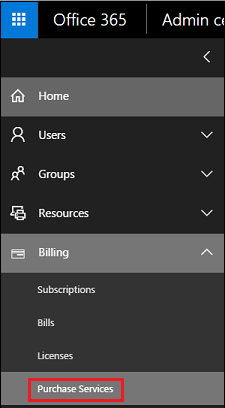
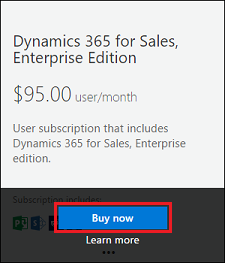
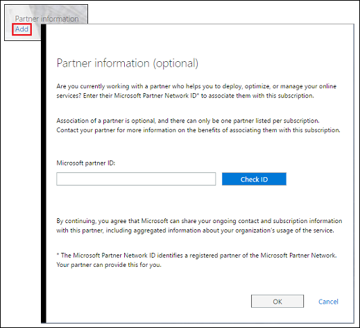
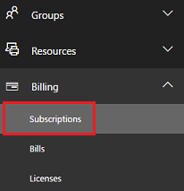
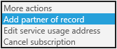

# Add a Partner of Record (POR) to your subscription

[!INCLUDE[cc-applies-to-update-9-0-0](../includes/cc_applies_to_update_9_0_0.md)] [!INCLUDE[cc-applies-to-update-8-2-0](../includes/cc_applies_to_update_8_2_0.md)]

You can choose to work with a designated Microsoft partner who can provide the sales and technical expertise you need to help set up, customize, deploy, and administer your [!INCLUDE[pn_dyn_365](../includes/pn-dyn-365.md)] instances. You can find a designated Partner of Record (POR) on the [Microsoft Partner Center](https://partnercenter.microsoft.com/pcv/register/joinnow/enrollmentWelcome/valueaddedreseller) site. Once you find a partner, request their Microsoft Partner ID and designate them in the [!INCLUDE[pn_office_365_admin_center](../includes/pn-office-365-admin-center.md)].  
  
## Add a partner at time of purchase  
  
1. [!INCLUDE[proc_office365_signin](../includes/proc-office365-signin.md)]  
  
2.  Click **Billing** > **Purchase Services**.  
  
   
  
3.  Select a subscription, click **Buy now**.  
  
   
  
4.  Fill in the number of users and a promo code, if you have one, then click **Next**.  
  
5.  Under Account, click **Add** and then fill in the partner information.  
  
   
  
## Add a partner to an existing subscription  
  
1. [!INCLUDE[proc_office365_signin](../includes/proc-office365-signin.md)]  
  
2.  Go to **Billing** > **Subscriptions** and select a subscription.  
  
   
  
3.  Under **Active**, click **More actions** > **Add partner of record**, and then fill in the partner information.  
  
   
  
### See also  
 [Add, change, or delete a subscription advisor partner](https://support.office.com/article/Add-change-or-delete-a-subscription-advisor-partner-f86e8177-936e-491e-9024-44dea2b296ff)   
 [Purchase and assign Dynamics 365 (online) licenses](https://docs.microsoft.com/dynamics365/customer-engagement/admin/purchase-assign-online-licenses)
