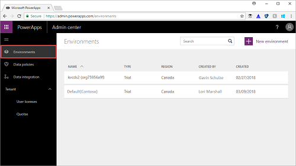

# Quickstart: Download a list of apps created in your environments
If you're an Environment admin, you can view and download a list of apps created in the environments that you're administering. If you're a 365 Global admin or Azure Active Directory Tenant admin, you can view and download a list of apps created in all of the environments in your organization.

In this quickstart, you'll learn how to download a list of apps created in a single environment to a .csv file, and then view that list in Excel.

## Prerequisites
 To follow this quickstart, the following items are required:
 * Either a PowerApps Plan 2 or Microsoft Flow Plan 2 license. Alternatively, you can sign up for a [free PowerApps Plan 2 trial](https://web.powerapps.com/signup?redirect=marketing&email=).
 * PowerApps Environment Admin, Office 365 Global Admin, or Azure Active Directory Tenant Admin permissions. For more information, see [Environments administration in PowerApps](environments-administration.md).

## Sign in to the PowerApps Admin center
Sign in to the Admin center at [https://admin.powerapps.com]([https://admin.powerapps.com).

## Download the list of apps
1. In the navigation pane, click or tap **Environments**, and then click or tap the environment for which you want to download the list of apps.

    
2. On the **Resources** tab, click or tap **Apps**, and then click or tap **Download the list of apps**.

    

    The list of apps is downloaded into a .csv file. This process could take several minutes. Make sure that you don't close the window before the list completely downloads or you may have to restart the process.

## View the list
After the .csv file is created, open it in Excel. The list contains the app display name, the owner of the app, any connectors that the app uses to connect to data sources, and other information.

## Next steps
In this quickstart, you learned how to download and view a list of apps created in an environment within your organization. Next, learn how to manage the apps created in your organization.

> [!div class="nextstepaction"]
> [Manage apps created in your organization](admin-manage-apps.md)
