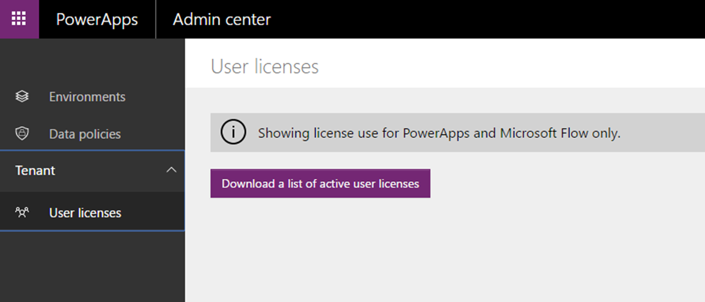

# Quickstart: Download a list of active users in your tenant
If you're a 365 Global admin or Azure Active Directory Tenant, you can download a list of active users in your tenant, so you can see not only who's accessed PowerApps, Microsoft Flow, or both, but also the licenses assigned to those users.

In this quickstart, you'll learn how to download a list of active users to a .csv file, and then view that list in Excel.

To follow this quickstart, you need Office 365 Global Admin or Azure Active Directory Tenant Admin permissions.

## Sign in to the PowerApps Admin center
Sign in to the Admin center at [https://admin.powerapps.com]([https://admin.powerapps.com).

## Download the list of users
In the navigation pane, click or tap **User licenses**, and then click or tap **Download a list of active user licenses**.

The list of users is downloaded into a .csv file. This process could take several minutes. Make sure that you don't close the window before the list completely downloads or you may have to restart the process.

## View the list
After the .csv file is created, open it in Excel. The list contains each user’s name, email address, license type, and other information.

A user who's accessed a product at least once is considered an *active user*. Since this is a list of active users, it does not contain users who have licenses for PowerApps and Microsoft Flow but have never accessed them. You can view all user licenses from the [Office 365 admin center](https://support.office.com/article/Assign-or-remove-licenses-for-Office-365-for-business-997596b5-4173-4627-b915-36abac6786dc).

The following example shows two users who have licenses to both PowerApps and Microsoft Flow. Jane Doe has access through a subscription to Office 365, and John Doe has a trial license for each product.

If a user has left the organization, the list will show **Unknown** in the **User name** and **Email address** columns. If the list shows **Unknown** but nobody has left the organization, wait several minutes, and then download the list again.

To add user licenses, open the [Office 365 admin center](https://support.office.com/article/Assign-or-remove-licenses-for-Office-365-for-business-997596b5-4173-4627-b915-36abac6786dc).

## Next steps
In this quickstart, you learned how to download and view a list of active users in your tenant. To learn how to download and view a list of apps created in your environments, continue to the next quickstart.

> [!div class="nextstepaction"]
> [Download a list of apps created in your environments](admin-view-apps.md)
