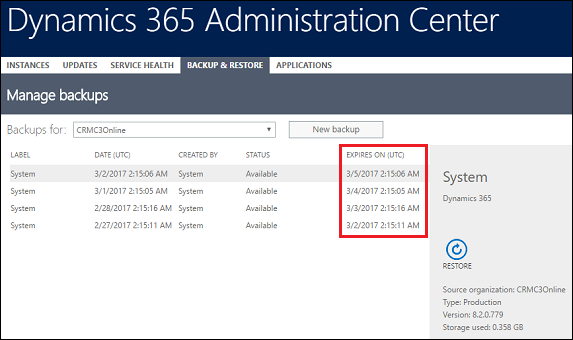
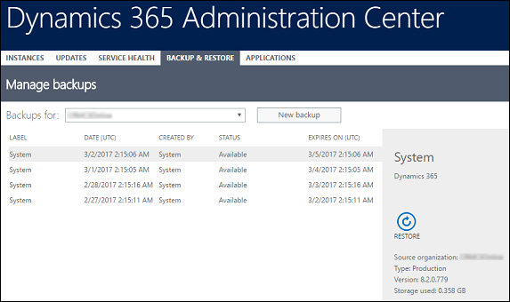
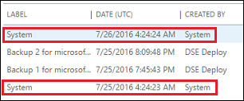
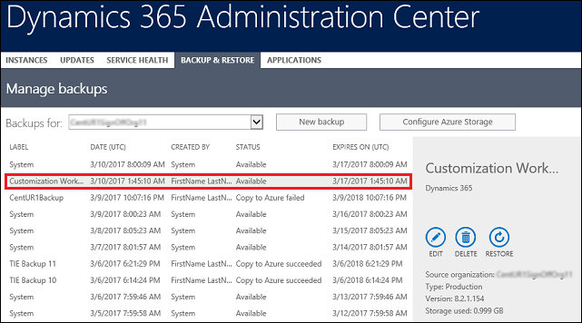
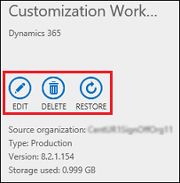
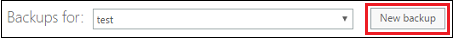
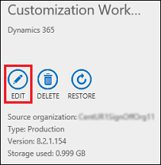
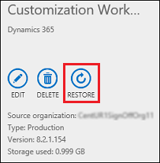
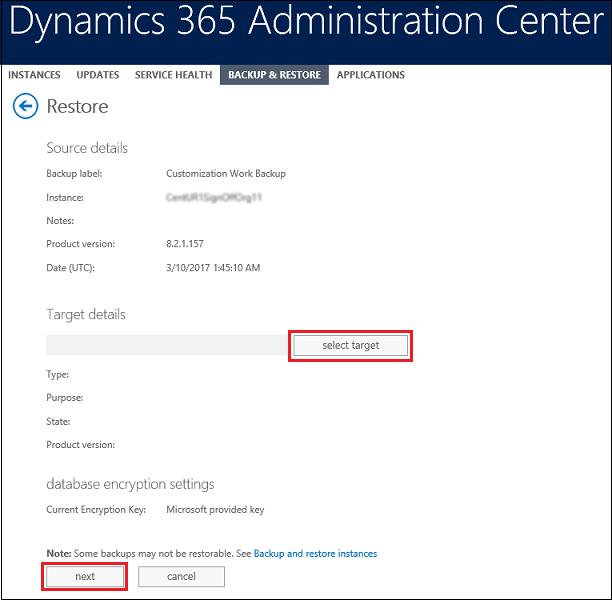
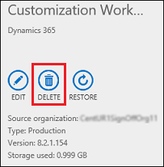

# Backup and restore instances

[!INCLUDE[cc-applies-to-update-9-0-0](../includes/cc_applies_to_update_9_0_0.md)] [!INCLUDE [cc_applies_to_update_8_2_0](../includes/cc_applies_to_update_8_2_0.md)]

Protecting your [!INCLUDE[pn_crm_shortest](../includes/pn-crm-shortest.md)] data and providing continuous availability of service is important for you and for us. You have multiple options for backing up and restoring your [!INCLUDE[pn_crm_online_shortest](../includes/pn-crm-online-shortest.md)] instances.   
  
  
 
## Daily system backups
 Good news! Some backups take place without you having to do anything.  
  
 About [!INCLUDE[pn_crm_online_shortest](../includes/pn-crm-online-shortest.md)] **system backups**:  
  
-   All your instances are backed up.  
  
-   System backups occur daily.  
  
-   System backups are retained up to three days. Check your expiration date.  

  

-   System backups do not count against your storage limits.  
  
-   System backups are identified as created by **System** on the **Manage backups** page.  
  
   
  
### See your system backups  
  
1. [!INCLUDE[proc_office365_signin](../includes/proc-office365-signin.md)] You can also sign in with [!INCLUDE[pn_crm_shortest](../includes/pn-crm-shortest.md)] System Administrator or Delegated Admin security roles.  
  
2.  Click **Admin centers** > **Dynamics 365**.  
  
3.  Click the **Backup & Restore** tab.  
  
4.  Choose an instance from the **Backups for** drop-down list.  
  
 System-created backups appear under **Created By** as **System**.  
  
   
  
   

## On-demand backup: Dynamics 365 managed  
 Automated system backups are great, but you will want to be able to make your own backups before making some significant customization change or applying a version update. You can do this with on-demand [!INCLUDE[pn_crm_shortest](../includes/pn-crm-shortest.md)] managed  backups.  
  
> [!NOTE]
>  A backup is created for you when we update your instance.  
  
 About [!INCLUDE[pn_crm_shortest](../includes/pn-crm-shortest.md)] managed **on-demand backups**:  
  
-   You can back up Production and Sandbox instances.  
  
- **You can only restore to a Sandbox instance**. To restore to a Production instance, first switch it to a Sandbox instance. See [Switch an instance](switch-environment.md).  
  
-   Only [!INCLUDE[pn_crm_8_1_0_online_subsequent](../includes/pn-crm-8-1-0-online-subsequent.md)] or later versions are supported for backup.  
  
-   On-demand backups are retained for up to three days. Check your expiration date.  
  
   
  
-   You are not limited in the number of on-demand backups you can make.

-   On-demand backups do not count against your storage limits.  

-   On-demand backups are identified by having a label you created and by the presence of **Edit** | **Delete** | **Restore** in the details section. System backups have only **Restore**.  
  
   
  
   

### Create an on-demand backup of a Dynamics 365 instance  
  
1. [!INCLUDE[proc_office365_signin](../includes/proc-office365-signin.md)] You can also sign in with [!INCLUDE[pn_crm_shortest](../includes/pn-crm-shortest.md)] System Administrator or Delegated Admin security roles.  
  
2.  Click **Admin centers** > **Dynamics 365**.  
  
3.  Click the **Backup & Restore** tab.  
  
4.  Choose an instance from the **Backups for** drop-down list.  
  
5.  Click **New backup**.  
  
   
  
6.  Type a label and any notes to help identify this backup for future restoration.  
  
7.  Click **Create**.  
  
  backup.")  
  
 A notification will be displayed to confirm the backup is being created.  The status column in the list provides the status of the backup.  
  
> [!NOTE]
>  The instance remains available while being backed up.  
  
   

### Edit a Dynamics 365 on-demand backup  
 Edit a backup to change its label and your notes about the backup.  
  
1. [!INCLUDE[proc_office365_signin](../includes/proc-office365-signin.md)] You can also sign in with [!INCLUDE[pn_crm_shortest](../includes/pn-crm-shortest.md)] System Administrator or Delegated Admin security roles.  
  
2.  Click **Admin centers** > **Dynamics 365**.  
  
3.  Click the **Backup and Restore** tab.  
  
4.  Choose an instance from the **Backups for** drop-down list.  
  
5.  Choose an on-demand backup from the list of backups.  
  
6.  Click **Edit**.  
  
   
  
7.  Change the information as needed, and then click **Save**.  
  
   

### Restore a Dynamics 365 on-demand backup  
 You can only restore to Sandbox instances. To restore to a Production instance, first switch it to a Sandbox instance, restore to it, and then switch it back to a Production instance. See [Switch an instance](switch-environment.md).  
  
1. [!INCLUDE[proc_office365_signin](../includes/proc-office365-signin.md)] You can also sign in with [!INCLUDE[pn_crm_shortest](../includes/pn-crm-shortest.md)] System Administrator or Delegated Admin security roles.  
  
2.  Click **Admin centers** > **Dynamics 365**.  
  
3.  Click the **Backup and Restore** tab.  
  
4.  Choose an instance from the **Backups for** drop-down list.  
  
5.  Choose an on demand backup from the list of backups.  
  
6.  Click **Restore**.  
  
   
  
7.  Click **Select target**  to pick a target instance.  
  
8.  Click **Next**. Verify the details, and then click **Restore**.  
  
   
  
 A notification will be displayed confirming that the backup is being restored.  It can take some time for the restoration to complete.  
  
> [!NOTE]
>  The instance remains unavailable while being restored.  
  
   

### Delete a Dynamics 365 on-demand backup  
 You can use the [!INCLUDE[pn_dyn_365_admin_center](../includes/pn-dyn-365-admin-center.md)] to delete [!INCLUDE[pn_crm_shortest](../includes/pn-crm-shortest.md)]-managed, on-demand backups.  You can't delete system backups.  
  
1. [!INCLUDE[proc_office365_signin](../includes/proc-office365-signin.md)] You can also sign in with [!INCLUDE[pn_crm_shortest](../includes/pn-crm-shortest.md)] System Administrator or Delegated Admin security roles.  
  
2.  Click **Admin centers** > **Dynamics 365**.  
  
3.  Click the **Backup & Restore** tab.  
  
4.  Choose an instance from the **Backups for** drop-down list.  
  
5.  Choose an on-demand backup from the list of backups.  
  
6.  Click **Delete**.  
  
   
  
7.  Click **Confirm**.  
 
### See also  
 [Switch an instance](switch-environment.md)   
