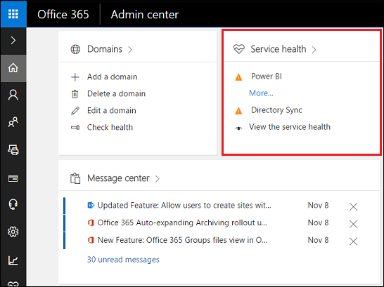
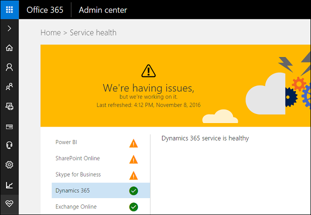
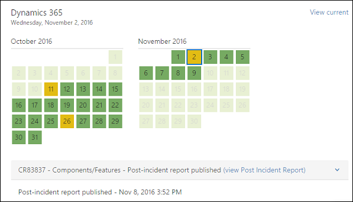
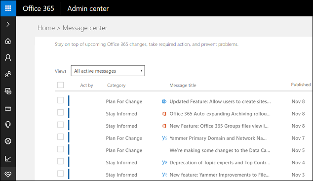
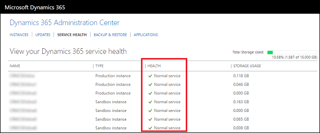

# How do I check my online service health?

[!INCLUDE[cc-applies-to-update-9-0-0](../includes/cc_applies_to_update_9_0_0.md)] [!INCLUDE[cc-applies-to-update-8-2-0](../includes/cc_applies_to_update_8_2_0.md)]

You can quickly get a real-time status of your [!INCLUDE[pn_crm_online_shortest](../includes/pn-crm-online-shortest.md)] and [!INCLUDE[pn_Office_365](../includes/pn-office-365.md)] services. The dashboard on the [!INCLUDE[pn_office_365_admin_center](../includes/pn-office-365-admin-center.md)] provides a comprehensive view of the service health of your online services. If users are having trouble signing in to [!INCLUDE[pn_crm_online_shortest](../includes/pn-crm-online-shortest.md)], check this page to see if there is a service outage.  
  
   
## View a snapshot of service health  
 [!INCLUDE[proc_office365_signin](../includes/proc-office365-signin.md)] You can see a quick snapshot of service health for some of your [!INCLUDE[pn_Office_365](../includes/pn-office-365.md)] services. Click **Health** > **Service health** to get more information on all your services.  
  
   
  
   
## View Dynamics 365 (online) service health  
 Click on an [!INCLUDE[pn_Office_365](../includes/pn-office-365.md)] service, such as [!INCLUDE[pn_crm_online_shortest](../includes/pn-crm-online-shortest.md)],  to get detailed information on its service health status.  
  
   
  
## View service health history  
 Click **Health** > **Service health** >**View history** to see a calendar with the past 30 days of service. Select a date and see service health status and details for that day. You might need to click **Go to the v2 Service Health page** first.  
  
   
  
   
## View planned maintenance  
 Click **Health** > **Message center** to see if there are any scheduled events for your online service and to view other informative messages.  
  
   
  
## View instance service health  
 If your company has multiple instances of [!INCLUDE[pn_crm_online_shortest](../includes/pn-crm-online-shortest.md)], you can see the health status for individual [!INCLUDE[pn_crm_online_shortest](../includes/pn-crm-online-shortest.md)] instances in the [!INCLUDE[pn_dyn_365_admin_center](../includes/pn-dyn-365-admin-center.md)].  
  
1. [!INCLUDE[proc_office365_signin](../includes/proc-office365-signin.md)]  
  
2. [!INCLUDE[proc_office365_choose_admin_crm](../includes/proc-office365-choose-admin-crm.md)]  
  
3.  Choose the **Service Health** tab.  
  
   
  
### See also  
 [Use the Organization Insights solution to view metrics about your instance](use-organization-insights-solution-view-environment-metrics.md) 
 [Preview feature: Use the Organization Insights dashboard to view metrics about your instance](use-organization-insights-dashboard-view-environment-metrics.md)
