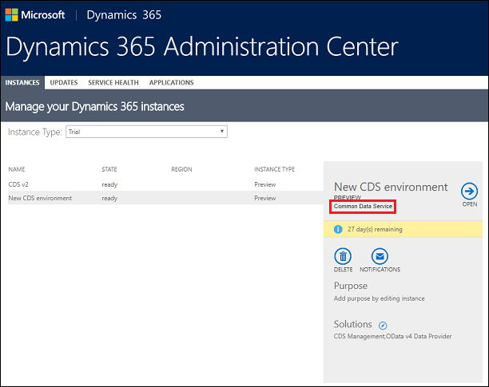

# Common Data Service instances

> [!NOTE]
>   [!INCLUDE[cc-under-construction](../includes/cc-under-construction.md)]

[!INCLUDE[cc-applies-to-update-9-0-0](../includes/cc_applies_to_update_9_0_0.md)] [!INCLUDE [cc_applies_to_update_8_2_0](../includes/cc_applies_to_update_8_2_0.md)]

The Common Data Service allows you to securely store and manage data used in your [!INCLUDE [pn-powerapps](../includes/pn-powerapps.md)] [environments](https://docs.microsoft.com/powerapps/administrator/environments-overview). As of March 21, 2018, [!INCLUDE [pn-powerapps](../includes/pn-powerapps.md)] environments provisioned with a Common Data Service database are displayed as instances in the [!INCLUDE [pn-dyn-365-admin-center](../includes/pn-dyn-365-admin-center.md)]. There you can view and do some management of your Common Data Service instances.

## Identify Common Data Service instances

1. In the [!INCLUDE [pn-dyn-365-admin-center](../includes/pn-dyn-365-admin-center.md)], select the **Instances** tab.
2. Select an instance and look for **Common Data Service** in the description details. 

## Manage Common Data Service instances

Currently, Common Data Service instances are available as trial and production types. What management actions are available depends on which admin center you use.

### Management in the Dynamics 365 admin center

You can manage the following with the Common Data Service instance in the [!INCLUDE [pn-dyn-365-admin-center](../includes/pn-dyn-365-admin-center.md)]:

> - [Open an instance](use-office-365-admin-center-manage-subscription.md)
> - [Edit an instance](edit-properties-environment.md)
> - [Copy an instance](copy-environment.md)
> - [Delete an instance](delete-environment.md)
> - [Change notifications](manage-email-notifications.md)

### Management in the PowerApps admin center

You can manage the following with the Common Data Service instance in the PowerApps admin center:

> - Add or remove a user or group from either the Environment Admin or Environment Maker role. For more information, see [Environment Administration](https://docs.microsoft.com/powerapps/administrator/environments-administration).
> - Provision a Common Data Service database for the environment. For more information, see [Create a Common Data Service database](https://docs.microsoft.com/powerapps/administrator/create-database).
> - Set Data Loss Prevention policies. For more information, see [Data loss prevention policies](https://docs.microsoft.com/powerapps/administrator/prevent-data-loss).
> - Set database security policies (as open or restricted by database roles). For more information, see [Configure database security](https://docs.microsoft.com/powerapps/administrator/database-security).
> - Members of the Azure AD tenant Global administrator role (includes Office 365 Global admins) can also manage all environments that have been created in their tenant and set tenant-wide policies from the PowerApps admin center.

## More information 
[Administer PowerApps overview](https://docs.microsoft.com/en-us/powerapps/administrator) 
[Introduction to the admin center for PowerApps](https://docs.microsoft.com/powerapps/introduction-to-the-admin-center)
