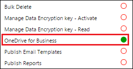

# Enable OneDrive for Business (on-premises)

[!INCLUDE[cc-applies-to-update-9-0-0](../includes/cc_applies_to_update_9_0_0.md)]<br/>[!INCLUDE[cc-applies-to-update-8-2-0](../includes/cc_applies_to_update_8_2_0.md)]

Users can create and manage private documents with [!INCLUDE[pn_onedrive_for_business](../includes/pn-onedrive-for-business.md)]. Those documents can be accessed within [!INCLUDE[pn_crm_shortest](../includes/pn-crm-shortest.md)] after the system administrator has enabled [!INCLUDE[pn_onedrive_for_business](../includes/pn-onedrive-for-business.md)].  
  
## Requirements  
 The following are required to use [!INCLUDE[pn_onedrive_for_business](../includes/pn-onedrive-for-business.md)] with [!INCLUDE[pn_microsoft_dynamics_crm_2016_server](../includes/pn-microsoft-dynamics-crm-2016-server.md)].  
  
> [!NOTE]
>  This topic applies to organizations deploying on-premises versions of [!INCLUDE[pn_onedrive_for_business](../includes/pn-onedrive-for-business.md)] and [!INCLUDE[pn_crm_shortest](../includes/pn-crm-shortest.md)] or an online/on-premises mix of these products. For information on integrating [!INCLUDE[pn_onedrive_for_business](../includes/pn-onedrive-for-business.md)] online with Dynamics 365 (online), see: [Enable OneDrive for Business](enable-onedrive-for-business.md).  
  
-   [Set up SharePoint integration with Microsoft Dynamics 365](https://docs.microsoft.com/dynamics365/customer-engagement/admin/set-up-sharepoint-integration) and have at least one team site.  
  
-   Set up permission on the root [!INCLUDE[pn_SharePoint_short](../includes/pn-sharepoint-short.md)] team site for all users who will use [!INCLUDE[pn_onedrive_for_business](../includes/pn-onedrive-for-business.md)] in [!INCLUDE[pn_crm_shortest](../includes/pn-crm-shortest.md)]. [!INCLUDE[proc_more_information](../includes/proc-more-information.md)] [Plan sites and manage users](https://support.office.com/article/Plan-sites-and-manage-users-95F9EB7A-4AC8-4DD5-A883-17686CBF8FFF)  
  
-   For SharePoint on-premises, enable the Search service to access shared documents from other users. It is enabled by default on [!INCLUDE[pn_sharepoint_online](../includes/pn-sharepoint-online.md)] but not on [!INCLUDE[pn_SharePoint_short](../includes/pn-sharepoint-short.md)] on-premises. [!INCLUDE[proc_more_information](../includes/proc-more-information.md)] [Create and configure a Search service application in SharePoint Server 2013](https://technet.microsoft.com/library/gg502597.aspx)  
  
## Enable OneDrive for Business  
 You enable [!INCLUDE[pn_onedrive_for_business](../includes/pn-onedrive-for-business.md)] as follows:  
  
1.  Click **Settings** > **Document Management** > **Enable OneDrive for Business**  
  
2.  Click **Enable OneDrive for Business** to enable it, and then click **OK**.  
  
 **If you’re running [!INCLUDE[pn_SharePoint_Server_short](../includes/pn-sharepoint-server-short.md)] on-premises**, on the Windows Server where [!INCLUDE[pn_SharePoint_Server_short](../includes/pn-sharepoint-server-short.md)] is running, open the [!INCLUDE[pn_SharePoint_short](../includes/pn-sharepoint-short.md)] Management Shell and run the following commands to set up permissions between [!INCLUDE[pn_SharePoint_short](../includes/pn-sharepoint-short.md)] and [!INCLUDE[pn_microsoft_dynamics_crm_2016_server](../includes/pn-microsoft-dynamics-crm-2016-server.md)].  
  
> [!NOTE]
>  You might have already set up permissions and can skip the following if you completed the steps in [Configure server-based authentication with Dynamics 365 Online and SharePoint on-premises](https://docs.microsoft.com/dynamics365/customer-engagement/admin/configure-server-based-authentication-sharepoint-on-premises).  
  
```  
Add-Pssnapin *  
# Access WellKnown App principal  
[Microsoft.SharePoint.Administration.SPWebService]::ContentService.WellKnownAppPrincipals  
  
# Create WellKnown App principal  
$ClientId = "00000007-0000-0000-c000-000000000000"  
$PermissionXml = "<AppPermissionRequests AllowAppOnlyPolicy=""true""><AppPermissionRequest Scope=""http://sharepoint/content/tenant"" Right=""FullControl"" /><AppPermissionRequest Scope=""http://sharepoint/social/tenant"" Right=""Read"" /><AppPermissionRequest Scope=""http://sharepoint/search"" Right=""QueryAsUserIgnoreAppPrincipal"" /></AppPermissionRequests>"  
  
$wellKnownApp= New-Object -TypeName "Microsoft.SharePoint.Administration.SPWellKnownAppPrincipal" -ArgumentList ($ClientId, $PermissionXml)  
  
$wellKnownApp.Update()  
  
```  
  
## Controlling access to OneDrive for Business in Dynamics 365 
 You can toggle availability of [!INCLUDE[pn_onedrive](../includes/pn-onedrive.md)] in [!INCLUDE[pn_crm_shortest](../includes/pn-crm-shortest.md)] for end users through the **OneDrive for Business** privilege.  
  
1.  Click **Settings** > **Security** > **Security Roles**  
  
2.  Choose a security role, and then click the **Core Records** tab.  
  
3.  Under **Miscellaneous Privileges**, toggle the **OneDrive for Business** privilege to the desired availability.  
  
    > [!NOTE]
    >  This privilege is visible in the Security Roles dialog only after [!INCLUDE[pn_onedrive_for_business](../includes/pn-onedrive-for-business.md)] is enabled.  
  
   
  
### See also  
 [Set up SharePoint integration with Microsoft Dynamics 365](https://docs.microsoft.com/dynamics365/customer-engagement/admin/set-up-sharepoint-integration)   
 [Use OneDrive for Business to manage your private documents](https://docs.microsoft.com/dynamics365/customer-engagement/basics/use-onedrive-business-manage-private-documents)   
 [What is OneDrive for Business?](https://support.office.com/en-US/article/What-is-OneDrive-for-Business-187f90af-056f-47c0-9656-cc0ddca7fdc2)   
 [SharePoint Online and OneDrive for Business: software boundaries and limits](https://support.office.com/en-us/article/SharePoint-Online-and-OneDrive-for-Business-software-boundaries-and-limits-8F34FF47-B749-408B-ABC0-B605E1F6D498)   
