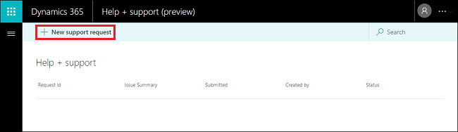
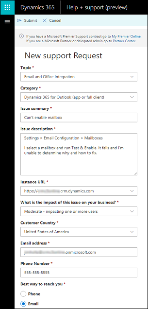

# Contact Technical Support 

[!INCLUDE[cc-applies-to-update-9-0-0](../includes/cc_applies_to_update_9_0_0.md)] [!INCLUDE[cc-applies-to-update-8-2-0](../includes/cc_applies_to_update_8_2_0.md)]

## New Dynamics 365 support center 

On February 14, 2018, we introduced a new Help + support experience for admins to contact a Microsoft support representative for Dynamics 365 (online). The new process will help us improve your overall support experience and drive faster issue resolution. 

### Prerequisites

-  Currently provided in English. We’re working to provide other languages soon. 

-  You have one of the following Office 365 admin roles to enter support requests:
 
   - Global
   - Tenant
   - Service
   - Support
   - Billing

-  For the following [support plans](https://www.microsoft.com/en-us/dynamics365/support).
   
   - Subscription Support
   - Enhanced Support
   - Professional Direct Support

   Premier Support plan members can go to [My Premier Online](https://support.microsoft.com/en-us/premier).  
   Microsoft Partners or delegated admins can go to [Partner Center](https://partnercenter.microsoft.com/en-us/partner/home).

### Enter a support request through the new support center

1. Go to [https://admin.dynamics.com](https://admin.dynamics.com).

2. Select **+ New support request**.

   

3. Fill in your information, and then select **Submit**.

   

Your request will appear in the list of support requests.

You can check the status and edit your request on this page.
  
### See also
 [Help and additional resources](help-additional-resources.md)