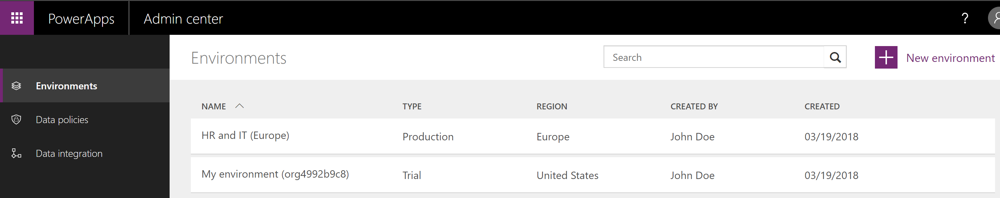
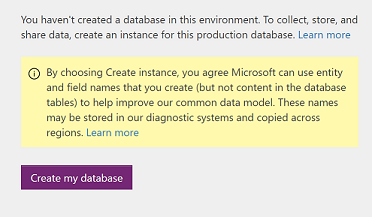
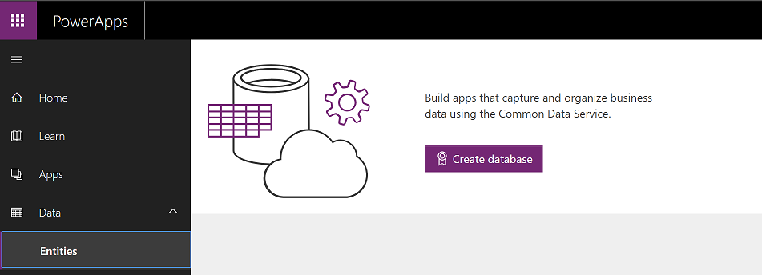

# Create a Common Data Service database
You can create a database and build apps by using Common Data Service as a data store. You can either create your own custom entities or use the predefined entities. To create a database, you first need to either create an environment, or be assigned to an existing environment as an **Environment Admin**. In addition, you must be assigned the appropriate license. For information on purchasing a plan for using the Common Data Service, see [Pricing info](pricing-billing-skus.md).

There are three ways to create a database:

* In the PowerApps admin center
* In the **Entities** pane of powerapps.com

## Create a database in the admin center
1. In the [admin center](https://admin.powerapps.com), in the left navigation pane, click **Environments**.
    
2. Select the environment in which you want to create the database.
    
    

3. On the **Details** tab, click **Create a database**. 
    
    

4. Choose currency and language to proceed with database creation. 
    
    

## Create a database in the Entities pane of powerapps.com
1. On [powerapps.com](https://web.powerapps.com), expand the **Data** section and click or tap **Entities** in the left navigation pane.

2. Click **Create Database** to create the database.

    

## Security model for the databases
When a database is created, the users who have environment roles assigned to them, will continue to maintain those priviliges.  
    Users with **Environment Admin** role are now assigned to **System Administrator** role. 
    Users with **Environment Maker** continue to possess the same role.

You can assign additional users to pre-defined roles or even create [custom roles][1]. See [Database Security](create-database.md) for more details.

> [!NOTE]
> On creating the database, any security group assigned to Environment Admin or Environment Maker role will not be honored any more. Currently, assigning permissions in database, do not support AAD security group.

## License and security permissions
To create a database, you must be an administrator in the selected environment, and the appropriate license must be assigned to you. From the environment, you can further configure security permissions for other users by using the **Security** tab. For more information, see [Configure database security](database-security.md) and [Security model](https://docs.microsoft.c../maker/common-data-service/entity-reference/security-model).

## Privacy notice
With the Microsoft PowerApps common data model we collect and store custom entity and field names in our diagnostic systems.  We use this knowledge to improve the common data model for our customers. The entity and field names that Creators create help us understand scenarios that are common across the Microsoft PowerApps community and ascertain gaps in the service’s standard entity coverage, such as schemas related to organizations. The data in the database tables associated with these entities is not accessed or used by Microsoft or replicated outside of the region in which the database is provisioned. Note, however, the custom entity and field names may be replicated across regions and are deleted in accordance with our data retention policies. Microsoft is committed to your privacy as described further in our [Trust Center](https://www.microsoft.com/trustcenter/Privacy/default.aspx).

<!--Reference links in article-->
[1]: https://technet.microsoft.com/library/dn531130.aspx
