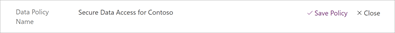
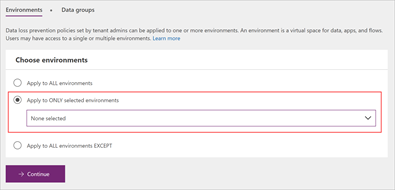

# Quickstart: Create a data loss prevention (DLP) policy
To protect data in your organization, PowerApps lets you create and enforce policies that define which consumer connectors specific business data can be shared with. These policies that define how data can be shared are referred to as data loss prevention (DLP) policies. DLP policies ensure that data is managed in a uniform manner across your organization, and they prevent important business data from being accidentally published to connectors such as social media sites.

In this quickstart, you'll learn how to create a DLP policy for a single environment that prevents data that's stored in your Common Data Service and SharePoint databases from being published to Twitter.

## Prerequisites
To follow this quickstart, **one** of the following items is required:
* Azure Active Directory Tenant Admin permissions
* Office 365 Global Admin permissions
* PowerApps Environment Admin permissions plus a PowerApps Plan 2, Microsoft Flow Plan 2, or a [PowerApps Plan 2 trial](https://web.powerapps.com/signup?redirect=marketing&email=) license

For more information, see [Environments administration in PowerApps](environments-administration.md).

## Sign in to the PowerApps Admin center
Sign in to the Admin center at [https://admin.powerapps.com]([https://admin.powerapps.com).

## Create a DLP policy
1. In the navigation pane, click or tap **Data policies**, and then click or tap **New policy**.

    
2. The **Data Policy Name** field auto-populates with a name based on the time and date the policy is created. Replace this with **Secure Data Access for Contoso**.

    
3. The options on the **Environments** tab differ depending on whether you're an Environment admin or a Tenant admin. If you're an Environment admin, select an environment from the drop-down list, and then click or tap **Continue**.

    

    If you're a Tenant admin, you can create DLP policies that apply to one or more environments, or to all environments within the tenant (including those created using a trial license). For this quickstart, click or tap **Apply to ONLY selected environments**, select an environment from the drop-down list, and then click or tap **Continue**.

    

    Note that environment DLP policies cannot override tenant-wide DLP policies.
4. On the **Data groups** tab, under **Business data only**, click or tap **Add**.

    
5. In the **Add connectors** window, select **Common Data Service** and **SharePoint** (you may have to scroll down or search to find them), and then click or tap **Add connectors** to add them to the **Business data only** data group.

    

    Connectors can reside in only one data group at a time and are added to the **No business data allowed** group by default. By moving Common Data Service and SharePoint to the **Business data only** group, you're preventing users from creating flows and apps that combine these two connectors with any of the connectors in the **No business data allowed** group.

6. Click **Save policy**.

    

The Secure Data Access for Contoso policy is created and appears in the list of data loss prevention policies. Since the Twitter connector resides in the **No business data allowed** data group, this policy ensures that the Common Data Service and SharePoint do not share their data with Twitter.

It's good practice for administrators to share a list of DLP policies with their organization so that users are aware of the policies prior to creating apps.

## Next steps
In this quickstart, you learned how to create a DLP policy for a single environment to prevent important business data from being accidentally published to connectors such as Twitter. To learn more about DLP policies, check out the article about how to manage them.

> [!div class="nextstepaction"]
> [Manage data loss prevention (DLP) policies](prevent-data-loss.md)
