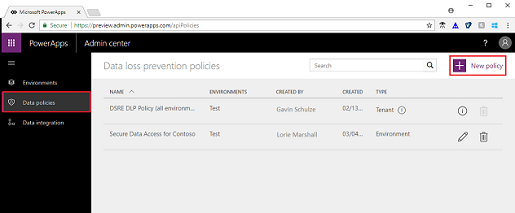
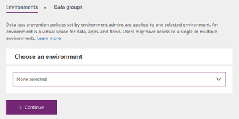
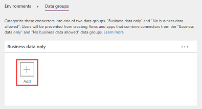
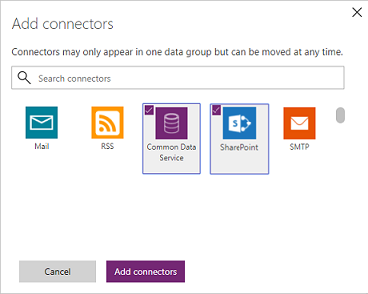
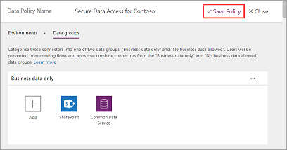

# Quickstart: Create a data loss prevention (DLP) policy
To protect data in your organization, PowerApps lets you create and enforce policies that define which consumer connectors specific business data can be shared with. These policies that define how data can be shared are referred to as data loss prevention (DLP) policies. DLP policies ensure that data is managed in a uniform manner across your organization, and they prevent important business data from being accidentally published to connectors such as social media sites.

In this quickstart, you'll learn how to create a DLP policy that prevents data that's stored in your Common Data Service and SharePoint databases from being published to Twitter.

## Prerequisites
To follow this quickstart, the following items are required:
* Either PowerApps Plan 2 or Flow Plan 2. Alternatively, you can sign up for a [free PowerApps Plan 2 trial](https://web.powerapps.com/signup?redirect=marketing&email=).
* Either Environment Admin or Tenant Admin permissions, and permissions to at least one environment. For more information, see [Environments administration in PowerApps](environments-administration.md).

## Sign in to the PowerApps Admin center
Sign in to the Admin center at [https://admin.powerapps.com]([https://admin.powerapps.com).

## Create a DLP policy
1. In the navigation pane, click or tap **Data policies**, and then click or tap **New policy**.

    
2. For the data policy name, enter **Secure Data Access for Contoso**.
3. On the **Environments** tab, select an environment from the drop-down list, and then click or tap **Continue**.

    
4. On the **Data groups** tab, under **Business data only**, click or tap **Add**.

    
5. In the **Add connectors** window, select **Common Data Service** and **SharePoint** (you may have to scroll down or search to find them), and then click or tap **Add connectors** to add them to the **Business data only** data group.

    

    Connectors can reside in only one data group at a time and are added to the **No business data allowed** group by default. By moving Common Data Service and SharePoint to the **Business data only** group, you're preventing users from creating flows and apps that combine these two connectors with any of the connectors in the **No business data allowed** group.
6. Click **Save policy**.

    

The Secure Data Access for Contoso policy is created and appears in the list of data loss prevention policies. Since the Twitter connector resides in the **No business data allowed** data group, this policy ensures that the Common Data Service and SharePoint do not share their data with Twitter.

It's good practice for administrators to share a list of DLP policies with their organization so that users are aware of the policies prior to creating apps.

## Next steps
In this quickstart, you learned how to create a DLP policy to prevent important business data from being accidentally published to connectors such as Twitter. To learn more about DLP policies, check out the article about how to manage them.

> [!div class="nextstepaction"]
> [Manage data loss prevention (DLP) policies](prevent-data-loss.md)
