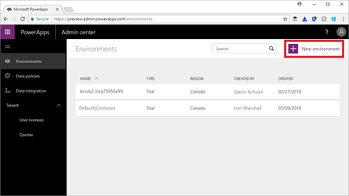
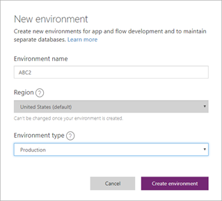
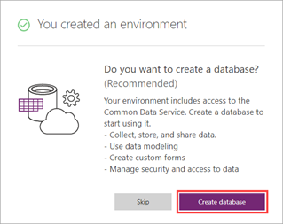
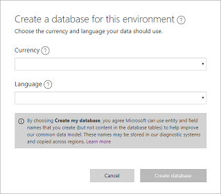
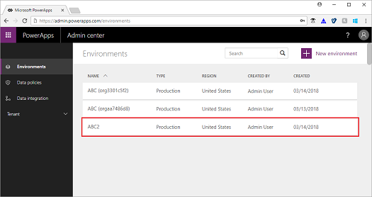

# Create an environment
An environment is a space to store, manage, and share your organization’s business data, apps, and flows. It also serves as a container to separate apps that may have different roles, security requirements, or target audiences. PowerApps automatically creates a single default environment for each tenant, which is shared by all users in that tenant.

Every environment can have zero or one Common Data Service database, which provides storage for apps. When users create an app in an environment, that app can connect to any data source, including connections, gateways, and flows. However, the app is only permitted to connect to the Common Data Service databases in that same environment. How you choose to leverage environments depends on your organization and the apps you're trying to build. For more information, see [Environments overview](environments-overview.md).

In this topic, you'll learn how to create an environment and a database for that environment.

## Prerequisites
 To follow this topic, the following items are required:
 * Either a PowerApps Plan 2 or Microsoft Flow Plan 2 license. Alternatively, you can sign up for a [free PowerApps Plan 2 trial](https://web.powerapps.com/signup?redirect=marketing&email=).
 * PowerApps Environment Admin, Office 365 Global Admin, or Azure Active Directory Tenant Admin permissions. For more information, see [Environments administration in PowerApps](environments-administration.md).

## Sign in to the PowerApps Admin center
Sign in to the Admin center at [https://admin.powerapps.com](https://admin.powerapps.com).

## Create an environment and database
1. In the navigation pane, click or tap **Environments**, and then click or tap **New environment**.

    
2. In the **New environment** dialog box, enter a name for the environment, and then select a region and environment type from the drop-down lists. The region  defaults to the Azure Active Directory Tenant home region, but you may select any region from the drop-down list. You cannot change the region once the environment is created. When you're done, click or tap **Create environment**.

    
3. Once the environment is created, you'll receive a confirmation message in the dialog box and you'll be prompted to create a database. Click or tap **Create database** to enable access to the Common Data Service.

    **Note:** At this time, you can only create a database in the Azure Active Directory Tenant home region.

    
4. Select the currency and language for the data stored in the database. You cannot change the currency or language once the database is created. When you're done, click or tap **Create database**.

    

    It may take several minutes to create the database on the Common Data Service. Once the database is created, the new environment appears in the list of environments on the **Environments** page.

    

    Click or tap the environment to view the environment details.

## Next steps
In this topic, you learned how to create an environment and database for that environment. Next, learn how to administer environments in your organization.

> [!div class="nextstepaction"]
> [Administer environments in PowerApps](environments-administration.md)
