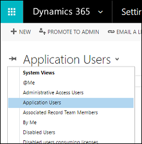

# Create users in Dynamics 365 (online) and assign security roles

> [!NOTE]
>   [!INCLUDE[cc-under-construction](../includes/cc-under-construction.md)]

[!INCLUDE[cc-applies-to-update-9-0-0](../includes/cc_applies_to_update_9_0_0.md)] [!INCLUDE[cc-applies-to-update-8-2-0](../includes/cc_applies_to_update_8_2_0.md)]

You use the [!INCLUDE[pn_office_365_admin_center](../includes/pn-office-365-admin-center.md)] to create user accounts for every user who needs access to [!INCLUDE[pn_crm_online_shortest](../includes/pn-crm-online-shortest.md)]. The user account registers the user with [!INCLUDE[pn_ms_online_services_environment](../includes/pn-ms-online-services-environment.md)]. In addition to registration with the online service, the user account must be assigned a license in order for the user to have access to the service. Note that when you assign a user the global administrator or the service administrator role in the [!INCLUDE[pn_ms_online_services_environment](../includes/pn-ms-online-services-environment.md)], it automatically assigns the user the System Administrator security role in [!INCLUDE[pn_microsoftcrm](../includes/pn-microsoftcrm.md)]. [!INCLUDE[proc_more_information](../includes/proc-more-information.md)] [Differences between the Microsoft Online services environment administrative roles and Dynamics 365 (online) security roles](grant-users-access.md#BKMK_O365CRMroles)  
  
   

## Create a user account  
 When you create a user account in the [!INCLUDE[pn_office_365_admin_center](../includes/pn-office-365-admin-center.md)], the system generates a user ID and temporary password for the user. You have the option to let the service send an email message to the user as clear text. Although the password is temporary, you may consider copying the information to send to the user through a more secure channel, such as from an email service that can digitally encrypt the contents. For step-by-step instructions for creating a [!INCLUDE[pn_MS_Online_Services](../includes/pn-ms-online-services.md)] user account, see [Create or edit users in Office 365](http://go.microsoft.com/fwlink/p/?LinkId=255286).  
  
  Check out the following video: [Add People to Dynamics 365](https://go.microsoft.com/fwlink/p/?linkid=836826).  
  
> [!NOTE]
>  When you create a user and assign a license in the [!INCLUDE[pn_office_365_admin_center](../includes/pn-office-365-admin-center.md)], the user is also created in [!INCLUDE[pn_crm_online_shortest](../includes/pn-crm-online-shortest.md)]. The synchronization process between the [!INCLUDE[pn_office_365_admin_center](../includes/pn-office-365-admin-center.md)] and [!INCLUDE[pn_crm_online_shortest](../includes/pn-crm-online-shortest.md)] can take a few minutes to complete.  
>   
>  By entering a user ID and password, a user can access the [!INCLUDE[pn_office_365_admin_center](../includes/pn-office-365-admin-center.md)] to view information about the service. However, the user will not have access to [!INCLUDE[pn_crm_online_shortest](../includes/pn-crm-online-shortest.md)] until you assign at least one [!INCLUDE[pn_crm_online_shortest](../includes/pn-crm-online-shortest.md)] security role to this user.  
  
> [!TIP]
>  To force an immediate synchronization between the [!INCLUDE[pn_office_365_admin_center](../includes/pn-office-365-admin-center.md)] and [!INCLUDE[pn_crm_online_shortest](../includes/pn-crm-online-shortest.md)], do the following:  
>   
> -   Sign out of [!INCLUDE[pn_crm_online_shortest](../includes/pn-crm-online-shortest.md)] and the [!INCLUDE[pn_office_365_admin_center](../includes/pn-office-365-admin-center.md)].  
> -   Close all open browsers used for [!INCLUDE[pn_crm_online_shortest](../includes/pn-crm-online-shortest.md)] and the [!INCLUDE[pn_office_365_admin_center](../includes/pn-office-365-admin-center.md)].  
> -   Sign back in to [!INCLUDE[pn_crm_online_shortest](../includes/pn-crm-online-shortest.md)] and the [!INCLUDE[pn_office_365_admin_center](../includes/pn-office-365-admin-center.md)].  
  
## User profile information

Some user profile information is maintained and managed in the [!INCLUDE [pn-office-365-admin-center](../includes/pn-office-365-admin-center.md)].  After you create or update a user, these user profile fields are automatically updated and synchronized in your [!INCLUDE[pn_crm_online_shortest](../includes/pn-crm-online-shortest.md)] instances.

The following table shows the fields that are managed in the **Users** section of the [!INCLUDE [pn-office-365-admin-center](../includes/pn-office-365-admin-center.md)].

|Dynamics 365 user form  |Office 365 / Azure Active Directory user  |
|---------|---------|
|User Name     |Username         |
|Full Name     |First name + Last name         |
|Title     |Job title         |
|Primary Email     |Email         |
|Main Phone     |Office phone         |
|Mobile Phone     |Mobile phone         |
|Fax     |Fax number         |
|Address     |Street address         |
|Address     |City         |
|Address     |State or province         |
|Address     |Country or region         |

The following are Office 365 user contact fields.

 

   

## Add a license to a user account  
 You can license the user when you create the user account, or you can license the user later. You must assign a license to every user account that you want to access the online service.  
  
 For step-by-step instructions, see [Assign, reassign, or remove licenses](http://go.microsoft.com/fwlink/p/?LinkId=255449).  
  
> [!IMPORTANT]
>  Licensed users must be assigned at least one [!INCLUDE[pn_microsoftcrm](../includes/pn-microsoftcrm.md)] security role to access [!INCLUDE[pn_crm_online_shortest](../includes/pn-crm-online-shortest.md)].  
  
 **About user licenses**  
  
- [!INCLUDE[pn_CRM_Online](../includes/pn-crm-online.md)] uses user licenses to provide access to your organization. You need one user license per person with an active user record who logs into your organization.  
  
-   When you add a new person, the **New user account** form displays the number of user licenses available. If you reach your limit, the **On** button is no longer available. You can add additional licenses by choosing **Billing** > **Purchase Services** from the left-side menu in the [!INCLUDE[pn_office_365_admin_center](../includes/pn-office-365-admin-center.md)].  
  
-   An unaccepted invitation requires a user license until the invitation expires two weeks after it was issued.  
  
-   If you have more user licenses than you are using, contact support to reduce the number of licenses. You cannot reduce the number of licenses to less than you are currently using or less than your offer allows. Any changes are reflected in your next billing cycle.  
  
-   Each user license requires a unique Microsoft account, and every user who logs on to [!INCLUDE[pn_microsoftcrm](../includes/pn-microsoftcrm.md)] needs a license. Most [!INCLUDE[pn_crm_shortest](../includes/pn-crm-shortest.md)] subscriptions include a specific number of user licenses.  
  
   
## Assign a security role to a user  
 Security roles control a user’s access to data through a set of access levels and permissions. The combination of access levels and permissions that are included in a specific security role sets limits on the user’s view of data and on the user’s interactions with that data.  
  
 [!INCLUDE[pn_CRM_Online](../includes/pn-crm-online.md)] provides a default set of security roles. If necessary for your organization, you can create new security roles by editing one of the default security roles and then saving it under a new name.  
  
 You can assign more than one security role to a user. The effect of multiple security roles is cumulative, which means that the user has the permissions associated with all security roles assigned to the user.  
  
 Security roles are associated with business units. If you have created business units, only those security roles associated with the business unit are available for the users in the business unit. You can use this feature to limit data access to only data owned by the business unit.  
  
 For more information about the difference between [!INCLUDE[pn_MS_Online_Services](../includes/pn-ms-online-services.md)] administrator roles and [!INCLUDE[pn_crm_online_shortest](../includes/pn-crm-online-shortest.md)] security roles, see [Grant users access to Microsoft Dynamics 365 (online) as a Microsoft Online service](grant-users-access.md).  
  
> [!IMPORTANT]
>  You must assign at least one security role to every [!INCLUDE[pn_crm_online_shortest](../includes/pn-crm-online-shortest.md)] user. The service does not allow access to users who do not have at least one security role. Even if a user is a member of a team with its own security privileges, the user won’t be able to see some data and may experience other problems when trying to use the system.  
  
 In [!INCLUDE[pn_crm_online_shortest](../includes/pn-crm-online-shortest.md)]:  
  
1.  Click **Settings** > **Security** > **Users**.  
  
2.  In the list, select the user or users that you want to assign a security role to.  
  
3.  Click **Manage Roles**.  
  
     Only the security roles available for that user's business unit are displayed.  
  
4.  In the **Manage User Roles** dialog box, select the security role or roles you want for the user or users, and then click **OK**.  
  
   

## (Optional) Assign an administrator role  
 You can share [!INCLUDE[pn_ms_online_services_environment](../includes/pn-ms-online-services-environment.md)] administration tasks among several people by assigning [!INCLUDE[pn_ms_online_services_environment](../includes/pn-ms-online-services-environment.md)] administrator roles to users you select to fill each role. You might decide to assign the global administrator role to a second person in your organization for times when you are not available.  
  
 There are five [!INCLUDE[pn_ms_online_services_environment](../includes/pn-ms-online-services-environment.md)] administrator roles with varying levels of permissions. For example, the password reset administrator role can reset user passwords only; the user management administrator role can reset user passwords as well as add, edit, or delete user accounts; and the global administrator role can add online service subscriptions for the organization and can manage all aspects of subscriptions. For detailed information about [!INCLUDE[pn_MS_Online_Services](../includes/pn-ms-online-services.md)] administrator roles, see [Assigning Admin Roles](http://go.microsoft.com/fwlink/p/?LinkId=255444).  
  
> [!NOTE]
> [!INCLUDE[pn_ms_online_services_environment](../includes/pn-ms-online-services-environment.md)] administrator roles are valid only for managing aspects of the online service subscription. These roles don’t affect permissions within the [!INCLUDE[pn_crm_online_shortest](../includes/pn-crm-online-shortest.md)] service.  
  
   

## Enable or disable users  
 To enable a user, assign a license to the user and add a user to the security group that is associated with an instance of [!INCLUDE[pn_crm_online_shortest](../includes/pn-crm-online-shortest.md)]. If you enable a user that was disabled, you must send a new invitation for the user to access the system.  
  
 To disable a user, remove a license from the user or remove the user from the security group that is associated with an instance of [!INCLUDE[pn_crm_online_shortest](../includes/pn-crm-online-shortest.md)]. Removing a user from the security group doesn’t remove the user’s license. If you want to make the license available to another user, you have to remove the license from the disabled user.  
  
> [!NOTE]
>  Removing all security roles from the user prevents the user from signing into and accessing [!INCLUDE[pn_crm_online_shortest](../includes/pn-crm-online-shortest.md)]. However, it doesn’t remove the license from the user and the user remains in the list of the enabled users in [!INCLUDE[pn_crm_online_shortest](../includes/pn-crm-online-shortest.md)]. Removing security roles from a user isn’t a recommended method of removing access to [!INCLUDE[pn_crm_online_shortest](../includes/pn-crm-online-shortest.md)].  
  
 You must be a member of an appropriate administrator role to do these tasks. [!INCLUDE[proc_more_information](../includes/proc-more-information.md)] [Assigning Admin Roles](http://go.microsoft.com/fwlink/p/?LinkId=255444)  
  
### Enable a user by assigning a license to the user and adding a user to the security group  
  
1.  Browse to the [Office 365 admin center](https://portal.office.com) and sign in.  
  
2.  Click **Users** > **Active users** and select the user.  
  
3.  Under **Product licenses**, click **Edit**.  
  
4.  Turn on a **[!INCLUDE[pn_CRM_Online](../includes/pn-crm-online.md)]** license, and then click **Save** > **Close**.  
  
5.  In the [!INCLUDE[pn_office_365_admin_center](../includes/pn-office-365-admin-center.md)], click **Groups** > **Groups**.  
  
6.  Choose the security group that is associated with your [!INCLUDE[pn_crm_online_shortest](../includes/pn-crm-online-shortest.md)] organization.  
  
7.  Under **Members**, click **Edit**, and then **Add members**. Select from the list of users with [!INCLUDE[pn_Office_365](../includes/pn-office-365.md)] licenses or use **Search** to find users.  
  
8.  Select the users to add to the security group, and then click **Save** > **Close** multiple times.  
  
     To add multiple users, see: [bulk add users to Office365 groups](http://go.microsoft.com/fwlink/p/?LinkID=615203).  
  
### Disable a user by removing a license from the user  
  
1.  In the [!INCLUDE[pn_office_365_admin_center](../includes/pn-office-365-admin-center.md)], click **Users** > **Active Users** and select a user.  
  
2.  In the right-side menu, under **Product licenses**, click **Edit**.  
  
3.  Turn off the **[!INCLUDE[pn_CRM_Online](../includes/pn-crm-online.md)]** license, and then click **Save** > **Close** multiple times.  
  
### Disable a user by removing the user from the security group that is associated with an instance of Dynamics 365 (online)  
  
1.  In the [!INCLUDE[pn_office_365_admin_center](../includes/pn-office-365-admin-center.md)], click **Groups** > **Groups**.  
  
2.  Choose the security group that is associated with your [!INCLUDE[pn_crm_online_shortest](../includes/pn-crm-online-shortest.md)] organization.  
  
3.  In the right-side menu, under **Members**, click **Edit**.  
  
4.  Click **Remove members**, and then the select  users to remove from the security group.  
  
5.  Click **Save** > **Close** multiple times.  
  
> [!NOTE]
> You can also delete users in the [!INCLUDE[pn_office_365_admin_center](../includes/pn-office-365-admin-center.md)]. When you remove a user from your subscription, the license assigned to that user automatically becomes available to be assigned to a different user. If you want the user to still have access to other applications you manage through [!INCLUDE[pn_Office_365](../includes/pn-office-365.md)], for example [!INCLUDE[pn_Microsoft_Exchange_Online](../includes/pn-microsoft-exchange-online.md)] or [!INCLUDE[pn_ms_SharePoint_long](../includes/pn-ms-sharepoint-long.md)], don't delete them as a user. Instead, simply remove the [!INCLUDE[pn_microsoftcrm](../includes/pn-microsoftcrm.md)] license you've assigned to them.  
  
> [!NOTE]
> When you sign out of the [!INCLUDE[pn_office_365_admin_center](../includes/pn-office-365-admin-center.md)], you aren’t signing out of [!INCLUDE[pn_crm_shortest](../includes/pn-crm-shortest.md)]. You have to do that separately.  
  
> [!TIP]
> To force an immediate synchronization between the [!INCLUDE[pn_office_365_admin_center](../includes/pn-office-365-admin-center.md)] and [!INCLUDE[pn_crm_online_shortest](../includes/pn-crm-online-shortest.md)], do the following:  
>   
> -   Sign out of [!INCLUDE[pn_crm_online_shortest](../includes/pn-crm-online-shortest.md)] and the [!INCLUDE[pn_office_365_admin_center](../includes/pn-office-365-admin-center.md)].  
> -   Close all open browsers used for [!INCLUDE[pn_crm_online_shortest](../includes/pn-crm-online-shortest.md)] and the [!INCLUDE[pn_office_365_admin_center](../includes/pn-office-365-admin-center.md)].  
> -   Sign back in to [!INCLUDE[pn_crm_online_shortest](../includes/pn-crm-online-shortest.md)] and the [!INCLUDE[pn_office_365_admin_center](../includes/pn-office-365-admin-center.md)].  
  
   

## Create a non-interactive user account  
 The non-interactive user is not a ‘user’ in the typical sense – it is not a person but an access mode that is created with a user account. It is used for programmatic access to and from Dynamics 365 between applications. A non-interactive user account lets these applications or tools, such as a Dynamics 365 to ERP connector, authenticate and access Dynamics 365 (online), without requiring a Dynamics 365 (online) license. For each instance of Dynamics 365 (online), you can create up to five non-interactive user accounts.  
  
 You need to have the System Administrator security role or equivalent permissions in Dynamics 365 to create a non-interactive user. First, you’ll create a user account in Office 365 and then in [!INCLUDE[pn_CRM_Online](../includes/pn-crm-online.md)], select the non-interactive access mode for the account.  
  
1.  [Create a user account](create-users-assign-online-security-roles.md#BKMK_create_users) in the [!INCLUDE[pn_office_365_admin_center](../includes/pn-office-365-admin-center.md)].  
  
     Be sure to assign a [!INCLUDE[pn_crm_online_shortest](../includes/pn-crm-online-shortest.md)] license to the account.  
  
2.  Go to [!INCLUDE[pn_crm_online_shortest](../includes/pn-crm-online-shortest.md)].  
  
3. [!INCLUDE[proc_settings_security](../includes/proc-settings-security.md)]  
  
4.  Choose **Users** > **Enabled Users**, and then click a user’s full name.  
  
5.  In the user form, scroll down under **Administration**  to the **Client Access License (CAL) Information** section and select **Non-interactive** for Access Mode.  
  
     You then need to remove the [!INCLUDE[pn_crm_online_shortest](../includes/pn-crm-online-shortest.md)] license from the account.  
  
6.  Go to the [!INCLUDE[pn_office_365_admin_center](../includes/pn-office-365-admin-center.md)].  
  
7.  Click **Users** > **Active Users**.  
  
8.  Choose the non-interactive user account and under **Product licenses**, click **Edit**.  
  
9. Turn off the [!INCLUDE[pn_crm_online_shortest](../includes/pn-crm-online-shortest.md)] license,  and then click **Save** > **Close** multiple times.  
  
10. Go back to [!INCLUDE[pn_crm_online_shortest](../includes/pn-crm-online-shortest.md)] and confirm that the non-interactive user account **Access Mode** is still set for **Non-interactive**.  
  
   

## Create an application user  
 Introduced in [!INCLUDE[pn_crm_8_2_0_online](../includes/pn-crm-8-2-0-online.md)], you can use server-to-server (S2S) authentication to securely and seamlessly communicate with [!INCLUDE[pn_crm_8_2_0_online_subsequent](../includes/pn-crm-8-2-0-online-subsequent.md)] with your web applications and services. S2S authentication is the common way that apps registered on [!INCLUDE[pn_microsoft_appsource](../includes/pn-microsoft-appsource.md)] use to access the [!INCLUDE[pn_crm_2016_shortest](../includes/pn-crm-2016-shortest.md)] data of their subscribers. All operations performed by your application or service using S2S will be performed as the application user you provide rather than as the user who is accessing your application.  
  
 You will need to create a custom security role and an application user to associate with your registered app. For more information, see [Build web applications using Server-to-Server (S2S) authentication](https://docs.microsoft.com/dynamics365/customer-engagement/developer/build-web-applications-server-server-s2s-authentication).
  
   
  
### See also  
 [Manage subscriptions, licenses, and user accounts](manage-subscriptions-licenses-user-accounts.md)   
 [Assigning Admin Roles](http://go.microsoft.com/fwlink/p/?LinkId=255444)   
 [Add users to Office 365 for business](https://support.office.com/en-us/article/Add-users-to-Office-365-for-business-435ccec3-09dd-4587-9ebd-2f3cad6bc2bc?ui=en-US&rs=en-US&ad=US)   
 [Security roles and privileges](security-roles-privileges.md)   
 [Manage Microsoft Dynamics 365 (online) licenses](manage-licenses.md)
