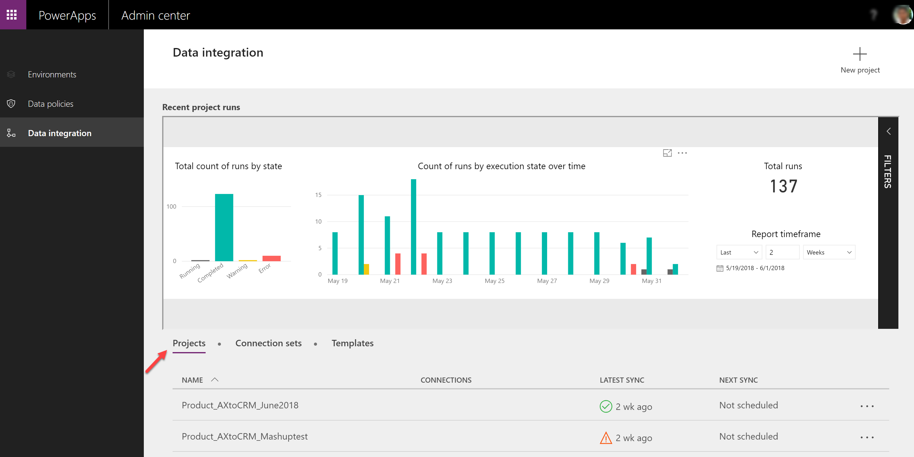
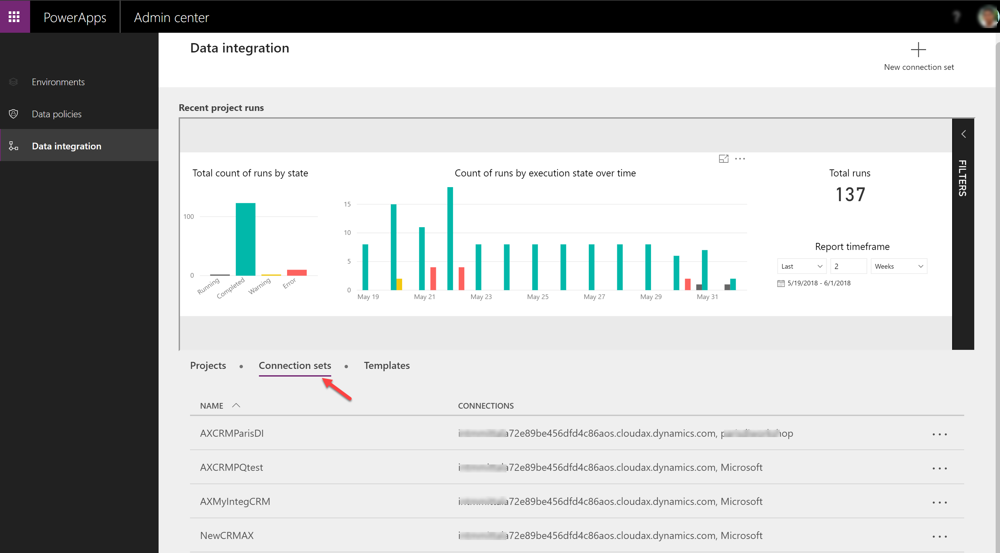
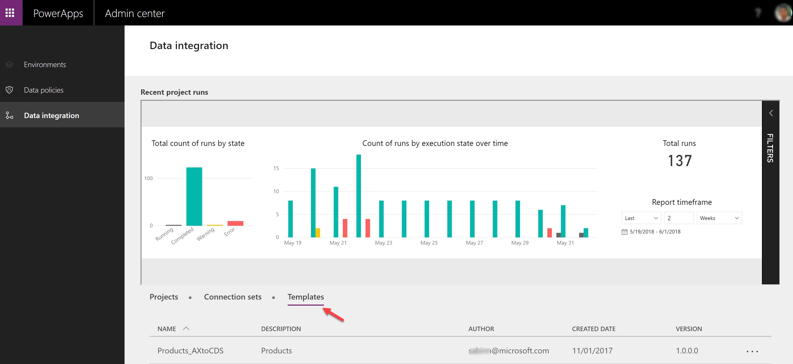
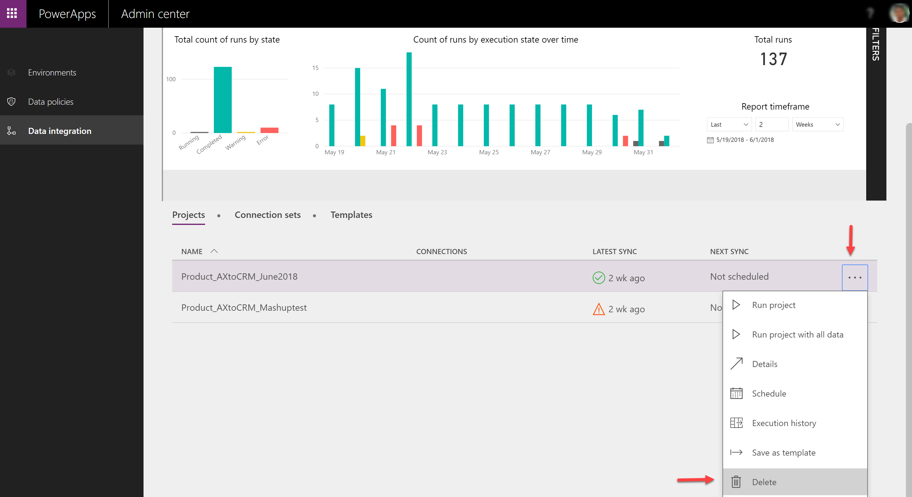
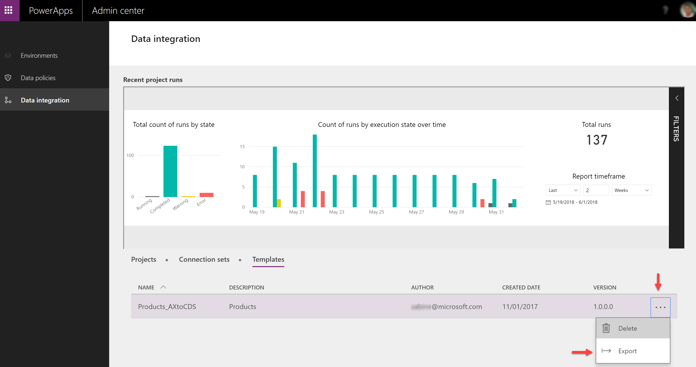
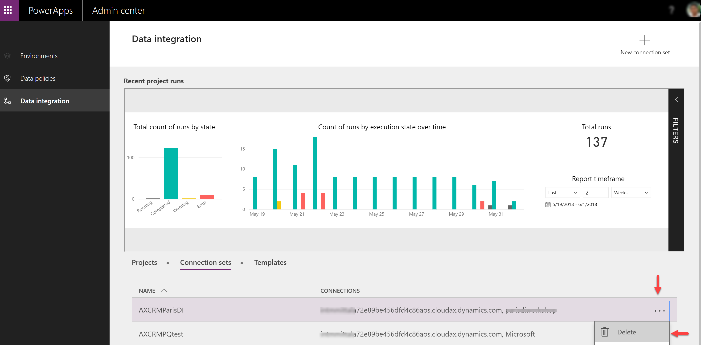
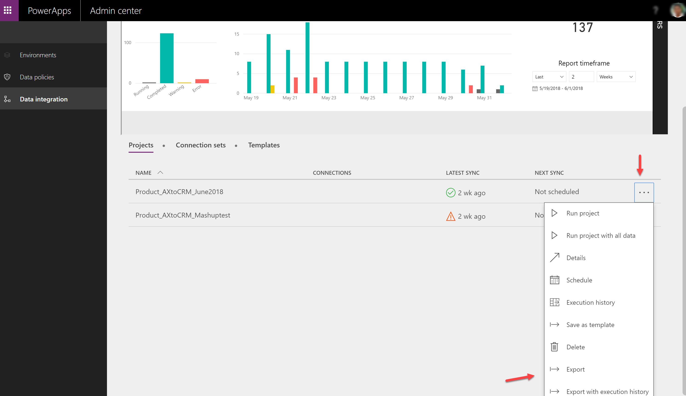
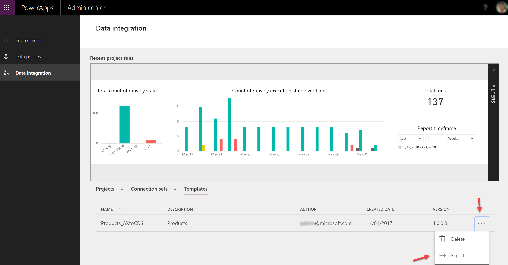
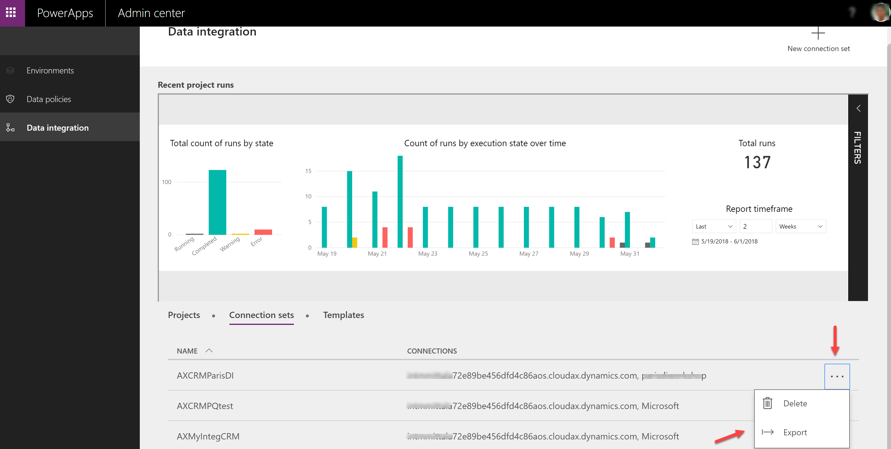

# Responding to Data Subject Rights (DSR) requests for Data Integration for Common Data Service for Apps customer data

## Introduction to DSR requests

The European Union (EU) General Data Protection Regulation (GDPR) gives rights to people (known in the regulation as data subjects) to manage the personal data that's been collected by an employer or other type of agency or organization (known as the data controller or just controller). Personal data is defined very broadly under the GDPR as any data that relates to an identified or identifiable natural person. The GDPR gives data subjects the right to do the following, as it pertains to their personal data:

- Obtain copies
- Request corrections
- Restrict processing
- Delete it
- Receive it in electronic format so it can be moved to another controller

A formal request by a data subject to a controller to take an action on his or her personal data is called a Data Subject Rights (DSR) request.

This article describes how Microsoft is preparing for the GDPR, and also provides examples of steps you can take to support GDPR compliance when using Data Integration for Admins via the administrator portal in CDS for Apps . You'll learn how to use Microsoft products, services, and administrative tools to help controller customers find, access, and act on personal data in the Microsoft cloud in response to DSR requests.

### Searching for and identifying personal data

Data Integration for Admins in CDS for Apps allows any user of the integrator application to view their data by using the data integration tab at:

[https://admin.powerapps.com/dataintegration](https://admin.powerapps.com/dataintegration)

The data stored for the user is shown in the portal. All projects are visible on the projects tab:

All connection sets are visible on the connection sets tab:

All Templates are visible on the Templates tab:

## Securing and controlling access to personal information

In the Data Integration for Admins in CDS for Apps, data stored by the data integration application can only be accessed through the administrator portal.

## Deleting personal data

In Data Integration for Admins in CDS for Apps user-authored data, projects, and connection sets can be deleted by the user the data is associated with. To delete their personal data, users can log on to the administrator portal: [https://admin.powerapps.com](https://admin.powerapps.com)

Users can delete projects by navigating to the projects tab and clicking on the ellipses next to the project, and then selecting the delete option:

Users can delete templates by navigating to the templates tab and clicking the ellipses next to the template, and then selecting the delete option:

Users can delete connection sets by navigating to the connection sets tab and clicking on the ellipses next to the connection set, and then selecting the delete option:

## Exporting personal data

In Data Integration for Admins in CDS for Apps, user-authored data can be exported by the user the data is associated with. To export their personal data, users can log on to the administrator portal:

[https://admin.powerapps.com](https://admin.powerapps.com)

To export projects or projects with execution history, users can navigate to the projects tab and click the ellipses next to the project, and then select the desired export option:

To export templates, users can navigate to the templates tab and click on the ellipses next to the template, and then select the export option:

To export connection sets, users can navigate to the connection set tab and click on the ellipses next to the connection set, and then select the export option:

