# Data Integrator error management and troubleshooting

The Data Integrator is a point-to-point integration service used to integrate data from multiple sources-for example, Dynamics 365 for Finance and Operations, Dynamics 365 for Sales and Salesforce, SQL (Preview)-into Common Data Service for Apps. It also supports integrating data into Dynamics 365 for Finance and Operations, Dynamics 365 for Sales. The Integrate data into Common Data service for Apps document provides detailed step-by-step instructions to help you set-up data integration projects for process based integration scenarios like Prospect to Cash, Field Service and Project Service integrations. It also supports integrating data into Dynamics 365 for Finance and Operations, Dynamics 365 for Sales. The [Integrate data into Common Data service for Apps](data-integrator.md) document provides detailed step-by-step instructions to help you set-up data integration projects for process based integration scenarios like Prospect to Cash, Field Service and Project Service integrations. 

While we are constantly evolving and driving fixes into the platform based on customer feedback, we understand there is a need to provide guidance when you run into issues.  The focus of this document is to walk you through error management and troubleshooting some of these issues.

## View health of project executions

Every time a data integration project is executed (manually or scheduled), you can view the status of the execution on the Admin dashboard and/or the project list page.  

> [!div class="mx-imgBorder"] 
> 

The admin dashboard provides a one-stop real-time view of all your project runs and their status with a drill-down to view details of executions. The dashboard shows you the individual and summarized count of executions. These are color-coded to show status of each project - green for completed projects, yellow for completed projects with warnings, and red for projects with an error status. Similarly, the green, red and yellow icons on the on the project list page indicate the status of your projects.

Additionally, to view more details, you can drill through project executions via the admin dashboard by right-clicking on individual bar charts.

> [!div class="mx-imgBorder"] 
> 

You will now be able to further drill through individual errors.

> [!div class="mx-imgBorder"] 
> 

You can also view project execution details by clicking on the individual projects on the project list page and view the historical executions and status under **Execution history** tab.

> [!div class="mx-imgBorder"] 
> 

In case of a Warning or Error, you can further drill down by clicking through the executions under the **Execution history** tab.

> [!div class="mx-imgBorder"] 
> 

## Project monitoring

We highly encourage our customers and partners to subscribe to email-based notifications, wherein you receive email alerts on project executions that either completed with warnings or errors. For each project, under the **Scheduling** tab, you will be able to select email-based notifications and provide multiple email addresses (including group addresses), separated by commas.

> [!div class="mx-imgBorder"] 
> 

Any time a project completes with a warning or is in the error state, you get an email notification indicating the project execution status with a drill-through link to the specific failure.

> [!div class="mx-imgBorder"] 
> 

Clicking on the link takes you directly to your project execution status which you can further drill through for specific errors.

> [!div class="mx-imgBorder"] 
> 

## Project execution status

When a data integration project is executed (manually or scheduled), it creates a detailed log with project name, a time stamp showing the last update along with project status.

Each project execution is marked with one of the three status - Completed, Warning or Error.

1. **Completed**
   
   If all records were upserted successfully, project status is marked as **Completed**. 

   > [!div class="mx-imgBorder"] 
   > 

2. **Warning**

   If some records were upserted (upsert or update insert is a logic to either update the record, if it already exists, or to insert new record) successfully while some failed or errored out, project is marked with a **Warning** status.

   > [!div class="mx-imgBorder"] 
   > 

3. **Error**

   If none of the records were successful and/or errored out. There were no upserts or inserts in destination, project is marked with an **Error** status.

   > [!div class="mx-imgBorder"] 
   > 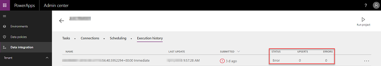

   If the project execution is in **Error** state, then it will automatically retry execution at the next scheduled run.

You can also manually retry an execution by selecting **Re-run execution** via the ellipsis on the **Execution history** page.

## Quick tips on troubleshooting common scenarios 

Here are some quick tips that will help you troubleshoot some of the common scenarios.

### Connection or environment issues 

If you are unable to see your connections or your environments in the drop-down while trying to create a Connection set, here are some of the things you can do to troubleshoot the issue.

> [!div class="mx-imgBorder"] 
> 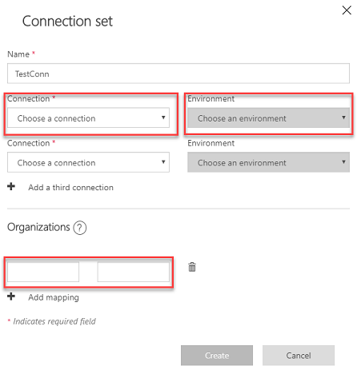

- **Connection**: ensure you have created your connections under Data/Connections on [https://web.powerapps.com ](https://web.powerapps.com) and that they are in the **Connected** state. If you see a *Fix Connection* notification, you want to double check the credentials used for the account and use the **Switch account** option from the ellipsis to re-authenticate.

  > [!div class="mx-imgBorder"] 
  > 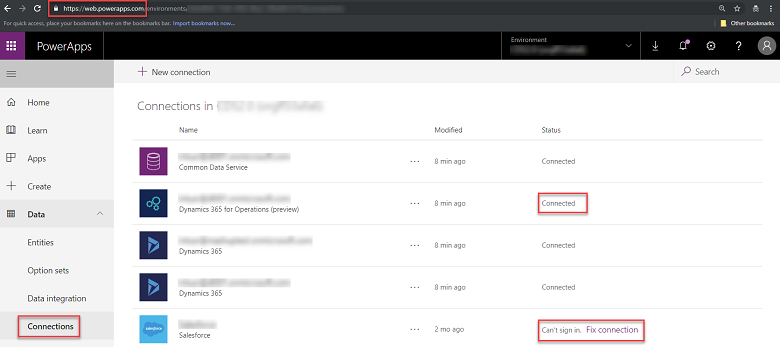

- **Environment**: if you don’t see your environments in the drop down, you want to ensure that the account you used to create the connections has the appropriate access to the entity. A good way to test this is by creating a *flow* (using Microsoft Flow). 

  Here is an example of creating a simple flow to test your connection to Dynamics 365 for Finance and Operations.

  - Create a new flow (choose **Create from blank**) under **Business logic/Flow** from [https://web.powerapps.com](https://web.powerapps.com).

    > [!div class="mx-imgBorder"] 
    > 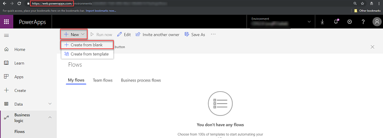

  - Select a **Recurrence** trigger and under **New Step** search and select **Dynamics 365 for Finance and Operations connector**.

    > [!div class="mx-imgBorder"] 
    > 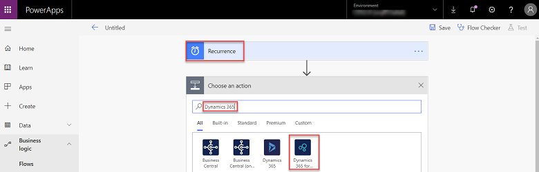

  - Select **Create record** as an action and in the drop down, ensure that you are logged in with the appropriate account. This is the same account you would use to create your connection for your data integration projects.

    > [!div class="mx-imgBorder"] 
    > 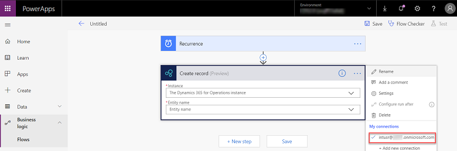

  - Clicking on the drop down under **Instance** should show all the Dynamics 365 Finance and Operations environments. This is a good step to verify your account (from previous step) has access to the environments. 

    > [!div class="mx-imgBorder"] 
    > 

  - Additionally, once you have picked your environment, you confirm that you have access to all the entities under it.

    > [!div class="mx-imgBorder"] 
    > 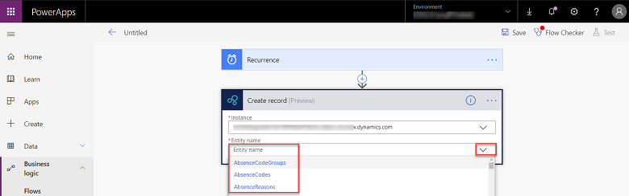

- **Organizations**: this is where you would specify the LE (Legal Entity ex: USMF) for Dynamics 365 for Finance and Operations, the BU (Business Unit) for Dynamics 365 for Sales or the Common Data Service for Apps organization name. If you miss this step, you will get a message with the valid names corresponding to your application that you then need to plug-in under Organizations.

### Project validation errors 

A data integration project is first validated before it is executed. Some of the top reasons for validation errors include:

- Incorrect company/Business unit selected during project creation 
- Missing mandatory columns 
- Incomplete or duplicate mapping 
- Field type mismatch

Here is an example of how the error manifests in case of duplicate mapping. The orange banner indicates mapping issues.

> [!div class="mx-imgBorder"] 
> 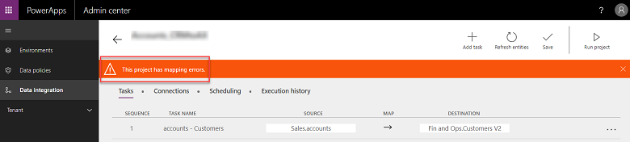

Further drilling into the project execution history indicates a duplicate field issue.

> [!div class="mx-imgBorder"] 
> 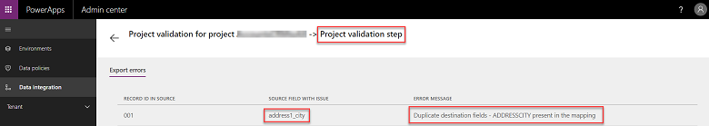

When you inspect the mapping, you can identify duplicates. In this case, source field **fax** is incorrectly mapped to ADDRESSCITY.

> [!div class="mx-imgBorder"] 
> 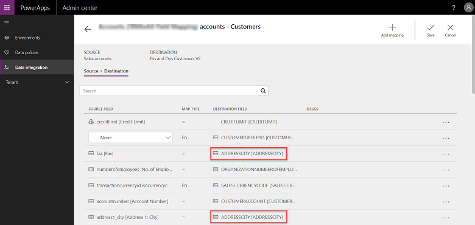

Once you fix the mapping, error should go away, and you should be able to execute the project successfully.

> [!div class="mx-imgBorder"] 
> 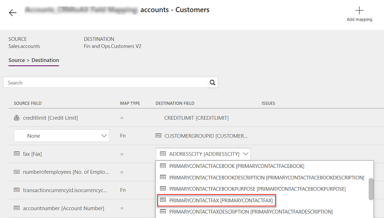

### Project executions issues 

If you are notified of a project execution that completed with warning or is in error state, the first step is to drill into the execution history. From the project list page, click the individual project and review the latest execution under the **Execution history** tab and click through to the specific error.

> [!div class="mx-imgBorder"] 
> 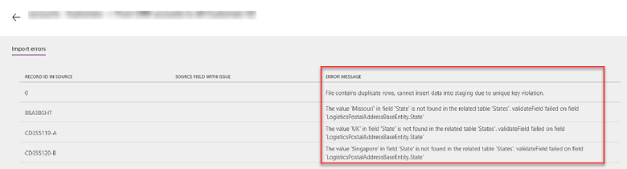

If this is an integration project where Dynamics 365 for Finance and Operations is the source, go to the Data Management workspace in Dynamics 365 F&O and filter projects based on your data integration project name or specifically choose type of import or export job.

> [!div class="mx-imgBorder"] 
> 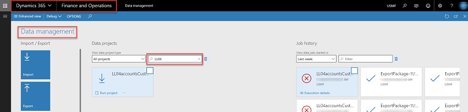

Additionally, you can open the job history of the project and drill through the job id of the project based on the timestamp of your execution and also inspect the execution log, view historical runs and view the staging data.

> [!div class="mx-imgBorder"] 
> 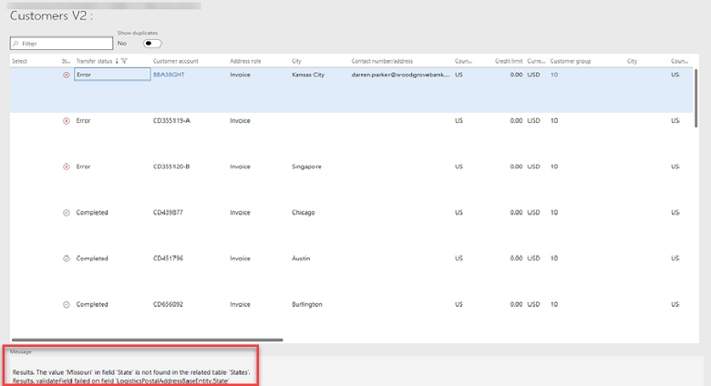

