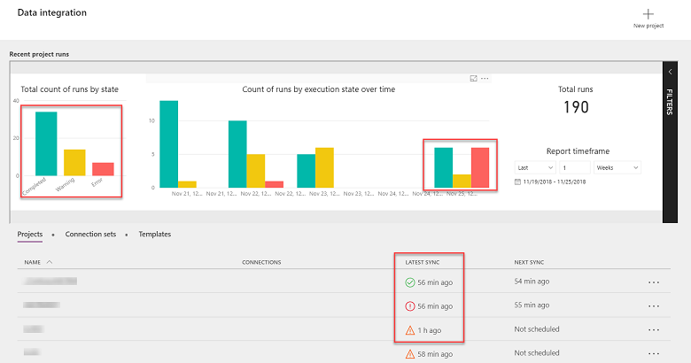
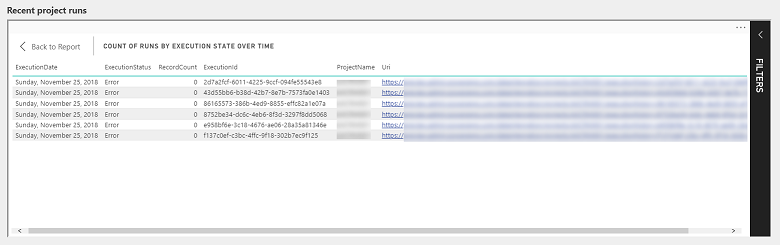
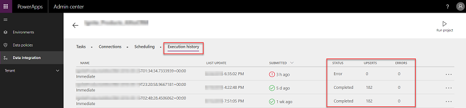
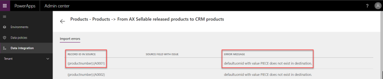
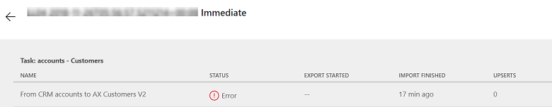
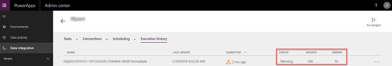

# Integrate data into Common Data Service for Apps

The Data Integrator is a point-to-point integration service used to integrate data from multiple sources-for example, Dynamics 365 for Finance and Operations, Dynamics 365 for Sales and Salesforce, SQL (Preview)-into Common Data Service for Apps. It also supports integrating data into Dynamics 365 for Finance and Operations, Dynamics 365 for Sales. The Integrate data into Common Data service for Apps document provides detailed step-by-step instructions to help you set-up data integration projects for process based integration scenarios like Prospect to Cash, Field Service and Project Service integrations. It also supports integrating data into Dynamics 365 for Finance and Operations, Dynamics 365 for Sales. The [Integrate data into Common Data service for Apps](data-integrator.md) document provides detailed step-by-step instructions to help you set-up data integration projects for process based integration scenarios like Prospect to Cash, Field Service and Project Service integrations. 

While we are constantly evolving and driving fixes into the platform based on customer feedback, we understand there is a need to provide guidance when you run into issues.  The focus of this document is to walk you through error management and troubleshooting some of these issues.

## View health of project executions

Every time a data integration project is executed (manually or scheduled), you can view the status of the execution on the Admin dashboard and/or the project list page.  

> [!div class="mx-imgBorder"] 
> 

The admin dashboard provides a one-stop real-time view of all your project runs and their status with a drill-down to view details of executions. The dashboard shows you the individual and summarized count of executions. These are color-coded to show status of each project - green for completed projects, yellow for completed projects with warnings, and red for projects with an error status. Similarly, the green, red and yellow icons on the on the project list page indicate the status of your projects.

Additionally, to view more details, you can drill through project executions via the admin dashboard by right-clicking on individual bar charts.

> [!div class="mx-imgBorder"] 
> 

You will now be able to further drill through individual errors.

> [!div class="mx-imgBorder"] 
> 

You can also view project execution details by clicking on the individual projects on the project list page and view the historical executions and status under Execution history tab.

> [!div class="mx-imgBorder"] 
> 

In case of a Warning or Error, you can further drill down by clicking through the executions under Execution history tab.

> [!div class="mx-imgBorder"] 
> 

## Project monitoring

We highly encourage our customers and partners to subscribe to email-based notifications, wherein you receive email alerts on project executions that either completed with warnings or errors. For each project, under Scheduling tab, you will be able to select email-based notifications and provide multiple email addresses (including group addresses), separated by commas.

> [!div class="mx-imgBorder"] 
> 

Any time a project completes with a warning or is in the error state, you get an email notification indicating the project execution status with a drill-through link to the specific failure.

> [!div class="mx-imgBorder"] 
> 

Clicking on the link takes you directly to your project execution status which you can further drill through for specific errors.

> [!div class="mx-imgBorder"] 
> 

## Project execution status

When a data integration project is executed (manually or scheduled), it creates a detailed log with project name, a time stamp showing the last update along with project status.

Each project execution is marked with one of the three status - Completed, Warning or Error

1. **Completed**
   If all records were upserted successfully, project status is marked as Completed. 

   > [!div class="mx-imgBorder"] 
   > 

2. **Warning**

   If some records were upserted (upsert or update insert is a logic to either update the record, if it already exists, or to insert new record) successfully while some failed or errored out, project is marked with a Warning status.

   > [!div class="mx-imgBorder"] 
   > 

