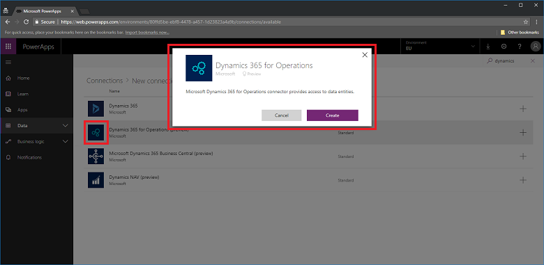
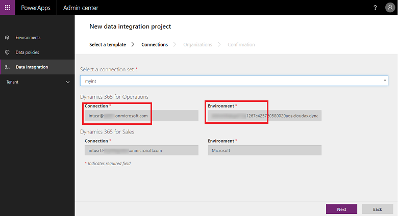
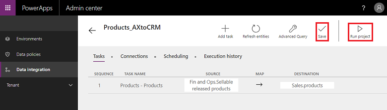
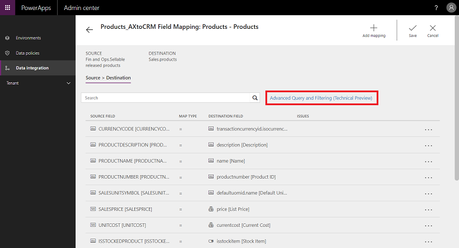
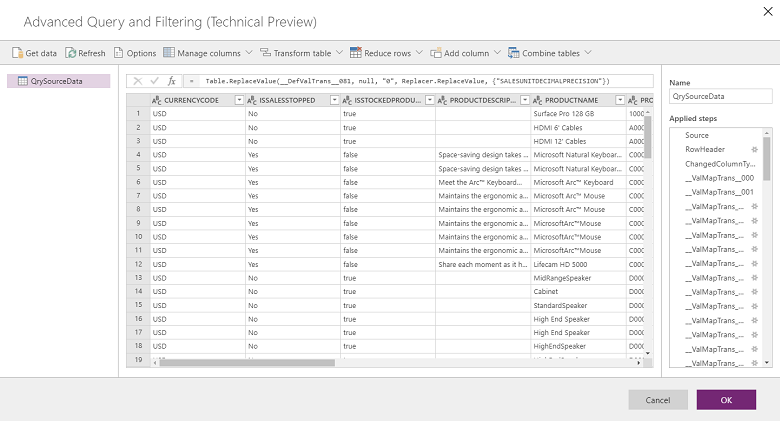

# Integrate data into Common Data Service for Apps

<!--note from editor: the style guide says not to use "the" in front of Common Data Service for Apps, so I'm removing that.-->

The Data Integrator (for Admins) is a point-to-point integration service used to integrate data into Common Data Service for Apps. It supports integrating data from multiple sources—for example, Dynamics 365 for Finance and Operations, Dynamics 365 for Sales and SalesForce (Preview), SQL (Preview)—into Common Data Service for Apps. It also supports integrating data into Dynamics 365 for Finance and Operations and Dynamics 365 for Sales. This service has been generally available since July 2017.  

We started with first-party apps—for example, Dynamics 365 for Finance and Operations and Dynamics 365 for Sales. With the help of Power Query or M-based connectors, we are now able to support additional sources like SalesForce (Preview) and SQL (Preview) and will extend this to 20+ sources in the near future. 

> [!div class="mx-imgBorder"]
> 

## How can you use the Data Integrator for your business?

The Data Integrator (for Admins) also supports process-based integration scenarios like Prospect to Cash that provide direct synchronization between Dynamics 365 for Finance and Operations and Dynamics 365 for Sales. The Prospect to Cash templates that are available with the data integration feature enable the flow of data for accounts, contacts, products, sales quotations, sales orders, and sales invoices between Finance and Operations and Sales. While data is flowing between Finance and Operations and Sales, you can perform sales and marketing activities in Sales, and you can handle order fulfillment by using inventory management in Finance and Operations. 

> [!div class="mx-imgBorder"]
> 

The Prospect to Cash integration enables sellers to handle and monitor their sales processes with the strengths from Dynamics 365 for Sales, while all aspects of fulfillment and invoicing happen using the rich functionality in Finance and Operations. With Microsoft Dynamics 365 Prospect to Cash integration, you get the combined power from both systems. 

See the video: [Prospect to cash integration](https://www.youtube.com/watch?v=AVV9x5x-XCg)

For more information about the Prospect to Cash integration, see the documentation on the [Prospect to Cash solution](https://docs.microsoft.com/en-us/dynamics365/unified-operations/supply-chain/sales-marketing/prospect-to-cash).

We also support [Field Service integration](https://docs.microsoft.com/dynamics365/unified-operations/supply-chain/sales-marketing/field-service-work-order)
and [PSA (Project Service Automation) integration](https://docs.microsoft.com/dynamics365/unified-operations/financials/project-management/psa-integration?toc=/fin-and-ops/toc.json) to Dynamics 365 for Finance and Operations.

## Data Integrator Platform

The Data Integrator (for Admins) consists of the Data Integration platform, out-of-the-box templates provided by our application teams (for example, Dynamics 365 for Finance and Operations and Dynamics 365 for Sales) and custom templates created by our customers and partners. We have built an application-agnostic platform that can scale across various sources. At the very core of it, you create connections (to integration end points), choose one of the customizable templates with predefined mappings (that you can further customize), and create and execute the data integration project.  

Integration templates serve as a blueprint with predefined entities and field mappings to enable flow of data from source to destination. It also provides the ability to transform the data before importing it. Many times, the schema between the source and destinations apps can be very different and a template with predefined entities and field mappings serves as a great starting point for an integration project.  

> [!div class="mx-imgBorder"]
> 

## How to set up a data integration project

There are three primary steps:

1. Create a connection (provide credentials to data sources).

2. Create a connection set (identify environments for connections you created in the previous step).

3. Create a data integration project using a template (create or use predefined mappings for one or more entities).

Once you create an integration project, you get the option to run the project manually and also set up a schedule-based refresh for the future. The rest of this article expands on these three steps.

### How to create a connection

Before you can create a data integration project, you must provision a connection for each system that you intend to work with in the Microsoft PowerApps portal. Think of these connections as your points of integration.

**To create a connection**

1. Go to [PowerApps](https://web.powerapps.com).

2. Under Data, select **Connections** and then select **New connection**.

3. You can either select a connection from the list of connections or search for your connection.

    > [!div class="mx-imgBorder"] 
    > 

4. Once you select your connection, select **Create**. Then you will be prompted for credentials.

5. After you provide your credentials, the connection will be listed under your connections.

    > [!div class="mx-imgBorder"] 
    > 

> [!NOTE]
> Please make sure that the account you specify for each connection has access to entities for the corresponding applications. Additionally, the account for each connection can be in a different tenant. 

### How to create a connection set

Connection sets are a collection of two connections, environments for the connections, organization mapping information, and integration keys that can be reused among projects. You can start using a connection set for development and then switch to a different one for production. One key piece of information that is stored with a connection set is organization unit mappings—for example, mappings between the Finance and Operations legal entity (or company) and Dynamics 365 for Sales organization or business units. You can store multiple organization mappings in a connection set.

**To create a connection set**

1. Go to [PowerApps Admin center](https://admin.powerapps.com).

2. Select the **Data Integration** tab in the left-hand navigation pane.

3. Select the **Connection Sets** tab and select **New connection set**.

4. Provide a name for your connection set.
  
    > [!div class="mx-imgBorder"] 
    > 
  
5. Choose the connections you created earlier and select the appropriate environment.

6. Repeat the steps by choosing your next connection (think of these as source and destination in no specific order).

7. Specify the organization to Business Unit mapping (if you are integrating between Finance and Operations and Sales systems).
  
    > [!NOTE]
    > You can specify multiple mappings for each connection set.
  
8. Once you have completed all the fields, select **Create**.

9. You will see the new connection set you just created under the Connection sets list page.
    
    > [!div class="mx-imgBorder"] 
    > 

Your connection set is ready to be used across various integration projects.

### How to create a data integration project

Projects enable the flow of data between systems. A project contains mappings for one or more entities. Mappings indicate which fields map to which other fields.

**To create a data integration project**

1. Go to [PowerApps Admin center](https://admin.powerapps.com).

2. Select the **Data Integration** tab in the left navigation pane.

3. While in the **Projects** tab, select **New Project** in the top right corner.

    > [!div class="mx-imgBorder"] 
    > 

4. Provide a name for your integration project.

5. Select one of the available templates (or [create your own template](#how-to-customize-or-create-your-own-template)). In this case, we are moving the Products entity from Finance and Operations to Sales.

    > [!div class="mx-imgBorder"] 
    > 

6. Select **Next** and choose a connection set you created earlier (or [create a new connection set](#how-to-create-a-connection-set)).

7. Make sure you have chosen the right one by confirming the connection and environment names.

    > [!div class="mx-imgBorder"] 
    > 

8. Select **Next** and then choose the legal entity to Business Unit mappings.

    > [!div class="mx-imgBorder"] 
    > 

9. Review and accept the privacy notice and consent on the next screen.

10. Proceed to create the project and then run the project which in turn executes the project.

    > [!div class="mx-imgBorder"] 
    > 

    On this screen, you will notice several tabs—**Scheduling** and **Execution history**—along with some buttons—**Add task**, **Refresh entities**, and **Advanced Query**—that will be described later in this article.

### Execution history

Execution history shows the history of all project executions with project name, timestamp of when the project was executed, and status of execution along with the number of upserts and/or errors.

-   Example of project execution history.

    > [!div class="mx-imgBorder"] 
    > 

-   Example of successful execution, showing status as completed with \# of upserts. (Update Insert is a logic to either update the record, if it already exists, or to insert new record.)

    > [!div class="mx-imgBorder"] 
    > 

-   For execution failures, you can drill down to see the root cause.

    Here is an example of a failure with project validation errors. In this case, the project validation error is due to missing source fields in the entity mappings.

    > [!div class="mx-imgBorder"] 
    > 

-   If the project execution is in ‘ERROR’ state, then it will retry execution at the next scheduled run.

-   If the project execution is in ‘WARNING’ state, then you will need to fix the issues on the source. It will retry execution at the next scheduled run.

    In either case, you could also choose to manually ‘re-run execution.’

### How to set up a schedule-based refresh

We support two types of executions/writes today:

-   Manual writes (execute and refresh project manually)

-   Schedule-based writes (auto-refresh)

After you create an integration project, you get the option to run it manually or configure schedule-based writes, which lets you set up automatic refresh for your projects.

**To set up schedule-based writes**

1. Go to [PowerApps Admin center](https://admin.powerapps.com).

2. You can schedule projects in two different ways. 

    Either select the project and select the **Scheduling** tab or launch the scheduler from the project list page by clicking the ellipsis next to the project name.

    > [!div class="mx-imgBorder"] 
    > 

3. Select **Recur every** and once you have completed all the fields, select **Save schedule**.

    > [!div class="mx-imgBorder"] 
    > 

You can set a frequency as often as 1 minute or have it recur a certain number of hours, days, weeks, or months. Note that the next refresh won't start until the previous project task completes its run.

Also note that under Notifications, you can opt in for email-based alert notifications, which would alert you on job executions that either completed with warnings and/or failed due to errors. You can provide multiple recipients, including groups separated by commas.

> [!div class="mx-imgBorder"] 
> 

> [!NOTE]
> - Currently, we support scheduling 50 integration projects at any given time per paid tenant. However you can create more projects and run them interactively.
For trial tenants, we have an additional limitation that a scheduled project would only run for first 50 executions.
> - While we support scheduling projects to run every minute, please bear in mind that this may put a lot of stress on your apps and in turn impact overall performance. We highly encourage users to test project executions under true load conditions and optimize for performance with less frequent refreshes.
In production environments, we do not recommend running more than 5 projects per minute per tenant.

## Customizing projects, templates, and mappings 

You use a template to create a data integration project. A template commoditizes the movement of data that in turn helps a business user or administrator expedite integrating data from sources to destination and reduces overall burden and cost. A business user or administrator can start with an out-of-the-box template published by Microsoft or its partner and then further customize it before creating a project. You can then save the project as a template and share with your organization and/or create a new project. 

A template provides you with source, destination, and direction of data flow. You need to keep this in mind while customizing and/or creating your own template.  

You can customize projects and templates in these ways:

-   Customize field mappings.

-   Customize a template by adding an entity of your choice.

### How to customize field mappings

**To create a connection set**

1. Go to [PowerApps Admin center](https://admin.powerapps.com).

2. Select the project for which you want to customize field mappings and then select the arrow between source and destination fields.

    > [!div class="mx-imgBorder"] 
    > 

3. This takes you to the mapping screen where you can add a new mapping by selecting **Add mapping** at the top right corner or **Customize existing mappings** from the dropdown list.

    > [!div class="mx-imgBorder"] 
    > 

4. Once you have customized your field mappings, select **Save**.

### How to customize or create your own template 

**To create your own template**

1. Go to [PowerApps Admin center](https://admin.powerapps.com).

2. Identify source and destination and direction of flow for your new template.

3. Create a project by choosing an existing template that matches your choice of source and destination and direction of flow.

<!--note from editor: Didn't we create the project in step 3? Step 4 tells us to create the project.-->

4. Create the project after choosing the appropriate connection.

5. Before you save and/or run the project, at the top right corner, select **Add task**.

    > [!div class="mx-imgBorder"] 
    > 

    This will launch the **Add task** dialog.

6. Provide a meaningful task name and add source and destination entities of your choice.

    > [!div class="mx-imgBorder"] 
    > 

7. The dropdown list shows you all your source and destination entities.

    > [!div class="mx-imgBorder"] 
    > 

    In this case, a new task was created to sync User entity from SalesForce to Users entity in Common Data Service for Apps.

    > [!div class="mx-imgBorder"] 
    > 

8. Once you create the task, you will see your new task listed and you can delete the original task.

    > [!div class="mx-imgBorder"] 
    > 

9. You just created a new template—in this case, a template to pull User entity data from SalesForce to Common Data Service. Select **Save** to save your customization.

10. Follow the steps to customize field mappings for this new template. You could run this project and/or save the project as a template from the **Project list** page.

    > [!div class="mx-imgBorder"] 
    > 

11. Provide a name and description and/or share with others in your organization.

    > [!div class="mx-imgBorder"] 
    > 

## Advanced data transformation and filtering 

With Power Query support, we now provide advanced filtering and data transformation of source data. Power Query enables users to reshape data to fit their needs, with an easy-to-use, engaging, and no-code user experience. You can enable this on a project-by-project basis. 

### How to enable advanced query and filtering

**To set up advanced filtering and data transformation**

1. Go to [PowerApps Admin center](https://admin.powerapps.com).

2. Select the project where you want to enable advanced query and then select **Advanced Query**.

    > [!div class="mx-imgBorder"] 
    > 

3. You will get a warning that enabling advanced query is a one-way operation and cannot be undone. Select **OK** to proceed and then select the source and destination mapping arrow.

    > [!div class="mx-imgBorder"] 
    > 

4. You are now presented with the familiar entity mapping page with a link to launch Advanced Query and Filtering.

    > [!div class="mx-imgBorder"] 
    > 

5. Select **to link** to launch the Advanced Query and Filtering user interface, which gives you source field data in Microsoft Excel-type columns.

    > [!div class="mx-imgBorder"] 
    > 

6. From the top menu, you get several options for transforming data such as **Add conditional column**, **Duplicate column**, and **Extract**.

    > [!div class="mx-imgBorder"] 
    > 

7. You can also right-click any column for more options such as **Remove columns**, **Remove duplicates**, and **Split column**.

    > [!div class="mx-imgBorder"] 
    > 

8. You also can filter by clicking each column and using Excel-type filters.

    > [!div class="mx-imgBorder"] 
    > 

<!--note from editor: I don't see an "otherwise" in the screenshot. I see "else".-->

9. Default value transforms can be achieved using the conditional column. To do this, from the **Add Column** dropdown list, select **Add Conditional Column** and enter the name of the new column. Fill in both **Then** and **Otherwise** with what should be the default value, using any field and value for **If** and **equal to**.

    > [!div class="mx-imgBorder"] 
    > 

10. Notice the **each** clause in the *fx* editor, at the top.

    > [!div class="mx-imgBorder"] 
    > 

11. Fix the **each** clause in the *fx* editor and select **OK**.

    > [!div class="mx-imgBorder"] 
    > 

<!--note from editor: The sentence that starts with "Additionally" is confusing - not sure where the "same steps" fit in.-->

12. Each time you make a change, you apply a step. You can see the applied steps on the right-hand pane (scroll to the bottom to see the latest step). You can undo a step in case you need to edit. Additionally, you can go to the Advanced editor by right-clicking the **QrySourceData** on the left pane, at the top to view the M language that gets executed behind the scenes, with the same steps.

    > [!div class="mx-imgBorder"] 
    > 

13. Select **OK** to close the Advanced Query and Filtering interface and then, on the mapping task page, pick the newly created column as the source to create the mapping accordingly.

    > [!div class="mx-imgBorder"] 
    > 

For more information on Power Query, see [Power Query documentation](https://docs.microsoft.com/power-query/).
