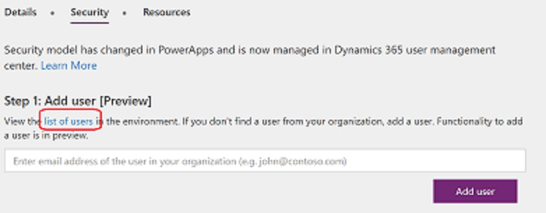
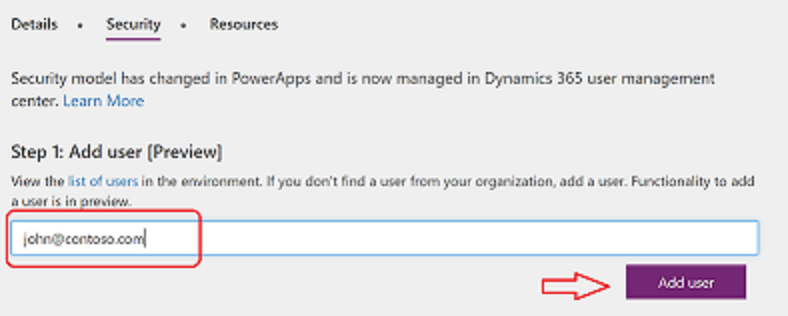

# Configure environment security
Common Data Service (CDS) for Apps uses a role-based security model to help secure access to the database. This topic explains how to create the security artifacts that you must have to help secure an app. The user roles control run-time access to data and are separate from the Environment roles that govern environment administrators and environment makers. For an overview of environments, see [Environments overview](environments-overview.md).

## Assign security roles to users
Security roles control a user’s access to data through a set of access levels and permissions. The combination of access levels and permissions that are included in a specific security role sets limits on the user’s view of data and on the user’s interactions with that data.

To assign a user or a security group to an environment role, an Environment Admin can take these steps in the [PowerApps admin center][1]:

1. Select the environment in the environments table.

    

2. Select **Security** tab.

3. View if the user already exists in the environment, by selecting **view the list of users in the environment**.
    
    

4. In case user doesn’t exist, you can add the user from PowerApps admin center 
	Add the user by mentioning the email address of the user, in your organization, and selecting **Add user**.

    

	Wait for a few minutes to check if the user is available in the list of users in the environment.
  
5. Select the user from the list of users in the environment.

    

6. Assign the role to the user.

    

    > [!NOTE]
    > Currently, roles can only be assigned to the users. Assigning a role to a security group is in our backlog.

7. Select **OK** to update the assignments to the environment role.

## Predefined security roles
The PowerApps environment includes predefined security roles that reflect common user tasks with access levels defined to match the security best-practice goal of providing access to the minimum amount of business data required to use the app.

|Security role  |*Database Privileges  |Description |
|---------|---------|---------|
|System Administrator     |  Create, Read, Write, Delete, Customizations, Security Roles       | Has full permission to customize or administer the environment, including creating, modifying, and assigning security roles. Can view all data in the environment. More information: [Privileges required for customization](https://docs.microsoft.com/dynamics365/customer-engagement/customize/privileges-required-customization)        |
|System Customizer     | Create (self), Read (self), Write (self), Delete (self), Customizations         | Has full permission to customize the environment. However, can only view records for environment entities that they create. More information: [Privileges required for customization](https://docs.microsoft.com/dynamics365/customer-engagement/customize/privileges-required-customization)        |
|Environment Maker     |  None       | Can create new resources associated with an environment including apps, connections, custom APIs, gateways, and flows using Microsoft Flow. However, does not have any privileges to access data within an environment. More information: [Environments overview](https://powerapps.microsoft.com/blog/powerapps-environments/)        |
|Common Data Service User     |  Read (self), Create (self), write (self), delete (self)       | Can run an app within the environment and perform common tasks for the records that they own.        |
|Delegate     | Act on behalf of another user        | Allows code to run as another user or impersonate.  Typically used with another security role to allow access to records. More information: [Impersonate another user](https://docs.microsoft.com/dynamics365/customer-engagement/developer/org-service/impersonate-another-user)        |

*Privilege is global scope unless specified otherwise.

- The Environment Maker role can not only create resources within an environment, but can also distribute the apps they build in an environment to other users in your organization. They can share the app with individual users. For more information, see [Share an app in PowerApps](../maker/canvas-apps/share-app.md).

- For the users making apps which are connecting to the database and needs to create or update entities and security roles, should be assigned System Customizer role as well, along with the Environment Maker as Environment Maker role, has no privileges on the database.

## Create or configure a custom security role
If your app uses a custom entity, its privileges must be explicitly granted in a security role before your app can be used.  You can either add these privileges in an existing security role or create a custom security role. There are a set of minimum privileges that are required in order for the new security role to be used - see [Minimum privileges to run app](#minimum-privileges-to-run-app).

> [!TIP]
> If you want to create a custom security role with the minimum required privileges to run an app, check out the section below: [Minimum privileges to run app](#minimum-privileges-to-run-app).

The environment might maintain the records which can be used by multiple apps, you might need multiple security roles to access the data with different privileges. e.g.
- Some of the users (Type A) might only need to read, update, and attach other records so their security role will have read, write, and append privileges.
- Other users might need all the privileges that users of Type A has, plus the ability to create, append to, delete, and share, so their security role will have create, read, write, append, delete, assign, append to, and share privileges.

For more information about access and scope privileges, see [Security roles](https://docs.microsoft.com/dynamics365/customer-engagement/admin/security-roles-privileges#security-roles).

1. In [PowerApps admin center][1] select the environment where you want to update a security role.

    

2. Click on the link in **Details** tab to manage the environment in Dynamics 365 admin center.

3. Select the instance (with the same name of environment) and click on Open

    

4. In the header, click on the **Settings** and select **Security**

    

5. Select **Security roles**

    

6. Click on **New**

7. From the security role designer, you select the actions, such as read, write, or delete, and the scope for performing that action.

8. Select the tab and search for your entity e.g. **Custom Entities** tab, for setting permissions on a custom entity.

9. Select the privileges **Read, Write, Append**

10. Select **Save and Close**.

## Minimum privileges to run app
When you create a custom security role, you need to assign the minimum privileges for a user to run an app. We've created a solution you can import that provides a security role with the required minimum privileges.  

Start by downloading the solution from the Download Center: [CDS for Apps minimum privilege security role](http://download.microsoft.com/download/6/5/5/6552A30E-05F4-45F0-AEE3-9BB01E13118A/MinprivilegeSecRole_1_0_0_0.zip).

Then, follow the directions to import the solution: [Import, update, and export solutions](../maker/common-data-service/import-update-export-solutions.md).

When you import the solution, it creates the **min prv Sec Role** which you can copy (see: [Create a security role by Copy Role](https://docs.microsoft.com/en-us/dynamics365/customer-engagement/admin/create-edit-security-role#create-a-security-role-by-copy-role)). When Copying Role is complete, navigate to each tab - Core Records, Business Management, Customization, etc - and set the appropriate privileges. 

> [!IMPORTANT]
> You should try out the solution in a development environment before importing into a production environment. 

<!--Reference links in article-->
[1]: https://admin.powerapps.com
