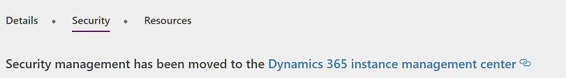
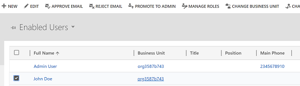
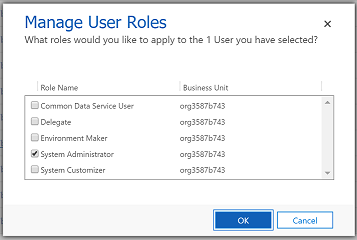
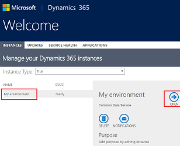
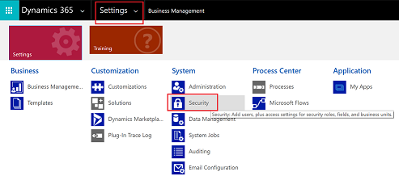
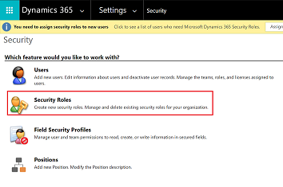

# Configure environment security
The Common Data Service uses a role-based security model to help secure access to the database. This topic explains how to create the security artifacts that you must have to help secure an app. The user roles control run-time access to data and are separate from the Environment roles that govern environment administrators and environment makers. For an overview of environments, see [Environments overview](environments-overview.md).

## Assign security roles to users
Security roles control a user’s access to data through a set of access levels and permissions. The combination of access levels and permissions that are included in a specific security role sets limits on the user’s view of data and on the user’s interactions with that data.

To assign a user or a security group to an environment role, an Environment Admin can take these steps in the [PowerApps admin center][1]:

1. Select the environment in the environments table.

    

2. Select **Security** tab.

3. Click on the link to manage the environment roles in Dynamics 365.

    

4. Select the user from the list of users in the environment.

    

5. Assign the role to the user.

    

    > [!NOTE]
    > Currently, roles can only be assigned to the users. Assigning a role to a security group is in our backlog.

6. Select **OK** to update the assignments to the environment role.

## Predefined security roles
The PowerApps environment includes predefined security roles that reflect common user tasks with access levels defined to match the security best-practice goal of providing access to the minimum amount of business data required to use the app.

|Security role  |*Database Privileges  |Description |
|---------|---------|---------|
|System Administrator     |  Create, Read, Write, Delete, Customizations, Security Roles       | Has full permission to customize or administer the environment, including creating, modifying, and assigning security roles. Can view all data in the environment. More information: [Privileges required for customization](https://docs.microsoft.com/dynamics365/customer-engagement/customize/privileges-required-customization)        |
|System Customizer     | Create (self), Read (self), Write (self), Delete (self), Customizations         | Has full permission to customize the environment. However, can only view records for environment entities that they create. More information: [Privileges required for customization](https://docs.microsoft.com/dynamics365/customer-engagement/customize/privileges-required-customization)        |
|Environment Maker     |  None       | Can create new resources associated with an environment including apps, connections, custom APIs, gateways, and flows using Microsoft Flow. However, does not have any privileges to access data within an environment. More information: [Environments overview](https://powerapps.microsoft.com/blog/powerapps-environments/)        |
|Common Data Service User     |  Read, Create (self), write (self), delete (self)       | Can run an app within the environment and perform common tasks for the records that they own.        |
|Delegate     | Act on behalf of another user        | Allows code to run as another user or impersonate.  Typically used with another security role to allow access to records. More information: [Impersonate another user](https://docs.microsoft.com/dynamics365/customer-engagement/developer/org-service/impersonate-another-user)        |

*Privilege is global scope unless specified otherwise.

- The Environment Maker role can not only create resources within an environment, but can also distribute the apps they build in an environment to other users in your organization. They can share the app with individual users. For more information, see [Share an app in PowerApps](../maker/canvas-apps/share-app.md).

- For the users making apps which are connecting to the database and needs to create or update entities and security roles, should be assigned System Customizer role as well, along with the Environment Maker as Environment Maker role, has no priviliges on the database.

## Create or configure a custom security role
If your app is based on a custom entity, privileges must be explicitly specified before users may work on it. To do this, you can choose to do one of the following.
- Expand an existing predefined security role, so that it includes privileges on records based on the custom entity.
- Create a custom security role for the purpose of managing privileges for users of the app.

The environment might maintain the records which can be used by multiple apps, you might need multiple security roles to access the data with different priviliges. e.g.
- Some of the users (Type A) might only need to read, update, and attach other records so their security role will have read, write, and append privileges.
- Other users might need all the privileges that users of Type A has, plus the ability to create, append to, delete, and share, so their security role will have create, read, write, append, delete, assign, append to, and share privileges.

For more information about access and scope privileges, see [Security roles](https://docs.microsoft.com/dynamics365/customer-engagement/admin/security-roles-privileges#security-roles).

1. In [PowerApps admin center][1] select the environment where you want to update a security role.

    

2. Click on the link in **Details** tab to manage the environment in Dynamics 365 admin center.

3. Select the instance (with the same name of environment) and click on Open

    

4. In the header, click on the **Settings** and select **Security**

    

5. Select **Security roles**

    

6. Click on **New**

7. From the security role designer, you select the actions, such as read, write, or delete, and the scope for performing that action.

8. Select the tab and search for your entity e.g. **Custom Entities** tab, for setting permissions on a custom entity.

9. Select the privileges **Read, Write, Append**

10. Select **Save and Close**.

<!--Reference links in article-->
[1]: https://admin.powerapps.com
