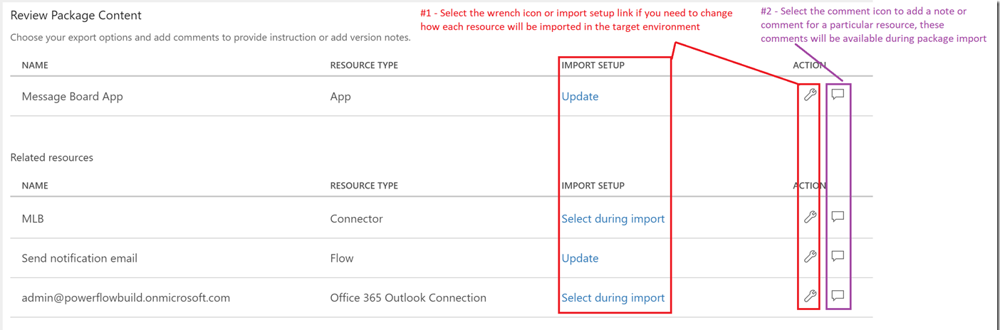
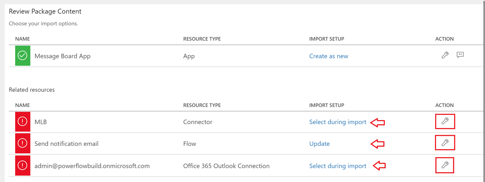
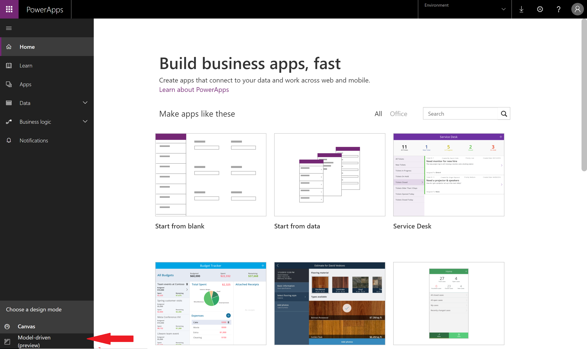
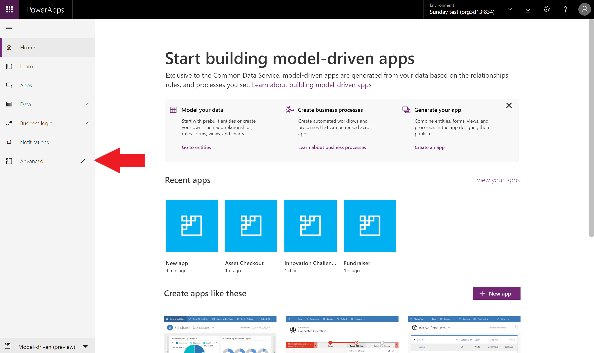
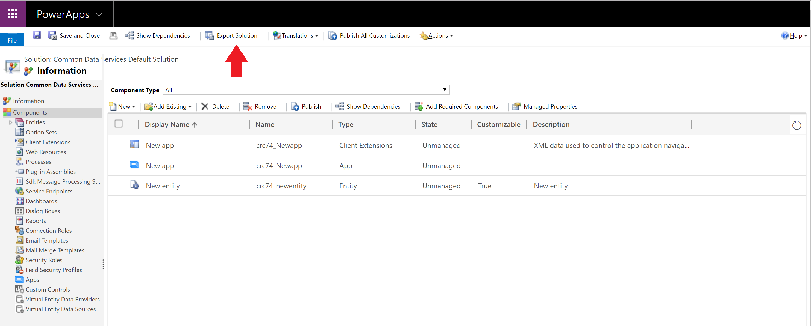
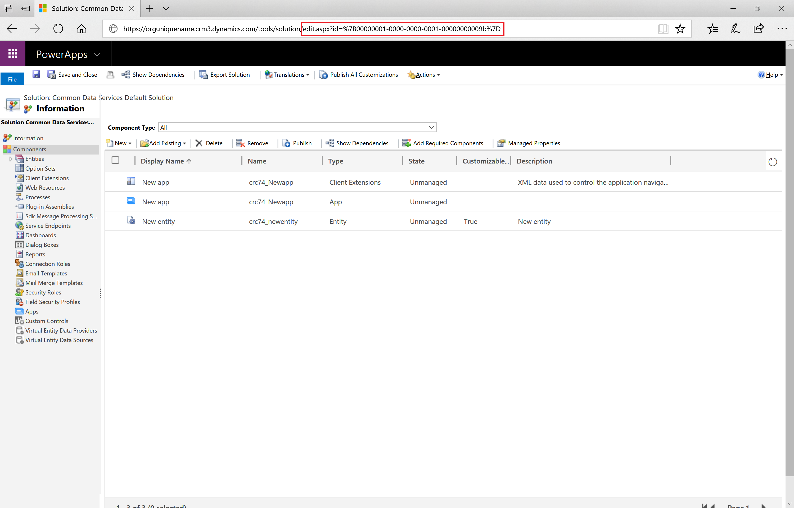
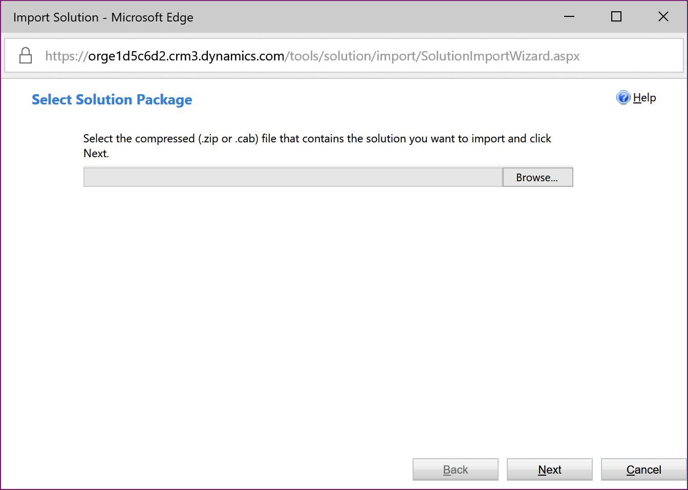
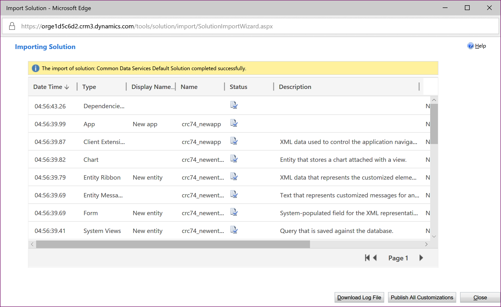

# Environment and tenant app migration through Packaging
Learn how to migrate resources from one environment to another with packaging. These environments can be within the same tenant or across different tenants.

## The scenario
One common scenario where you may want to migrate resources is where you have Test or Dev environments and a Production environment. Developers and testers have wide access to the apps in their environments. But when it comes time to migrate a new app to production, that environment has rigorous control over permissions to update and change it.

Another scenario is one where each customer has their own environment and data. When a new customer is added, a new environment is created for them, and you would migrate apps into their environment.

## Which resources can I migrate through packaging?
When you export an app, the dependent resources for your app will also get exported into the package.  Initially only a subset of all possible resource types will be supported as outlined in the table below.

| Resource type | Supported | Import options |
| --- | --- | --- |
| App |Yes |There are two options to import an app into an environment: <ol><li><b>Create new</b> – The app will be created as a new app in the environment where the package is imported.</li> <li><b>Update</b> - the app already exists in the environment and will be updated when this package is imported.</li></ol> |
| Flow |Yes |There are two options to import a flow into an environment: <ol><li><b>Create new</b> – The flow will be created as a new flow in the environment where the package is imported.</li> <li><b>Update</b> - The flow already exists in the environment and will be updated when this package is imported.</li></ol> <b>Note: </b>All resources that the flow depends on will also be included within the app package that is exported and will need to be configured with the package is imported. |
| Custom Connectors |No |If an app depends on a custom connector <b>we do not</b> currently support exporting the connector as a part of the package. 

 If you have an app that relies on a custom connector, your only current option is to manually re-create or update the connector in your target environment and select that connector when you import the package. |
| Connections |No |If an app depends on a connection (such as a SQL connection w/ credentials), we do not currently support exporting the connection or credentials as a part of the package. 

 If you have an app that relies on a shared connection (like SQL), your only current option is to manually re-create that connection with the appropriate credentials in your target environment and select that connection when you import the package. |
| CDS Customizations |No |Exporting CDS customizations is no longer supported as a part of packaging. This is now supported through export and importing the environment default solution as outlined in the article below. |
| Gateways |No |Gateways are only supported in the default (and {tenant name} (from preview) ) environments, so export/migration is not supported. |

## How do I get access to packaging for my app?
The ability to export an app is available to any user with "Can edit" permission to the app.

The ability to import an app is available to any user with "Environment Maker" permission in the destination environment.

A  user must have a PowerApps Plan 2 or PowerApps Plan 2 trial license in order to export or import any app.

> [!NOTE]
> While packaging is in preview, any user with a valid PowerApps license will be able to try out packaging for their apps and environments.

## Exporting an app
1. In http://web.powerapps.com, click or tap **Apps**, select the ellipses for the app you want to migrate, and then select **Export (preview)**.

    
2. When the export package page opens, enter a Name and Description for the package.

    
3. Within the ‘Review Package Content’ section you can optionally add comments or notes or change the setting for how each individual resource will be imported into the target environment during package import.

    

4. When you are done select **Export** and the package file will begin downloading within a few seconds.

## Importing an app
1. In http://web.powerapps.com, click or tap **Apps**, and then select **Import package (preview)**.

    
2. Select **Upload** and select the app package file that you want to import.

    
3. Once the package has been uploaded you will need to review the package contents and will need to provide additional input for any item marked with a red icon by selecting the wrench icon for each item and entering the required information.

    
4. Once you have provided all of the required information select **Import**.

    
5. When import completes you will be automatically redirected to a page (similar to the one below) that outlines whether or not the import operation was successful.

    

> [!NOTE]
>  If you are importing an app and chose to **Update** an existing app, the new changes will be saved as a draft of the applications.  You will need to [publish](http://powerapps.microsoft.com/tutorials/save-publish-app/#publish-an-app) those changes in order for them to be available all other users of the applications.
>
>

## Exporting CDS customizations and model-driven apps
Exporting any entity or option set customizations or any model-driven apps that you have built in https://web.powerapps.com is supported by exporting the default environment solution as follows:
> [!NOTE]
>  If you would like to learn more about solutions in PowerApps, please see [Introduction to solutions](../developer/common-data-service/introduction-solutions.md).
>
>

1. In http://web.powerapps.com, select the **Model-driven (preview)** design mode in your environment.

    

2. Select **Advanced** in the left-navigation bar to launch the solution explorer for this environment's default solution

    

3. Select **Export Solution** and complete the required steps.  A solution package file will begin downloading within a few seconds.

    

## Importing CDS customization and model-driven apps
Importing a CDS solution package unfortunately requires a manual workaround in the experience, one that we are actively working to fix:

1. In http://web.powerapps.com, select the **Model-driven (preview)** design mode in your environment.

    

2. Select **Advanced** in the left-navigation bar to launch the solution explorer for this environment's default solution.

    

3. Copy the Url from your browser, make the following changes and then navigate to the new URL in your browser:

    * Current URL structure: https://{orguniquename}.crm.dynamics.com/tools/solution/edit.aspx?id={solutionname}

        

    * New URL structure:
  https://{orguniquename}.crm.dynamics.com/tools/solution/SolutionImportWizard.aspx

        

4. Select the CDS solution package file that you want to import, and complete the wizard.

5. If import is successful you will see the following confirmation dialog. In order for the solution changes to be available to other customizers within the environment select **Publish All Customizations**

    
