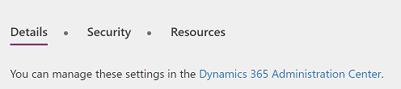
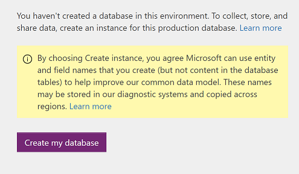

# Administer environments in PowerApps
In the [PowerApps admin center][1], manage environments that you've created and those for which you have been added to the Environment Admin or System Administrator role. From the admin center, you can perform these administrative actions:

* Create environments.
* Rename environments.
* Add or remove a user or group from either the Environment Admin or Environment Maker role.
* Provision a Common Data Service database for the environment.
* Set Data Loss Prevention policies.
* Set database security policies (as open or restricted by database roles).
* Members of the Azure AD tenant Global administrator role (includes Office 365 Global admins) can also manage all environments that have been created in their tenant and set tenant-wide policies.

## Access the PowerApps admin center
To access the PowerApps admin center:

* Go directly to [admin.powerapps.com][1], OR

* Go to [powerapps.com][2], and then select the gear icon in the  navigation header.

    

To manage an environment in the PowerApps admin center, you must have one of these roles:

* The Environment Admin or System Administrator role of the environment, OR

* The Global Administrator role of your Azure AD or Office 365 tenant.

You also need either PowerApps Plan 2 or Flow Plan 2 to access the admin center. For more information, see the [PowerApps pricing page][3].

> [!IMPORTANT]
> Any changes that you make in PowerApps admin center affect the [Flow admin center][4] and vice versa.

## Create an environment
For instructions on how to create an environment, see [Quickstart: Create an environment](create-environment.md).

## View your environments
When you open the admin center, the Environments tab appears by default and lists all the environments for which you are an Environment Admin (as shown below):

If you are a member of the Global Administrator role of your Azure AD or Office 365 tenant, all the environments that have been created by users in your tenant appear, because you're automatically an Environment Admin for all of them.

## Rename your environment
1. Open the [PowerApps admin center][1], find the environment to be renamed in the list, and click or tap it.

    
 
2. Click or tap **Details**.

    
3. in the **Name** text box, enter the new name, then click **Save**.

    

    If you have created the database in the environment, then you will not see this option. You can rename the environment from Dynamics 365 Admin center by clicking on the link in **Details** tab.

    

## Delete your environment
1. In the [PowerApps admin center][1], click or tap the environment that you want to delete.

    
2. Click or tap **Details**.

    
3. Click or tap **Delete environment** to delete your environment.

    

## Create a Common Data Service database for an environment
If an environment doesn't already have a database, an Environment Admin can create one in the [PowerApps admin center][1] by following these steps. Only users with a PowerApps Plan 2 license can create Common Data Service databases.

1. Select an environment in the environments table.

    
2. Select the **Details** tab.
3. Select **Create a database**.

    

After you create a database, choose a security model. For more information, see [Configure database security](database-security.md).

## Manage security for your environments

### Environment permissions
In an environment, all the users in the Azure AD tenant are users of that environment. However, for them to play a more privileged role, they need to be added to a specific environment role. Environments have two built-in roles that provide access to permissions within an environment:

* The **Environment Admin** role (or **System Administrator** role) can perform all administrative actions on an environment including the following:
    * Add or remove a user from either the Environment Admin or Environment Maker role.

    * Provision a Common Data Service database for the environment.

    * View and manage all resources created within an environment.

    * Set data loss prevention policies. For more information, see [Data loss prevention policies](prevent-data-loss.md).

  > [!NOTE]
  > If the environment has the database, then you need to assign users the **System Administrator** role, instead of the **Environment Admin** role.

* The **Environment Maker** role can create resources within an environment including apps, connections, custom connectors, gateways, and flows using Microsoft Flow. Environment Makers can also distribute the apps they build in an environment to other users in your organization. They can share the app with individual users, security groups, or all users in the organization. For more information, see [Share an app in PowerApps](../maker/canvas-apps/share-app.md).

To assign a user or a security group to an environment role, an Environment Admin can take these steps in the [PowerApps admin center][1]:

1. Select the environment in environments table.

    
2. Select **Security** tab.
3. If there is no database created in the environment:

    a. Select either the **Environment Admin** or **Environment Maker** role.

    

    b. Specify the names of one or more users or security groups in Azure Active Directory, or specify that you want to add your entire organization.

    

    c. Select **Save** to update the assignments to the environment role.

4. If database is created in the environment:

    a. Click on the link to manage the environment roles in Dynamics 365.

    

    b. Select the user from the list of users in the environment / instance.

    

    c. Assign the role to the user.

    

    d. Select **OK** to update the assignments to the environment role.

> [!NOTE]
> Users or groups assigned to these environment roles are not automatically given access to the environment’s database (if it exists) and must be given access separately by a Database owner. For more information, see [Configure database security](database-security.md).  
>
>

### Database security
The ability to create and modify a database schema and to connect to the data stored within a database that is provisioned in your environment is controlled by the database's user roles and permission sets. You can manage the user roles and permission sets for your environment's database from the **User roles** and **Permission sets** section of the **Security** tab. For more information, see [Configure database security](database-security.md).

## Data policies
An organization's data must be protected so that it isn't shared with audiences that should not have access to it. To protect this data, you can create and enforce policies that define which consumer services and connector-specific business data can be shared with. Policies that define how data can be shared are referred to as data loss prevention (DLP) policies. You can manage the DLP policies for your environments  from the **Data Policies** section of the [PowerApps admin center][1].  For more information, see [Data loss prevention policies](prevent-data-loss.md).

## Frequently asked questions
### How many environments and databases can I create?
You can create up to two Trial environments and two Production environments, depending on their license. [Read here](environments-overview.md#creating-an-environment) for more details. 
Each user can provision databases in two Trial environments and two Production environments, depending on their license. 

### Which license includes Common Data Service?
PowerApps Plan 2.  See [PowerApps pricing page][3] for details on all the plans that include this license.

### While trying to create a new environment, I am getting an error. How should I resolve it?
If you are getting the following error message: "Either your plan doesn’t support the environment type selected or you’ve reached the limit for that type of environment." , it can mean one of the two things

1. You have already utilized your quota to create a specific type of environments. Say you were creating  a Trial environment and you get this error message. That means, that you have already provisioned two Trial environments. You can view all the environments in [PowerApps admin center][1].
If you want, you can delete an existing environment of that specific type and create a new one. But, please make sure that you don't lose your data, apps, flows and other resources which you want to retain.

2. You do not have a quota to create that specific type of the environment. Check what type of environment you can create [here](environments-overview.md#creating-an-environment).

If you are getting any other error message or have more questions, please connect with us [here][5].

### While trying to create a database in an environment, I am getting an error. How should I resolve it?
In following scenarios, you can get an error while trying to create a database:

1. **Default environment**: Creating a database is currently not supported in a default environment of the tenant. 

2. **Environment for an individual use**: You get an environment for your individual use, by signing-up from the PowerApps Community Plan. If you have not created the database yet, then currently you can't provision a database in the environment for individual use. 

3. **Environment in a different region, than your AAD tenant's home region**: Currently, you can only provision a database in the environments created in your Azure Active Directory Tenant home region. Ability to provision a database in the other regions, will be coming soon. So, make sure to keep the region same as tenant's default location, if you want to create a database in it.

4. **Creating databases not supported in certain regions**: There are certain regions, where creating databases is still not available. e.g. countries in South America. So, if your tenant's home location is South America, you currently can't provision a database in any environment. 
    
We are working on enabling all of the above scenarios.
If you are getting any other error message or have more questions, please connect with us [here][5]

### When will my Trial environment expire?   
Trial environment expires after 30 days of its creation. If you don't want your environment to expire, there will be ways to convert it into a Production environment. This functionality, will be coming soon and we will not expire Trial environments till then.

### Does my current database (created with previous version of the Common Data Service) also gets counted in the quota?
If you had a database (created with previous version of the Common Data Service), they will also get counted with your Production environment quota. If you now create a database in an environment (created prior to March 15, 2018) then it will also get counted as Production environment.

### Can I rename an environment?
Yes, this functionality is available from the PowerApps admin center. See [Environments Administration](environments-administration.md#rename-your-environment) for more details.

### Can I delete an environment?
Yes, this functionality is available from the PowerApps admin center. See [Environments Administration](environments-administration.md#delete-your-environment) for more details.
Please note that you currently can't delete a Production environment with a database (with latest version of the Common Data Service). This will be coming soon!

### As an Environment Admin, can I view and manage all resources (apps, flows, APIs, etc.) for an environment?
Yes, the ability to view the apps and flows for an environment is available from the PowerApps admin center. See [View Apps](admin-view-apps.md) for more details.

<!--Reference links in article-->
[1]: https://admin.powerapps.com
[2]: https://web.powerapps.com
[3]: https://powerapps.microsoft.com/pricing/
[4]: https://admin.flow.microsoft.com
[5]: https://go.microsoft.com/fwlink/?linkid=871628