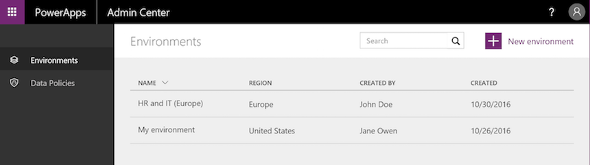
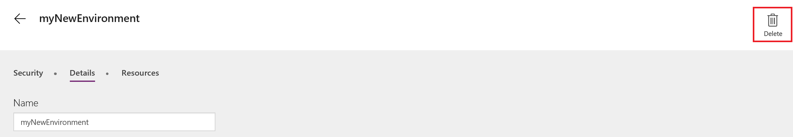
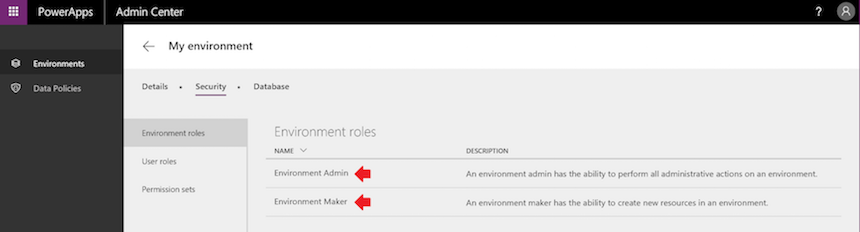
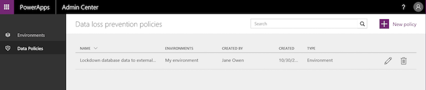

# Environments administration in PowerApps
In the [PowerApps admin center][1], manage environments that you've created and those for which you have been added to the Environment Admin role. From the admin center, you can perform these administrative actions:

* Create environments.
* Rename environments.
* Add or remove a user or group from either the Environment Admin or Environment Maker role.
* Provision a Common Data Service database for the environment.
* Set Data Loss Prevention policies.
* Set database security policies (as open or restricted by database roles).
* Members of the Azure AD tenant Global administrator role (includes Office 365 Global admins) can also manage all environments that have been created in their tenant and set tenant-wide policies.

## Access the PowerApps admin center
To access the PowerApps admin center:

* Go directly to [admin.powerapps.com][1], OR

* Go to [powerapps.com][2], and then select the gear icon in the  navigation header.
  
    

To manage an environment in the PowerApps admin center, you must have one of these roles:

* The Environment Admin role of the environment, OR

* The Global Administrator role of your Azure AD or Office 365 tenant.

You also need either PowerApps Plan 2 or Flow Plan 2 to access the admin center. For more information, see the [PowerApps pricing page][3].

> [!IMPORTANT]
> Any changes that you make in PowerApps admin center affect the [Flow admin center][4] and vice versa.

## Create an environment
First, click **+ New environment** to open a dialog box and create an environment.

Then enter the following info:

| Property | Description |
| --- | --- |
| Environment name |Enter the name of your environment. |
| Region |Choose the location to host your environment. We recommend using a location closest to your users. For example, if your app users are in London, choose a Europe location. If your app users are in New York, choose the U.S. See [Supported regions](regions-overview.md) for a list of supported environment regions. |
| Create a database for this environment |Select this check box to create a Common Data Service database for this environment. A database can be configured to either be open to all users in the environment or restricted to database roles. For more information, see [Configure database security](database-security.md). |

Finally, select **Create an environment**.

The new environment appears in the environments table.

> [!NOTE]
> When you create an environment, you are automatically added to the Environment Admin role for that environment.
> 
> 

## View your environments
When you open the admin center, the Environments tab appears by default and lists all the environments for which you are an Environment Admin (as shown below):

If you are a member of the Global Administrator role of your Azure AD or Office 365 tenant, all the environments that have been created by users in your tenant appear, because you're automatically an Environment Admin for all of them.

## Rename your environment
1. Open the [PowerApps admin center][1], find the environment to be renamed in the list, and click or tap it.
   
    
2. Click or tap **Details**.
   
    
3. in the **Name** text box, enter the new name, then click **Save**.
   
    

## Delete your environment
1. In the [PowerApps admin center][1], click or tap the environment that you want to delete.
   
    
2. Click or tap **Details**.
   
    
3. Click or tap **Delete environment** to delete your environment.
   
    

## Create a Common Data Service database for an environment
If an environment doesn't already have a database, an Environment Admin can create one in the [PowerApps admin center][1] by following these steps. Only users with a PowerApps Plan 2 license can create Common Data Service databases.

1. Select an environment in the environments table.
   
    
2. Select the **Database** tab.
3. Select **Create a database**.
   
    
   
    When the database is provisioned, this confirmation message appears:
   
    

After you create a database, choose a security model. For more information, see [Configure database security](database-security.md).

## Manage security for your environments

### Environment permissions
In an environment, all the users in the Azure AD tenant are users of that environment. However, for them to play a more privileged role, they need to be added to a specific environment role. Environments have two built-in roles that provide access to permissions within an environment:

* The **Environment Admin** role can perform all administrative actions on an environment including the following:
  
    * Add or remove a user or group from either the Environment Admin or Environment Maker role.
  
    * Provision a Common Data Service database for the environment.
  
    * View and manage all resources created within an environment.
  
    * Set data loss prevention policies. For more information, see [Data loss prevention policies](prevent-data-loss.md).

* The **Environment Maker** role can create resources within an environment including apps, connections, custom connectors, gateways, and flows using Microsoft Flow. Environment Makers can also distribute the apps they build in an environment to other users in your organization. They can share the app with individual users, security groups, or all users in the organization. For more information, see [Share an app in PowerApps](../share-app.md).

To assign a user or a security group to an environment role, an Environment Admin can take these steps in the [PowerApps admin center][1]:

1. Select the environment in environments table.
   
    
2. On the **Security** tab, select **Environment roles**.
3. Select either the **Environment Admin** or **Environment Maker** role.
   
    
4. Specify the names of one or more users or security groups in Azure Active Directory, or specify that you want to add your entire organization.
   
    
5. Select **Save** to update the assignments to the environment role.

To remove all permissions for a user or a group, click or tap the **x** icon for that user or group.

> [!NOTE]
> Users or groups assigned to these environment roles are not automatically given access to the environment’s database (if it exists) and must be given access separately by a Database owner. For more information, see [Configure database security](database-security.md).  
> 
> 

### Database security
The ability to create and modify a database schema and to connect to the data stored within a database that is provisioned in your environment is controlled by the database's user roles and permission sets. You can manage the user roles and permission sets for your environment's database from the **User roles** and **Permission sets** section of the **Security** tab. For more information, see [Configure database security](database-security.md).

> [!NOTE]
> Environment Admins do not have access to create and manage user roles and permission sets for an environment's database. This power is limited to members of the **Database owner** user role.  
> 
> 

## Data policies
An organization's data must be protected so that it isn't shared with audiences that should not have access to it. To protect this data, you can create and enforce policies that define which consumer services and connector-specific business data can be shared with. Policies that define how data can be shared are referred to as data loss prevention (DLP) policies. You can manage the DLP policies for your environments  from the **Data Policies** section of the [PowerApps admin center][1].  For more information, see [Data loss prevention policies](prevent-data-loss.md).

## Frequently asked questions
### How many environments can I create?
Each user can create up to two environments.

### How many databases can I provision?
Each user can provision up to two databases.

### Can I rename an environment?
Yes, this functionality is available from the PowerApps admin center. See [Environments Administration](environments-administration.md#rename-your-environment) for more details.

### Can I delete an environment?
Yes, this functionality is available from the PowerApps admin center. See [Environments Administration](environments-administration.md#delete-your-environment) for more details.

### As an Environment Admin, can I view and manage all resources (apps, flows, APIs, etc.) for an environment?
Yes, the ability to view the apps and flows for an environment is available from the PowerApps admin center. See [View Apps](admin-view-apps.md) for more details.

### Which license includes Common Data Service?
PowerApps Plan 2.  See [PowerApps pricing page][3] for details on all the plans that include this license.

### Can the Common Data Service be used outside of an environment?
No. Common Data Service requires an environment.

<!--Reference links in article-->
[1]: https://admin.powerapps.com
[2]: https://web.powerapps.com
[3]: https://powerapps.microsoft.com/pricing/
[4]: https://admin.flow.microsoft.com
