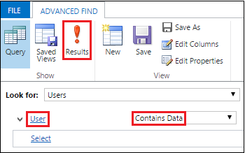

# For partners: the Delegated Administrator

[!INCLUDE[cc-applies-to-update-9-0-0](../includes/cc_applies_to_update_9_0_0.md)] [!INCLUDE[cc-applies-to-update-8-2-0](../includes/cc_applies_to_update_8_2_0.md)]

Admins for [!INCLUDE[pn_crm_online_shortest](../includes/pn-crm-online-shortest.md)] can use their [!INCLUDE[pn_Office_365](../includes/pn-office-365.md)] global administrator role to create and edit users, reset user passwords, manage user licenses, manage domains, and assign admin permissions to other users in their organization, among other things. However, if admins want someone else to do these administrative tasks, they can delegate this role to an authorized [!INCLUDE[pn_crm_shortest](../includes/pn-crm-shortest.md)] partner. When admins authorize a partner to take on this role, the partner is referred to as a delegated admin. A delegated admin can perform routine tasks such as adding users and resetting passwords, or more complex tasks such as adding a domain. A delegated admin can have access to multiple tenants, which can simplify and consolidate tenant management.  
  
 You can see the new Delegated Admin user in [!INCLUDE[pn_CRM_Online](../includes/pn-crm-online.md)] revisions 2040 or greater or in [!INCLUDE[pn_crm_2015_update_0_2](../includes/pn-crm-2015-update-0-2.md)]. This user won’t appear in standard provided views. You must create a custom view to see it.  
  
> [!TIP]
>  To determine your revision of [!INCLUDE[pn_CRM_Online](../includes/pn-crm-online.md)], in the upper-right corner of your [!INCLUDE[pn_crm_shortest](../includes/pn-crm-shortest.md)] screen, choose the **Settings** gear () > **About**.  
>   
>  Your revision should be 2040 or above for both numbers highlighted.  
  
  revision version")  
  
 To create a simple custom view to see the delegated admin user:  
  
1.  Go to **Settings** > **Security** > **Users**.  
  
2.  Choose **Select a view** () and then choose **Create Personal View**.  
  
3.  Verify **Users** is selected in **Look for**.  
  
4.  Choose **User** > **Contains Data**, and then choose **Results**.  
  
   
  
 Delegated Admin will appear in the list of users.  
  
   
  
## How to get authorized as a delegated admin  
 [!INCLUDE[pn_crm_shortest](../includes/pn-crm-shortest.md)] partners can be authorized to be delegated admins for a company in several ways:  
  
1.  A partner can offer the customer to become a delegated admin for their account by sending a link to the delegated admin offer. The customer will need to accept and sign in with their [!INCLUDE[pn_Office_365](../includes/pn-office-365.md)]/[!INCLUDE[pn_CRM_Online](../includes/pn-crm-online.md)] credentials.  
  
2.  A partner can send the customer a purchase offer link with delegated admin selected as part of the offer. The customer will need to sign up for the offer and accept the delegated admin offer.  
  
3.  A partner can create a trial invitation link to [!INCLUDE[pn_CRM_Online](../includes/pn-crm-online.md)] and invite the customer to the trial via a link in email or a link on the partner’s website. The trial invitation can include delegated admin if the prospect chooses to accept.  
  
## Related information  
 Review the following for more information on partners and delegated admins.  
  
-   [Learn how to provide technical support as a delegated admin](https://msdn.microsoft.com/library/partnercenter/mt157012.aspx)  
  
-   [Leearn how to do common partner tasks](https://partnercenter.microsoft.com/partner/howto)  
  
-   [Learn about the Microsoft Cloud Solution Provider (CSP) program](http://go.microsoft.com/fwlink/p/?LinkID=617116)  
  
### See also  
 [Introducing the new Office 365 Partner admin center](https://blogs.office.com/2014/01/28/introducing-the-new-office-365-partner-admin-center/)   
 [Partners: Offer delegated administration](https://support.office.com/article/Partners-Offer-delegated-administration-26530dc0-ebba-415b-86b1-b55bc06b073e?ui=en-US&rs=en-US&ad=US)   
 [Partners: Add or delete a delegated admin](https://support.office.com/article/partners-add-or-delete-a-delegated-admin-201ccb3b-6011-4bf1-a6b2-84e7cc1ee2d0)
