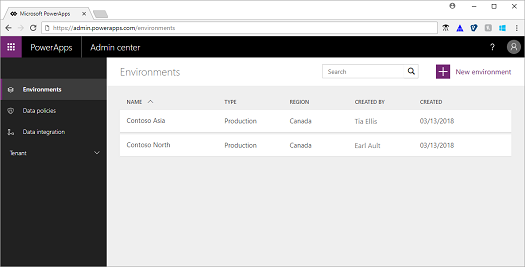

# What's the role of a PowerApps administrator?
Administration of PowerApps, Microsoft Flow, and Common Data Service (CDS) for Apps is done through the [PowerApps Admin center](https://admin.powerapps.com).

## Administration journey
The evolution of an organization adopting PowerApps, Microsoft Flow, and CDS for Apps starts with the administrator. As an administrator, you begin your journey asking how you can protect your organization's data. What data is accessible through these services? Are there best practices to follow? What is the PowerApps security model and how should I control access to data? Once you determine how to proceed with data access, you'll then want to know how you can monitor and manage what users are doing with these services.

When you've figured out control and visibility, the next part of your journey takes you to deployment. Individual users and teams can deploy apps on their own, but how do you centrally deploy solutions for your entire organization? And how do you orchestrate updates and identify and fix issues?

The documentation in this section, which you can access from the navigation pane on the left, provides answers to these questions and guides you on this journey.

## Next steps
To get you started administering PowerApps, Microsoft Flow, and CDS for Apps, check out the following articles:
* Learn how to [create a data loss protection (DLP) policy](create-dlp-policy.md).
* Learn how to [download a list of active users in your tenant](admin-view-user-licenses.md).
* Learn about [environments](environments-overview.md).
