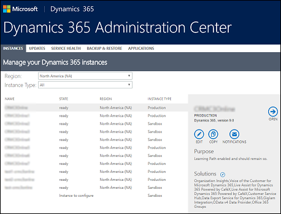
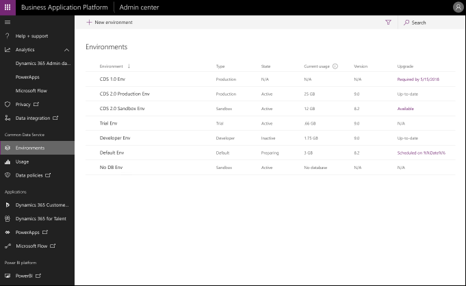
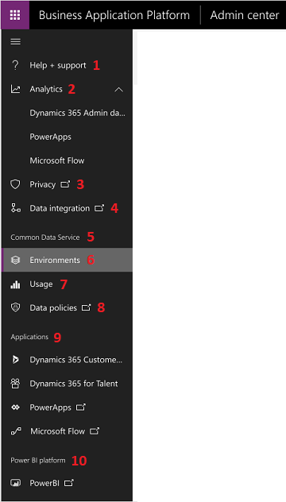
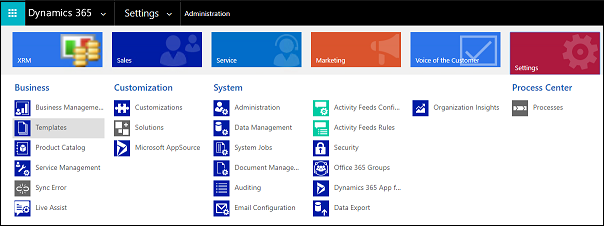
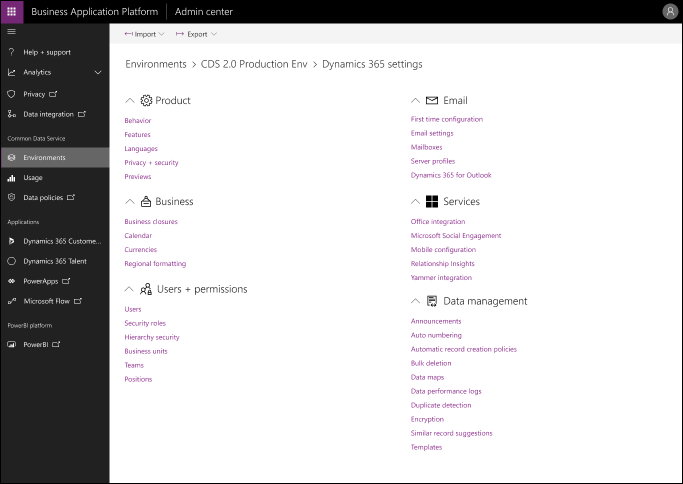

# Overview: Introducing the Business Application Platform admin center

If you've managed Dynamics 365 (online) tenants and instances, you've used the Dynamics 365 admin center.

With the merge of Common Data Service and the Dynamics 365 platform, we're launching a new admin center experience bringing PowerApps, Flow, and Dynamics 365 administration capabilities together on a single site - the Business Application Platform admin center.

Benefits of the Business Application Platform admin center include:

> - **Accessible Admin settings**: Configure all environment settings from the admin center through a single experience designed with accessibility in mind. 
> - **Unified environment management**: Admins no longer need to switch between the Dynamics 365 Admin Center and the Admin Settings experience to properly setup their environment. Admins now have a single view of all environments deployed on the Common Data Service for apps across their organization.
> - **PowerApps and Flow usage reports**: Admins now have more visibility over the PowerApps and Microsoft Flow activity and usage within their organization. From the admin center, admins can review tenant-wide and environment-level reports detailing active users, app usage, and flow usage across their organization.
> - **Unified gateway management**: Have full visibility over all the gateways that have been setup by makers within their organization that could be providing access to sensitive company data. Global admins can view and manage all gateways in their organization from the admin center. 
> - **Migrate Flow and DLP management**: Admins and partners can create data-loss prevention policies and manage flows within their organization from the admin center.
> - **Migrate Dynamics 365 Customer Engagement App Management**: Install, configure, and uninstall Dynamics 365 Customer Engagement apps from the admin center.
> - **Migrate PowerApps management**: Manage custom canvas and model-drive PowerApps within their organization from the admin center.
> - **Dynamics 365 Trial sign-up**: Users can sign up for a Dynamics 365 trial.
> - **AppSource installation**: Acquire and install first and third-party applications from AppSource via the admin center.
> - **Org Insights reports**: Admins no longer need to install the Org Insights solution into their environment. All of the org insights reports are available by default from the admin center.

See blog - press release for more information about the new admin center.

> [!NOTE]
> We're rolling out the Business Application admin center in phases to ensure a stable and high performance environment. Check back here for documentation updates on new features as they become available.

## A tour of the interface
Let's go through the various parts of the new admin center.

|Element  |Description  |
|---------|---------|
|1: Help + support     |Product documentation and information on contacting technical support.         |
|2: Analytics     |Need information.         |
|3: Privacy     |Need information.         |
|4: Data integration     |Need information.         |
|5: Common Data Service     |         |
|6: Environments     |Create, configure, and manage environments (previously called instances).         |
|7: Usage     |Need information.         |
|8: Data policies     |Need information.         |
|9: Applications     |PowerApps licensed apps.         |
|10: PowerBI platform  |PowerBI licensed apps.        |

## Dynamics 365 Admin Settings
We're moving Admin settings from the Dynamics 365 Customer Engagement product to the Business Application Platform admin center. 

Many of these settings...

...are moving here.

Use the links on this page to manage organization-wide settings. App-specific settings will remain in Dynamics 365 based on your licensing. 

## What about the Office 365 admin center?

You'll continue to use the Office 365 admin center to manage settings like:

> - users, licenses, roles, passwords
> - subscriptions, billing, purchase services
> - service health
> - usage and security reports

Ideas for sections:
1. what's done where: 1) user and license, O365 2) environment and PA, new admin center.