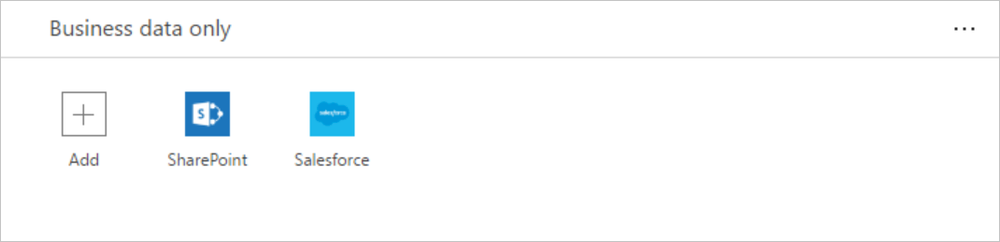
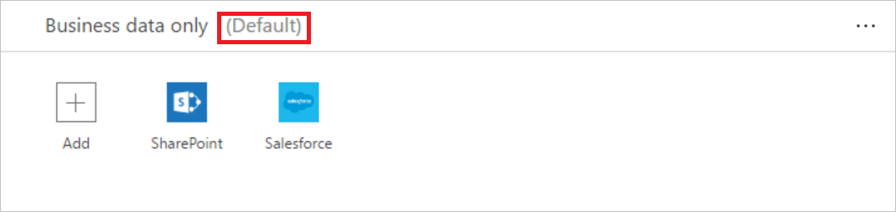

# Data groups
Data groups are a simple way to categorize services within a [data loss prevention (DLP) policy](prevent-data-loss.md). The two data groups available are the **Business data only** group and the **No business data allowed** group. Organizations are free to determine which services are placed into a particular data group. A good way to categorize services is to place them in groups, based on the impact to the organization. By default, all services are placed into the **No business data allowed** data group. You manage the services in a data group when you create or modify the properties of a DLP policy from the admin center.

## How data is shared between data groups
Data cannot be shared among services located in different groups. For example, if you place SharePoint and Salesforce in the **Business data only** group and you place Facebook and Twitter in the **No business data allowed** group, you cannot create a PowerApp that moves data between SharePoint and Facebook. While data cannot be shared among services in different groups, you can share data among the services within a specific group. So, going back to the earlier example, since SharePoint and Salesforce were placed in the same data group, PowerApps that your end users create can share data between SharePoint and Salesforce. The key point is that services in a specific group can share data, while services in different groups cannot share data.

Additionally, one data group must be designated as the *default* group. Initially, the **No business data allowed** group is the *default* group and all services are in the data group. An administrator can change the default data group to the **business data only** data group. 

> [!NOTE]
> Any new services that are added to PowerApps will be placed in the designated *default* group. For this reason, we recommend you keep the **No business data allowed** as the default group and manually add services into the **Business data only** group after your organization has evaluated the impact of allowing business data to be shared with the new service.

## Add services to a data group
In this walk-through, we'll add SharePoint and Salesforce to the **business data only** data group of a data loss prevention (DLP) policy.

1. Select the **+ Add** link located inside the **Business data only** group box of a DLP policy:    
     
2. Select SharePoint and Salesforce then select **Add services** to add both to the business data only group:    
     
3. Select **Save Policy** from the menu at the top:  
   
4. Notice that both SharePoint and Salesforce are now in the business data only group:  
      

In this walk-through, you've added SharePoint and Salesforce to the **business data only** data group of a DLP policy. If one of the person who is part of the DLP policy's environment create an app shares data between SharePoint or Salesforce and any service in the **No business data allowed** data group, the app will not be allowed to run.

## Remove services from a data group
Since all services must be in one of the available data groups, to remove a service from a specific group, simply add the service to another group then save the policy.  

## Change the default data group
In this walk-through, we will change the default data group from the **no business data allowed** data group to the **business data only** data group.  

> [!IMPORTANT]
> Any new services that are added to PowerApps will be placed in the designated *default* group. For this reason, we recommend you keep the **No business data allowed** as the default group and manually add services into the **Business data only** group.

1. Select the **...** located at the top right corner of the data group you wish to designate as the default data group:    
     
2. Select **Set as default group**:  
      
3. Select **Save Policy** from the menu at the top:  
   
4. Notice the data group is now designated as the default data group:  
      

## Next steps
* [Learn more about data loss prevention (DLP) policies](prevent-data-loss.md)
* [Learn more about environments](environments-overview.md)
* [Learn more about Microsoft PowerApps](../maker/canvas-apps/getting-started.md)
