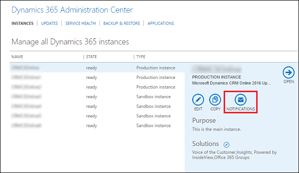
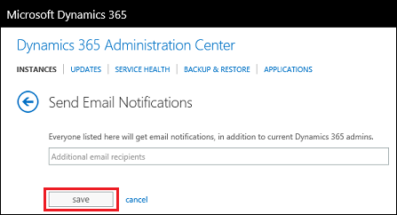

# Manage email notifications to admins

[!INCLUDE[cc-applies-to-update-9-0-0](../includes/cc_applies_to_update_9_0_0.md)] [!INCLUDE[cc-applies-to-update-8-2-0](../includes/cc_applies_to_update_8_2_0.md)]

The [!INCLUDE[pn_CRM_Online](../includes/pn-crm-online.md)] service team regularly sends email notifications to the administrators in your [!INCLUDE[pn_microsoftcrm](../includes/pn-microsoftcrm.md)] organization. Now, with a simple approach of mailbox rules, you have complete control over who should receive these email communications. As an administrator, you can set up mailbox rules to automatically redirect email communications from [!INCLUDE[pn_crm_online_shortest](../includes/pn-crm-online-shortest.md)] (crmoln@microsoft.com) to additional recipients that you choose. For example, you can add to the list of recipients:  
  
-   People outside of your [!INCLUDE[pn_crm_shortest](../includes/pn-crm-shortest.md)] organization, such as your partners.  
  
-   People inside and outside of your company.  
  
 All redirected emails retain the original sender context, such as [!INCLUDE[pn_crm_online_shortest](../includes/pn-crm-online-shortest.md)] (crmoln@microsoft.com).  
  
 You can automatically redirect the email notifications in [!INCLUDE[pn_ms_Exchange_Server_2010_short](../includes/pn-ms-exchange-server-2010-short.md)] or later versions. You can also set up automatic email redirection in the following deployments:  
  
- [!INCLUDE[pn_Exchange_Server_full](../includes/pn-exchange-server-full.md)] on-premises deployment  
  
- [!INCLUDE[pn_Office_365](../includes/pn-office-365.md)] – [!INCLUDE[pn_Exchange_Online](../includes/pn-exchange-online.md)] service  
  
-   Hybrid deployment: [!INCLUDE[pn_Exchange_Server_short](../includes/pn-exchange-server-short.md)] on-premises and [!INCLUDE[pn_Office_365](../includes/pn-office-365.md)] subscription with [!INCLUDE[pn_Exchange_Online](../includes/pn-exchange-online.md)]  
  
-   Email deployments other than [!INCLUDE[pn_Exchange](../includes/pn-exchange.md)]  
  
 If you have been added as an additional recipient, and you want to stop receiving email notifications, please contact your [!INCLUDE[pn_crm_shortest](../includes/pn-crm-shortest.md)] admin. If you’re not sure who your [!INCLUDE[pn_crm_shortest](../includes/pn-crm-shortest.md)] admin is, see: [Find your Dynamics 365 administrator or support person](https://docs.microsoft.com/dynamics365/customer-engagement/basics/find-administrator-support).  
  
 For more information, download the white paper: [Create your Mailbox rule](http://download.microsoft.com/download/D/1/A/D1A64A1D-FD55-43E4-AD71-9D32D16E5F9E/Create%20your%20Mailbox%20rule.docx)  
  
   
## Send email notifications to multiple recipients  
 By default, Dynamics 365 admins will receive update notifications. You can add others to receive update notifications.  
  
1.  Sign in to [https://portal.office.com](https://portal.office.com).  
  
2.  On the [!INCLUDE[pn_Office_365](../includes/pn-office-365.md)] menu bar, click **Admin centers** > **[!INCLUDE[pn_crm_shortest](../includes/pn-crm-shortest.md)]** > **Instances** tab.  
  
3.  Choose an instance that has notifications you want to change.  
  
4.  Click **Notifications**.  
  
   
  
5.  Enter the email addresses of people to receive update notifications for the selected instance and click **Save**.  
  
   
  
### See also   
 [Blog: Managing Email notifications in Microsoft Dynamics CRM Online](http://blogs.msdn.com/b/crm/archive/2014/05/27/how-do-i-start-receiving-notification.aspx)   
 [Blog: Identifying Your Microsoft Dynamics CRM Online Administrator(s)](http://blogs.msdn.com/b/crm/archive/2014/05/27/how-to-identify-the-system-administrator-s-in-your-org-who-currently-receive-notifications.aspx)
