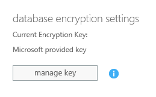
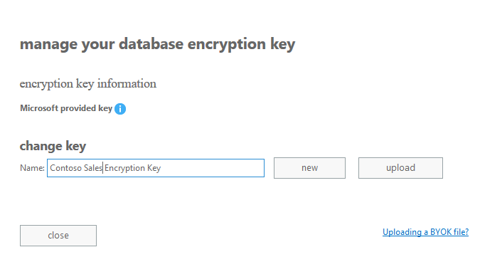
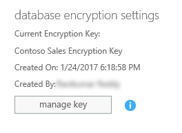
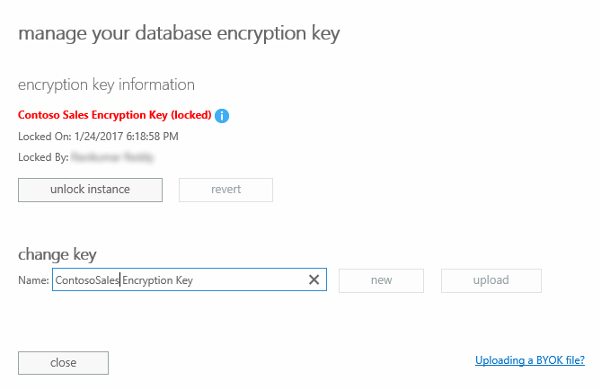

# Manage the encryption keys 

[!INCLUDE [cc_applies_to_update_8_2_0](../includes/cc_applies_to_update_8_2_0.md)]

All instances of [!INCLUDE[pn_CRM_Online](../includes/pn-crm-online.md)] use [!INCLUDE[pn_MS_SQL_Server](../includes/pn-ms-sql-server.md)] Transparent Data Encryption (TDE) to perform real-time encryption of data when written to disk, also known as encryption at rest.  
  
 By default, [!INCLUDE[cc_Microsoft](../includes/cc-microsoft.md)] stores and manages the database encryption keys for your instances of [!INCLUDE[pn_dynamics_crm_online](../includes/pn-dynamics-crm-online.md)] so you don’t have to.  The manage keys feature in the [!INCLUDE[pn_dyn_365_admin_center](../includes/pn-dyn-365-admin-center.md)] gives administrators the ability to self-manage the database encryption keys that are associated with instances of [!INCLUDE[pn_dynamics_crm_online](../includes/pn-dynamics-crm-online.md)]. 

> [!IMPORTANT]
>  Self-managed database encryption keys are only available in the [!INCLUDE[pn_CRM_Online](../includes/pn-crm-8-2-0-online.md)] and may not be made available for later versions.  
  
   
## Introduction to key management  
 With [!INCLUDE[pn_crm_online_shortest](../includes/pn-crm-online-shortest.md)] key management, administrators can provide their own encryption key or have an encryption key generated for them, which is used to protect the database for an instance.  
  
 The key management feature supports both PFX and BYOK encryption key files, such as those stored in a hardware security module (HSM). To use the upload encryption key option you need both the public and private encryption key.  
  
 The key management feature takes the complexity out of encryption key management by using [!INCLUDE[pn_azure_key_vault](../includes/pn-azure-key-vault.md)] to securely store encryption keys. [!INCLUDE[pn_azure_key_vault](../includes/pn-azure-key-vault.md)] helps safeguard cryptographic keys and secrets used by cloud applications and services. The key management feature doesn’t require that you have an [!INCLUDE[pn_azure_key_vault](../includes/pn-azure-key-vault.md)] subscription and for most situations there is no need to access encryption keys used for [!INCLUDE[pn_dynamics_crm_online](../includes/pn-dynamics-crm-online.md)] within the vault.  
  
 The manage keys feature lets you perform the following tasks.  
  
-   Enable the ability to self-manage database encryption keys that are associated with [!INCLUDE[pn_dynamics_crm_online](../includes/pn-dynamics-crm-online.md)] instances.  
  
-   Generate new encryption keys or upload existing .PFX or .BYOK encryption key files.  
  
-   Lock a [!INCLUDE[pn_dynamics_crm_online](../includes/pn-dynamics-crm-online.md)] instance.  
  
    > [!CAUTION]
    >  You should never lock an instance as part of your normal business process. While a [!INCLUDE[pn_dynamics_crm_online](../includes/pn-dynamics-crm-online.md)] instance is locked it takes the instance completely offline and it cannot be accessed by anyone, including [!INCLUDE[cc_Microsoft](../includes/cc-microsoft.md)]. Additionally, services such as synchronization and maintenance are all stopped. An appropriate reason why you would lock an instance is when you move your database from online to on-premises. Locking the instance can make sure that your online data is never accessed again by anyone.  
    >   
    >  A locked instance  can’t be restored from backup.  
  
-   Unlock a [!INCLUDE[pn_dynamics_crm_online](../includes/pn-dynamics-crm-online.md)] instance. To unlock a locked instance of [!INCLUDE[pn_dynamics_crm_online](../includes/pn-dynamics-crm-online.md)], you must upload the encryption key that was used to lock it. While a [!INCLUDE[pn_dynamics_crm_online](../includes/pn-dynamics-crm-online.md)] instance is locked, it cannot be accessed by anyone.  
  
   
## Understand the potential risk when you manage your keys  
 As with any business critical application, personnel within your organization who have administrative-level access must be trusted. Before you use the key management feature, you should understand the risk when you manage your database encryption keys. It is conceivable that a malicious administrator (a person who is granted or has gained administrator-level access with intent to harm an organization's security or business processes) working within your organization might use the manage keys feature to create a key and use it to lock a [!INCLUDE[pn_dynamics_crm_online](../includes/pn-dynamics-crm-online.md)] instance. Consider the following sequence of events.  
  
1.  The malicious administrator  signs in to the [!INCLUDE[pn_dyn_365_admin_center](../includes/pn-dyn-365-admin-center.md)], goes to the edit page for an instance, and then generates a new encryption key to use to encrypt the instance. As part of the key generation, the malicious [!INCLUDE[pn_crm_shortest](../includes/pn-crm-shortest.md)] administrator downloads the encryption key.  
  
2.  The malicious administrator locks the associated [!INCLUDE[pn_dynamics_crm_online](../includes/pn-dynamics-crm-online.md)] instance and takes or deletes the encryption key that was used to lock the instance.  
  
Notice that, encryption key changes take 72 hours to complete. Additionally, anytime an encryption key is changed for a [!INCLUDE[pn_dynamics_crm_online](../includes/pn-dynamics-crm-online.md)] instance all [!INCLUDE[pn_dynamics_crm_online](../includes/pn-dynamics-crm-online.md)] administrators receive an email message alerting them of the key change.  This provides up to 72 hours to  roll back any unauthorized key changes.  
  
However, if after 72 hours the key change is not rolled back, the [!INCLUDE[pn_dynamics_crm_online](../includes/pn-dynamics-crm-online.md)] instance will remain in a locked state until the encryption key that was used to lock it can be recovered to unlock it.  
  
   
## Key management requirements  
  
### Privileges required  
 To use the manage keys feature you need one of the following privileges:  
  
-   Office 365 Global Administrators membership.  
  
-   Office 365 Service Administrators group membership.  
  
-   System Administrator security role for the instance of [!INCLUDE[pn_dynamics_crm_online](../includes/pn-dynamics-crm-online.md)] that you want to manage the encryption key.  
  
### Subscription requirements  
 The ability to self-manage database encryption keys requires either Dynamics 365 Customer Engagement Plan or Dynamics 365 Plan.  
  
### Encryption key requirements  
 If you provide your own encryption key, your key must meet  these  requirements that are accepted by [!INCLUDE[pn_azure_key_vault](../includes/pn-azure-key-vault.md)].  
  
-   The encryption key file format must be PFX or BYOK.  
  
-   2048-bit RSA or RSA-HSM key type.  
  
-   PFX encryption key files must be password protected.  
  
For more information about the key types supported by Key Vault by uploading the file in the [!INCLUDE[pn_dyn_365_admin_center](../includes/pn-dyn-365-admin-center.md)].  Only the encrypted version of your key leaves the original workstation.  For more information about generating and transferring an HSM-protected key over the Internet see [How to generate and transfer HSM-protected keys for Azure Key Vault](https://docs.microsoft.com/azure/key-vault/key-vault-hsm-protected-keys).  
  
   
## Key management tasks  
 The following sections describe the tasks you can perform when you choose to self-manage the database encryption key for one or more instances.  
  
### Set or change the encryption key for an instance  
 Use this procedure to set the manage key feature the first time for an instance or to change an encryption key for an already self-managed instance.  
  
1.  Sign in to the [Office 365 Admin center](https://portal.office.com).  
  
2.  Expand **Admin centers**, and then click **Dynamics 365**.  
  
3.  Click **Instance**, select the instance where you want to manage the database encryption key, and then click **Edit**.  
  
4.  Under **database encryption settings**, click **manage key**.  
  
   
  
5.  Review the message that appears and if you want to manage your own database encryption key for the instance, click **ok**.  
  
6.  By default, the name for the key is *InstanceName Encryption Key*. Leave the key name or change it and then click either **new** or **upload**.  
  
   
  
**new**  
 Click **new** to have a .PFX encryption key generated for you that will be used to encrypt the database.  
  
    1.  When you are prompted, enter the password that will be used for the encryption key.  
  
    2.  To use the key for the instance, click **Yes**.  
  
    3.  When you're prompted to save the private key, save it to a secure location. The key generated is RSA SHA256 2048-bit. We strongly recommend that you back up the key and save the password to a secure location.  
  
    4.  Click **close** to close the manage your database encryption key dialog box.  
  
 **upload**  
 Click **upload** to provide your own password protected PFX or BYOK encryption key file.  
  
    1.  Browse for and add your own key that has been exported from your local hardware security module (HSM) or encryption key application. For BYOK encryption key files, make sure you use the subscription id when you export the encryption key from your local HSM. Click **Uploading a BYOK file?** on the **manage you database encryption key** dialog box to find your subscription id.  
  
    2.  If you’re sure you want to change the encryption key, click **yes**.  
  
    3.  Enter a password for the key, and click **ok**.  
  
    4.  Click **close** to close the manage your database encryption key dialog box.  
  
    5.  An email message is sent to all [!INCLUDE[pn_crm_online_shortest](../includes/pn-crm-online-shortest.md)] administrators in your organization. This occurs whenever a key is changed for an instance.  
  
Notice that the key name you specified to manage database encryption settings now appears under **Current Encryption Key**.  
  
  
  
### Revert a managed encryption key  
 Reverting a managed key configures the instance back to the default behavior where [!INCLUDE[cc_Microsoft](../includes/cc-microsoft.md)] manages the encryption key for you.  
  
-   From the [!INCLUDE[pn_dyn_365_admin_center](../includes/pn-dyn-365-admin-center.md)], click **Instance**, select the instance that you want to revert, and then click **Edit**.  
  
-   Under **database encryption settings**, click **manage key**.  
  
-   Click **revert**.  
  
-   To revert the instance back to [!INCLUDE[cc_Microsoft](../includes/cc-microsoft.md)]-managed key encryption, click **yes**.  
  
-   Click **close** to close the manage your database encryption key dialog box.  
  
### Lock an instance  
 A locked instance remains inaccessible to everyone, including [!INCLUDE[cc_Microsoft](../includes/cc-microsoft.md)], until a tenant administrator in your organization unlocks it by using the key that was used to lock it.  
  
> [!CAUTION]
>  While a [!INCLUDE[pn_dynamics_crm_online](../includes/pn-dynamics-crm-online.md)] instance is locked it takes the instance completely offline and it cannot be accessed by anyone, including [!INCLUDE[cc_Microsoft](../includes/cc-microsoft.md)]. Additionally, services such as synchronization and maintenance are all stopped. You should never lock an instance as part of your normal business process. A common reason why you would lock an instance is when you move your database from online to on-premises. Locking the instance can make sure that your online data is never access again by anyone.  
>   
>  A locked instance  can’t be restored from backup.  
  
1.  From the [!INCLUDE[pn_dyn_365_admin_center](../includes/pn-dyn-365-admin-center.md)], click **Instance**, select the instance that you want to lock, and then click **Edit**.  
  
2.  Under **database encryption settings**, click **manage key**.  
  
3.  Click **lock instance**.  
  
4.  Enter the name as it appears in the dialog box to confirm that you understand the risks with locking an instance, and then click **upload**.  
  
5.  Browse for and select the encryption key file that was used to encrypt the instance, and then click **Open**.  
  
6.  Enter the password for the key, and then click **ok**.  
  
7.  To lock the instance, click **yes**.  
  
8.  Click **close** to close the manage your database encryption key dialog box.  
  
### Unlock a locked instance  
 To unlock an instance, you must provide the encryption key and password that was used to lock the instance.  
  
1.  From the [!INCLUDE[pn_dyn_365_admin_center](../includes/pn-dyn-365-admin-center.md)], click **Instance**, select the instance that you want to unlock, and then click **Edit**.  
  
2.  Under **database encryption settings**, click **manage key**.  
  
3.  Click **unlock instance**.  
  
   
  
4.  Browse for and select the encryption key that was used to encrypt the instance, and then click **Open**.  
  
5.  Enter the password for the key, and then click **ok**.  
  
6.  Click **close** to close the manage your database encryption key dialog box.  
  
### See also  
 [SQL Server: Transparent Data Encryption (TDE)](https://technet.microsoft.com/library/bb934049.aspx)
