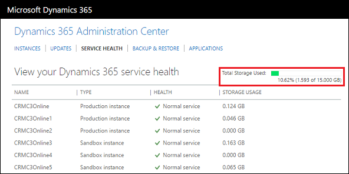
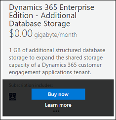

# Manage storage  

[!INCLUDE[cc-applies-to-update-9-0-0](../includes/cc_applies_to_update_9_0_0.md)] [!INCLUDE[cc-applies-to-update-8-2-0](../includes/cc_applies_to_update_8_2_0.md)]

You can manage your organization’s data storage capacity in connection with your subscription to [!INCLUDE[pn_CRM_Online](../includes/pn-crm-online.md)]. The type of subscription you purchase determines the amount of storage initially allocated to your organization. If you run out of storage, you can add more.  
  
 You can also gain storage by deleting certain types of unnecessary data in [!INCLUDE[pn_crm_online_shortest](../includes/pn-crm-online-shortest.md)]. For information on deleting data, see: [Free storage space in Dynamics 365](https://docs.microsoft.com/dynamics365/customer-engagement/admin/free-storage-space).  
  
 For information on storage amounts included with the various [!INCLUDE[pn_CRM_Online](../includes/pn-crm-online.md)] plans, see: [Dynamics 365 pricing](https://www.microsoft.com/en-us/dynamics365/pricing).  
  
## Monitor the amount of storage your organization is using  
 Monitor your [!INCLUDE[pn_crm_online_shortest](../includes/pn-crm-online-shortest.md)] storage to make sure you’ve got lots of capacity for growth.  
  
 If your total storage used is 80% or more of capacity, [!INCLUDE[pn_crm_shortest](../includes/pn-crm-shortest.md)] admins will receive email notifications and alerts will appear on the Service Health page.  
  
1. [!INCLUDE[proc_office365_signin](../includes/proc-office365-signin.md)]  
  
2. [!INCLUDE[proc_office365_choose_admin_crm](../includes/proc-office365-choose-admin-crm.md)]  
  
3.  Choose the **Service Health** tab.  
  
   
  
## Add storage to Dynamics 365 (online)  
  
1. [!INCLUDE[proc_office365_signin](../includes/proc-office365-signin.md)]  
  
2.  Click **Billing** > **Purchase Services**.  
  
3.  Scroll down to the **Add-on subscriptions** section and mouse over the **Dynamics 365 - Additional Database Storage** tile.  
  
   
  
4.  Click **Buy now**, and then proceed through the order process.  
  
     If you paid for the subscription by credit card, any additional storage space that you order will be available immediately after you receive an order confirmation. If you’re invoiced for subscription payments, you may be asked to complete a credit check. In this case, the additional storage will not be available until the credit check is passed.  

## What happens if you exceed your storage limit?

[!INCLUDE[pn_crm_shortest](../includes/pn-crm-shortest.md)] System administrators will receive frequent email notifications which will cease once additional storage is added or storage is reduced to below the limit.

### See also  
 [Manage Microsoft Dynamics 365 (online) instances](manage-online-environments.md)   
 [Free storage space in Microsoft Dynamics 365](https://docs.microsoft.com/dynamics365/customer-engagement/admin/free-storage-space)   
 [Manage subscriptions, licenses, and user accounts](manage-subscriptions-licenses-user-accounts.md)   
 [Global and Service administrators can administer Dynamics 365 without a license](global-service-administrators-can-administer-without-license.md)
