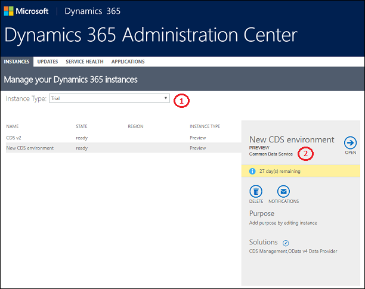

# What's new for instance management 

[!INCLUDE[cc-applies-to-update-9-0-0](../includes/cc_applies_to_update_9_0_0.md)] [!INCLUDE [cc_applies_to_update_8_2_0](../includes/cc_applies_to_update_8_2_0.md)]

You might have noticed some changes to the [!INCLUDE [pn-dyn-365-admin-center](../includes/pn-dyn-365-admin-center.md)]. On March 21, 2018, we introduced the following:

<!-- 1. **Region picker**. Filter on geographical regions.-->
1. **Instance type picker**. Filter on the type of instance: Trial, Production, Sandbox.
2. **Common Data Service instance**. PowerApps [Environments](https://docs.microsoft.com/powerapps/environments-overview) provisioned with Common Data Service in the PowerApps admin center are now displayed in the [!INCLUDE [pn-dyn-365-admin-center](../includes/pn-dyn-365-admin-center.md)] as Common Data Service instances. 

<!-- ## Filter by region
You can filter for instances from a specific geographical region.

1. [!INCLUDE[proc_office365_signin](../includes/proc-office365-signin.md)]  
2. [!INCLUDE[proc_office365_choose_admin_crm](../includes/proc-office365-choose-admin-crm.md)]  
3. Choose the **Instances** tab.  
4. Select a region to display instances for that region only. -->

## Filter by instance type
If you're a large organization, you might have numerous instances of various types such as Production and Sandbox. You can now filter for instance type to show only the type you're interested in.

1. [!INCLUDE[proc_office365_signin](../includes/proc-office365-signin.md)]  
2. [!INCLUDE[proc_office365_choose_admin_crm](../includes/proc-office365-choose-admin-crm.md)]  
3. Choose the **Instances** tab.  
4. Select an instance type to display instances for that type only.

## Common Data Service instance
Once you create [Environments](https://docs.microsoft.com/powerapps/environments-overview) provisioned with Common Data Services in the PowerApps admin center, they will now show up as Common Data Service instances in your [!INCLUDE [pn-dyn-365-admin-center](../includes/pn-dyn-365-admin-center.md)].

For more information, see [Manage Common Data Service instances](common-data-service-environments.md).

###See also
[Administer PowerApps overview](https://docs.microsoft.com/en-us/powerapps/administrator) 
[Introduction to the admin center for PowerApps](https://docs.microsoft.com/powerapps/introduction-to-the-admin-center)
