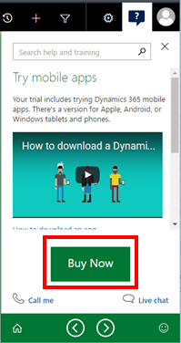

# Onboard your organization and users

> [!NOTE]
>   [!INCLUDE[cc-under-construction](../includes/cc-under-construction.md)]

[!INCLUDE[cc-applies-to-update-9-0-0](../includes/cc_applies_to_update_9_0_0.md)] [!INCLUDE [cc_applies_to_update_8_2_0](../includes/cc_applies_to_update_8_2_0.md)]

New to [!INCLUDE[pn_crm_online_shortest](../includes/pn-crm-online-shortest.md)]? We've put together step-by-step guidance whether you’re still evaluating [!INCLUDE[pn_crm_online_shortest](../includes/pn-crm-online-shortest.md)], ready to make a purchase, or ready to onboard your organization and users.  
  
> [!NOTE]
>  This topic is targeted at administrators for [!INCLUDE[pn_crm_online_shortest](../includes/pn-crm-online-shortest.md)]. Many of the features covered in this topic are also available for [!INCLUDE[pn_crm_op_edition](../includes/pn-crm-onprem.md)]. If a feature is available only for [!INCLUDE[pn_crm_online_shortest](../includes/pn-crm-online-shortest.md)], it’s indicated in the topic. For more information about which features are online only, see [Online-only features in Dynamics 365 Customer Engagement](https://docs.microsoft.com/dynamics365/get-started/whats-new/customer-engagement/online-only-features)  
  
## Step One: Try out Dynamics 365 (online) in a free 30-day trial  

[JimHoltz: rewrite for new process]

If you haven’t already purchased Dynamics 365 (online), we recommend you start with a free 30-day trial.

1. In the 

  
## Step Two: Buy and manage a subscription  
 With [!INCLUDE[pn_crm_online_shortest](../includes/pn-crm-online-shortest.md)], you can evolve your business on your terms. Start with just what you need to run your business. For example, you might want to start with the [!INCLUDE[pn_crm_shortest](../includes/pn-crm-shortest.md)] for Sales app or the [!INCLUDE[pn_crm_shortest](../includes/pn-crm-shortest.md)] for Customer Service app, and then add more apps as your needs change. [!INCLUDE[proc_more_information](../includes/proc-more-information.md)] [Dynamics 365](https://www.microsoft.com/dynamics365/home)  
  
 There are four ways to buy a subscription of [!INCLUDE[pn_crm_online_shortest](../includes/pn-crm-online-shortest.md)]:  
  
-   Convert from a trial  
  
-   Buy direct  
  
-   Buy through volume licensing  
  
-   Buy through a cloud solution provider  
  
   
### Convert from a trial  
 The simplest way to buy [!INCLUDE[pn_crm_online_shortest](../includes/pn-crm-online-shortest.md)] is to click the **Buy Now** button from one of the sidebars in the free 30-day trial:  
  
   
  
> [!NOTE]
>  If your trial has expired, you’ll receive an email that includes a **Buy Today** button.  
  
 When you convert from a trial, you keep any customizations you made during the trial period.  
  
[!INCLUDE[proc_more_information](../includes/proc-more-information.md)] [Introduction to solutions](https://docs.microsoft.com/dynamics365/customer-engagement/developer/introduction-solutions)
  
   
### Buy direct  
 To buy direct, go to the [Dynamics 365 pricing page](https://www.microsoft.com/dynamics365/pricing). This page includes several different plans to fit your organization’s needs.  
  
   
### Buy through volume licensing  
 If your organization has 250 or more [!INCLUDE[pn_crm_shortest](../includes/pn-crm-shortest.md)] users, you may be interested in [purchasing a Dynamics 365 enterprise licensing agreement](https://www.microsoft.com/licensing/default.aspx).  
  
   
### Buy through a cloud solution provider  
 A cloud solution provider can work closely with you to understand the needs of your business or organization. [Learn how to find a Dynamics 365 partner](https://partnercenter.microsoft.com/partner/home).  
  
   
### Choose your support  
 Microsoft provides flexible, industry-leading support, services, and resources that enable users to quickly address technical issues and maximize return on your [!INCLUDE[pn_crm_shortest](../includes/pn-crm-shortest.md)] investment. Choose a plan that best meets your business requirements. [!INCLUDE[proc_more_information](../includes/proc-more-information.md)] [Dynamics 365 support](https://www.microsoft.com/dynamics365/support)  
  
   
### Set up points of contacts for communications  
 Microsoft regularly maintains and updates [!INCLUDE[pn_crm_online_shortest](../includes/pn-crm-online-shortest.md)] to ensure security, performance, and availability, and to provide new features and functionality. From time to time, Microsoft also responds to service incidents. For each of these activities, the [!INCLUDE[pn_crm_shortest](../includes/pn-crm-shortest.md)] admin for your organization receives email notifications. You have control over who should receive these email communications.  
  
[!INCLUDE[proc_more_information](../includes/proc-more-information.md)]
  
-   [Policies and communications for Dynamics 365 (online)](policies-communications.md)  
  
-   [Manage email notifications](manage-email-notifications.md)  
  
   
### Manage subscriptions, licenses, and user accounts  
 As a [!INCLUDE[pn_MS_Online_Services](../includes/pn-ms-online-services.md)] administrator, you manage the [!INCLUDE[pn_crm_online_shortest](../includes/pn-crm-online-shortest.md)] subscription, including billing and payments, user licenses, accounts and registration. You do these tasks in the [!INCLUDE[pn_Office_365](../includes/pn-office-365.md)] admin center. [!INCLUDE[proc_more_information](../includes/proc-more-information.md)] [Manage subscriptions, licenses, and user accounts](manage-subscriptions-licenses-user-accounts.md)  
  
   

### Add a Partner of Record to share account details with your partner  
 Many customers choose to work with a designated Microsoft partner to set up, customize, deploy, and administer their [!INCLUDE[pn_crm_shortest](../includes/pn-crm-shortest.md)] instance(s). If you have a partner assisting you, this process can be facilitated by selecting a designated Partner of Record (POR) inside the [!INCLUDE[pn_Office_365](../includes/pn-office-365.md)] Portal. This enables the sharing of select details, such as contact and user information with your POR. Sharing this information will allow your partner to more quickly access information about your account, create support requests on your behalf, and work with Microsoft to assist with your accounts. [!INCLUDE[proc_more_information](../includes/proc-more-information.md)] [Manage subscriptions, licenses, and user accounts](manage-subscriptions-licenses-user-accounts.md)
  
## Step Three: Plan your deployment and learn about FastTrack  
 Microsoft FastTrack for [!INCLUDE[pn_dyn_365](../includes/pn-dyn-365.md)] is our customer success service designed to help you move to [!INCLUDE[pn_dyn_365](../includes/pn-dyn-365.md)] smoothly and confidently, so you can realize business value faster. When you participate in the FastTrack program, you will receive guidance on best practices and how to plan for successful rollouts. You will also learn ways to enable new users and expand capabilities – all at your own pace. Additionally, you will have access to Microsoft engineering resources committed to make your experience with [!INCLUDE[pn_dyn_365](../includes/pn-dyn-365.md)] a success.  
  
 [!INCLUDE[proc_more_information](../includes/proc-more-information.md)] [Use the FastTrack customer success service to plan a successful Dynamics 365 rollout](https://docs.microsoft.com/dynamics365/get-started/fasttrack/index).  
  
   
### Plan your deployment  
 Many decisions you make at the beginning and throughout the deployment process can have downstream effects and impact other phases of the plan. Developing a plan to deploy [!INCLUDE[pn_crm_shortest](../includes/pn-crm-shortest.md)] is important in determining the actions to take from inception to go live. The amount of resources involved in planning depends on the size and scope of the project. Large organizations may need a deployment team, while a small organization may assign these functions to a key person.  
  
 Often times an organization will employ an independent software vendor (ISV), value-added reseller, or partner to help implement and maintain a [!INCLUDE[pn_crm_shortest](../includes/pn-crm-shortest.md)] deployment. Partners bring experience, best practices, and industry expertise that will be valuable in the planning and deployment process. [Find a partner if you don’t have one.](https://partnercenter.microsoft.com/pcv/search)  
  
[!INCLUDE[proc_more_information](../includes/proc-more-information.md)]
  
-   [Get started administering Dynamics 365 (online)](getting-started.md)  
  
-   [Plan for Dynamics 365 deployment and administration](plan-for-deployment-and-administration.md)  
  
## Step Four: Onboard your organization  
 After you purchase a subscription to [!INCLUDE[pn_crm_online_shortest](../includes/pn-crm-online-shortest.md)], it’s time to onboard your organization.  
  
   
### Sign in to Dynamics 365 (online) and manage your subscription  
  
-   [Sign in to Dynamics 365 and Office 365 apps](sign-in-office-365-apps.md)  
  
-   [Use the Office 365 admin center to manage your Dynamics 365 (online) subscription](use-office-365-admin-center-manage-subscription.md)  
  
-   [Optional: Manage user account synchronization](manage-user-account-synchronization.md)  
  
   

### Add users and assign security roles  
 [!INCLUDE[pn_crm_shortest](../includes/pn-crm-shortest.md)] uses role-based security. The security role assigned to a user determines the tasks the user is permitted to perform and the data the user is permitted to view. Every user must be assigned at least one security role to access [!INCLUDE[pn_crm_shortest](../includes/pn-crm-shortest.md)].  
  
[!INCLUDE[proc_more_information](../includes/proc-more-information.md)]
  
-   [Grant users access to Dynamics 365 (online) as a Microsoft Online service](grant-users-access.md)  
  
-   [Create users and assign security roles](create-users-assign-online-security-roles.md)  
  
  
 
### Optional: Transfer customizations from your free 30-day trial  
 If you made customizations to your free trial, you can transfer those customizations to your production instance.  
  
[!INCLUDE[proc_more_information](../includes/proc-more-information.md)]
  
-   [Export your customizations as a solution](../maker/common-data-service/use-solutions-for-your-customizations.md)  
  
-   [Use solutions for your customizations](../maker/common-data-service/use-solutions-for-your-customizations.md)  
  
For more advanced scenarios, consider the following development tools: [Solution tools for team development](https://docs.microsoft.com/dynamics365/customer-engagement/developer/solution-tools-team-development).
  
   

### Manage storage  
 You can manage your organization’s data storage capacity in connection with your subscription to [!INCLUDE[pn_crm_online_shortest](../includes/pn-crm-online-shortest.md)]. The type of subscription you purchase determines the amount of storage initially allocated to your organization. If you run out of storage, you can add more.  
  
[!INCLUDE[proc_more_information](../includes/proc-more-information.md)]
  
-   [Manage storage for Dynamics 365 (online)](manage-storage.md)  
  
-   [Understanding storage and storage notifications](https://blogs.msdn.microsoft.com/crm/2013/07/24/understanding-storage-and-storage-notifications-in-microsoft-dynamics-crm-online/)  
  
   
### Create a sandbox (non-production instance)  
 You can create a sandbox instance (non-production environment) for development, testing, training, and other non-production uses. Then when you’re ready to turn the sandbox instance into your production instance, you can switch it.  
  
 You get one free sandbox instance with your purchase of [!INCLUDE[pn_crm_online_shortest](../includes/pn-crm-online-shortest.md)]. You can also purchase additional sandbox instances.  
  
[!INCLUDE[proc_more_information](../includes/proc-more-information.md)]
  
-   [Manage Dynamics 365 (online) sandbox instances](manage-sandbox-environments.md)  
  
-   [Switch an instance](switch-environment.md)  
  
   
### Set organization-wide system settings  
 When you first set up [!INCLUDE[pn_crm_shortest](../includes/pn-crm-shortest.md)], you’ll want to set system-wide settings.  
  
[!INCLUDE[proc_more_information](../includes/proc-more-information.md)]
  
-   [Find your way around Dynamics 365](https://docs.microsoft.com/dynamics365/customer-engagement/basics/navigation-customer-engagement-enterprise) 
  
-   [Set up a Dynamics 365 organization](https://docs.microsoft.com/dynamics365/customer-engagement/admin/set-up-a-dynamics-365-organization)  
  
   
### Import and export data  
 [!INCLUDE[pn_crm_shortest](../includes/pn-crm-shortest.md)] provides an import tool for importing simple data stored in files. If the import tool doesn't satisfy your data import requirements, you may want to contact a partner. [Find a partner if you don’t have one.](https://partnercenter.microsoft.com/en-us/pcv/search)  
  
[!INCLUDE[proc_more_information](../includes/proc-more-information.md)]
  
-   [Import contacts](https://docs.microsoft.com/dynamics365/customer-engagement/basics/import-contacts)  
  
-   [Import accounts, leads, or other data](https://docs.microsoft.com/dynamics365/customer-engagement/basics/import-accounts-leads-other-data)  
  
-   [Download a template for data import](download-template-data-import.md)  
  
-   [Best practices for migrating your data](https://mbs.microsoft.com/customersource/northamerica/CRM/learning/documentation/DataMigrationCRMOnlineOnboardingSuccess)  
  
[!INCLUDE[pn_crm_online_shortest](../includes/pn-crm-online-shortest.md)] also provides advanced tools for exporting to [!INCLUDE[pn_Azure_SQL_Database_long](../includes/pn-azure-sql-database-long.md)]. [!INCLUDE[proc_more_information](../includes/proc-more-information.md)] [Replicate data to Azure SQL Database using Data Export Service](https://docs.microsoft.com/dynamics365/customer-engagement/admin/replicate-data-microsoft-azure-sql-database)  
  
   
### Set up Dynamics 365 for phones and Dynamics 365 for tablets  
 The [!INCLUDE[pn_crm_shortest](../includes/pn-crm-shortest.md)] mobile apps make it easy to stay connected with your prospects and customers no matter where you are, or what mobile device you’re using. Having access to [!INCLUDE[pn_crm_shortest](../includes/pn-crm-shortest.md)] data in the field also improves user adoption and productivity.  
  
[!INCLUDE[proc_more_information](../includes/proc-more-information.md)]
  
-   [Video: Overview of the mobile app](https://www.youtube.com/embed/KApKrlvMncQ)  
  
-   [Dynamics 365 for phones and tablets User's Guide](https://docs.microsoft.com/dynamics365/customer-engagement/mobile-app/dynamics-365-phones-tablets-users-guide)  
  
-   [Customize Dynamics 365 for phones and tablets to work for your business](https://docs.microsoft.com/dynamics365/customer-engagement/customize/customize-phones-tablets)  
<!--  
-   [Configure mobile offline synchronization for Dynamics 365 for phones and tablets](https://docs.microsoft.com/dynamics365/customer-engagement/mobile-app/dynamics-365-phones-tablets-users-guide)  -->
  
   
### Set up Dynamics 365 App for Outlook  
 Your users can tap the power of [!INCLUDE[pn_crm_shortest](../includes/pn-crm-shortest.md)] from the familiar [!INCLUDE[pn_MS_Outlook_Short](../includes/pn-ms-outlook-short.md)] environment. Working with a tool they already know speeds up the learning curve and makes them more productive.  
  
 Before deploying [!INCLUDE[pn_dyn_365_app_outlook](../includes/pn-dyn-365-app-outlook.md)], you must connect [!INCLUDE[pn_crm_shortest](../includes/pn-crm-shortest.md)] to [!INCLUDE[pn_MS_Outlook_Short](../includes/pn-ms-outlook-short.md)] using server-side synchronization.  
  
[!INCLUDE[proc_more_information](../includes/proc-more-information.md)]
  
-   [Dynamics 365 App for Outlook User's Guide](https://docs.microsoft.com/dynamics365/customer-engagement/outlook-app/dynamics-365-app-outlook-user-s-guide)  
  
-   [Set up server-side sync](set-up-server-side-synchronization-of-email-appointments-contacts-and-tasks.md)
  
-   [Deploy Dynamics 365 App for Outlook](https://docs.microsoft.com/dynamics365/customer-engagement/outlook-app/deploy-dynamics-365-app-for-outlook)  
  
   
### Integrate SharePoint document management  
 When you integrate [!INCLUDE[pn_SharePoint_short](../includes/pn-sharepoint-short.md)] with [!INCLUDE[pn_crm_shortest](../includes/pn-crm-shortest.md)], your teams can store documents with associated [!INCLUDE[pn_crm_shortest](../includes/pn-crm-shortest.md)] records and take advantage of all the other document management features provided by [!INCLUDE[pn_SharePoint_short](../includes/pn-sharepoint-short.md)]. [!INCLUDE[proc_more_information](../includes/proc-more-information.md)] [Set up SharePoint integration with Dynamics 365](https://docs.microsoft.com/dynamics365/customer-engagement/admin/set-up-sharepoint-integration)  
  
 After you integrate [!INCLUDE[pn_SharePoint_short](../includes/pn-sharepoint-short.md)], you can set up [!INCLUDE[pn_onenote](../includes/pn-onenote.md)], [!INCLUDE[pn_onedrive_for_business](../includes/pn-onedrive-for-business.md)], or [!INCLUDE[pn_office_365_groups](../includes/pn-office-365-groups.md)]:  
  
 **[!INCLUDE[pn_onenote](../includes/pn-onenote.md)].** When you turn on [!INCLUDE[pn_onenote](../includes/pn-onenote.md)] integration, your teams can use [!INCLUDE[pn_onenote](../includes/pn-onenote.md)] to take or review notes and store them with [!INCLUDE[pn_crm_online_shortest](../includes/pn-crm-online-shortest.md)] records. [!INCLUDE[proc_more_information](../includes/proc-more-information.md)] [Set up OneNote integration in Dynamics 365](set-up-onenote-integration-in-dynamics-365.md)  
  
 **[!INCLUDE[pn_onedrive_for_business](../includes/pn-onedrive-for-business.md)].** Use [!INCLUDE[pn_onedrive_for_business](../includes/pn-onedrive-for-business.md)] to store private documents while working in [!INCLUDE[pn_crm_online_shortest](../includes/pn-crm-online-shortest.md)]. For example, start working on a document privately, such as a draft sales pitch. When the draft is far enough along, move it to an Office 365 Group for team collaboration. [!INCLUDE[pn_onedrive_for_business](../includes/pn-onedrive-for-business.md)] provides 1 TB or more of storage and documents are automatically synced to your desktop and mobile devices. [!INCLUDE[proc_more_information](../includes/proc-more-information.md)] [Use OneDrive for Business to manage your private documents](https://docs.microsoft.com/dynamics365/customer-engagement/basics/use-onedrive-business-manage-private-documents)  
  
 **[!INCLUDE[pn_office_365_groups](../includes/pn-office-365-groups.md)].** [!INCLUDE[pn_office_365_groups](../includes/pn-office-365-groups.md)] provides a shared workspace for email, conversations, files, and events. Your teams can use [!INCLUDE[pn_office_365_groups](../includes/pn-office-365-groups.md)] to collaborate with people across your company, even if they don’t have access to [!INCLUDE[pn_crm_online_shortest](../includes/pn-crm-online-shortest.md)]. For example, create a group for your sales team, invite other [!INCLUDE[pn_Office_365](../includes/pn-office-365.md)] users to join the group, and then share documents, conversations, meeting notes, and [!INCLUDE[pn_onenote](../includes/pn-onenote.md)] information related to specific accounts or opportunities. [!INCLUDE[proc_more_information](../includes/proc-more-information.md)] [Collaborate with your colleagues using Office 365 Groups](https://docs.microsoft.com/dynamics365/customer-engagement/basics/collaborate-with-colleagues-using-office-365-groups)  
  
   
### Integrate Skype or Skype for Business  
 If your organization uses [!INCLUDE[pn_skype](../includes/pn-skype.md)] or [!INCLUDE[pn_skype_for_business](../includes/pn-skype-for-business.md)], you can take advantage of connectivity features like click-to-call or user presence from within [!INCLUDE[pn_crm_shortest](../includes/pn-crm-shortest.md)]. [!INCLUDE[proc_more_information](../includes/proc-more-information.md)] [Skype for Business and Skype integration](skype-business-integration.md)  
  
   
### Integrate Yammer  
 Integrating [!INCLUDE[pn_yammer](../includes/pn-yammer.md)], the enterprise social network, with [!INCLUDE[pn_crm_shortest](../includes/pn-crm-shortest.md)] encourages the sharing of information across your organization by bringing [!INCLUDE[pn_yammer](../includes/pn-yammer.md)] posts right into the [!INCLUDE[pn_crm_shortest](../includes/pn-crm-shortest.md)] interface. To integrate [!INCLUDE[pn_yammer](../includes/pn-yammer.md)], you must have a [!INCLUDE[pn_yammer](../includes/pn-yammer.md)] enterprise license set up for each user in [!INCLUDE[pn_crm_shortest](../includes/pn-crm-shortest.md)]. You can include a [!INCLUDE[pn_yammer](../includes/pn-yammer.md)] enterprise account license as an add-on to your [!INCLUDE[pn_Office_365](../includes/pn-office-365.md)] tenant through the [!INCLUDE[pn_office_365_admin_center](../includes/pn-office-365-admin-center.md)]. [!INCLUDE[proc_more_information](../includes/proc-more-information.md)] [Connect to Yammer](connect-yammer.md)  
  
   
### Integrate Office Delve to surface trending documents in Dynamics 365 (online)  
 [!INCLUDE[pn_office_delve](../includes/pn-office-delve.md)] proactively surfaces trending documents on a user’s dashboard so they can discover new content and make new connections. [!INCLUDE[proc_more_information](../includes/proc-more-information.md)] [View relevant and trending information on a dashboard with Office Delve](https://docs.microsoft.com/dynamics365/customer-engagement/basics/view-relevant-trending-information-office-delve)  
  
   
### Guide staff through common tasks with business processes  
 To help ensure that staff follow consistent steps every time they work with customers, [!INCLUDE[pn_crm_shortest](../includes/pn-crm-shortest.md)] includes several ready-to-use business processes for common sales, service, and marketing scenarios. [!INCLUDE[pn_crm_shortest](../includes/pn-crm-shortest.md)] also includes mobile task flows, and business rules/recommendations that you can use to apply form logic. You can use a drag-and-drop designer to create business processes, task flows, or business rules/recommendations.  
  
 [!INCLUDE[pn_crm_shortest](../includes/pn-crm-shortest.md)]also includes other processes like work flows and dialogs that serve different purposes.

[!INCLUDE[proc_more_information](../includes/proc-more-information.md)]

-   [Create custom business logic through processes](../maker/model-driven-apps/guide-staff-through-common-tasks-processes.md)
  
-   [Create a business process flow to standardize processes](../maker/model-driven-apps/create-business-process-flow.md)
  
-   [Create a mobile task flow](../maker/model-driven-apps/create-mobile-task-flow.md)
  
-   [Use Workflow processes to automate processes that don't require user interaction](../maker/common-data-service/workflow-processes.md)
  
-   [Actions overview](../maker/common-data-service/actions.md)
  
   

### Customize and personalize Dynamics 365 (online) for your organization  
 [!INCLUDE[pn_crm_shortest](../includes/pn-crm-shortest.md)] provides point-and-click customization tools to make the system work for your business needs. For example, create or modify fields, forms, views, dashboards, reports, charts, and more.

[!INCLUDE[proc_more_information](../includes/proc-more-information.md)]
  
-   [Video: 6 ways to customize Dynamics 365 without writing code](https://www.youtube.com/embed/SycOC_eVBY4)  
  
-   [Design custom business apps by using the app designer](../maker/model-driven-apps/design-custom-business-apps-using-app-designer.md)
  
-   [Create a theme](../maker/common-data-service/change-color-scheme-add-logo-match-organizations-brand.md)
  
-   [Get started with app making and customization](../maker/model-driven-apps/getting-started-customization.md)
  
To do advanced customizations, we recommend you work with a partner. [Find a partner if you don’t have one.](https://partnercenter.microsoft.com/pcv/search)  
  
   
### Additional products and services  
 You may be interested in any of the following additional products and services as you onboard your organization to [!INCLUDE[pn_crm_online_shortest](../includes/pn-crm-online-shortest.md)].  

#### Social Engagement  
 Connect [!INCLUDE[pn_crm_shortest](../includes/pn-crm-shortest.md)] to [!INCLUDE[pn_netbreeze_long](../includes/pn-social-engagement-long.md)] to get social insights in [!INCLUDE[pn_crm_shortest](../includes/pn-crm-shortest.md)]. [!INCLUDE[pn_netbreeze_long](../includes/pn-social-engagement-long.md)] collects data from social media channels, such as [!INCLUDE[tn_facebook](../includes/tn-facebook.md)], [!INCLUDE[tn_twitter](../includes/tn-twitter.md)], and blogs, and presents it in charts and graphs that you can use to spot emerging trends in people's comments, whether positive, negative, or neutral. Drill down into the data and analyze social conversations about your brand. Pinpoint what you're doing right and address potential concerns.  
  
[!INCLUDE[proc_more_information](../includes/proc-more-information.md)]
  
-   [Connect your organization to Social Engagement](https://docs.microsoft.com/dynamics365/customer-engagement/social-engagement/connect-dynamics-365-social-engagement)  
  
-   [Social Engagement Help Center](http://go.microsoft.com/fwlink/p/?LinkId=394325)  
  
#### Portals capabilities for Dynamics 365 (online)  
 Portals capabilities for [!INCLUDE[pn_crm_online_shortest](../includes/pn-crm-online-shortest.md)] empower people who prefer to find answers on their own through self-service and community options. Create portals to provide a more personalized experience for your customers, partners, or internal employees. For example, create portals for:  
  
-   Customers to submit cases and find knowledge articles  
  
-   Partners to see and manage sales opportunities  
  
-   Internal employees to create and find best practices  
  
[!INCLUDE[proc_more_information](../includes/proc-more-information.md)] [Deliver web engagement experience with portal capabilities for [!INCLUDE[pn-microsoftcrm](../includes/pn-microsoftcrm.md)]](https://docs.microsoft.com/dynamics365/customer-engagement/portals/administer-manage-portal-dynamics-365)  
  
#### Customer Insights Service  
 [!INCLUDE[pn_customerinsight_full](../includes/pn-customer-insights-full.md)] is a cloud-based SaaS service that enables organizations of all sizes to bring together data from multiple sources and generate knowledge and insights to build a holistic 360° view of their customers. Use [!INCLUDE[pn_customerinsight_short](../includes/pn-customer-insights-short.md)] to connect to transactional data sources and model profiles of customers and their interactions. The [!INCLUDE[pn_customerinsight_short](../includes/pn-customer-insights-short.md)] application transforms profile, interaction, and KPI’s into rich visuals that you can customize and organize to focus on what matters to you. [!INCLUDE[proc_more_information](../includes/proc-more-information.md)] [Customer Insights service](http://go.microsoft.com/fwlink/p/?LinkId=824625)  
  
#### Dynamics 365 - Gamification  
 [!INCLUDE[pn_gamification](../includes/pn-gamification.md)] allows employees to participate in individual and team-based games which motivate employees to achieve certain pre-defined metrics by offering prizes, awards, privileges, and recognition. The gamification solution relies on fun, engaging activities that drive collaboration and competition to increase performance and participation. The solution uniquely encourages broader participation by getting more employees in the game through drafting teams. Organizations typically see increased productivity, engagement, and performance as well as user adoption of business applications. [!INCLUDE[proc_more_information](../includes/proc-more-information.md)] [Keep your employees engaged and productive by using Gamification](https://docs.microsoft.com/dynamics365/customer-engagement/gamification/increase-employee-productivity)
  
#### Versium Predict  
 Use Versium Predict to increase your marketing and sales effectiveness. Enhance your existing marketing process with predictive analytics that allow you to precisely target your campaigns. Build predictive models, score leads, and more. [!INCLUDE[proc_more_information](../includes/proc-more-information.md)] [Versium Predict](https://docs.microsoft.com/dynamics365/customer-engagement/versium-predict/versium-predict)  
  
   
### Preview features in Dynamics 365 (online)  
 Preview features are features that aren’t complete, but are made available on a “preview” basis so customers can get early access and provide feedback. Find out what preview features are currently being offered: [What are Preview features and how do I enable them?](https://docs.microsoft.com/dynamics365/customer-engagement/admin/what-are-preview-features-how-do-i-enable-them)  
  
   
### On-going monitoring, maintenance, and administration  
  
-   [Important changes coming in Dynamics 365 Customer Engagement](https://docs.microsoft.com/dynamics365/get-started/whats-new/customer-engagement/important-changes-coming)  

-   [How do I check my online service health?](check-online-service-health.md)  
  
-   [Policies and communications for Dynamics 365 (online)](policies-communications.md)  
  
   
### Keep track of new features  
  
-   [Dynamics 365 Roadmap](http://go.microsoft.com/fwlink/p/?LinkID=826016)  
  
-   [What's new](https://docs.microsoft.com/dynamics365/get-started/whats-new/index)  
    
-   [Dynamics 365 - Online vs on-premises features FAQ](https://docs.microsoft.com/dynamics365/get-started/whats-new/customer-engagement/dynamics-365-online-vs-on-premises-features-faq.md)  
  
   
### Troubleshooting, FAQ, and support  
  
-   [Troubleshoot Dynamics 365 problems](https://docs.microsoft.com/dynamics365/customer-engagement/admin/troubleshoot-dynamics-365-problems)  
  
-   [Troubleshoot sign-in problems](https://docs.microsoft.com/dynamics365/customer-engagement/admin/troubleshoot-sign-in-problems)  
  
-   [Frequently asked questions about synchronizing records between Dynamics 365 and Outlook]https://docs.microsoft.com/dynamics365/customer-engagement/admin/frequently-asked-questions-synchronizing-records-dynamics-365-and-outlook)  
  
-   [Troubleshooting and monitoring server-side synchronization](https://docs.microsoft.com/dynamics365/customer-engagement/admin/troubleshooting-monitoring-server-side-synchronization)  
  
-   [Potential issues and resolutions](https://docs.microsoft.com/dynamics365/customer-engagement/mobile-app/troubleshooting-things-know-about-phones-tablets)

-   [Office 365 Groups in Dynamics 365 FAQs](https://docs.microsoft.com/dynamics365/customer-engagement/basics/office-365-groups-dynamics-365-faqs)  
  
-   [Support for Dynamics 365](http://go.microsoft.com/fwlink/p/?LinkId=394391)  
  
   
### Videos, community, forums, and blogs  
  
-   [Dynamics 365 videos on YouTube](https://go.microsoft.com/fwlink/p/?linkid=825366)  
  
-   [Dynamics 365 community, including forums, blogs, and videos](https://go.microsoft.com/fwlink/p/?linkid=825368)  
  
   
### For developers  
  
-   [Dynamics 365 Developer Center](http://go.microsoft.com/fwlink/p/?LinkId=526629)  
  
-   [What’s new for developers](https://docs.microsoft.com/dynamics365/customer-engagement/developer/whats-new-developers)
  
-   [Best practices for migrating your data](https://mbs.microsoft.com/customersource/northamerica/CRM/learning/documentation/DataMigrationCRMOnlineOnboardingSuccess)  
  
-   [Best practices to optimize system performance](https://mbs.microsoft.com/customersource/northamerica/CRM/learning/documentation/PerformanceOptimizationsCRMOnlineSuccess)  
  
## Step Five: Onboard your users  
 After onboarding your organization, it's time to onboard your users.  
  
 [!INCLUDE[pn_crm_shortest](../includes/pn-crm-shortest.md)] includes separate apps for Sales, Customer Service, [!INCLUDE[pn_field_service](../includes/pn-field-service.md)], [!INCLUDE[pn_project_service_auto](../includes/pn-project-service-auto.md)], Financials, and Operations. Having separate apps makes it easy for users to focus on just the tasks they need for their role.  
   
   
### Train your users  
 Studies show that you can greatly increase user adoption by devoting time to user training. Jumpstart training for your teams with the following resources:  
  
-   [Dynamics 365 for Sales - User Guide](https://docs.microsoft.com/dynamics365/customer-engagement/sales-enterprise/user-guide)  
  
-   [Dynamics 365 for Customer Service – User’s Guide](https://docs.microsoft.com/dynamics365/customer-engagement/customer-service/user-guide-customer-service)  
  
-   [Dynamics 365 for Field Service - User's Guide](https://docs.microsoft.com/dynamics365/customer-engagement/field-service/user-guide)   
  
-   [Dynamics 365 for Project Service Automation - User's Guide](https://docs.microsoft.com/dynamics365/customer-engagement/project-service/admin-guide)
  
-   [Dynamics 365 for Finance and Operations](https://docs.microsoft.com/dynamics365/unified-operations/fin-and-ops/index)  
  
-   [Customer Service hub – User’s guide](https://docs.microsoft.com/dynamics365/customer-engagement/customer-service/user-guide-customer-service)
  
-   [Watch videos on YouTube](https://go.microsoft.com/fwlink/p/?linkid=825366)  
  
   
### Install Dynamics 365 for phones or Dynamics 365 for tablets  
 After you set up [!INCLUDE[pn_dyn_365_phones](../includes/pn-dyn-365-phones.md)] and [!INCLUDE[pn_dyn_365_tablets](../includes/pn-dyn-365-tablets.md)], your users can install the mobile app themselves.  
  
[!INCLUDE[proc_more_information](../includes/proc-more-information.md)]

-   [Install Dynamics 365 for phones and tablets](https://docs.microsoft.com/dynamics365/customer-engagement/mobile-app/set-up-dynamics-365-for-phones-and-dynamics-365-for-tablets)  
  
-   [Dynamics 365 for Phones and Tablets User's Guide](https://docs.microsoft.com/dynamics365/customer-engagement/mobile-app/dynamics-365-phones-tablets-users-guide)  
  
   
### Install Dynamics 365 App for Outlook  
 Starting with a tool your users already know speeds up the learning curve and improves productivity.  
  
 If you have deployed [!INCLUDE[pn_ms_dyn_crm_app_for_outlook](../includes/pn-ms-dyn-crm-app-for-outlook.md)] to your organization, your users can install the app themselves.  
  
 [!INCLUDE[proc_more_information](../includes/proc-more-information.md)] [Dynamics 365 App for Outlook User's Guide](https://docs.microsoft.com/dynamics365/customer-engagement/outlook-app/dynamics-365-app-outlook-user-s-guide)  
  
   
### Use Office apps with Dynamics 365  
 [!INCLUDE[pn_crm_shortest](../includes/pn-crm-shortest.md)] works with many Office apps in addition to [!INCLUDE[pn_MS_Outlook_Short](../includes/pn-ms-outlook-short.md)]. Working with familiar tools improves user adoption and productivity.  
  
[!INCLUDE[proc_more_information](../includes/proc-more-information.md)]
  
-   [Manage your documents using SharePoint](manage-documents-using-sharepoint.md)
  
-   [Set up onenote integration in Dynamics 365](set-up-onenote-integration-in-dynamics-365.md)  
  
-   [Use OneDrive for Business to manage your private documents](https://docs.microsoft.com/dynamics365/customer-engagement/basics/use-onedrive-business-manage-private-documents)  
  
-   [Collaborate with your colleagues using Office 365 Groups](https://docs.microsoft.com/dynamics365/customer-engagement/basics/collaborate-with-colleagues-using-office-365-groups)  
  
-   [Analyze your Dynamics 365 data in Excel Online](https://docs.microsoft.com/dynamics365/customer-engagement/basics/analyze-dynamics-365-data-excel-online)  
  
-   [Export data to Excel](https://docs.microsoft.com/dynamics365/customer-engagement/basics/export-data-excel)  
  
-   [Analyze and share your data with Excel templates](https://docs.microsoft.com/dynamics365/customer-engagement/admin/analyze-your-data-with-excel-templates)
  
-   [Use Word templates to create standardized documents](https://docs.microsoft.com/dynamics365/customer-engagement/admin/using-word-templates-dynamics-365)

-   [Collaborate and communicate with Yammer](https://docs.microsoft.com/dynamics365/customer-engagement/basics/collaborate-communicate-with-yammer)  
  
   
### Empower your users with rich dashboards and reports  
 [!INCLUDE[pn_crm_shortest](../includes/pn-crm-shortest.md)] is all about gaining insights from data. Dashboards collect a user’s most important data in one place in easy-to-read charts and lists. Users can select the dashboard that’s right for their role, or as the administrator or system customizer, you can modify the system dashboards or create new ones. Users can also create their own dashboards.  
  
 [!INCLUDE[pn_crm_shortest](../includes/pn-crm-shortest.md)] also comes with many built-in reports that your organization can use as is or modify. Or create new reports. When you need to provide deeper insights, take advantage of Power BI.

[!INCLUDE[proc_more_information](../includes/proc-more-information.md)]
  
-   [Run a report](https://docs.microsoft.com/dynamics365/customer-engagement/basics/run-report)  
  
-   [Get a list of available reports](https://docs.microsoft.com/dynamics365/customer-engagement/basics/get-list-available-reports)  
  
-   [Start your day with a dashboard](https://docs.microsoft.com/dynamics365/customer-engagement/basics/start-your-day-dashboard-chart)  
  
-   [Create or edit dashboards](../maker/model-driven-apps/create-edit-dashboards.md)
  
-   [Add or edit Power BI visualizations on your dashboard](https://docs.microsoft.com/dynamics365/customer-engagement/basics/add-edit-power-bi-visualizations-dashboard)  
  
   

### Get customer feedback with Voice of the Customer surveys  
 Create and send out surveys to get valuable feedback from your customers about your products or services. Respondents can take your surveys on a phone, tablet, or computer. You can see your customer's feedback history as you work a sale or resolve a service case. [!INCLUDE[proc_more_information](../includes/proc-more-information.md)] [Create a survey to get customer feedback (Voice of the Customer)](https://docs.microsoft.com/dynamics365/customer-engagement/voice-of-customer/get-feedback-surveys)  
  
   

### Keep users up-to-date with the latest  
 Let your users know and get excited about the latest updates to [!INCLUDE[pn_crm_shortest](../includes/pn-crm-shortest.md)]. [!INCLUDE[proc_more_information](../includes/proc-more-information.md)] [What's new](https://docs.microsoft.com/dynamics365/get-started/whats-new/index)  
  
   

### How to get help  
 [!INCLUDE[pn_crm_online_shortest](../includes/pn-crm-online-shortest.md)] provides Learning Path in-app guided tasks and videos in additional to eBooks and more traditional Help content.

[!INCLUDE[proc_more_information](../includes/proc-more-information.md)]
  
-   [Video: Learning Path](https://www.youtube.com/embed/-uCxzk3CtfY)  
  
-   [Watch videos on YouTube](https://go.microsoft.com/fwlink/p/?linkid=825366)  
  
-   [Dynamics 365 community](https://go.microsoft.com/fwlink/p/?linkid=825368)
