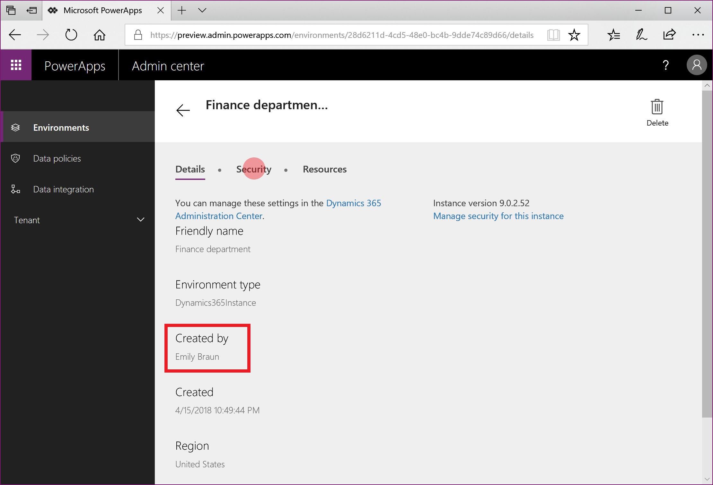
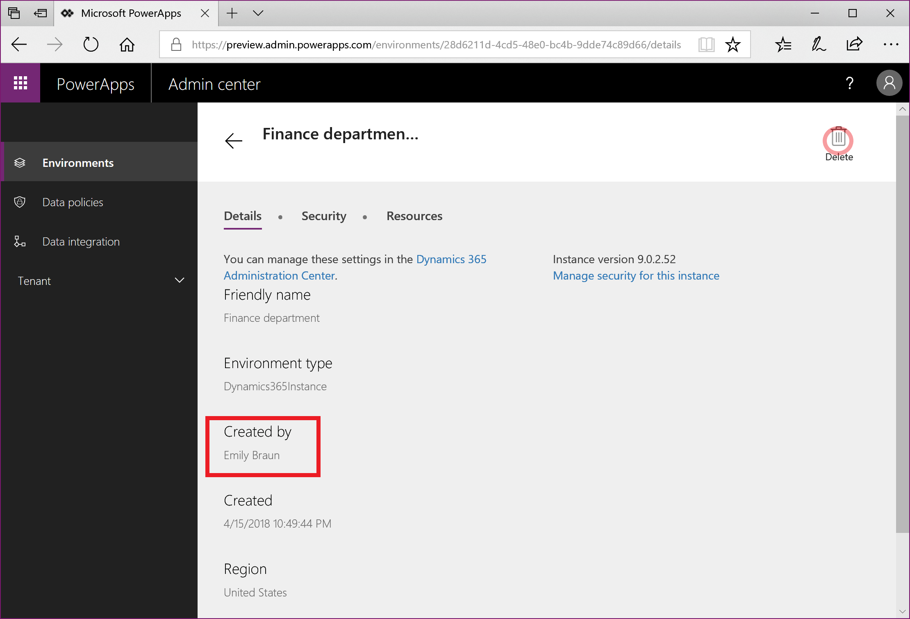

# Responding to Delete Data Subject Rights (DSR) Requests for PowerApps Customer Data

The “right to erasure” by the removal of personal data from an organization’s Customer Data is a key protection in the GDPR. Removing personal data includes removing all personal data and system-generated logs, except audit log information.

PowerApps allows users to build line-of-business applications that are a critical part of your organization’s day-to-day operations, so when a user leaves your organization you will need to manually review and determine whether or not to delete certain data and resources that they have created.   There is other personal data that will be automatically deleted whenever the user’s account deleted from Azure Active Directory.

Here is the breakdown between which personal data will be automatically deleted and which data will require your manual review and deletion:

Requires manual review and deletion |	Automatically deleted when the user is deleted from Azure Active Directory.
--- | ---
Environment** | Gateway
Environment permissions*** | Gateway permissions
Canvas App** | PowerApps notifications
Canvas App permissions | PowerApps user settings
Connection** | PowerApps user-app settings
Connection permissions |
Custom connector** |
Custom connector permissions |  

> ** Each of these resources contain “Created By” and “Modified By” records that include personal data. For security reasons, these records will be retained until the resource is deleted.

> *** For environments that include a Common Data Service For Apps database, environment permissions (e.g. which users are assigned to the Environment Maker and Admin roles?) stored as records in the Common Data Service database. Please see [Executing DSRs against Common Data Service Customer Data](https://go.microsoft.com/fwlink/?linkid=872251), for guidance on how to respond to DSRs for users that use the Common Data Service.

For the data and resources that requires manual review, PowerApps offers the following experiences to reassign (if necessary) or delete personal data for a specific user:

1.	Website access: [PowerApps maker portal](https://web.powerapps.com), [PowerApps Admin Center](https://admin.powerapps.com/), and [Office 365 Service Trust Portal](https://servicetrust.microsoft.com/)

2.	PowerShell access: PowerApps cmdlets ([Maker cmdlets](https://go.microsoft.com/fwlink/?linkid=871448) , [Admin cmdlets](https://go.microsoft.com/fwlink/?linkid=871804)) and [On-premise gateway cmdlets](https://go.microsoft.com/fwlink/?linkid=872238)
And here is the breakdown of which experiences are available to delete each type of resource that can contain personal data:

Resources containing personal data | Website access	| PowerShell access
--- | --- | ---
Environment	| PowerApps Admin Center | 	PowerApps cmdlets
Environment permissions**	| PowerApps Admin Center | PowerApps cmdlets
Canvas App	| PowerApps Admin Center   PowerApps Maker Portal| PowerApps cmdlets
Canvas App permissions	| PowerApps Admin Center | PowerApps cmdlets
Connection | | Maker: Available   Admin: Under development
Connection permissions | | Maker: Available   Admin: Under development
Custom connector | | Maker: Available   Admin: Under development
Custom connector permissions | | Maker: Available   Admin: Under development

> ** With the introduction of the Common Data Service for Apps, if a database is created within the environment, environment permissions and model-driven app permissions are stored as records within the Common Data Service for Apps database instance. Please see [Executing DSRs against Common Data Service Customer Data](https://go.microsoft.com/fwlink/?linkid=872251), for guidance on how to respond to DSRs for users that use the Common Data Service.

## Prerequisites

### For users
Any user with a valid PowerApps license will be able to perform the user operations outlined in this document using the [PowerApps maker portal](https://web.powerapps.com) or [PowerApps Maker PowerShell cmdlets](https://go.microsoft.com/fwlink/?linkid=871448).

### For admins
In order to perform the administration operations outlined in this document using the [PowerApps Admin Center](https://admin.powerapps.com/), Microsoft Flow Admin Center, or [PowerApps Admin PowerShell cdmlets](https://go.microsoft.com/fwlink/?linkid=871804), you will need an account with the following permissions:

1.	A paid PowerApps Plan 2 license, or a PowerApps Plan 2 trial license. You can sign-up for a 30d trial license here – [http://web.powerapps.com/trial](http://web.powerapps.com/trial), trial licenses can be renewed if they have expired.

2.	[Office 365 Global Administrator](https://support.office.com/article/assign-admin-roles-in-office-365-for-business-eac4d046-1afd-4f1a-85fc-8219c79e1504) or [Azure Active Directory Global Administrator](https://docs.microsoft.com/azure/active-directory/active-directory-assign-admin-roles-azure-portal)  privileges are also required if you need to search through another user’s resources, otherwise you will only have access to those environments and environment resources where you have Environment Admin privileges.

## Step #1: Delete or reassign all environments created by the user
As an admin you have two decisions to make when processing a DSR delete request for a user for each of the environments that has been created by the user:

1.	If you determine that the environment is not being used by anyone else in your organization then you can choose to delete the environment

2.	If you determine that the environment is still required, then you can choose to not delete the environment and add yourself (or another user in your organization) as an Environment Admin.
> **Important**: Deleting an environment will permanently delete all resources within the environment, including all apps, flows, connections, etc., so please review the contents of an environment before deletion.

### Give access to a user’s environments from the PowerApps Admin Center
An admin can grant Admin access to an environment created by a specific user from the [PowerApps Admin Center](https://admin.powerapps.com/) via the following steps:

1.	From the [PowerApps Admin Center](https://admin.powerapps.com/), select each environment in your organization.

  

2.	 If the environment was created by the user from the DSR request, then select **Security** and proceed with the steps outlined in the Administer Environments article to given admin privileges to yourself or another user in your organization.

  

### Delete environments created by a user from the PowerApps Admin Center
An admin can review and delete environments created by a specific user from the [PowerApps Admin Center](https://admin.powerapps.com/) via the following steps:
1.	From the [PowerApps Admin Center](https://admin.powerapps.com/), select each environment in your organization.

  

2.	 If the environment was created by the user from the DSR request, then select **Delete** and proceed with the steps to delete the environment:

  

### Give access to a user’s environments using the PowerApps Admin PowerShell cmdlets
An admin can assign themselves (or another user within their organization) access to all environments created by a user via the **Set-AdminEnvironmentRoleAssignment** function in the [PowerApps Admin PowerShell cdmlets](https://go.microsoft.com/fwlink/?linkid=871804):

~~~~
Add-PowerAppsAccount
$deleteDsrUserId = "0ecb1fcc-6782-4e46-a4c4-738c1d3accea"
$myUserId = $global:currentSession.UserId

#Assign yourself as an admin to each environment created by the user
Get-AdminEnvironment -CreatedBy $deleteDsrUserId | Set-AdminEnvironmentRoleAssignment -RoleName EnvironmentAdmin -PrincipalType User -PrincipalObjectId $myUserId

#Retrieve the environment role assignments to confirm
Get-AdminEnvironment -CreatedBy $deleteDsrUserId | Get-AdminEnvironmentRoleAssignment
~~~~

> **Important**: This function only works for environments that do not have a Common Data Service For Apps database instance.  

### Delete environments created by a user using the PowerApps Admin PowerShell cmdlets
 An admin can delete all environments created by a user via the **Remove-AdminEnvironment** function in the [PowerApps Admin PowerShell cdmlets](https://go.microsoft.com/fwlink/?linkid=871804):

~~~~
Add-PowerAppsAccount
$deleteDsrUserId = "0ecb1fcc-6782-4e46-a4c4-738c1d3accea"

# Retrieve all environments created by the user and then delete them
Get-AdminEnvironment -CreatedBy $deleteDsrUserId | Remove-AdminEnvironment
~~~~

## Step #2: Delete the user’s permissions to all other environments
Users can be assigned permissions (such as Environment Admin, Environment Maker, etc.) in an environment, which is stored in the PowerApps service as a “role assignment.”
With the introduction of the Common Data Service for Apps, if a database is created within the environment, these “role assignments” are stored as records within the Common Data Service for Apps database instance.
For more information see the Administer environments article.

### For environments without a Common Data Service for Apps database

#### PowerApps Admin Center
An admin can delete a user’s environment permissions starting from the [PowerApps Admin Center](https://admin.powerapps.com/) via the following steps:

1.	From the [PowerApps Admin Center](https://admin.powerapps.com/), select each environment in your organization.  You must be an [Office 365 Global Administrator](https://support.office.com/article/assign-admin-roles-in-office-365-for-business-eac4d046-1afd-4f1a-85fc-8219c79e1504) or [Azure Active Directory Global Administrator](https://docs.microsoft.com/azure/active-directory/active-directory-assign-admin-roles-azure-portal)  to be able to review all environments that have been created within your organization.

  

2.	Select **Security**

3.	If your environment does not have a CDS For Apps database, you will see a section for **Environment Roles.**

4.	Within **Environment Roles**, select both **Environment Admin** and **Environment Maker** separately, and using the search bar, search for the user’s name.

  

5.	If the user has access to either role, from within the **Users** screen, remove their permission and select **Save**.

#### PowerApps Admin PowerShell cmdlets
An admin can delete all environment role assignments for a user across all environments without a Common Data Service for Apps database via the **Remove-AdminEnvironmentRoleAssignment** function in the [PowerApps Admin PowerShell cdmlets](https://go.microsoft.com/fwlink/?linkid=871804):

~~~~
Add-PowerAppsAccount
$deleteDsrUserId = "0ecb1fcc-6782-4e46-a4c4-738c1d3accea"

#find all environment role assignments for the user for environments without a CDS for Apps instance and delete them
Get-AdminEnvironmentRoleAssignment -UserId $deleteDsrUserId | Remove-AdminEnvironmentRoleAssignment
~~~~

> **Important**: This function only works for environments that do not have a Common Data Service For Apps database instance.  

### For environments WITH a Common Data Service for Apps database
With the introduction of the Common Data Service for Apps, if a database is created within the environment, these “role assignments” are stored as records within the Common Data Service for Apps database instance.
Please refer to the following documentation on how to remove personal data from a Common Data Service for Apps database instance: Common Data Service User personal data removal

## Step #3: Delete or reassign all canvas apps owned by a user

### Reassign a user’s canvas apps using the PowerApps Admin PowerShell cmdlets
If an admin decides not to delete a user’s canvas apps, they can reassign the apps owned by a user via the **Set-AdminAppOwner** function in the [PowerApps Admin PowerShell cdmlets](https://go.microsoft.com/fwlink/?linkid=871804):

~~~~
Add-PowerAppsAccount
$deleteDsrUserId = "0ecb1fcc-6782-4e46-a4c4-738c1d3accea"
$newAppOwnerUserId = "72c272b8-14c3-4f7a-95f7-a76f65c9ccd8"

#find all apps owned by the DSR user and assigns them a new owner
Get-AdminApp -Owner $deleteDsrUserId | Set-AdminAppOwner -AppOwner $newAppOwnerUserId
~~~~

### Delete a canvas app using the PowerApps Maker Portal
A user can delete an app from the [PowerApps maker portal](https://web.powerapps.com). For the full steps on how to delete an app, please see deleting an app.

### Delete a user’s canvas app using the PowerApps Admin Center
An admin can delete apps created by a user starting from the [PowerApps Admin Center](https://admin.powerapps.com/) via the following steps:

1.	From the [PowerApps Admin Center](https://admin.powerapps.com/), select each environment in your organization.  You must be a [Office 365 Global Administrator](https://support.office.com/article/assign-admin-roles-in-office-365-for-business-eac4d046-1afd-4f1a-85fc-8219c79e1504) or [Azure Active Directory Global Administrator](https://docs.microsoft.com/azure/active-directory/active-directory-assign-admin-roles-azure-portal)  to be able to review all environments that have been created within your organization.

  

2.	Select **Resources** then **Apps**

3.	Using the search bar, search for the user’s name, which will bring-up any apps that have been created by that user within this environment:

  

4.	 Select **Details** for each of the apps owned by the user:

  

5.	Select **Delete** to delete each app:

### Delete a user’s canvas apps using the PowerApps Admin PowerShell cmdlets
If an admin decides to delete all canvas apps owned by a user, they can do so using the **Remove-AdminApp** function in the [PowerApps Admin PowerShell cdmlets](https://go.microsoft.com/fwlink/?linkid=871804):

~~~~
Add-PowerAppsAccount
$deleteDsrUserId = "0ecb1fcc-6782-4e46-a4c4-738c1d3accea"

#find all apps owned by the DSR user and deletes them
Get-AdminApp -Owner "0ecb1fcc-6782-4e46-a4c4-738c1d3accea" | Remove-AdminApp
~~~~

## Step #4: Delete the user’s permissions to canvas apps
Whenever an app is shared with a user, PowerApps stores a record called a “role assignment” that describes the user’s permissions (CanEdit or CanUser) to the application. For more information see the Share an app article.

>**NOTE**: an app’s role assignments will be deleted when the app is deleted.

>**NOTE**: the app owner's role assignment can only be deleted by assigning a new owner for the app.

### PowerApps Admin Center
An admin can delete app role assignments for a user starting from the [PowerApps Admin Center](https://admin.powerapps.com/) via the following steps:

1.	From the [PowerApps Admin Center](https://admin.powerapps.com/), select each environment in your organization.  You must be an [Office 365 Global Administrator](https://support.office.com/article/assign-admin-roles-in-office-365-for-business-eac4d046-1afd-4f1a-85fc-8219c79e1504) or [Azure Active Directory Global Administrator](https://docs.microsoft.com/azure/active-directory/active-directory-assign-admin-roles-azure-portal) to be able to review all environments that have been created within your organization.

  

2.	For each environment select **Resources** then **Apps**

3.	 Select **Share** for each of the apps in the environment:

  

6.	 If the user has access to the app, from within the app’s **Share** screen, remove their permission and select **Save**.

  

### PowerApps Admin PowerShell cmdlets
An admin can delete all of user’s canvas app role assignments by using the **Remove-AdminAppRoleAssignmnet** function in the [PowerApps Admin PowerShell cdmlets](https://go.microsoft.com/fwlink/?linkid=871804):

~~~~
Add-PowerAppsAccount
$deleteDsrUserId = "0ecb1fcc-6782-4e46-a4c4-738c1d3accea"

#find all app role assignments for the DSR user and deletes them
Get-AdminAppRoleAssignment -UserId $deleteDsrUserId | Remove-AdminAppRoleAssignment
~~~~

## Step #5: Delete connections created by a user
Connections are used in conjunction with connectors when establishing connectivity with other APIs and SaaS systems.  Connections do include references to the user who created them and as a result, can be deleted to remove any references to the user.

### PowerApps Maker PowerShell cmdlets
A user can delete all of their connections the Remove-Connection function in the [PowerApps Maker PowerShell cmdlets](https://go.microsoft.com/fwlink/?linkid=871448):

~~~~
Add-PowerAppsAccount

#Retrieves all connections for the calling user and deletes them
Get-Connection | Remove-Connection
~~~~

### PowerApps Admin PowerShell cmdlets
The function to allow an admin to find and delete a user’s connections using the [PowerApps Admin PowerShell cdmlets](https://go.microsoft.com/fwlink/?linkid=871804) is under development.

## Step #6: Delete the user’s permissions to shared connections

### PowerApps Maker PowerShell cmdlets
A user can delete all of their connection role assignments for shared connections Remove-ConnectionRoleAssignment function in the [PowerApps Maker PowerShell cmdlets](https://go.microsoft.com/fwlink/?linkid=871448):

~~~~
Add-PowerAppsAccount

#Retrieves all connection role assignments for the calling users and deletes them
Get-ConnectionRoleAssignment | Remove-ConnectionRoleAssignment
~~~~

>NOTE: Owner role assignments cannot be deleted without deleting the connection resource.

### PowerApps Admin PowerShell cmdlets
The function to allow an admin to find and delete a user’s connection role assignments using the [PowerApps Admin PowerShell cdmlets](https://go.microsoft.com/fwlink/?linkid=871804) is under development.

## Step #7: Delete custom connectors created by the user
Custom Connectors supplement the existing out of box connectors and allow for connectivity to other APIs, SaaS and custom-developed systems. You may want to transfer Custom Connector ownership to other users in the organization or delete the Custom Connector.

### PowerApps Maker PowerShell cmdlets
A user can delete all of their custom connectors the Remove-Connector function in the [PowerApps Maker PowerShell cmdlets](https://go.microsoft.com/fwlink/?linkid=871448):

~~~~
Add-PowerAppsAccount

#Retrieves all custom connectors	for the calling user and deletes them
Get-Connector -FilterNonCustomConnectors | Remove-Connector
~~~~

### PowerApps Admin PowerShell cmdlets
The function to allow an admin to find and delete a user’s custom connectors using the [PowerApps Admin PowerShell cdmlets](https://go.microsoft.com/fwlink/?linkid=871804) is under development.

## Step #8: Delete the user’s permissions to shared custom connectors

### PowerApps Maker PowerShell cmdlets
A user can delete all of their connector role assignments for shared custom connector with the Remove-ConnectorRoleAssignment function in the [PowerApps Maker PowerShell cmdlets](https://go.microsoft.com/fwlink/?linkid=871448):

~~~~
Add-PowerAppsAccount

#Retrieves all connector role assignments for the calling users and deletes them
Get-ConnectorRoleAssignment | Remove-ConnectorRoleAssignment
~~~~

>NOTE: Owner role assignments cannot be deleted without deleting the connection resource.

### PowerApps Admin PowerShell cmdlets
The function to allow an admin to find and delete a user’s connector role assignments using the [PowerApps Admin PowerShell cdmlets](https://go.microsoft.com/fwlink/?linkid=871804) is under development.

## Step #9: Delete the user’s personal data in Microsoft Flow
PowerApps licenses always include Microsoft Flow capabilities. In addition to being included in PowerApps licenses, Microsoft Flow is also available as a standalone service.
Please see [Executing DSRs against Microsoft Flow Customer Data](https://go.microsoft.com/fwlink/?linkid=872250), for guidance on how to respond to DSRs for users that use the Microsoft Flow service.
> **Important**:  It is recommended that admins complete this step for a PowerApps user

## Step #10: Delete the user’s personal data in Common Data Service (CDS) instances
Certain PowerApps licenses give the ability for users within your organization to create instances of the Common Data Service, and create and build apps on the Common Data Service, including the PowerApps Community Plan which is a free license that allows users to try out CDS in an individual environment. See the PowerApps Pricing page for which CDS capabilities are included in each PowerApps license.

Please see [Executing DSRs against Common Data Service Customer Data](https://go.microsoft.com/fwlink/?linkid=872251), for guidance on how to respond to DSRs for users that use the Common Data Service.
> **Important**: It is recommended that admins complete this step for a PowerApps user

## Step #11: Delete the user from Azure Active Directory
Once the above steps have been complete the final step is to delete the user’s account for Azure Active Directory by following the steps outlined in the Azure Data Subject Request GDPR documentation that can be found on the [Office 365 Service Trust Portal](https://servicetrust.microsoft.com/ViewPage/GDPRDSR).

 
