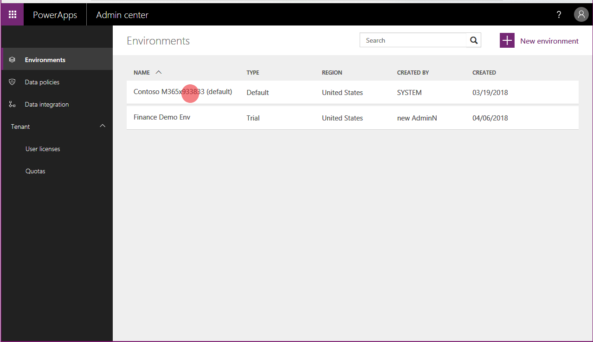
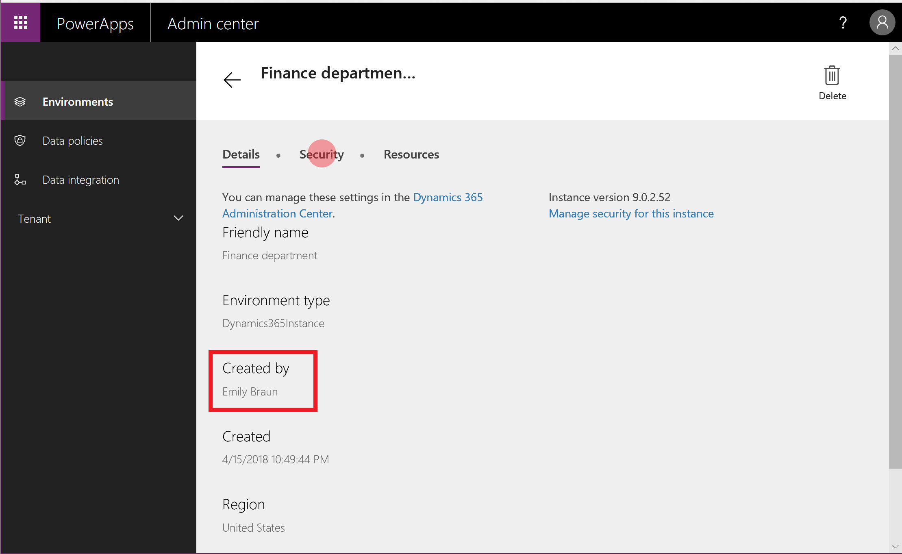
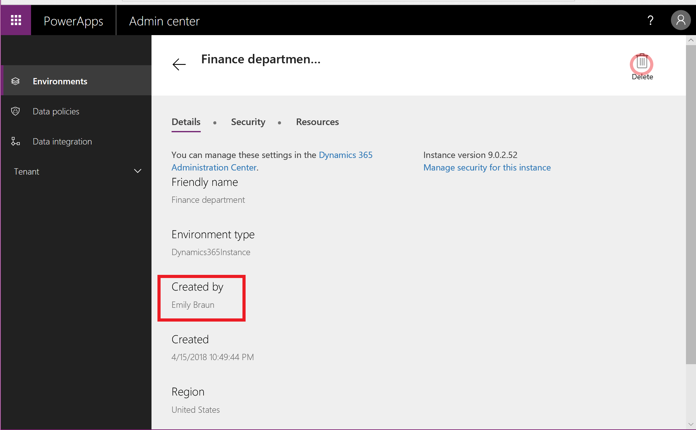
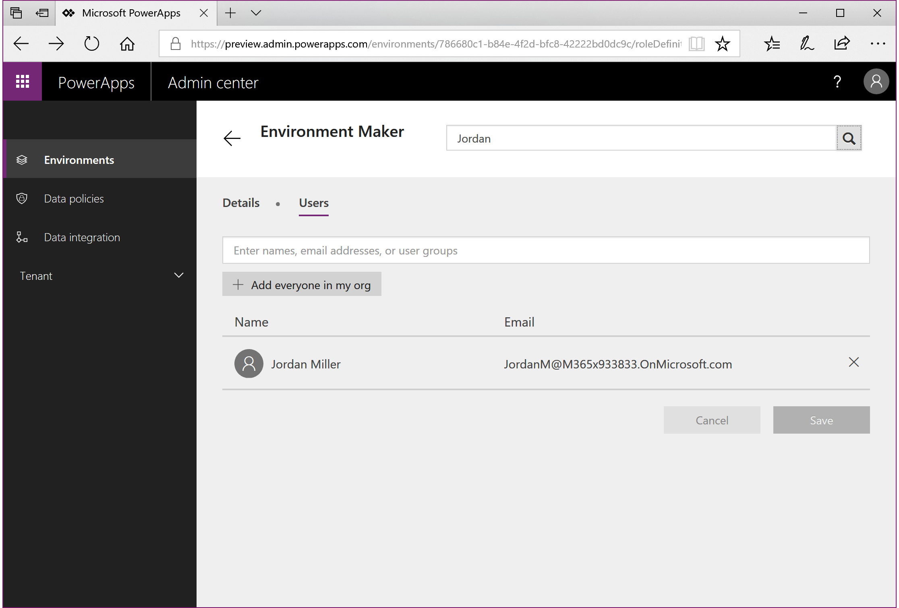
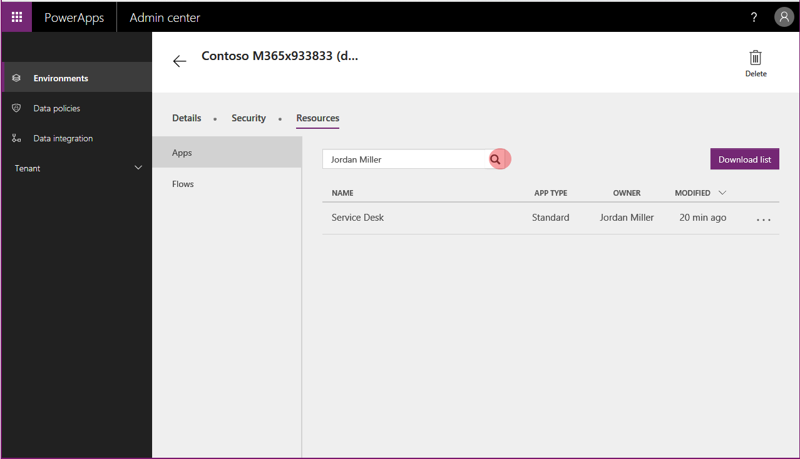
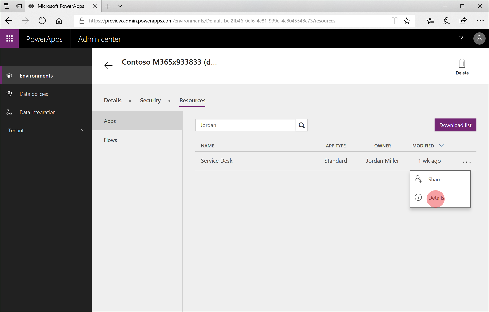
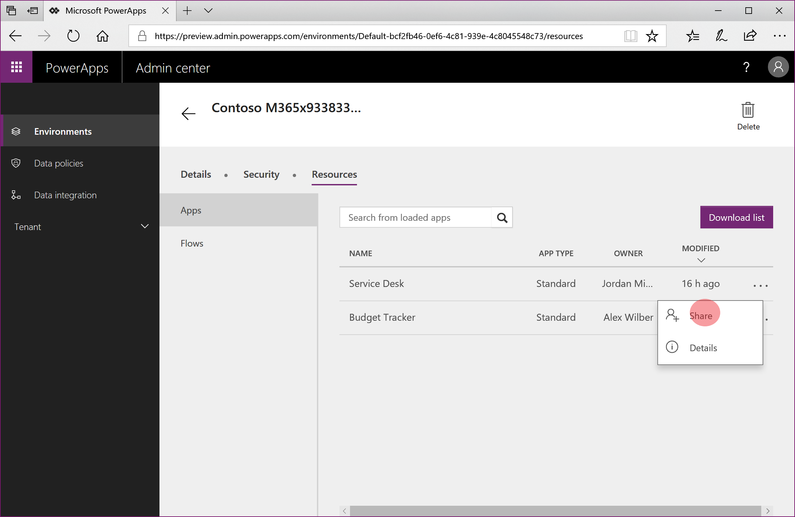
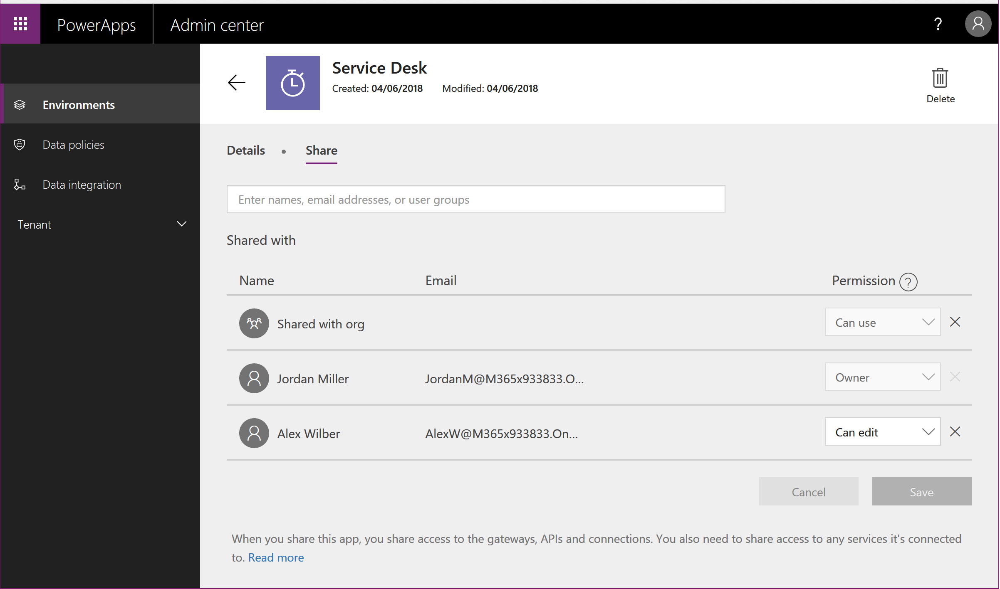

# Responding to Data Subject Rights (DSR) requests to delete PowerApps customer data

The “right to erasure” by the removal of personal data from an organization’s customer data is a key protection in the European Union (EU) General Data Protection Regulation (GDPR). Removing personal data includes removing system-generated logs but not audit log information.

PowerApps allows users to build line-of-business applications that are a critical part of your organization’s day-to-day operations. When a user leaves your organization, you'll need to manually review and determine whether to delete certain data and resources that the user created. Other personal data will be automatically deleted whenever the user’s account is deleted from Azure Active Directory.

Here is the breakdown between which personal data will be automatically deleted and which data will require your manual review and deletion:

Requires manual review and deletion |	Automatically deleted when the user is deleted from Azure Active Directory
--- | ---
Environment\** | Gateway
Environment permissions\*** | Gateway permissions
Canvas app\** | PowerApps notifications
Canvas-app permissions | PowerApps user settings
Connection\** | PowerApps user-app settings
Connection permissions |
Custom connector\** |
Custom-connector permissions |  

\** Each of these resources contains “Created By” and “Modified By” records that include personal data. For security reasons, these records will be retained until the resource is deleted.

\*** For environments that include a Common Data Service (CDS) for Apps database, environment permissions (that is, which users are assigned to the Environment Maker and Admin roles) are stored as records in that database. For guidance on how to respond to DSRs for users of CDS for Apps, see [Responding to Data Subject Rights (DSR) requests for Common Data Service for Apps customer data](common-data-service-gdpr-dsr-guide.md).

For the data and resources that require manual review, PowerApps offers the following experiences to reassign (if necessary) or delete personal data for a specific user:

* Website access: [PowerApps site](https://web.powerapps.com), [PowerApps Admin center](https://admin.powerapps.com/), and [Office 365 Service Trust Portal](https://servicetrust.microsoft.com/)

* PowerShell access: PowerApps cmdlets for [app creators](https://go.microsoft.com/fwlink/?linkid=871448) and [administrators](https://go.microsoft.com/fwlink/?linkid=871804) and cmdlets for [on-premises gateways](https://go.microsoft.com/fwlink/?linkid=872238).

Here is the breakdown of which experiences are available to delete each type of resource that can contain personal data:

Resources containing personal data | Website access	| PowerShell access
--- | --- | ---
Environment	| PowerApps Admin center | 	PowerApps cmdlets
Environment permissions**	| PowerApps Admin center | PowerApps cmdlets
Canvas app	| PowerApps Admin center <br> PowerApps| PowerApps cmdlets
Canvas-app permissions	| PowerApps Admin center | PowerApps cmdlets
Connection | | App creator: Available <br> Admin: Available
Connection permissions | | App creator: Available <br> Admin: Available
Custom connector | | App creator: Available <br> Admin: Available
Custom-connector permissions | | App creator: Available <br> Admin: Available

\** With the introduction of CDS for Apps, if a database is created within the environment, environment permissions and model-driven app permissions are stored as records within the instance of that database. For guidance on how to respond to DSRs for users of CDS for Apps, see [Responding to Data Subject Rights (DSR) requests for Common Data Service for Apps customer data](common-data-service-gdpr-dsr-guide.md).

## Prerequisites

### For users
Any user with a valid PowerApps license can perform the user operations outlined in this document using the [PowerApps](https://web.powerapps.com) or [PowerShell cmdlets for app creators](https://go.microsoft.com/fwlink/?linkid=871448).

### For administrators
To perform the administrative operations outlined in this document using the [PowerApps Admin center](https://admin.powerapps.com/), Microsoft Flow admin center, or [PowerShell cmdlets for PowerApps administrators](https://go.microsoft.com/fwlink/?linkid=871804), you'll need the following:

* A paid PowerApps Plan 2 license or a PowerApps Plan 2 trial license. You can sign-up for a 30-day trial license at [http://web.powerapps.com/trial](http://web.powerapps.com/trial). Trial licenses can be renewed if they've expired.

* [Office 365 Global Administrator](https://support.office.com/article/assign-admin-roles-in-office-365-for-business-eac4d046-1afd-4f1a-85fc-8219c79e1504) or [Azure Active Directory Global Administrator](https://docs.microsoft.com/azure/active-directory/active-directory-assign-admin-roles-azure-portal) permissions if you need to search through another user’s resources. (Note that Environment Admins only have access to those environments and environment resources for which they have permissions.)

## Step 1: Delete or reassign all environments created by the user
As an administrator, you have two decisions to make when processing a DSR delete request for each environment that the user created:

1. If you determine that the environment is not being used by anyone else in your organization, you can choose to delete the environment.

2. If you determine that the environment is still required, you can choose not to delete the environment and add yourself (or another user in your organization) as an Environment Admin.

> [!IMPORTANT]
> Deleting an environment will permanently delete all resources within the environment, including all apps, flows, connections, etc. So please review the contents of an environment before deletion.

### Give access to a user’s environments from the PowerApps admin center
An admin can grant administrative access to an environment created by a specific user from the [PowerApps admin center](https://admin.powerapps.com/) by following these steps:

1. From the [PowerApps admin center](https://admin.powerapps.com/), select each environment in your organization.

    

2. If the environment was created by the user from the DSR request, select **Security**, and proceed with the steps outlined in [Administer environments](environments-administration.md) to give admin privileges to yourself or another user in your organization.

    

### Delete environments created by a user from the PowerApps admin center
An admin can review and delete environments created by a specific user from the [PowerApps admin center](https://admin.powerapps.com/) by following these steps:

1. From the [PowerApps admin center](https://admin.powerapps.com/), select each environment in your organization.

    

2. If the environment was created by the user from the DSR request, select **Delete** and then proceed with the steps to delete the environment:

    

### Give access to a user’s environments using PowerShell
An administrator can assign themselves (or another user within their organization) access to all environments created by a user by using the **Set-AdminEnvironmentRoleAssignment** function in the [PowerShell cmdlets for PowerApps administrators](https://go.microsoft.com/fwlink/?linkid=871804):

```
Add-PowerAppsAccount
$deleteDsrUserId = "0ecb1fcc-6782-4e46-a4c4-738c1d3accea"
$myUserId = $global:currentSession.UserId

#Assign yourself as an admin to each environment created by the user
Get-AdminEnvironment -CreatedBy $deleteDsrUserId | Set-AdminEnvironmentRoleAssignment -RoleName EnvironmentAdmin -PrincipalType User -PrincipalObjectId $myUserId

#Retrieve the environment role assignments to confirm
Get-AdminEnvironment -CreatedBy $deleteDsrUserId | Get-AdminEnvironmentRoleAssignment
```

> [!IMPORTANT]
> This function works only in environments that do not have an instance of a database in CDS for Apps.

### Delete environments created by a user using PowerShell
 An administrator can delete all environments created by a user by using the **Remove-AdminEnvironment** function in the [PowerShell cmdlets for PowerApps administrators](https://go.microsoft.com/fwlink/?linkid=871804):

```
Add-PowerAppsAccount
$deleteDsrUserId = "0ecb1fcc-6782-4e46-a4c4-738c1d3accea"

# Retrieve all environments created by the user and then delete them
Get-AdminEnvironment -CreatedBy $deleteDsrUserId | Remove-AdminEnvironment
```

## Step 2: Delete the user’s permissions to all other environments
Users can be assigned permissions (such as Environment Admin and Environment Maker) in an environment, which are stored in the PowerApps service as a “role assignment.”
With the introduction of CDS for Apps, if a database is created within the environment, these “role assignments” are stored as records within the instance of that database.
For more information, see [Administer environments](environments-administration.md).

### For environments without a CDS for Apps database

#### PowerApps Admin center
An administrator can delete a user’s environment permissions starting from the [PowerApps Admin center](https://admin.powerapps.com/) by following these steps:

1. From the [PowerApps Admin center](https://admin.powerapps.com/), select each environment in your organization.

    You must be an [Office 365 Global Administrator](https://support.office.com/article/assign-admin-roles-in-office-365-for-business-eac4d046-1afd-4f1a-85fc-8219c79e1504) or [Azure Active Directory Global Administrator](https://docs.microsoft.com/azure/active-directory/active-directory-assign-admin-roles-azure-portal) to be able to review all environments that have been created within your organization.

    

2. Select **Security**.

    If your environment does not have a CDS for Apps database, you will see a section for **Environment Roles.**

3. Within **Environment Roles**, select both **Environment Admin** and **Environment Maker** separately and, using the search bar, search for the user’s name.

    

5.	If the user has access to either role, from within the **Users** screen, remove their permission, and select **Save**.

#### PowerShell
An administrator can delete all environment role assignments for a user across all environments without a CDS for Apps database by using the **Remove-AdminEnvironmentRoleAssignment** function in the [PowerShell cmdlets for PowerApps administrators](https://go.microsoft.com/fwlink/?linkid=871804):

```
Add-PowerAppsAccount
$deleteDsrUserId = "0ecb1fcc-6782-4e46-a4c4-738c1d3accea"

#find all environment role assignments for the user for environments without a CDS for Apps instance and delete them
Get-AdminEnvironmentRoleAssignment -UserId $deleteDsrUserId | Remove-AdminEnvironmentRoleAssignment
```

> [!IMPORTANT]
> This function works only for environments that do not have an instance of a CDS for Apps database.

### For environments WITH a CDS for Apps database
With the introduction of the CDS for Apps, if a database is created within the environment, these “role assignments” are stored as records within the instance of that database. Please refer to the following documentation on how to remove personal data from an instance of a database in CDS for Apps: Common Data Service User personal data removal

## Step 3: Delete or reassign all canvas apps owned by a user

### Reassign a user’s canvas apps using the PowerApps Admin PowerShell cmdlets
If an admin decides not to delete a user’s canvas apps, they can reassign the apps owned by a user by using the **Set-AdminAppOwner** function in the [PowerApps Admin PowerShell cdmlets](https://go.microsoft.com/fwlink/?linkid=871804):

```
Add-PowerAppsAccount
$deleteDsrUserId = "0ecb1fcc-6782-4e46-a4c4-738c1d3accea"
$newAppOwnerUserId = "72c272b8-14c3-4f7a-95f7-a76f65c9ccd8"

#find all apps owned by the DSR user and assigns them a new owner
Get-AdminApp -Owner $deleteDsrUserId | Set-AdminAppOwner -AppOwner $newAppOwnerUserId
```

### Delete a user’s canvas app using the PowerApps site
A user can delete an app from the [PowerApps site](https://web.powerapps.com). For the full steps on how to delete an app, please see deleting an app.

### Delete a user’s canvas app using the PowerApps Admin center
An admin can delete apps created by a user starting from the [PowerApps Admin center](https://admin.powerapps.com/) by following these steps:

1. From the [PowerApps Admin center](https://admin.powerapps.com/), select each environment in your organization.

    You must be a [Office 365 Global Administrator](https://support.office.com/article/assign-admin-roles-in-office-365-for-business-eac4d046-1afd-4f1a-85fc-8219c79e1504) or [Azure Active Directory Global Administrator](https://docs.microsoft.com/azure/active-directory/active-directory-assign-admin-roles-azure-portal)  to be able to review all environments that have been created within your organization.

    

2. Select **Resources** > **Apps**.

3. Using the search bar, search for the user’s name, which will bring up any apps that have been created by that user within this environment:

    

4. Select **Details** for each of the apps owned by the user:

    

5. Select **Delete** to delete each app:

### Delete a user’s canvas app using the PowerApps Admin PowerShell cmdlets
If an admin decides to delete all canvas apps owned by a user, they can do so using the **Remove-AdminApp** function in the [PowerApps Admin PowerShell cmdlets](https://go.microsoft.com/fwlink/?linkid=871804):

```
Add-PowerAppsAccount
$deleteDsrUserId = "0ecb1fcc-6782-4e46-a4c4-738c1d3accea"

#find all apps owned by the DSR user and deletes them
Get-AdminApp -Owner "0ecb1fcc-6782-4e46-a4c4-738c1d3accea" | Remove-AdminApp
```

## Step 4: Delete the user’s permissions to canvas apps
Whenever an app is shared with a user, PowerApps stores a record called a “role assignment” that describes the user’s permissions (CanEdit or CanUse) to the application. For more information, see the Share an app article.

> [!NOTE]
> An app’s role assignments will be deleted when the app is deleted.

> [!NOTE]
> The app owner's role assignment can only be deleted by assigning a new owner for the app.

### PowerApps Admin center
An admin can delete app-role assignments for a user starting from the [PowerApps Admin center](https://admin.powerapps.com/) by following these steps:

1. From the [PowerApps Admin center](https://admin.powerapps.com/), select each environment in your organization.

    You must be an [Office 365 Global Administrator](https://support.office.com/article/assign-admin-roles-in-office-365-for-business-eac4d046-1afd-4f1a-85fc-8219c79e1504) or [Azure Active Directory Global Administrator](https://docs.microsoft.com/azure/active-directory/active-directory-assign-admin-roles-azure-portal) to be able to review all environments that have been created within your organization.

    

2. For each environment select **Resources** > **Apps**.

3. Select **Share** for each of the apps in the environment:

    

4. If the user has access to the app, from within the app’s **Share** screen, remove their permission and select **Save**.

    

### PowerShell cmdlets for admins
An admin can delete all of a user’s canvas-app role assignments by using the **Remove-AdminAppRoleAssignmnet** function in the [PowerApps Admin PowerShell cmdlets](https://go.microsoft.com/fwlink/?linkid=871804):

```
Add-PowerAppsAccount
$deleteDsrUserId = "0ecb1fcc-6782-4e46-a4c4-738c1d3accea"

#find all app role assignments for the DSR user and deletes them
Get-AdminAppRoleAssignment -UserId $deleteDsrUserId | Remove-AdminAppRoleAssignment
```

## Step 5: Delete connections created by a user
Connections are used in conjunction with connectors when establishing connectivity with other APIs and SaaS systems.  Connections do include references to the user who created them and, as a result, can be deleted to remove any references to the user.

### PowerShell cmdlets for app creators
A user can delete all of their connections by using the Remove-Connection function in the [PowerShell cmdlets for app creators](https://go.microsoft.com/fwlink/?linkid=871448):

```
Add-PowerAppsAccount

#Retrieves all connections for the calling user and deletes them
Get-Connection | Remove-Connection
```

### PowerShell cmdlets for PowerApps administrators
An admin can delete all of a user’s connections by using the **Remove-AdminConnection** function in the [PowerApps Admin PowerShell cmdlets](https://go.microsoft.com/fwlink/?linkid=871804):

```
Add-PowerAppsAccount
$deleteDsrUserId = "0ecb1fcc-6782-4e46-a4c4-738c1d3accea"

#Retrieves all connections for the DSR user and deletes them
Get-AdminConnection -CreatedBy $deleteDsrUserId | Remove-AdminConnection
```

## Step 6: Delete the user’s permissions to shared connections

### PowerShell cmdlets for app creators
A user can delete all of their connection role assignments for shared connections by using the Remove-ConnectionRoleAssignment function in the [PowerShell cmdlets for app creators](https://go.microsoft.com/fwlink/?linkid=871448):

```
Add-PowerAppsAccount

#Retrieves all connection role assignments for the calling users and deletes them
Get-ConnectionRoleAssignment | Remove-ConnectionRoleAssignment
```
> [!NOTE]
> Owner role assignments cannot be deleted without deleting the connection resource.

### PowerShell cmdlets for admins
An admin can delete all of a user’s connection role assignments by using the **Remove-AdminConnectionRoleAssignment** function in the [PowerApps Admin PowerShell cmdlets](https://go.microsoft.com/fwlink/?linkid=871804):

```
Add-PowerAppsAccount
$deleteDsrUserId = "0ecb1fcc-6782-4e46-a4c4-738c1d3accea"

#Retrieves all connection role assignments for the DSR user and deletes them
Get-AdminConnectionRoleAssignment -PrincipalObjectId $deleteDsrUserId | Remove-AdminConnectionRoleAssignment
```

## Step 7: Delete custom connectors created by the user
Custom Connectors supplement the existing out of box connectors and allow for connectivity to other APIs, SaaS and custom-developed systems. You may want to transfer Custom Connector ownership to other users in the organization or delete the Custom Connector.

### PowerShell cmdlets for app creators
A user can delete all of their custom connectors by using the Remove-Connector function in the [PowerShell cmdlets for app creators](https://go.microsoft.com/fwlink/?linkid=871448):

```
Add-PowerAppsAccount

#Retrieves all custom connectors for the calling user and deletes them
Get-Connector -FilterNonCustomConnectors | Remove-Connector
```

### PowerShell cmdlets for admins
An admin can delete all custom connectors created by a user using the **Remove-AdminConnector** function in the [PowerApps Admin PowerShell cmdlets](https://go.microsoft.com/fwlink/?linkid=871804):

```
Add-PowerAppsAccount
$deleteDsrUserId = "0ecb1fcc-6782-4e46-a4c4-738c1d3accea"

#Retrieves all custom connectors created by the DSR user and deletes them
Get-AdminConnector -CreatedBy $deleteDsrUserId | Remove-AdminConnector
```

## Step 8: Delete the user’s permissions to shared custom connectors

### PowerShell cmdlets for app creators
A user can delete all of their connector role assignments for shared custom connectors with the Remove-ConnectorRoleAssignment function in the [PowerShell cmdlets for app creators](https://go.microsoft.com/fwlink/?linkid=871448):

```
Add-PowerAppsAccount

#Retrieves all connector role assignments for the calling users and deletes them
Get-ConnectorRoleAssignment | Remove-ConnectorRoleAssignment
```

> [!NOTE]
> Owner role assignments cannot be deleted without deleting the connection resource.

### PowerShell cmdlets for admins
An admin can delete all custom connector role assignments for a user using the **Remove-AdminConnectorRoleAssignment** function in the [PowerApps Admin PowerShell cmdlets](https://go.microsoft.com/fwlink/?linkid=871804):

```
Add-PowerAppsAccount
$deleteDsrUserId = "0ecb1fcc-6782-4e46-a4c4-738c1d3accea"

#Retrieves all custom connector role assignments for the DSR user and deletes them
Get-AdminConnectorRoleAssignment -PrincipalObjectId $deleteDsrUserId | Remove-AdminConnectorRoleAssignment
```

## Step 9: Delete the user’s personal data in Microsoft Flow
PowerApps licenses always include Microsoft Flow capabilities. In addition to being included in PowerApps licenses, Microsoft Flow is also available as a standalone service. For guidance on how to respond to DSRs for users who use the Microsoft Flow service, see [Responding to GDPR Data Subject Requests for Microsoft Flow](https://go.microsoft.com/fwlink/?linkid=872250).

> [!IMPORTANT]
> It is recommended that admins complete this step for a PowerApps user.

## Step 10: Delete the user’s personal data in instances of CDS for Apps
Certain PowerApps licenses, including the PowerApps Community Plan, give the ability for users within your organization to create instances of CDS for Apps and to create and build apps on CDS for Apps. The PowerApps Community Plan is a free license that allows users to try out CDS for Apps in an individual environment. See the PowerApps pricing page for which capabilities are included in each PowerApps license.

For guidance on how to respond to DSRs for users who use CDS for Apps, see [Responding to Data Subject Rights (DSR) requests for Common Data Service for Apps customer data](common-data-service-gdpr-dsr-guide.md).

> [!IMPORTANT]
> It is recommended that admins complete this step for a PowerApps user.

## Step 11: Delete the user from Azure Active Directory
Once the above steps have been complete the final step is to delete the user’s account for Azure Active Directory by following the steps outlined in the Azure Data Subject Request GDPR documentation that can be found on the [Office 365 Service Trust Portal](https://servicetrust.microsoft.com/ViewPage/GDPRDSR).
