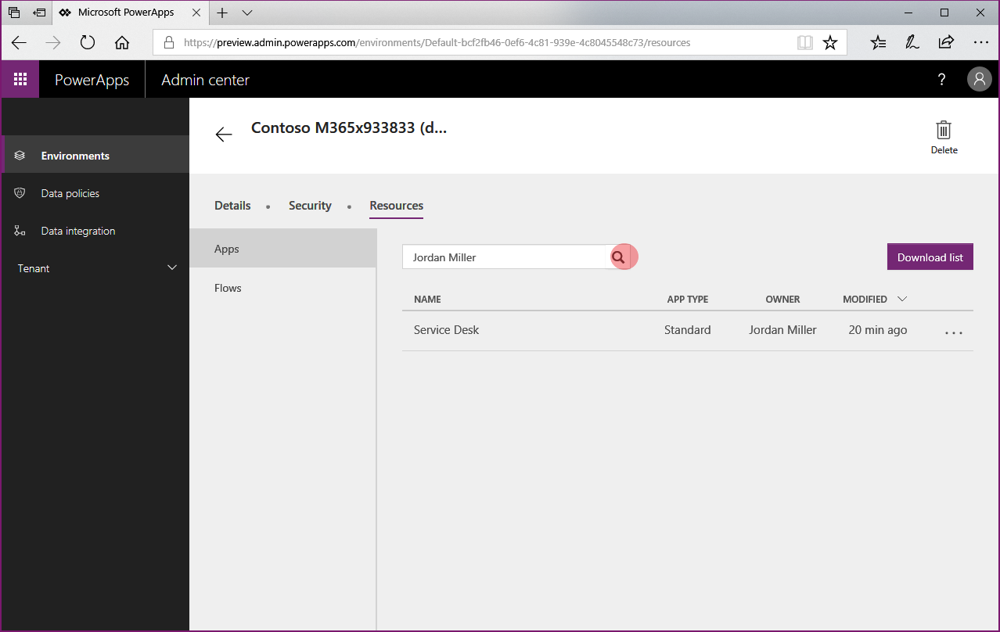
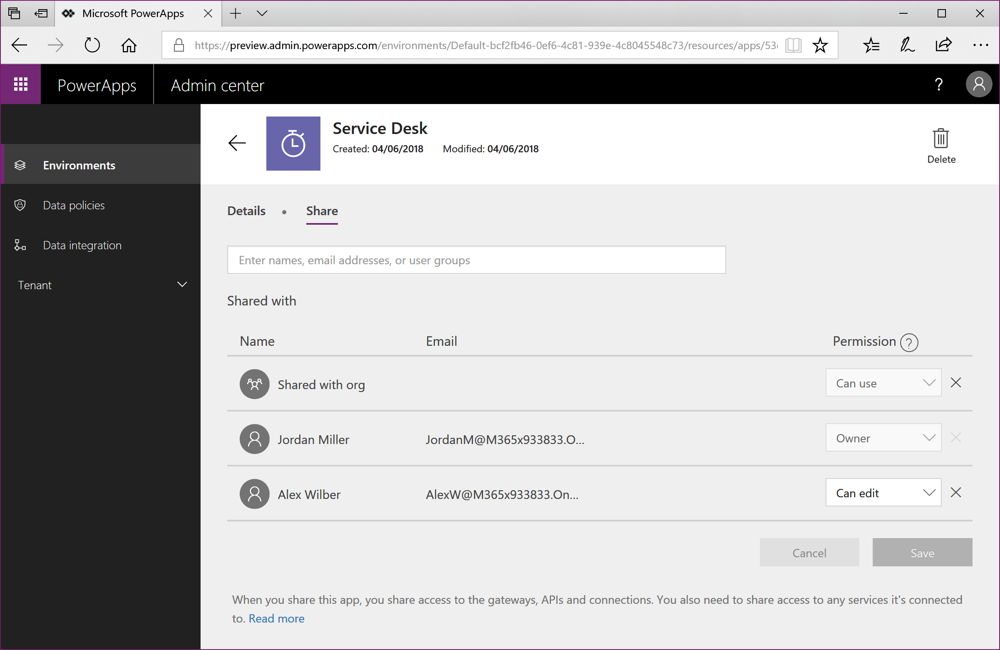
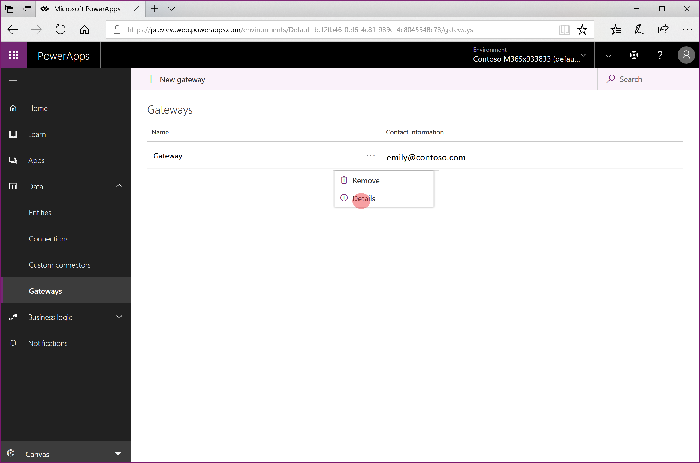
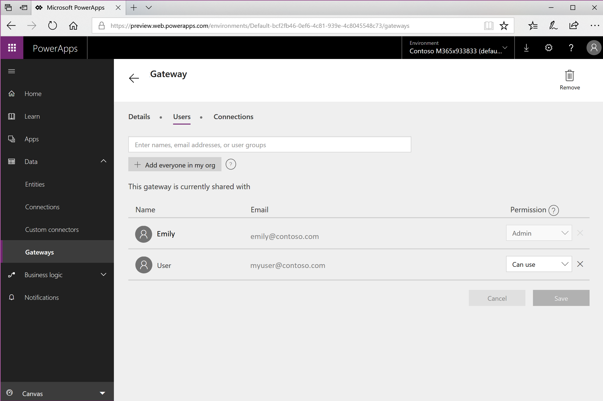

# Responding to Export Data Subject Rights (DSR) Requests for PowerApps Customer Data

The “right of data portability” allows a data subject to request a copy of their personal data in an electronic format (that’s a “structured, commonly used, machine read-able and interoperable format”) that may be transmitted to another data controller:

1.	Website access: [PowerApps maker portal](https://web.powerapps.com), [PowerApps Admin Center](https://admin.powerapps.com/), and [Office 365 Service Trust Portal](https://servicetrust.microsoft.com/)

2.	PowerShell access: PowerApps cmdlets ([Maker cmdlets](https://go.microsoft.com/fwlink/?linkid=871448) , [Admin cmdlets](https://go.microsoft.com/fwlink/?linkid=871804)) and [On-premise gateway cmdlets](https://go.microsoft.com/fwlink/?linkid=872238)

Below is a summary of the types of personal data that can be stored by PowerApps for a specific user and which experiences you can use to find and export it.

Resources containing personal data | Website access |	PowerShell access
--- | --- | --
Environment	| PowerApps Admin Center | 	PowerApps cmdlets
Environment permissions**	| PowerApps Admin Center 	| PowerApps cmdlets
Canvas App	| PowerApps Admin Center <br> PowerApps Maker Portal | 	PowerApps cmdlets
Canvas App permissions	| PowerApps Admin Center <br> PowerApps Maker Portal	| PowerApps cmdlets
Gateway | PowerApps Maker Portal***	| On-premise gateway cmdlets
Gateway permissions	| PowerApps Maker Portal***	|
Custom connector | |	Maker: Available <br> Admin: Under development
Custom connector permissions | | 	Maker: Available <br> Admin: Under development
Connection | | Maker: Available <br> Admin: Under development
Connection permissions	| | Maker: Available <br> Admin: Under development
PowerApps user settings, user-app settings, and notifications | | Maker: Available <br> Admin: Under development

> ** With the introduction of the Common Data Service for Apps, if a database is created within the environment, environment permissions and model-driven app permissions are stored as records within the Common Data Service for Apps database instance. Please see [Executing DSRs against Common Data Service Customer Data](https://go.microsoft.com/fwlink/?linkid=872251), for guidance on how to respond to DSRs for users that use the Common Data Service.

> *** An admin will only be able to access these resources from the [PowerApps maker portal](https://web.powerapps.com) if the owner of the resource has explicitly granted them access.  If that is not the case, the admin will need to leverage the [PowerApps Admin PowerShell cdmlets](https://go.microsoft.com/fwlink/?linkid=871804).

## Prerequisites

### For users
Any user with a valid PowerApps license will be able to perform the user operations outlined in this document using the [PowerApps maker portal](https://web.powerapps.com) or [Maker cmdlets](https://go.microsoft.com/fwlink/?linkid=871448).

### For admins
In order to perform the administration operations outlined in this document using the PowerApps Admin Center, Microsoft Flow Admin Center, or [PowerApps Admin PowerShell cdmlets](https://go.microsoft.com/fwlink/?linkid=871804), you will need an account with the following permissions:

1.	A paid PowerApps Plan 2 license, or a PowerApps Plan 2 trial license. You can sign-up for a 30d trial license at [http://web.powerapps.com/trial](http://web.powerapps.com/trial), trial licenses can be renewed if they have expired.

2.	[Office 365 Global Administrator](https://support.office.com/article/assign-admin-roles-in-office-365-for-business-eac4d046-1afd-4f1a-85fc-8219c79e1504) or [Azure Active Directory Global Administrator](https://docs.microsoft.com/azure/active-directory/active-directory-assign-admin-roles-azure-portal)  privileges are also required if you need to search through another user’s resources, otherwise you will only have access to those environments and environment resources where you have Environment Admin privileges.

## Step #1: Export personal data contained within environments created by the user

### PowerApps Admin Center
An admin can export all environments created by a specific user from the [PowerApps Admin Center](https://admin.powerapps.com/) via the following steps:
1.	From the [PowerApps Admin Center](https://admin.powerapps.com/), select each environment in your organization.

  

2.	 If the environment was created by the user from the DSR request, then from the **Details** page you can **copy-paste** in a document editor, like Microsoft Word.

  

### PowerApps Maker PowerShell cmdlets
A user can export the environments they have access to in PowerApps via the **Get-PowerAppsEnvironment** function in the [PowerApps Maker PowerShell cmdlets](https://go.microsoft.com/fwlink/?linkid=871448):
```PowerShell
Add-PowerAppsAccount
Get-PowerAppsEnvironment | ConvertTo-Json | Out-File -FilePath "UserDetails.json"
```

### PowerApps Admin PowerShell cmdlets
An admin can export all of the environments that have been created by a user via the **Get-AdminEnvironment** function in the [PowerApps Admin PowerShell cdmlets](https://go.microsoft.com/fwlink/?linkid=871804):
```PowerShell
Add-PowerAppsAccount
$userId = "7557f390-5f70-4c93-8bc4-8c2faabd2ca0"
Get-AdminEnvironment -CreatedBy $userId | ConvertTo-Json | Out-File -FilePath "UserDetails.json"
```
 
## Step #2: Export the user’s environment permissions
Users can be assigned permissions (such as Environment Admin, Environment Maker, etc.) in an environment, which is stored in the PowerApps service as a “role assignment.”
With the introduction of the Common Data Service for Apps, if a database is created within the environment, these “role assignments” are stored as records within the Common Data Service for Apps database instance.
For more information see the Administer environments article.

### For environments without a Common Data Service for Apps database

#### PowerApps Admin Center
An admin can export a user’s environment permissions starting from the [PowerApps Admin Center](https://admin.powerapps.com/) via the following steps:

1.	From the [PowerApps Admin Center](https://admin.powerapps.com/), select each environment in your organization.  You must be an [Office 365 Global Administrator](https://support.office.com/article/assign-admin-roles-in-office-365-for-business-eac4d046-1afd-4f1a-85fc-8219c79e1504) or [Azure Active Directory Global Administrator](https://docs.microsoft.com/azure/active-directory/active-directory-assign-admin-roles-azure-portal)  to be able to review all environments that have been created within your organization.

  

2.	Select **Security**

3.	If your environment does not have a CDS For Apps database, you will see a section for **Environment Roles.**

4.	Select both **Environment Admin** and **Environment Maker** separately, and using the search bar, search for the user’s name.

  

5.	If the user has access to either role, from within the **Users** screen, you can **copy-paste** in a document editor, like Microsoft Word

#### PowerApps Admin PowerShell cmdlets
An admin can export all environment role assignments for a user across all environments without a Common Data Service for Apps database via the **Get-AdminEnvironmentRoleAssignment** function in the [PowerApps Admin PowerShell cdmlets](https://go.microsoft.com/fwlink/?linkid=871804):

```
Add-PowerAppsAccount
$userId = "0ecb1fcc-6782-4e46-a4c4-738c1d3accea"
Get-AdminEnvironmentRoleAssignment -UserId $userId | ConvertTo-Json | Out-File -FilePath "UserDetails.json"
```

> **Important**: : This function only works for environments that do not have a Common Data Service For Apps database instance.  

### For environments WITH a Common Data Service for Apps database
With the introduction of the Common Data Service for Apps, if a database is created within the environment, these “role assignments” are stored as records within the Common Data Service for Apps database instance.
Please refer to the following documentation on how to remove personal data from a Common Data Service for Apps database instance: [Common Data Service User personal data removal](https://go.microsoft.com/fwlink/?linkid=871886).
 
## Step #3: Export personal data contained within canvas apps created by the user

### PowerApps Maker Portal
A user can export an app from the [PowerApps maker portal](https://web.powerapps.com). For the full steps on how to export an app, please see [exporting an app](https://docs.microsoft.com/powerapps/administrator/environment-and-tenant-migration#exporting-an-app).

### PowerApps Admin Center
An admin can export apps created by a user starting from the [PowerApps Admin Center](https://admin.powerapps.com/) via the following steps:

1.	From the [PowerApps Admin Center](https://admin.powerapps.com/), select each environment in your organization.  You must be a [Office 365 Global Administrator](https://support.office.com/article/assign-admin-roles-in-office-365-for-business-eac4d046-1afd-4f1a-85fc-8219c79e1504) or [Azure Active Directory Global Administrator](https://docs.microsoft.com/azure/active-directory/active-directory-assign-admin-roles-azure-portal)  to be able to review all environments that have been created within your organization.

  

2.	Select **Resources** then **Apps**

3.	Using the search bar, search for the user’s name, which will bring-up any apps that have been created by that user within this environment:

  

4.	 Select **Share** for each of the apps created by that user and give yourself **Can edit** access to the app:

  

  

5.	Once you have access to each of the user’s apps you can export an app from the [PowerApps maker portal](https://web.powerapps.com). For the full steps on how to export an app, please see exporting an app.

### PowerApps Admin PowerShell cmdlets
An admin can export apps created by a user via the **Get-AdminApp** function in the [PowerApps Admin PowerShell cdmlets](https://go.microsoft.com/fwlink/?linkid=871804):

```
Add-PowerAppsAccount
$userId = "0ecb1fcc-6782-4e46-a4c4-738c1d3accea"
Get-AdminApp -Owner $userId | ConvertTo-Json | Out-File -FilePath "UserDetails.json"
```

## Step #4: Export the user’s permissions to canvas apps
Whenever an app is shared with a user, PowerApps stores a record called a “role assignment” that describes the user’s permissions (CanEdit or CanUser) to the application. For more information see the [Share an app](https://docs.microsoft.com/en-us/powerapps/maker/canvas-apps/share-app#share-an-app) article.

### PowerApps Maker PowerShell cmdlets
A user can export the app role assignments for all apps that they have access to via the **Get-RoleAssignment** function in the [PowerApps Maker PowerShell cmdlets](https://go.microsoft.com/fwlink/?linkid=871448):

```
Add-PowerAppsAccount
Get-AppRoleAssignment | ConvertTo-Json | Out-File -FilePath "UserDetails.json"
```

### PowerApps Admin Center
An admin can export app roles assignments for a user starting from the [PowerApps Admin Center](https://admin.powerapps.com/) via the following steps:

1.	From the [PowerApps Admin Center](https://admin.powerapps.com/), select each environment in your organization.  You must be a [Office 365 Global Administrator](https://support.office.com/article/assign-admin-roles-in-office-365-for-business-eac4d046-1afd-4f1a-85fc-8219c79e1504) or [Azure Active Directory Global Administrator](https://docs.microsoft.com/azure/active-directory/active-directory-assign-admin-roles-azure-portal)  to be able to review all environments that have been created within your organization.

  

2.	For each environment select Resources then Apps

3.	 Select Share for each of the apps in the environment:

  

4.	If the user has access to the app, from within the app’s **Share** screen, you can **copy-paste** in a document editor, like Microsoft Word:

  

### PowerApps Admin PowerShell cmdlets
An admin can export all app role assignments for a user across all apps in their tenant via the **Get-AdminAppRoleAssignment** function in the [PowerApps Admin PowerShell cdmlets](https://go.microsoft.com/fwlink/?linkid=871804):

```
Add-PowerAppsAccount
$userId = "0ecb1fcc-6782-4e46-a4c4-738c1d3accea"
Get-AdminAppRoleAssignment -UserId $userId | ConvertTo-Json | Out-File -FilePath "UserDetails.json"
```

## Step #5: Export personal data contained within connections created by the user
Connections are used in conjunction with connectors when establishing connectivity with other APIs and SaaS systems.  Connections do include references to the user who created them and as a result, can be deleted to remove any references to the user.

### PowerApps Maker PowerShell cmdlets
A user can export all of the connections they have access to via the **Get-Connection** function in the [PowerApps Maker PowerShell cmdlets](https://go.microsoft.com/fwlink/?linkid=871448):

```
Add-PowerAppsAccount
Get-Connection | ConvertTo-Json | out-file -FilePath "UserDetails.json"
```

### PowerApps Admin PowerShell cmdlets
The function for an admin to export connections created by a user using the [PowerApps Admin PowerShell cdmlets](https://go.microsoft.com/fwlink/?linkid=871804) is under development.
 
## Step #6: Export the user’s permissions to shared connections
### PowerApps Maker PowerShell cmdlets
A user can export the connection role assignments for all connections that they have access to via the **Get-ConnectionRoleAssignment** function in the [PowerApps Maker PowerShell cmdlets](https://go.microsoft.com/fwlink/?linkid=871448):

```
Add-PowerAppsAccount
Get-ConnectionRoleAssignment | ConvertTo-Json | out-file -FilePath "UserDetails.json"
```

### PowerApps Admin PowerShell cmdlets
The function for an admin to export connection role assignments for a user using the [PowerApps Admin PowerShell cdmlets](https://go.microsoft.com/fwlink/?linkid=871804) is under development.

 
## Step #7: Export personal data contained within custom connectors created by the user
Custom Connectors supplement the existing out of box connectors and allow for connectivity to other APIs, SaaS and custom-developed systems.

### PowerApps Maker PowerShell cmdlets
A user can export all custom connectors they have created to via the **Get-Connector** function in the [PowerApps Maker PowerShell cmdlets](https://go.microsoft.com/fwlink/?linkid=871448):

```
Add-PowerAppsAccount  
Get-Connector -FilterNonCustomConnectors | ConvertTo-Json | Out-File -FilePath "UserDetails.json"
```

### PowerApps Admin PowerShell cmdlets
The function for an admin to export custom connectors created by a user using the [PowerApps Admin PowerShell cdmlets](https://go.microsoft.com/fwlink/?linkid=871804) is under development.

## Step #8: Export the user’s permissions to custom connectors
### PowerApps Maker PowerShell cmdlets
A user can export all connector role assignments for the custom connectors they have access to via the Get-ConnectorRoleAssignment function in the [PowerApps Maker PowerShell cmdlets](https://go.microsoft.com/fwlink/?linkid=871448):

```
Add-PowerAppsAccount  
Get-ConnectorRoleAssignment | ConvertTo-Json | Out-File -FilePath "UserDetails.json"
```

### PowerApps Admin PowerShell cmdlets
The function for and admin to export custom connector role assignments for a user using the [PowerApps Admin PowerShell cdmlets](https://go.microsoft.com/fwlink/?linkid=871804) is under development.
 
## Step #9: Export PowerApps Notifications, User Settings, and User-App Settings
PowerApps sends several types of notifications to users including when an app is shared with them and when a Common Data Service export operation has completed.  A user’s notification history is visible to them within the [PowerApps maker portal](https://web.powerapps.com).

PowerApps also stores several different user preferences and settings that are used to deliver the PowerApps runtime and portal experiences including, when you last opened an application, pinned apps, etc.

### PowerApps Maker PowerShell cmdlets
The function to export a user’s PowerApps notifications, user settings and user-app settings using the [PowerApps Admin PowerShell cdmlets](https://go.microsoft.com/fwlink/?linkid=871804) is under development.

### PowerApps Admin PowerShell cmdlets
The function for admin to export a user’s PowerApps notifications, user settings and user-app settings using the [PowerApps Admin PowerShell cdmlets](https://go.microsoft.com/fwlink/?linkid=871804) is under development.

## Step #10: Export personal data contained for a user stored gateway or in the user’s gateway permissions

### PowerApps Maker Portal
A user can export the personal data stored within the Gateway service from the [PowerApps maker portal](https://web.powerapps.com) via the following steps:

1.	From the [PowerApps maker portal](https://web.powerapps.com), within the Default environment for your tenant, select **Gateways** and then select **Details** for each gateway you have access to.

  

2.	From the **Details** page, and if the Gateway details contains any personal data you can copy-paste of the page in a document editor, like Microsoft Word:

  

3.	Then select **Share** and **copy-paste** the contents of the page in a document editor, like Microsoft Word:

  

### Gateway PowerShell cmdlets
There are also PowerShell cmdlets that allow you to retrieve, manage and delete your personal gateways.  For more information see [On-premise gateway cmdlets](https://go.microsoft.com/fwlink/?linkid=872238).

## Step #11: Export the user’s personal data in Microsoft Flow
PowerApps licenses always include Microsoft Flow capabilities. In addition to being included in PowerApps licenses, Microsoft Flow is also available as a standalone service.
Please see [Executing DSRs against Microsoft Flow Customer Data](https://go.microsoft.com/fwlink/?linkid=872250), for guidance on how to respond to DSRs for users that use the Microsoft Flow service.
> **Important**: : It is recommended that admins complete this step for a PowerApps user

## Step #12: Export the user’s personal data in Common Data Service (CDS) instances
Certain PowerApps licenses give the ability for users within your organization to create instances of the Common Data Service, and create and build apps on the Common Data Service, including the PowerApps Community Plan which is a free license that allows users to try out CDS in an individual environment. See the [PowerApps Pricing page](https://powerapps.microsoft.com/pricing) for which CDS capabilities are included in each PowerApps license.

Please see [Executing DSRs against Common Data Service Customer Data](https://go.microsoft.com/fwlink/?linkid=872251), for guidance on how to respond to DSRs for users that use the Common Data Service.

> **Important**: It is recommended that admins complete this step for a PowerApps user
