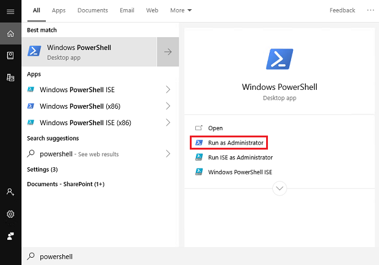
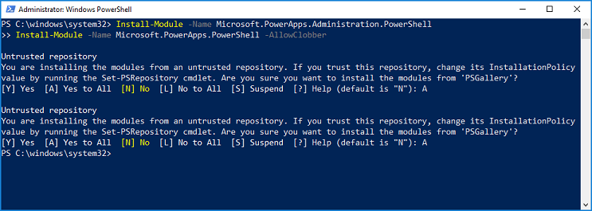
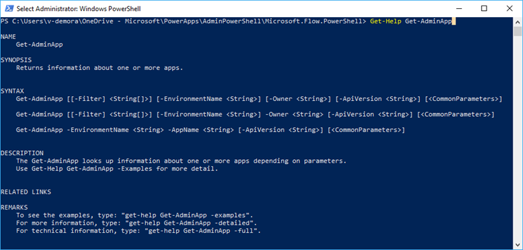
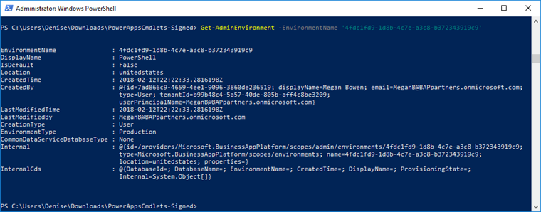
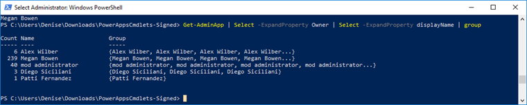
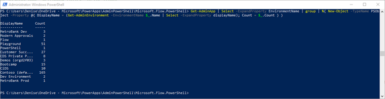

# PowerShell support for PowerApps (preview)
With the preview launch of the PowerShell cmdlets for app creators and administrators, you can automate many of the monitoring and management tasks that are only possible manually today in [PowerApps](https://web.powerapps.com/?utm_source=padocs&utm_medium=linkinadoc&utm_campaign=referralsfromdoc) or the [PowerApps Admin center](https://admin.powerapps.com).

## Cmdlets
[Cmdlets](https://docs.microsoft.com/powershell/developer/cmdlet/writing-a-windows-powershell-cmdlet) are functions written in PowerShell script language that execute commands in the Windows PowerShell environment. Running these PowerApps cmdlets will allow you to interact with your Business Application Platform without having to go through the admin portal in a web browser. You can combine these cmdlets with other PowerShell functions to write complex scripts that can optimize your workflow. Note that you can still use the cmdlets if you’re not an admin on the tenant, but you will be limited to the resources you own. Cmdlets that start with the word ‘Admin’ are designed to be used by an administrative user account.

Cmdlets are available on the PowerShell gallery as two separate modules: 
- [Administrator](https://www.powershellgallery.com/packages/Microsoft.PowerApps.Administration.PowerShell/2.0.1)
- [Maker](https://www.powershellgallery.com/packages/Microsoft.PowerApps.PowerShell/1.0.1) 

## Installation
To run the PowerShell cmdlets for app creators, do the following:

1. Run PowerShell as an administrator.

   > [!div class="mx-imgBorder"] 
   > 

2. Import the necessary modules using the following commands:

    ```
    Install-Module -Name Microsoft.PowerApps.Administration.PowerShell
    Install-Module -Name Microsoft.PowerApps.PowerShell -AllowClobber
    ```
3. If you are prompted to accept the change to *InstallationPolicy* value of the repository, accept [A] Yes to all modules by typing ‘A’ and pressing **Enter** for each module.

   

4. Before accessing any of the commands, you have the option to provide your credentials using the following command. These credentials are refreshed for up to ~8 hours before you’re required to sign in again to continue using the cmdlets.

    ```
    # This call opens prompt to collect credentials (Azure Active Directory account and password) used by the commands 
    Add-PowerAppsAccount
    ```

    ```
    # Here is how you can pass in credentials (avoiding opening a prompt)
    $pass = ConvertTo-SecureString "password" -AsPlainText -Force
    Add-PowerAppsAccount -Username foo@bar.com -Password $pass
    ```

## PowerApps cmdlets for app creators (preview)

### Prerequisite
Users with a valid PowerApps license can perform the operations in these cmdlets, but they will only have access to the resources (for example, apps, flows, etc.) that have been created or shared with them.

### Cmdlet list - Maker Cmdlets
> [!NOTE]
> We have updated some of the cmdlets function names in the latest release in order to add appropriate prefixes to prevent collisions. See the table below for an overview of what has changed.

| Purpose | Cmdlet |
| --- | --- |
| Read environments | Get-PowerAppEnvironment *(previously Get-PowerAppsEnvironment)* <br> Get-FlowEnvironment |
| Read, update, and delete a canvas app | Get-PowerApp *(previously Get-App)* <br> Remove-PowerApp *(previously Remove-App)* <br> Publish-PowerApp *(previously Publish-App)* <br> Set-AppDisplayName *(previously Set-PowerAppDisplayName)*<br> Get-PowerAppVersion *(previously Get-AppVersion)* <br> Restore-PowerAppVersion *(previously Restore-AppVersion)* |
| Read, update, and delete canvas app permissions | Get-PowerAppRoleAssignment *(previously Get-AppRoleAssignment)* <br> Set-PowerAppRoleAssignment *(previously Set-AppRoleAssignment)* <br> Remove-PowerAppRoleAssignment *(previously Remove-AppRoleAssignment)* |
| Read, update, and delete a flow | Get-Flow <br> Get-FlowRun <br> Enable-Flow <br> Disable-Flow <br> Remove-Flow |
| Read, update, and delete flow permissions | Get-FlowOwnerRole <br> Set-FlowOwnerRole <br> Remove-FlowOwnerRole |
| Read and respond to flow approvals | Get-FlowApprovalRequest <br> Get-FlowApproval <br> RespondTo-FlowApprovalRequest |
| Read and delete connections | Get-PowerAppConnection *(previously Get-Connection)* <br> Remove-PowerAppConnection *(previously Remove-Connection)* |
| Read, update, and delete connection permissions | Get-PowerAppConnectionRoleAssignment *(previously Get-ConnectionRoleAssignment)* <br> Set-PowerAppConnectionRoleAssignment *(previously Set-ConnectionRoleAssignment)* <br> Remove-PowerAppConnectionRoleAssignment *(previously Remove-ConnectionRoleAssignment)* |
| Read and delete connectors | Get-PowerAppConnector *(previously Get-Connector)* <br> Remove-PowerAppConnector *(previously Remove-Connector)* |
| Read, update, and delete custom connector permissions | Get-PowerAppConnectorRoleAssignment *(previously Get-ConnectorRoleAssignment)* <br> Set-PowerAppConnectorRoleAssignment *(previously Set-ConnectorRoleAssignment)* <br> Remove-PowerAppConnectorRoleAssignment *(previously Remove-ConnectorRoleAssignment)* |

## PowerApps cmdlets for administrators (preview)

### Prerequisite
To perform the administration operations in the admin cmdlets, you'll need the following:

* A paid PowerApps Plan 2 license or a PowerApps Plan 2 trial license. You can sign-up for a 30-day trial license at [http://web.powerapps.com/trial](http://web.powerapps.com/trial). Trial licenses can be renewed if they've expired.

* [Office 365 Global Administrator](https://support.office.com/article/assign-admin-roles-in-office-365-for-business-eac4d046-1afd-4f1a-85fc-8219c79e1504) or [Azure Active Directory Global Administrator](https://docs.microsoft.com/azure/active-directory/active-directory-assign-admin-roles-azure-portal) permissions if you need to search through another user’s resources. (Note that Environment Admins only have access to those environments and environment resources for which they have permissions.)

### Cmdlet list - Admin Cmdlets

| Purpose | Cmdlets
| --- | ---
| Read, update, and delete environments & Common Data Service for Apps databases | New-AdminPowerAppEnvironment <br> Set-AdminPowerAppEnvironmentDisplayName <br> Get-AdminPowerAppEnvironment *(previously Get-AdminEnvironment)* <br> Remove-AdminPowerAppEnvironment *(previously Remove-AdminEnvironment)* <br> New-AdminPowerAppCdsDatabase <br> Get-AdminPowerAppCdsDatabaseLanguages <br> Get-AdminPowerAppCdsDatabaseCurrencies <br> Get-AdminPowerAppEnvironmentLocations |
| Delete CDS database | Remove-LegacyCDSDatabase **\*New\*** | 
| Read, update, and delete environment permissions <br><br> *These cmdlets only work today for environments that do not have a Common Data Service (CDS) for Apps database.* | Get-AdminPowerAppEnvironmentRoleAssignment *(previously Get-AdminEnvironmentRoleAssignment)* <br> Set-AdminPowerAppEnvironmentRoleAssignment *(previously Set-AdminEnvironmentRoleAssignment)* <br> Remove-AdminPowerAppEnvironmentRoleAssignment *(previously Remove-AdminEnvironmentRoleAssignment)* |
| Read, update, and remove canvas apps | Get-AdminPowerApp *(previously Get-AdminApp)* <br> Remove-AdminPowerApp *(previously Remove-AdminApp)* <br> Get-AdminPowerAppConnectionReferences <br> Set-AdminPowerAppAsFeatured <br> Clear-AdminPowerAppAsFeatured <br> Set-AdminPowerAppAsHero <br> Clear-AdminPowerAppAsHero <br> Set-AdminPowerAppApisToBypassConsent <br> Clear-AdminPowerAppApisToBypassConsent |
| Read, update, and delete canvas app permissions | Get-AdminPowerAppRoleAssignment *(previously Get-AdminAppRoleAssignment)* <br> Remove-AdminPowerAppRoleAssignment *(previously Remove-AdminAppRoleAssignment)* <br> Set-AdminPowerAppRoleAssignment *(previously Set-AdminAppRoleAssignment)* <br> Set-AdminPowerAppOwner *(previously Set-AdminAppOwner)* |
| Read, update, and delete flows | Get-AdminFlow <br> Enable-AdminFlow <br> Disable-AdminFlow <br> Remove-AdminFlow <br> Remove-AdminFlowApprovals |
| Read, update, and delete flow permissions | Get-AdminFlowOwnerRole <br> Set-AdminFlowOwnerRole <br> Remove-AdminFlowOwnerRole |
| Read and delete connections | Get-AdminPowerAppConnection *(previously Get-AdminConnection)* <br> Remove-AdminPowerAppConnection *(previously Remove-AdminConnection)* |
| Read, update, and delete connection permissions | Get-AdminPowerAppConnectionRoleAssignment *(previously Get-AdminConnectionRoleAssignment)* <br> Set-AdminPowerAppEnvironmentConnectionRoleAssignment *(previously Set-AdminConnectionRoleAssignment)* <br> Remove-AdminPowerAppConnectionRoleAssignment *(previously Remove-AdminConnectionRoleAssignment)* |
| Read and delete custom connectors | Get-AdminPowerAppConnector *(previously Get-AdminConnector)* <br> Remove-AdminPowerAppConnector *(previously Remove-AdminConnector)* |
| Read, update, and delete custom connector permissions | Get-AdminPowerAppConnectorRoleAssignment *(previously Get-AdminConnectorRoleAssignment)*<br> Set-AdminPowerAppConnectorRoleAssignment *(previously Set-AdminConnectorRoleAssignment)* <br> Remove-AdminPowerAppConnectorRoleAssignment *(previously Remove-AdminConnectorRoleAssignment)* |
| Read a user's PowerApps user settings, user-app settings, and notifications | Get-AdminPowerAppsUserDetails |
| Read & delete a user's Microsoft Flow settings, which are not visible to user, but that support flow execution | Get-AdminFlowUserDetails <br> Remove-AdminFlowUserDetails |
| Create, read, update & delete data loss prevention policies for your organization | Get-AdminDlpPolicy *(previously Get-AdminApiPolicy)* <br> Add-AdminDlpPolicy *(previously Add-AdminApiPolicy)* <br> Remove-AdminDlpPolicy *(previously Remove-AdminApiPolicy)* <br> Set-AdminDlpPolicy *(previously Set-AdminApiPolicy)* <br> Add-ConnectorToBusinessDataGroup <br>  Remove-ConnectorFromBusinessDataGroup |

## Tips

- Use Get-Help ‘CmdletName’ to get a list of examples.

     

- To cycle through the possible options for input tags, click on the tab key after typing out the dash (-) character, after the cmdlet name.

Example commands:

```
Get-Help Get-AdminPowerAppEnvironment
Get-Help Get-AdminPowerAppEnvironment -Examples
Get-Help Get-AdminPowerAppEnvironment -Detailed
```

## Operation examples

Below are some common scenarios that show how to use new and existing PowerApps cmdlets.

- [Environments Commands](#environments-commands)
- [PowerApps Commands](#powerapps-commands)
- [Flow commands](#flow-commands)
- [API connection commands](#api-connection-commands)
- [Data Loss Prevention (DLP) policy commands](#data-loss-prevention-dlp-policy-commands)

### Environments commands

Use these commands to get details on and update environments in your tenant.

#### Display a list of all environments

```
Get-AdminEnvironment
```

Returns a list of each environment across your tenant, with details of each (e.g., environment name (guid), display name, location, creator, etc).

#### Display details of your default environment

```
Get-AdminEnvironment –Default
```

Returns the details for only the default environment of the tenant.

#### Display details of a specific environment

```
Get-AdminEnvironment –EnvironmentName ‘EnvironmentName’
```

**Note**: The *EnvironmentName* field is a unique identifier, which is different from the *DisplayName* (see first and second fields in the output in the following image).



### PowerApps commands

These operations are used to read and modify PowerApps data in your tenant.

#### Display a list of all PowerApps

```
Get-AdminPowerApp
```

Returns a list of all PowerApps across the tenant, with details of each (e.g., application name (guid), display name, creator, etc).

#### Display a list of all PowerApps that match the input display name

```
Get-AdminPowerApp 'DisplayName'
```

Returns a list of all the PowerApps in your tenant that match the display name. 

**Note**: Use quotation characters (”) around input values that contain spaces.

#### Feature an application

```
Set-AdminPowerAppAsFeatured –AppName 'AppName'
```

Featured applications are grouped and pushed to the top of the list in the PowerApps mobile player.

**Note**: Like environments, the *AppName* field is a unique identifier, which is different from the *DisplayName*. If you want to perform operations based on the display name, some functions will let you use the pipeline (see next function).

#### Make an application a Hero app, using the pipeline

```
Get-AdminPowerApp 'DisplayName' | Set-AdminPowerAppAsHero
```

A Hero app will appear at the top of the list in the PowerApps mobile player. There can only be one Hero app.

The pipeline (represented as the ‘|’ character between two cmdlets) takes the output of the first cmdlet and passes it as the input value of the second, assuming the function has been written to accommodate the pipeline feature.

**Note**: an app must already be a featured app before it is changed to a hero.

#### Display the number of apps each user owns

```
Get-AdminPowerApp | Select –ExpandProperty Owner | Select –ExpandProperty displayname | Group
```

You can combine native PowerShell functions with the PowerApps cmdlets to manipulate data even further. Here we use the Select function to isolate the Owner attribute (an object) from the Get-AdminApp object. We then isolate the name of the owner object by pipelining that output into another Select function. Finally, passing the second Select function output into the Group function returns a nice table that includes a count of each owner’s number of apps.



#### Display the number of apps in each environment

```
Get-AdminPowerApp | Select -ExpandProperty EnvironmentName | Group | %{ New-Object -TypeName PSObject -Property @{ DisplayName = (Get-AdminPowerAppEnvironment -EnvironmentName $_.Name | Select -ExpandProperty displayName); Count = $_.Count } }
```



#### Download PowerApps user details

```
Get-AdminPowerAppsUserDetails -OutputFilePath '.\adminUserDetails.txt' –UserPrincipalName ‘admin@bappartners.onmicrosoft.com’
```

The above command will store the PowerApps user details (basic usage information about the input user via their user principal name) in the specified text file. It will create a new file if there is no existing file with that name, and overwrite the text file if it already exists.

#### Set logged in user as the owner of a PowerApp

```
Set-AdminPowerAppOwner –AppName 'AppName' -AppOwner $Global:currentSession.userId –EnvironmentName 'EnvironmentName'
```

Changes the owner role of a PowerApp to the current user, and replaces the original owner as a “can view” role type.

**Note**: The AppName and EnvironmentName fields are the unique identifiers (guids), not the display names.

### Flow commands

Use these commands to view and modify data related to Microsoft Flow.

#### Display all flows

```
Get-AdminFlow
```

Returns a list of all flows in the tenant.

#### Display flow owner role details

```
Get-AdminFlowOwnerRole –EnvironmentName 'EnvironmentName' –FlowName ‘FlowName’
```

Returns the owner details of the specified flow.

**Note**: Like *Environments* and *PowerApps*, *FlowName* is the unique identifier (guid), which is different from the display name of the flow.

#### Display flow user details

```
Get-AdminFlowUserDetails –UserId $Global:currentSession.userId
```

Returns the user details regarding flow usage. In this example we’re using the user Id of the current logged in user of the PowerShell session as input.

#### Remove flow user details

```
Remove-AdminFlowUserDetails –UserId 'UserId'
```

Deletes the details on a flow user completely from the Microsoft database. All flows the input user owns must be deleted before the flow user details can be purged.

**Note**: The UserId field is the Object ID of the user’s Azure Active Directory record, which can be found in the [Azure Portal](https://portal.azure.com) under **Azure Active Directory** > **Users** > **Profile** > **Object ID**. You must be an admin to access this data from here.

#### Export all flows to a CSV file

```
Get-AdminFlow | Export-Csv -Path '.\FlowExport.csv'
```

Exports all the flows in your tenant into a tabular view .csv file.

### API connection commands

View and manage API connections in your tenant.

#### Display all native Connections in your default environment

```
Get-AdminPowerAppEnvironment -Default | Get-AdminConnection
```

Displays a list of all API connections you have in the default environment. Native connections are found under the **Data** > **Connections** tab in the maker portal.

#### Display all custom connectors in the tenant

```
Get-AdminPowerAppConnector
```

Returns a list of all custom connector details in the tenant.

### Data Loss Prevention (DLP) policy commands

These cmdlets will control the DLP policies on your tenant.

#### Display all policies

```
Get-AdminDlpPolicy
```

Returns a list of all the policies.

#### Display a filtered list of policies

```
Get-AdminDlpPolicy 'DisplayName'
```

Uses the display name to filter the policies

#### Display all ‘Business data only’ API connectors in a policy

```
Get-AdminDlpPolicy 'PolicyName' | Select –ExpandProperty BusinessDataGroup
```

Lists the API connections that are in the *Business data only*(or *BusinessDataGroup*) field in an input policy.

#### Add a connector to the ‘Business data only’ group

```
Add-ConnectorToBusinessDataGroup -PolicyName 'PolicyName' –ConnectorName 'ConnectorName'
```

Adds a connector to the ‘Business data only’ group in a given DLP policy. See the list of connectors by *DisplayName* and *ConnectorName* (used as input) here.

## Version History
| Version | Date | Updates |
| --- | --- | --- |
| 1.0 | 04/23/2018 | <ol> <li> Initial launch of the PowerApps cmdlets for app creators (preview) including management cmdlets for Environments, Apps, Flows, Flow approvals, Connections, and Custom Connectors </li> <li> Initial launch of the PowerApps cmdlets for administrators (preview) including administrative cmdlets for Environments, Apps, and Flows </li></ol>|
| 2.0 | 05/24/2018 | <ol> <li> Minor bug fixes in both the cmdlets for app creators and administrators </li> <li> Added the following new administrative cmdlets: <br> Get-AdminConnection <br> Remove-AdminConnection <br> Get-AdminConnectionRoleAssignment <br> Set-AdminConnectionRoleAssignment <br>Remove-AdminConnectionRoleAssignment <br>Get-AdminConnector  <br>Remove-AdminConnector <br>Set-AdminConnectorRoleAssignment  <br>Get-AdminConnectorRoleAssignment  <br>Remove-AdminConnectorRoleAssignment <br>Get-AdminPowerAppsUserDetails <br>Get-AdminFlowUserDetails <br>Remove-AdminFlowUserDetails <br>Get-AdminApiPolicy  <br>Add-AdminApiPolicy <br>Remove-AdminApiPolicy <br>Set-AdminApiPolicy <br>Add-ConnectorToBusinessDataGroup  <br>Remove-ConnectorFromBusinessDataGroup </li> </ol>
| 3.0 | 07/30/2018 | <ol> <li> Added the ability to pass-in credentials to the Add-PowerAppsAccount (to enable recurring scripting) </li> <li>  Minor bug fixes in both the cmdlets for app creators and administrators </li> <li> Added the "PowerApp" or "Flow" prefix to each cmdlet for app creators </li> <li>  Added the "AdminPowerApp" or "AdminFlow" prefix to each cmdlet for administrators </li> <li> Added the following new administrative cmdlets: <br> New-AdminPowerAppEnvironment <br> Set-AdminPowerAppEnvironmentDisplayName <br> New-AdminPowerAppCdsDatabase <br> Get-AdminPowerAppCdsDatabaseLanguages <br> Get-AdminPowerAppCdsDatabaseCurrencies <br> Get-AdminPowerAppEnvironmentLocations <br> Get-AdminPowerAppConnectionReferences <br> Set-AdminPowerAppAsFeatured <br> Clear-AdminPowerAppAsFeatured <br> Set-AdminPowerAppAsHero <br> Clear-AdminPowerAppAsHero <br> Set-AdminPowerAppApisToBypassConsent <br> Clear-AdminPowerAppApisToBypassConsent <br> Remove-AdminFlowApprovals </li></ol>
| 4.0 | 08/15/2018 | Added an optional parameter to the New-AdminPowerAppCdsDatabase to make the function synchronous, by default (i.e. it will not return until the database is successfully provisioned)
| 5.0 | 08/24/2018 | Fixed an issue where the Flow admin cdmlets where not returning data for some using based on their security settings
| 6.0 | 01/09/2019 | <ol><li>Cmdlets are now available on the PowerShell gallery as two separate modules: Administrator and Maker.</li> <br/><li>Added administrative cmdlet: Remove-LegacyCDSDatabase</li><br/><li> Added operation examples</li></ol>|

## Questions?

If you have any comments, suggestions, or questions, post them on the [Administering PowerApps community board](https://powerusers.microsoft.com/t5/Administering-PowerApps/bd-p/Admin_PowerApps).
