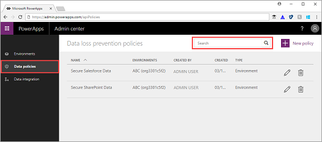
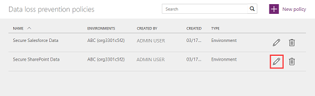
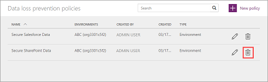

# Manage data loss prevention (DLP) policies
An organization's data is critical to its success. Its data needs to be readily available for decision-making, but it needs to be protected so that it isn't shared with audiences that shouldn't have access to it. To protect this data, PowerApps lets you create and enforce data loss prevention (DLP) policies that define which consumer connectors specific business data can be shared with. For example, an organization that uses PowerApps may not want its business data that's stored in SharePoint to be automatically published to its Twitter feed.

To create, edit, or delete DLP policies, you must have either Environment Admin or Azure Active Directory Tenant Admin permissions. For more information, see [Environments administration in PowerApps](environments-administration.md).

For instructions on how to create a DLP policy, see [Quickstart: Create a data loss prevention (DLP) policy](create-dlp-policy.md).

## Find a DLP policy
1. Sign in to the Admin center at [https://admin.poweraps.com]([https://admin.powerapps.com).
2. In the navigation pane, click or tap **Data policies**. If you have a long list of policies, use the **Search** box to find specific DLP policies.

    

## Edit a DLP policy
1. In the list of data loss prevention policies, click or tap the pencil icon next to the policy you want to edit.

    
2. Make your changes, and then click or tap **Save Policy**.

    > [!NOTE]
    > Environment DLP policies cannot override tenant-wide DLP policies.
    >
    >

    To review the changes, find the DLP policy in the list of data loss prevention policies and click or tap it to review its properties.

## Delete a DLP policy
1. In the list of data loss prevention policies, click or tap the trash can icon next to the policy you want to delete.

    
4. In the confirmation dialog box, click or tap **Delete**.

    The policy is deleted and no longer appears in the list of data loss prevention policies.

## Next steps
* [Learn more about environments](environments-administration.md)
* [Learn more about Microsoft PowerApps](../maker/canvas-apps/getting-started.md)
