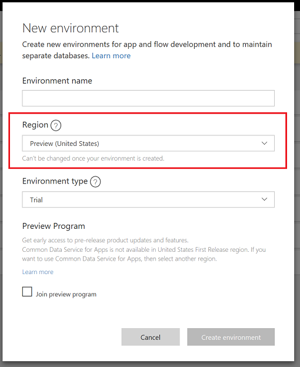
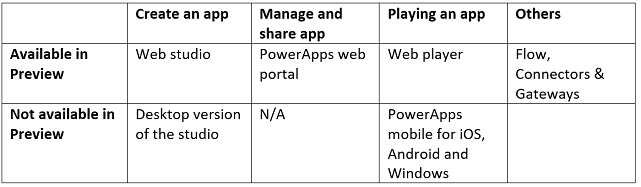
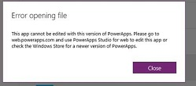

# PowerApps Preview Program
PowerApps updates the platform and its capabilities every few days or weeks. The PowerApps Preview program is a way to get early access to those upcoming functionalities and updates prior to availability in other regions (where customer production apps are deployed). 

With the PowerApps Preview program, you can:
- **Try out, learn, and dogfood upcoming functionalities**: Many functionalities will be rolled out first in the preview for a few days to get feedback. By participating in the Preview program, you can learn about new functionalities sooner and provide feedback. Also, you will be ready to quickly take advantage of new functionalities as soon as they reach regions where their production apps are created.
- **Enable business continuity by ensuring current apps will continue to work** with the upcoming updates (vNext) of PowerApps.

## What in PowerApps is available for preview?
To access the preview functionalities across PowerApps, you need be in a preview environment. More details on the preview environment are given in the next section.
Currently we will be rolling out preview for the following scenarios across PowerApps:
1. **Creating apps**: You can create canvas-based apps using the next version of PowerApps. This can be done by creating apps in a preview environment. Current limitations include - model-driven apps can’t be built in the preview program - we're working on it.
2. **Managing apps**: You can manage and share apps using [PowerApps web portal][2]. To access the preview functionalities, all you need to do is to be in a preview environment; it will take you to the preview version of [PowerApps web portal][3].
3. **Playing apps**: You need to play the apps in a preview environment using the web player. When you do that, you will be automatically taken to [preview version of web player][4]. Apps will play with the vNext version of the PowerApps web player. Current limitations include - PowerApps Mobile for iOS, Android, and Windows are currently not available for preview. Playing the apps created in the First Release environment might not work - we're working on it.
4. **Administrating PowerApps**: Admin experiences are available for preview using the [preview version of PowerApps admin center][1]

## How to get early access to the upcoming updates?
For PowerApps, all the apps and related resources are stored in an environment. Early access to all preview functionalities are also available with an environment created in a region where the vNext (preview) is deployed. For now, there is only one region, **Preview (United States)**, as shown in the image below:

Select the region for the environment as **Preview (United States)** and accept the consent for joining the Preview Program to create the environment to get access to the next version (vNext) of PowerApps.
All the apps and other resources created in this environment are on the vNext version of the platform (SAAS).

## How to learn about the latest updates?
You can get aware of the new functionalities which are available for preview at [What’s new in PowerApps][5]. The functionalities which are just available in the preview have a ‘Preview’ tag.

## Key scenarios to test with the preview program
1. **Validate your production apps with the upcoming PowerApps updates (vNext)**

   You might like to verify your production apps, to be working fine with the next upcoming updates on PowerApps. You can [copy][6] the apps from a production environment to an environment in First Release and play the apps to test out the scenarios. Please note, all the other necessary resources like CustomAPI, Flow, etc., will also need to be moved along with it. This should just create another copy of these apps and required resources. You can start testing out the newer updates not just for playing an app, but also while editing and managing the apps.
   
2. **Trying out the new functionalities available in preview**

   We will be launching many new functionalities initially in the **Preview (United States)** region. You can try out the new functionalities prior to their being available in rest of the regions (which might impact your production environment).

## How to provide feedback to the product team?
You can provide feedback on the [PowerApps forum][8] and/or contact [support][9].

## What are the known issues and limitations?
1. **PowerApps portals and clients which are not available in preview** 

   There are certain functionalities, services and portals which are available in preview:
   
   

2. **Accessing apps created in First Release environment from the Desktop Studio in Windows**

   As mentioned above, desktop studio in Windows is not available in preview. Hence, creating or editing of the apps in the preview environment might not be compatible with your Desktop Studio and shows the following error message:
   
   

   In such a case, we recommend you use Web Studio to create or edit an app in the preview environment.

3. **Database cannot be created in Preview region**

   Currently, you cannot create a database with Common Data Service for Apps in an environment in Preview (United States) region - we're working on it.

<!--Reference links in article-->
[1]: https://preview.admin.powerapps.com
[2]: https://web.powerapps.com
[3]: https://preview.web.powerapps.com
[4]: https://preview.web.powerapps.com/webplayer
[5]: https://docs.microsoft.com/powerapps/maker/canvas-apps/release-notes
[6]: https://docs.microsoft.com/powerapps/administrator/environment-and-tenant-migration
[7]: https://preview.create.powerapps.com
[8]: https://powerusers.microsoft.com/t5/PowerApps-Community/ct-p/PowerApps1
[9]: https://powerapps.microsoft.com/support/

