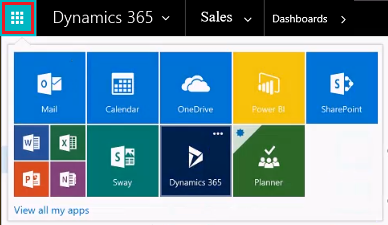
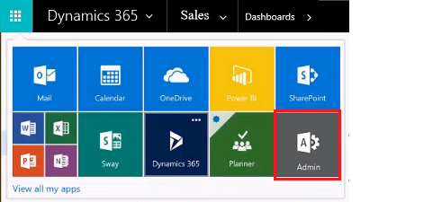
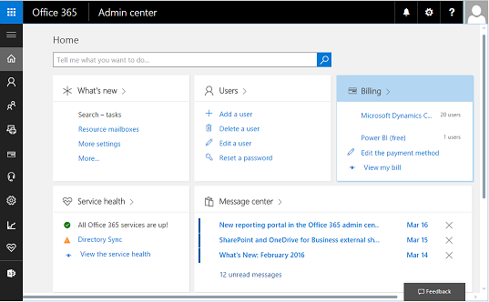
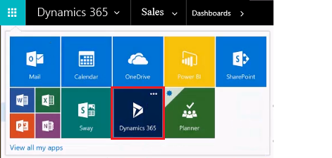
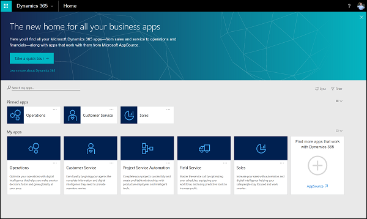
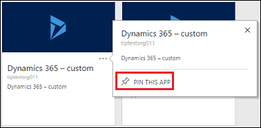
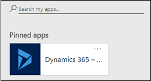
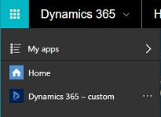
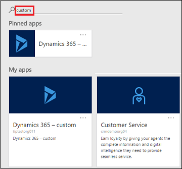
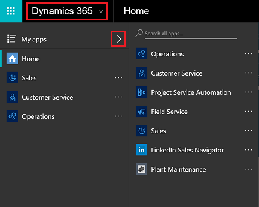

# Quickly navigate with the Office 365 app launcher and the Dynamics 365 home page

[!INCLUDE[cc-applies-to-update-9-0-0](../includes/cc_applies_to_update_9_0_0.md)] [!INCLUDE[cc-applies-to-update-8-2-0](../includes/cc_applies_to_update_8_2_0.md)]

[!INCLUDE[pn_dyn_365_online](../includes/pn-crm-online.md)] introduces a new app model for [!INCLUDE[pn_dyn_365](../includes/pn-dyn-365.md)] apps and makes accessing these and [!INCLUDE[pn_Office_365](../includes/pn-office-365.md)] apps fast and easy.  
  
 If you're a [!INCLUDE[pn_crm_online_shortest](../includes/pn-crm-online-shortest.md)] user with an [!INCLUDE[pn_Office_365](../includes/pn-office-365.md)] subscription, you're just two clicks away from accessing the family of online apps that are available to you, like [!INCLUDE[pn_ms_Word_short](../includes/pn-ms-word-short.md)] and Excel Online.  
  
 [Watch a short video (3:35) about the Dynamics 365 business apps](https://go.microsoft.com/fwlink/p/?linkid=837700).  
  
   
## For admins and end users: Quickly move between apps with the new Office 365 app launcher  
 The [!INCLUDE[pn_Office_365](../includes/pn-office-365.md)] app launcher is built in to all Dynamics and [!INCLUDE[pn_Office_365](../includes/pn-office-365.md)] apps. Use the app launcher to quickly navigate to your Dynamics application of choice.  
  
 If you have an [!INCLUDE[pn_Office_365](../includes/pn-office-365.md)] subscription, click  the app launcher to go to the [!INCLUDE[pn_Office_365](../includes/pn-office-365.md)] apps and services available to you.  
  
   
  
 Check your email.  Create  a [!INCLUDE[pn_ms_Word_short](../includes/pn-ms-word-short.md)] doc. Get files from your [!INCLUDE[pn_onedrive](../includes/pn-onedrive.md)].  All while staying just two clicks away from getting back to [!INCLUDE[pn_crm_online_shortest](../includes/pn-crm-online-shortest.md)].  
  
> [!NOTE]
> **TIP**: If you've just started a trial or upgraded to [!INCLUDE[pn_dyn_365](../includes/pn-dyn-365.md)], you might need to refresh or open a new browser session to see your apps. There might be a delay for your instance to fully provision.  
>   
>  For [!INCLUDE[pn_CRM_Online_Government_Full](../includes/pn-crm-online-government-full.md)] subscriptions, the [!INCLUDE[pn_Office_365](../includes/pn-office-365.md)] app launcher will take users to either [!INCLUDE[pn_CRM_Online](../includes/pn-crm-online.md)] or the [!INCLUDE[pn_dyn_365_admin_center](../includes/pn-dyn-365-admin-center.md)]. Admins will go to the [!INCLUDE[pn_dyn_365_admin_center](../includes/pn-dyn-365-admin-center.md)].  
  
   
## For admins: Get to the admin center through the Office 365 app launcher  
 If you're a [!INCLUDE[pn_dyn_365](../includes/pn-dyn-365.md)] system administrator or an [!INCLUDE[pn_Office_365](../includes/pn-office-365.md)] global administrator, click the app launcher to see the **Admin** tile.  
  
   
  
 Click the **Admin** tile to go to the [!INCLUDE[pn_office_365_admin_center](../includes/pn-office-365-admin-center.md)], where you can add users and change passwords.  
  
   
  
   
## For admins and end users: Introducing the Dynamics 365 home page  
 If you've transitioned to [!INCLUDE[pn_crm_8_2_0_online](../includes/pn-crm-8-2-0-online.md)], we have a new page for you to manage and open [!INCLUDE[pn_dyn_365](../includes/pn-dyn-365.md)] apps. Click **[!INCLUDE[pn_dyn_365](../includes/pn-dyn-365.md)]**from the app launcher, to go to the [!INCLUDE[pn_dyn_365](../includes/pn-dyn-365.md)] home page ([home.dynamics.com](http://home.dynamics.com)).  
  
   
  
 The new [!INCLUDE[pn_dyn_365](../includes/pn-dyn-365.md)] home page.  
  
   
  
> [!NOTE]
>  The [!INCLUDE[pn_dyn_365](../includes/pn-dyn-365.md)] home page is not part of the [!INCLUDE[pn_CRM_Online_Government_Full](../includes/pn-crm-online-government-full.md)] subscription. Clicking [!INCLUDE[pn_dyn_365](../includes/pn-dyn-365.md)] takes [!INCLUDE[pn_CRM_Online_Government_Full](../includes/pn-crm-online-government-full.md)] users to your instance of [!INCLUDE[pn_dyn_365_online](../includes/pn-crm-online.md)] or to the [!INCLUDE[pn_dyn_365_admin_center](../includes/pn-dyn-365-admin-center.md)].  
  
 See the next section to see what you can do with the home page.  
  
   
### View your apps  
 Any [!INCLUDE[pn_dyn_365](../includes/pn-dyn-365.md)] app for which you have a license appears as an app module tile on this page. If you have multiple instances of an app, select the tile for the instance you want to open.  
  
 In this example, there are two instances of [!INCLUDE[pn_dyn_365_online](../includes/pn-crm-online.md)] displayed.  
  
> [!TIP]
>  If you've just started a trial or upgraded to [!INCLUDE[pn_dyn_365](../includes/pn-dyn-365.md)], you might need to refresh or open a new browser session to see your apps. There might be a delay for your instance to fully provision.  
  
  on the home page")  
  
> [!NOTE]
> **What is "Dynamics 365 - custom"?**  
>   
>  "Dynamics 365 - custom" is the app name for all online organizations with a version 8.1 and lower as well as the default app on 8.2. The name for the 8.2 default app can be changed by the administrator.  
>   
> **What are the tiles on the home page?**  
>   
> [!INCLUDE[pn_dyn_365](../includes/pn-dyn-365.md)] is introducing a new app model and what you're seeing are [!INCLUDE[pn_dyn_365_online](../includes/pn-crm-online.md)] apps for which you're licensed once you've upgraded to [!INCLUDE[pn_crm_8_2_0_online](../includes/pn-crm-8-2-0-online.md)].  
>   
> **Admins: You have options for displaying and naming Dynamics 365 - custom.**  
>   
>  Once you update to [!INCLUDE[pn_crm_8_2_0_online](../includes/pn-crm-8-2-0-online.md)], you have options.  Go to **Settings** > **Administration** > **System Setting** > **General** tab. Scroll down to **Set options for the default app: Dynamics 365 - custom**.  
>   
> **Where do I get more information about upgrading to Dynamics 365?**  
>   
> -   [Important information for CRM Online customers](https://docs.microsoft.com/dynamics365/customer-engagement/admin/important-information-customers)  
> -   [Switch from Dynamics CRM Online to Dynamics 365 (online)](https://docs.microsoft.com/dynamics365/customer-engagement/admin/switch-dynamics-crm-online-dynamics-365)  
  
   
### Pin your frequently-used apps  
 For companies with lots of [!INCLUDE[pn_dyn_365](../includes/pn-dyn-365.md)] apps, you can do a variety of things to make the home page more manageable.  For example, pin your frequently-used apps to the top of your page.  
  
1.  Select the app on the home page.  
  
2.  Click the **ellipses** (...), and then click **Pin this app**.  
  
   
  
 The app will appear at the top of the home page and in the task pane.  
  
   
  
 Pinned in the home page.  
  
   
  
 Pinned in the task pane.  
  
   
### Search your apps  
 If you have a lot of apps, you can search for specific ones.  
  
   
  
   
## For admins and end users: Select a Dynamics 365 app from the new app switcher  
 For customers who have upgraded to [!INCLUDE[pn_crm_8_2_0_online](../includes/pn-crm-8-2-0-online.md)] or later, you can use the app switcher in [!INCLUDE[pn_dyn_365_online](../includes/pn-crm-online.md)] to quickly select other [!INCLUDE[pn_dyn_365](../includes/pn-dyn-365.md)] apps for which you're licensed.  
  
   
  
 You can pin apps using the ellipses on this menu, which will pin to the menu and to the home page.  
  
### See also  
 [Blog: Meet the all new Dynamics 365 Home page](https://dynamics365.wordpress.com/tag/dynamics-365-home-page/)   
 [Sign in to Dynamics and Office 365 apps](sign-in-office-365-apps.md)
 [My Apps on Home.Dynamics.com ](https://blogs.msdn.microsoft.com/crm/2017/03/30/my-apps-on-home-dynamics-com/)  
 [Important information for CRM Online customers](https://docs.microsoft.com/dynamics365/customer-engagement/admin/important-information-customers)   
 [Switch from Dynamics CRM Online to Dynamics 365 (online)](https://docs.microsoft.com/dynamics365/customer-engagement/admin/switch-dynamics-crm-online-dynamics-365)   
 [Meet the Office 365 app launcher](https://support.office.com/article/Meet-the-Office-365-app-launcher-79f12104-6fed-442f-96a0-eb089a3f476a)   
