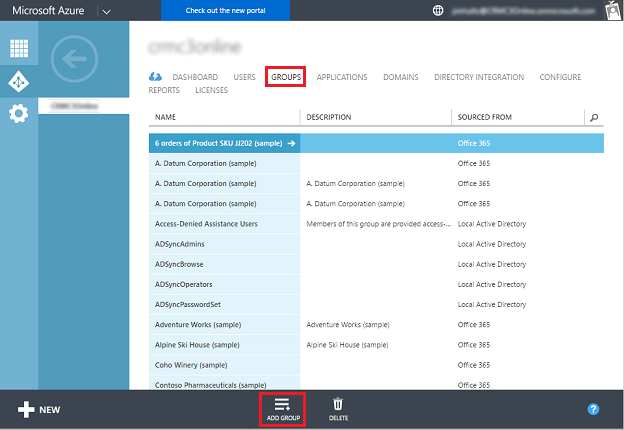
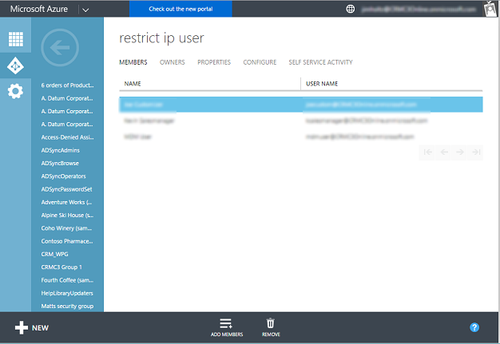
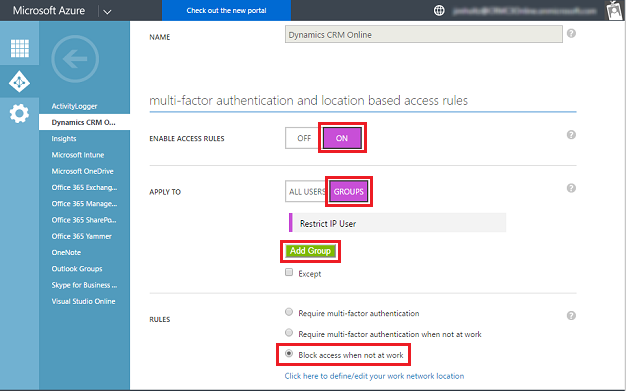
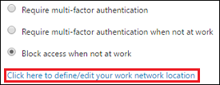
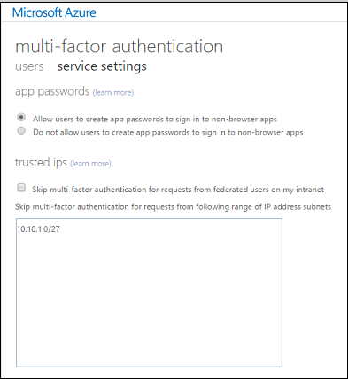

# Restrict access with trusted IP rules

[!INCLUDE[cc-applies-to-update-9-0-0](../includes/cc_applies_to_update_9_0_0.md)] [!INCLUDE[cc-applies-to-update-8-2-0](../includes/cc_applies_to_update_8_2_0.md)]

You can limit access to [!INCLUDE[pn_crm_online_shortest](../includes/pn-crm-online-shortest.md)] to users with   trusted IP addresses to reduce unauthorized access. When trusted IP address restrictions are set in a user’s profile and the user tries to log in from an untrusted IP address, access to [!INCLUDE[pn_crm_online_shortest](../includes/pn-crm-online-shortest.md)] is blocked.  
  
 **Requirements**  
  
-   A subscription to [Azure Active Directory Premium](https://www.microsoft.com/cloud-platform/azure-active-directory).  
  
-   A federated or managed [!INCLUDE[pn_azure_active_directory](../includes/pn-azure-active-directory.md)] tenant.  
  
-   Federated tenants require that multi-factor authentication (MFA) be enabled.  
  
   
## Additional security considerations  
 IP restriction is only enforced during user authentication.  This is done by the [!INCLUDE[pn_azure_active_directory](../includes/pn-azure-active-directory.md)] Conditional Access capability. [!INCLUDE[pn_crm_online_shortest](../includes/pn-crm-online-shortest.md)] sets a session timeout limit to balance protecting user data and the number of times users are prompted for their sign-in credentials. Trusted IP restriction for devices (including laptops) is not applied until the [!INCLUDE[pn_crm_online_shortest](../includes/pn-crm-online-shortest.md)] session timeout expires.  
  
 For example, a trusted IP restriction is setup to only allow access to [!INCLUDE[pn_crm_shortest](../includes/pn-crm-shortest.md)] when users are working from a corporate office.  When a [!INCLUDE[pn_crm_shortest](../includes/pn-crm-shortest.md)] user signs in into [!INCLUDE[pn_crm_shortest](../includes/pn-crm-shortest.md)] using their laptop from their office and establishes a [!INCLUDE[pn_crm_shortest](../includes/pn-crm-shortest.md)] session, the user can continue to access [!INCLUDE[pn_crm_shortest](../includes/pn-crm-shortest.md)] after leaving the office until the [!INCLUDE[pn_crm_shortest](../includes/pn-crm-shortest.md)] session timeout expires.  This behavior also applies to mobile and offsite connections such as: Dynamics 365 for phones and tablets, and [!INCLUDE[pn_crm_app_for_outlook_short](../includes/pn-crm-app-for-outlook-short.md)].  
  
   
## Create security group (optional)  
 You can restrict access to all Users or groups of users.  It's more efficient to restrict by a group if only a subset of your Azure Active Directory (AAD) users are accessing [!INCLUDE[pn_crm_online_shortest](../includes/pn-crm-online-shortest.md)].  
  
1.  Sign in to your [Azure portal](https://portal.azure.com).  
  
2.  Click **Browse** > **Active Directory**, and then select your [!INCLUDE[pn_crm_online_shortest](../includes/pn-crm-online-shortest.md)] directory.  
  
3.  Click **Groups** > **Add Group**, and then fill in the settings to create a new group.  
  
  
  
4.  Click the group you created and add members.  
 
  
  
   
## Create a location based access rule  
 Access restriction is set using Azure Active Directory (AD) Conditional Access. See [Getting started with conditional access to Azure AD](https://azure.microsoft.com/documentation/articles/active-directory-conditional-access-azuread-connected-apps/).  You control Conditional Access through an access rule.  
  
> [!NOTE]
>  Setting Conditional Access is only available with an [!INCLUDE[pn_azure_active_directory](../includes/pn-azure-active-directory.md)] Premium license.  Upgrade your Azure AD to a Premium license in the Office 365 admin center (**https://portal.office.com** > **Billing** > **Purchase services**).  
  
1.  Sign in to your [Azure portal](https://portal.azure.com).  
  
2.  Click **Browse** > **Active Directory**, and then select your [!INCLUDE[pn_crm_online_shortest](../includes/pn-crm-online-shortest.md)] directory.  
  
3.  Click **Applications**, and then click  the **Dynamics 365 Online** web application.  
 
   web app") 
  
4.  Click **Configure**.  
 
   instance")

5.  Set the following on the Properties page:  
  
    1.  Set **Enable Access Rule** to **On**.  
  
    2.  Optional: Set **Apply to** to **Groups**.  
  
    3.  Optional: Click **Add Group** to select a group.  
  
    4.  Set **Rules** to **Block access when not at work**.  
  
      
  
    5.  Click **Save** > **OK**.  
  
    6.  Click **Click here to define/edit your work network location**.  
  
      

6.  Enter  trusted IP addresses (using [CIDR notation](https://en.wikipedia.org/wiki/Classless_Inter-Domain_Routing)).  
  
  
  
7.  Click **Save**.  
  
### See also  
 [How to set Azure Active Directory device-based conditional access policy for access control to Azure Active Directory connected applications](https://azure.microsoft.com/documentation/articles/active-directory-conditional-access-policy-connected-applications/)   
