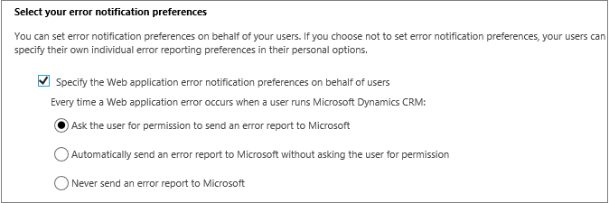
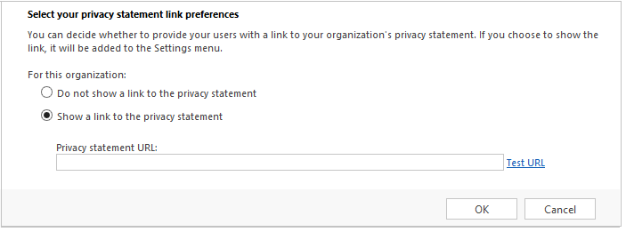

# Set privacy preferences for an organization

[!INCLUDE[cc-applies-to-update-9-0-0](../includes/cc_applies_to_update_9_0_0.md)] [!INCLUDE[cc-applies-to-update-8-2-0](../includes/cc_applies_to_update_8_2_0.md)]

Manage users’ data privacy by controlling when to send error notifications, and also let users know how their privacy is protected by displaying your organization’s own privacy statement instead of the one from [!INCLUDE[cc_Microsoft](../includes/cc-microsoft.md)].  
  
## Set error reporting preferences for the organization  
 When errors occur in the product, data about the problem is sent to [!INCLUDE[cc_Microsoft](../includes/cc-microsoft.md)]. This data – an error report - allows [!INCLUDE[cc_Microsoft](../includes/cc-microsoft.md)] to track and address errors relating to [!INCLUDE[pn_microsoftcrm](../includes/pn-microsoftcrm.md)]. You can help [!INCLUDE[cc_Microsoft](../includes/cc-microsoft.md)] improve products and services when you allow the system to send these error reports.  
  
 By default, individual users in [!INCLUDE[pn_dynamics_crm](../includes/pn-dynamics-crm.md)] have a measure of control over whether to send error reports to [!INCLUDE[cc_Microsoft](../includes/cc-microsoft.md)]. But you, as an administrator, can override their preferences and set up the error reporting preferences for the entire organization.  
  
1. [!INCLUDE[proc_permissions_system_admin_and_customizer](../includes/proc-permissions-system-admin-and-customizer.md)]  
  
    Check your security role  
  
    - [!INCLUDE[proc_follow_steps_in_link](../includes/proc-follow-steps-in-link.md)]  
  
    - [!INCLUDE[proc_dont_have_correct_permissions](../includes/proc-dont-have-correct-permissions.md)]  
  
2. [!INCLUDE[proc_settings_administration](../includes/proc-settings-administration.md)]  
  
3.  Choose **Privacy Preferences**.  
  
4.  Under **Select your error notification preferences**, choose **Specify the Web application error notification preferences on behalf of users**, and then select one of the options.  
  
   
  
 When you use this setting, you can control error reporting for the entire organization by:  
  
 -   Not allowing users to make changes in how error reporting occurs.  
  
 -   Changing the default behavior for how error reporting happens.  
  
## Replace the privacy statement for the organization  
 By default, the [!INCLUDE[cc_Microsoft](../includes/cc-microsoft.md)] privacy statement is always shown to users with an administrator role only, and not to other (business) users. As an administrator, you can add a link to specify your organization's privacy statement, which is then shown to other users in your organization.  
  
1. [!INCLUDE[proc_permissions_system_admin_and_customizer](../includes/proc-permissions-system-admin-and-customizer.md)]  
  
    Check your security role  
  
    - [!INCLUDE[proc_follow_steps_in_link](../includes/proc-follow-steps-in-link.md)]  
  
    - [!INCLUDE[proc_dont_have_correct_permissions](../includes/proc-dont-have-correct-permissions.md)]  
  
2. [!INCLUDE[proc_settings_administration](../includes/proc-settings-administration.md)]  
  
3.  Choose **Privacy Preferences**.  
  
4.  Under **Select your privacy statement link preferences**, choose **Show a link to the privacy statement**, and then, in the **Privacy statement URL** box, type the link of the webpage you want to show.  
  
   
  
5.  To make sure the link is correct, choose **Test URL**.  
  
 After you add the privacy statement URL, the link directs all [!INCLUDE[pn_microsoftcrm](../includes/pn-microsoftcrm.md)] users to the specified link.  
  
> [!NOTE]
>  Any user with the System Administrator security role will always see the [!INCLUDE[cc_Microsoft](../includes/cc-microsoft.md)] privacy statement and not the organization’s privacy statement.  
  
### See also  
 [Get Help from the Microsoft Dynamics 365 Community](http://go.microsoft.com/fwlink/p/?LinkID=856838)
