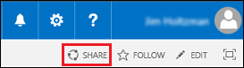
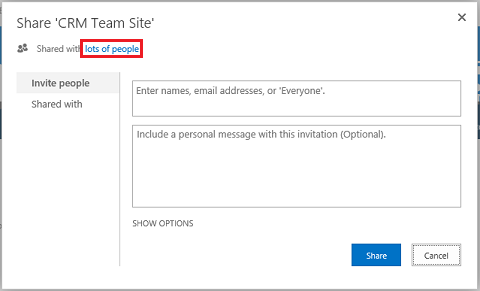
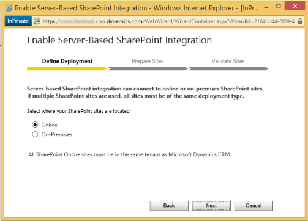
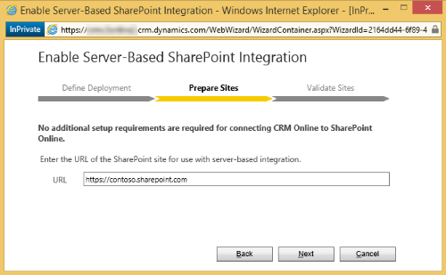
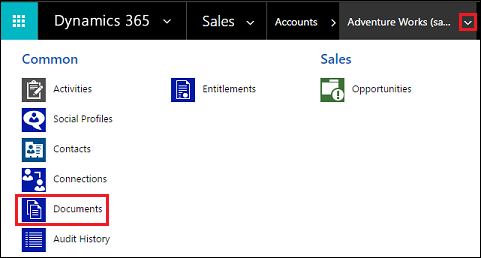
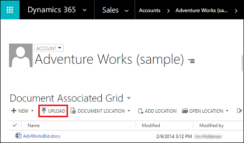
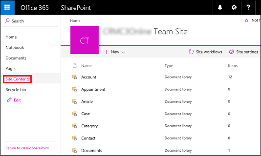

# Set up Dynamics 365 (online) to use SharePoint Online

[!INCLUDE[cc-applies-to-update-9-0-0](../includes/cc_applies_to_update_9_0_0.md)] [!INCLUDE[cc-applies-to-update-8-2-0](../includes/cc_applies_to_update_8_2_0.md)]

When you use [!INCLUDE[pn_microsoft_sharepoint_online](../includes/pn-microsoft-sharepoint-online.md)] with [!INCLUDE[pn_CRM_Online](../includes/pn-crm-online.md)], you can:  
  
-   Create, upload, view, and delete documents stored in [!INCLUDE[pn_SharePoint_short](../includes/pn-sharepoint-short.md)] from within [!INCLUDE[pn_microsoftcrm](../includes/pn-microsoftcrm.md)].  
  
-   Use the [!INCLUDE[pn_SharePoint_short](../includes/pn-sharepoint-short.md)] document management abilities within [!INCLUDE[pn_microsoftcrm](../includes/pn-microsoftcrm.md)], such as checking the document in and out, viewing version history, and changing document properties.  
  
-   Enable non-[!INCLUDE[pn_microsoftcrm](../includes/pn-microsoftcrm.md)] users, such as customers who want to review a bid, to directly access the [!INCLUDE[pn_SharePoint_short](../includes/pn-sharepoint-short.md)] documents, provided they have the appropriate permissions.  
  
> [!IMPORTANT]
>  This topic is for organizations who wish to deploy for the first time or upgrade to server-based [!INCLUDE[pn_SharePoint_short](../includes/pn-sharepoint-short.md)] integration. After you enable server-based [!INCLUDE[pn_SharePoint_short](../includes/pn-sharepoint-short.md)] integration, you can’t revert to the previous client-based authentication method.  
>   
>  For some organizations, using the [!INCLUDE[pn_list_component_short](../includes/pn-list-component-short.md)] solution might be a better choice. [!INCLUDE[proc_more_information](../includes/proc-more-information.md)] [Configure SharePoint integration using the list component](https://docs.microsoft.com/dynamics365/customer-engagement/admin/configure-sharepoint-integration-using-list-component).  
  
> [!TIP]
>  Check out the following video: [Connect Dynamics 365 to SharePoint Online](https://go.microsoft.com/fwlink/p/?linkid=837790)  
  
 To set up [!INCLUDE[pn_crm_online_shortest](../includes/pn-crm-online-shortest.md)] to use [!INCLUDE[pn_sharepoint_online](../includes/pn-sharepoint-online.md)], complete the following steps.  
  
   

## Assign user permissions to the Team SharePoint site  
 Your [!INCLUDE[pn_CRM_Online](../includes/pn-crm-online.md)] and [!INCLUDE[pn_MS_Office_365](../includes/pn-ms-office-365.md)] users are not automatically allowed access to your [!INCLUDE[pn_SharePoint_short](../includes/pn-sharepoint-short.md)] sites. You must work within the [!INCLUDE[pn_SharePoint_short](../includes/pn-sharepoint-short.md)] site to assign specific permission levels to individual users or groups.  
  
#### Assign users to the Team site  
  
1. [!INCLUDE[proc_office365_signin](../includes/proc-office365-signin.md)]  
  
2.  Open the [!INCLUDE[pn_Office_365](../includes/pn-office-365.md)] app launcher, and then click **SharePoint**.  
  
3.  3.  On the left-side menu, click **Team Site**.  
  
4.  On the Home page, click **SHARE** (upper-right corner).  
  
   
  
5.  To view the default permissions for your team site, click **lots of people**.  
  
   
  
6.  By default, all users in your [!INCLUDE[pn_MS_Office_365](../includes/pn-ms-office-365.md)] organization are able to add and edit documents on the Team [!INCLUDE[pn_SharePoint_short](../includes/pn-sharepoint-short.md)] site. To invite others, choose **Invite people** and add people external to your organization to share documents.  
  
For more information about [!INCLUDE[pn_SharePoint_short](../includes/pn-sharepoint-short.md)] permissions, see [Introduction: Control user access with permissions](https://support.office.com/Article/Introduction-Control-user-access-with-permissions-ab2d1ab1-07cf-4c69-bdd9-390bfd787b26)  
  
  
 
## Configure Dynamics 365 (online) for SharePoint document management  
 For [!INCLUDE[pn_crm_online_shortest](../includes/pn-crm-online-shortest.md)] organizations, [!INCLUDE[pn_v6_online_ur1](../includes/pn-v6-online-ur1.md)] introduced a new server-based (using server-to-server authentication) [!INCLUDE[pn_SharePoint_short](../includes/pn-sharepoint-short.md)] integration that removes the need to install or continue to use the [!INCLUDE[pn_list_component_short](../includes/pn-list-component-short.md)] solution.  
  
 If you are a new organization and have not yet deployed document management, see [Configure a new organization](https://docs.microsoft.com/dynamics365/customer-engagement/admin/set-up-dynamics-365-online-to-use-sharepoint-online#BKMK_ConfigNewOrg).  
  
 If your organization is already using document management with [!INCLUDE[pn_list_component_short](../includes/pn-list-component-short.md)], you can switch to server-based [!INCLUDE[pn_SharePoint_short](../includes/pn-sharepoint-short.md)] integration. [!INCLUDE[proc_more_information](../includes/proc-more-information.md)] [Switching from the list component or changing the deployment](https://docs.microsoft.com/dynamics365/customer-engagement/admin/switching-list-component-changing-deployment)  
  
> [!IMPORTANT]
>  The [!INCLUDE[pn_list_component_short](../includes/pn-list-component-short.md)] builds the SharePoint library using the internal name of the document-enabled entity in [!INCLUDE[pn_crm_shortest](../includes/pn-crm-shortest.md)]. Server-based [!INCLUDE[pn_SharePoint_short](../includes/pn-sharepoint-short.md)] integration uses the entity display name. When you upgrade to server-based [!INCLUDE[pn_SharePoint_short](../includes/pn-sharepoint-short.md)] integration, be sure to check that the display names in your document library on [!INCLUDE[pn_SharePoint_short](../includes/pn-sharepoint-short.md)] match the entity display names in [!INCLUDE[pn_crm_shortest](../includes/pn-crm-shortest.md)]. [!INCLUDE[proc_more_information](../includes/proc-more-information.md)] ["Validation Error" when you try to configure server-based SharePoint integration for Microsoft Dynamics CRM Online and SharePoint Online](http://go.microsoft.com/fwlink/p/?LinkID=402112).  
  
   
  
 These names should match.  
  
   

### Configure a new organization  
 If your [!INCLUDE[pn_crm_shortest](../includes/pn-crm-shortest.md)] organization has not deployed document management, when a [!INCLUDE[pn_crm_shortest](../includes/pn-crm-shortest.md)] System Administrator logs in an alert message will be displayed to enable server-based [!INCLUDE[pn_SharePoint_short](../includes/pn-sharepoint-short.md)] integration.  
  
   
  
> [!NOTE]
>  If you don’t see the alert and have not previously enabled server-based [!INCLUDE[pn_SharePoint_short](../includes/pn-sharepoint-short.md)] integration, clear your browser cache or open [!INCLUDE[pn_crm_shortest](../includes/pn-crm-shortest.md)] using [!INCLUDE[pn_Internet_Explorer](../includes/pn-internet-explorer.md)] with InPrivate browsing to have the alert display again. Once you configure server-based integration, the alert will no longer appear.  
  
1.  In the Enable Server-based SharePoint Integration alert click **Next**.  
  
2.  Choose **Online** for where your [!INCLUDE[pn_SharePoint_short](../includes/pn-sharepoint-short.md)] sites are located, and then choose **Next**.  
  
   
  
3.  If your [!INCLUDE[pn_CRM_Online](../includes/pn-crm-online.md)] is not connected to a [!INCLUDE[pn_SharePoint_short](../includes/pn-sharepoint-short.md)] online site, enter the URL (for example https://contoso.sharepoint.com) of your [!INCLUDE[pn_SharePoint_short](../includes/pn-sharepoint-short.md)] site that you will use for auto folder creation, and then choose **Next**.  
  
    > [!TIP]
    >  To see your [!INCLUDE[pn_SharePoint_short](../includes/pn-sharepoint-short.md)] site collections, in the [!INCLUDE[pn_office_365_admin_center](../includes/pn-office-365-admin-center.md)], click **Admin centers** > **SharePoint**, and then click **site collections**.  
  
   
  
4.  The URL will be checked for being a valid [!INCLUDE[pn_SharePoint_short](../includes/pn-sharepoint-short.md)] online site and for existing in the same [!INCLUDE[pn_Office_365](../includes/pn-office-365.md)] tenant as your [!INCLUDE[pn_crm_shortest](../includes/pn-crm-shortest.md)] organization. After enabling server-based [!INCLUDE[pn_SharePoint_short](../includes/pn-sharepoint-short.md)] integration you can’t go back to the previous client-side integration. Choose **Enable**.  
  
After you enable server-based [!INCLUDE[pn_SharePoint_short](../includes/pn-sharepoint-short.md)] the options to Install List Components and to enable server-based integration will no longer appear as an option in Document Management.  
  
Once server-based [!INCLUDE[pn_SharePoint_short](../includes/pn-sharepoint-short.md)] integration is enabled you will need to enable the entities you want available for document management integration. [!INCLUDE[proc_more_information](../includes/proc-more-information.md)] [Enable document management on entities](https://docs.microsoft.com/dynamics365/customer-engagement/admin/enable-sharepoint-document-management-specific-entities)    
  
   

## Using Document Management  
 You are now ready to add document storage locations to the entities you enabled above and start managing documents. Begin by opening a document management-enabled record (for example, Contact).  
  
1.  Browse to your [!INCLUDE[pn_CRM_Online](../includes/pn-crm-online.md)] web application.  
  
2.  Choose an account, such as the **Adventure Works** sample account.  
  
3.  On the nav bar, click the down arrow next to the account name, and then click **Documents**.  
  
   
  
4.  Click **Upload**, and then browse to a document to upload to the new folder in your [!INCLUDE[pn_MS_Office_365](../includes/pn-ms-office-365.md)][!INCLUDE[pn_sharepoint_online](../includes/pn-sharepoint-online.md)] Team site.  
  
   
  
5.  Select a [!INCLUDE[pn_dyn_365](../includes/pn-dyn-365.md)] folder location, and then click **Ok**.  
  
6.  To see the document in your [!INCLUDE[pn_MS_Office_365](../includes/pn-ms-office-365.md)][!INCLUDE[pn_sharepoint_online](../includes/pn-sharepoint-online.md)] Team site, click to the left of the document name (you’ll see a check mark), and then click **Open Location**.  
  
  
  
7.  Click **Site Contents** to see all the document libraries created for the managed entities you selected.  
  
     The entities you selected to be managed by Document Management appear as document libraries (for example: Account, Article, Case, Lead, Opportunity, Product, Quote, and Sales Literature).  
  
   
  
### See also  
 [Manage your documents using SharePoint](manage-documents-using-sharepoint.md)   
 [SharePoint Online for IT pros](https://technet.microsoft.com/sharepoint/gg144571)   

