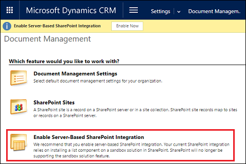
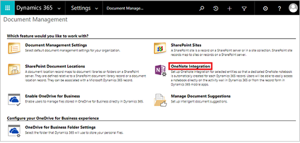
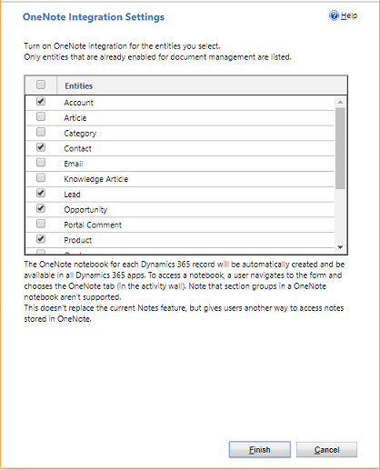
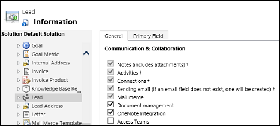

# Set up OneNote integration

[!INCLUDE[cc-applies-to-update-9-0-0](../includes/cc_applies_to_update_9_0_0.md)] [!INCLUDE[cc-applies-to-update-8-2-0](../includes/cc_applies_to_update_8_2_0.md)]

Gather your thoughts, ideas, plans and research in one single place with [!INCLUDE[pn_onenote](../includes/pn-onenote.md)] in [!INCLUDE[pn_microsoftcrm](../includes/pn-microsoftcrm.md)].  
  
 When you turn on [!INCLUDE[pn_microsoft_onenote](../includes/pn-microsoft-onenote.md)] integration in [!INCLUDE[pn_CRM_online](../includes/pn-crm-online.md)], you have the benefits of using [!INCLUDE[pn_onenote](../includes/pn-onenote.md)] to take or review customer notes from within your [!INCLUDE[pn_crm_shortest](../includes/pn-crm-shortest.md)] records.  
  
 You can configure [!INCLUDE[pn_onenote](../includes/pn-onenote.md)] in [!INCLUDE[pn_crm_online_shortest](../includes/pn-crm-online-shortest.md)] when you're also using [!INCLUDE[pn_sharepoint_online](../includes/pn-sharepoint-online.md)]. You must have a subscription to [!INCLUDE[pn_Office_365](../includes/pn-office-365.md)] to use [!INCLUDE[pn_onenote](../includes/pn-onenote.md)] in [!INCLUDE[pn_crm_online_shortest](../includes/pn-crm-online-shortest.md)].  
  
   
## Step 1: Turn on server-based SharePoint integration  

 Before you can enable [!INCLUDE[pn_onenote](../includes/pn-onenote.md)] integration, you need to [turn on server-based SharePoint integration](https://docs.microsoft.com/dynamics365/customer-engagement/admin/set-up-sharepoint-integration).  
  
 [!INCLUDE[proc_permissions_system_admin](../includes/proc-permissions-system-admin.md)] Or, make sure that you have Read and Write privileges on all record types that are customizable.  
  
#### Check your security role  
  
- [!INCLUDE[proc_follow_steps_in_link](../includes/proc-follow-steps-in-link.md)]  
  
- [!INCLUDE[proc_dont_have_correct_permissions](../includes/proc-dont-have-correct-permissions.md)]  
  
   
  
   
## Step 2: Turn on OneNote integration  

 When server-based [!INCLUDE[pn_SharePoint_short](../includes/pn-sharepoint-short.md)] integration is turned on, **[!INCLUDE[pn_onenote](../includes/pn-onenote.md)] integration** is listed in **Document Management**.  
  
1. [!INCLUDE[proc_settings_doc_mgmt](../includes/proc-settings-doc-mgmt.md)]  
  
2.  Select **OneNote Integration**.  
  
   
  
3.  Follow the instructions in the wizard to turn on [!INCLUDE[pn_onenote](../includes/pn-onenote.md)] integration for selected entities. Choose entities that need a full notebook per record. Only entities that are already enabled for document management are listed. Select **Finish**.  
  
   
  
4.  You can also enable [!INCLUDE[pn_onenote](../includes/pn-onenote.md)] integration for an entity from the customization form, as long as document management has been enabled for that entity.  
  
   
  
5.  A [!INCLUDE[pn_onenote](../includes/pn-onenote.md)] notebook is automatically created for a record the first time you select the **OneNote** tab in the activities area in [!INCLUDE[pn_CRM_online](../includes/pn-crm-online.md)]. After the dedicated [!INCLUDE[pn_onenote](../includes/pn-onenote.md)] notebook is created for that [!INCLUDE[pn_crm_shortest](../includes/pn-crm-shortest.md)] record, you can view and navigate to that notebook from any [!INCLUDE[pn_crm_shortest](../includes/pn-crm-shortest.md)] client.  
  
[!INCLUDE[proc-more-information](../includes/proc-more-information.md)]  [Use OneNote in Dynamics 365 (online)](https://docs.microsoft.com/dynamics365/customer-engagement/basics/use-onenote)
  
## To turn off OneNote integration  
  
1. [!INCLUDE[proc_settings_doc_mgmt](../includes/proc-settings-doc-mgmt.md)]  
  
2.  Select **OneNote Integration**.  
  
   
  
3.  In the **OneNote Integration Setting** dialog box, clear the check boxes for all entities, and then select **Finish**.  
  
### See also  
 [Use OneNote in Dynamics 365 (online)](https://docs.microsoft.com/dynamics365/customer-engagement/basics/use-onenote)   
 [OneNote in Dynamics 365 FAQs](https://docs.microsoft.com/dynamics365/customer-engagement/basics/onenote-dynamics-365-faqs)   
 [Turn on server-based SharePoint integration](https://docs.microsoft.com/dynamics365/customer-engagement/admin/set-up-sharepoint-integration)   
 [Blog: OneNote in CRM](http://blogs.technet.com/b/lystavlen/archive/2015/03/31/make-a-note-of-this.aspx)
