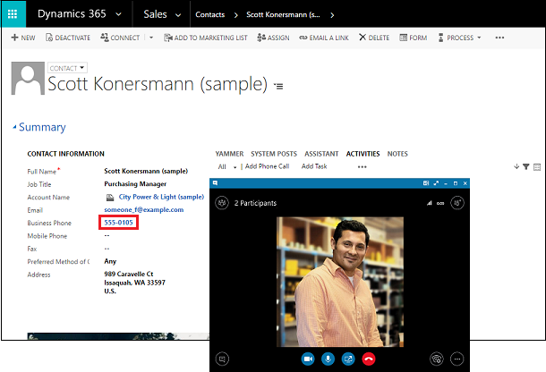
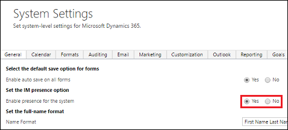
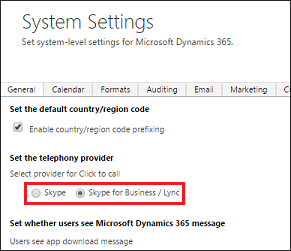
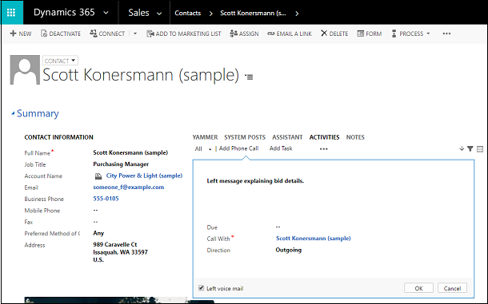

# Set up Dynamics 365 (online) to use Skype or Skype for Business

[!INCLUDE[cc-applies-to-update-9-0-0](../includes/cc_applies_to_update_9_0_0.md)] [!INCLUDE[cc-applies-to-update-8-2-0](../includes/cc_applies_to_update_8_2_0.md)]

When you use [!INCLUDE[pn_skype_for_business](../includes/pn-skype-for-business.md)] and [!INCLUDE[pn_CRM_Online](../includes/pn-crm-online.md)], your organization can benefit from these capabilities:  
  
-   Real-time communications with customers, colleagues, and team members without leaving [!INCLUDE[pn_microsoftcrm](../includes/pn-microsoftcrm.md)]. Click or tap a person’s phone number to call them.  
  
-   Track meetings as Activities in [!INCLUDE[pn_microsoftcrm](../includes/pn-microsoftcrm.md)].  
  
-   Get Presence information for members of the same email domain you are signed in with in [!INCLUDE[pn_skype_for_business](../includes/pn-skype-for-business.md)].  
  
   
  
## Set up Skype in Microsoft Dynamics 365 (online)  
  
1.  Verify that IM presence is enabled in [!INCLUDE[pn_microsoftcrm](../includes/pn-microsoftcrm.md)]. Go to **Settings** > **Administration** > **System Settings** > **General tab**.  
  
   
  
2.  In **System Settings**, set the telephony provider to [!INCLUDE[pn_skype_for_business](../includes/pn-skype-for-business.md)].  
  
   
  
3. [!INCLUDE[proc_office365_signin](../includes/proc-office365-signin.md)]  
  
4.  On the [!INCLUDE[pn_office_365_admin_center](../includes/pn-office-365-admin-center.md)] page, click or tap **Admin** > **Skype for Business** > **organization**.  
  
5.  Choose the **general** tab. Review and set the presence privacy mode.  
  
    > [!NOTE]
    >  Presence information is shown for members of the same email domain you are signed in to with [!INCLUDE[pn_skype_for_business](../includes/pn-skype-for-business.md)]. For example, if you are signed in with someone@contoso.com, you will see presence for other @contoso.com users.  
    >   
    >  Instruct users to add the following as trusted sites in their browser:  
    >   
    > -   https://*.dynamics.com  
    > -   https://*.lync.com  
    > -   https://*.sharepoint.com  
    > -   https://login.microsoftonline.com  
  
6.  Choose the **external communications** tab. Review and set the **external access** and public **IM connectivity** settings.  
  
   
  
## Tracking Skype  
 Now that [!INCLUDE[pn_skype](../includes/pn-skype.md)] is setup, your [!INCLUDE[pn_skype](../includes/pn-skype.md)] calls are tracked as activities.  
  
   
  
### See also 
 [Skype for Business and Skype integration with Microsoft Dynamics 365](skype-business-integration.md)   
 [Skype for Business help](https://support.office.com/en-us/skype-for-business)
