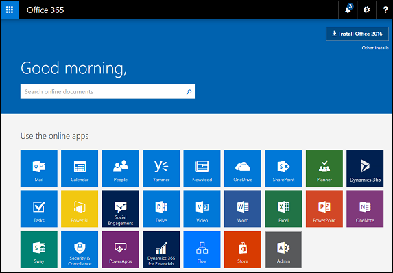
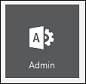
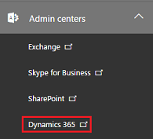

# Sign in to Customer Engagement and Office 365 apps

> [!NOTE]
>   [!INCLUDE[cc-under-construction](../includes/cc-under-construction.md)]

[!INCLUDE[cc-applies-to-update-9-0-0](../includes/cc_applies_to_update_9_0_0.md)] [!INCLUDE[cc-applies-to-update-8-2-0](../includes/cc_applies_to_update_8_2_0.md)]

There are multiple ways to sign in and access your Dynamics and [!INCLUDE[pn_Office_365](../includes/pn-office-365.md)] apps. You can sign in by using the [!INCLUDE[pn_office_365_admin_center](../includes/pn-office-365-admin-center.md)], or sign in directly. For [!INCLUDE[pn_crm_8_2_0_online](../includes/pn-crm-8-2-0-online.md)], we're introducing the [!INCLUDE[pn_Office_365](../includes/pn-office-365.md)] home page which you can also sign in to directly.  
  
> [!TIP]
>  Admins: Be sure to share this information with your end users.  
>   
>  You can troubleshoot issues with signing in to [!INCLUDE[pn_dyn_365](../includes/pn-dyn-365.md)] using the Support and Recovery Assistant for Office 365. For more information, see the blog [New diagnostic scenario for web sign-in](https://community.dynamics.com/crm/b/dynamicscrmsupportblog/archive/2016/11/15/new-diagnostic-scenario-for-web-sign-in).  
  
   
## Signing in to https://portal.office.com  
 For admins and end users, when you sign in to https://portal.office.com, you will go to the [!INCLUDE[pn_Office_365](../includes/pn-office-365.md)] Welcome page. The tiles that appear on the Welcome page depend on what licenses you have. For example, if you have licenses for [!INCLUDE[pn_Office_365](../includes/pn-office-365.md)] and [!INCLUDE[pn_crm_online_shortest](../includes/pn-crm-online-shortest.md)], you'll see tiles for [!INCLUDE[pn_MS_Office](../includes/pn-ms-office.md)] apps like [!INCLUDE[pn_ms_Word_short](../includes/pn-ms-word-short.md)], [!INCLUDE[pn_onedrive](../includes/pn-onedrive.md)], and [!INCLUDE[pn_SharePoint_short](../includes/pn-sharepoint-short.md)], as well as a tile for [!INCLUDE[pn_crm_shortest](../includes/pn-crm-shortest.md)].  
  
   
  
 Click the [!INCLUDE[pn_crm_shortest](../includes/pn-crm-shortest.md)] tile to go to the [!INCLUDE[pn_crm_shortest](../includes/pn-crm-shortest.md)] Home page. See [For admins and end users: Introducing the Dynamics 365 home page](quickly-navigate-office-365-app-launcher.md#BKMK_IntroD365HomePage).  
  
 If you're a [!INCLUDE[pn_crm_shortest](../includes/pn-crm-shortest.md)] system administrator, you'll see an **Admin** tile. Click this tile to get to the [!INCLUDE[pn_office_365_admin_center](../includes/pn-office-365-admin-center.md)], where you can see your service health, manage users, manage licenses, and more for all the online services associated with your account.  
  
   
  
 From there, you can get to the [!INCLUDE[pn_dyn_365_admin_center](../includes/pn-dyn-365-admin-center.md)]. Click **Admin centers** > **Dynamics 365**.  
  
   
  
 For other ways to access Dynamics and [!INCLUDE[pn_Office_365](../includes/pn-office-365.md)] apps, see [Quickly navigate with the Office 365 app launcher and the Dynamics 365 home page](quickly-navigate-office-365-app-launcher.md).  
  
   
## Direct sign in to the Dynamics 365 Administration Center  
 Some [!INCLUDE[pn_dyn_365](../includes/pn-dyn-365.md)] admin or Office 365 admin roles might be unable to access the [!INCLUDE[pn_dyn_365_admin_center](../includes/pn-dyn-365-admin-center.md)] after signing in to https://portal.office.com. Use the following steps to directly navigate to the [!INCLUDE[pn_dyn_365_admin_center](../includes/pn-dyn-365-admin-center.md)] and manage your [!INCLUDE[pn_crm_online_shortest](../includes/pn-crm-online-shortest.md)] instance.  
  
1.  Go to https://port.\<region>.dynamics.com/G/instances/InstancePicker.aspx  
  
     Replace \<region> with the region identifier or use one of the links below.  
  
    |Region identifier|URL|  
    |-----------------------|---------|  
    |**crm** for North America (NAM)|[https://port.crm.dynamics.com/G/instances/InstancePicker.aspx](https://port.crm.dynamics.com/G/instances/InstancePicker.aspx)|  
    |**crm2** for South America (LATAM/SAM)|[https://port.crm2.dynamics.com/G/instances/InstancePicker.aspx](https://port.crm2.dynamics.com/G/instances/InstancePicker.aspx)|  
    |**crm3** for Canada (CAN)|[https://port.crm3.dynamics.com/G/instances/InstancePicker.aspx](https://port.crm3.dynamics.com/G/instances/InstancePicker.aspx)|  
    |**crm4** for Europe, Middle East, Africa (EMEA)|[https://port.crm4.dynamics.com/G/instances/InstancePicker.aspx](https://port.crm4.dynamics.com/G/instances/InstancePicker.aspx)|  
    |**crm5** for Asia Pacific (APAC)|[https://port.crm5.dynamics.com/G/instances/InstancePicker.aspx](https://port.crm5.dynamics.com/G/instances/InstancePicker.aspx)|  
    |**crm6** for Oceania (OCE)|[https://port.crm6.dynamics.com/G/instances/InstancePicker.aspx](https://port.crm6.dynamics.com/G/instances/InstancePicker.aspx)|  
    |**crm7** for Japan (JPN)|[https://port.crm7.dynamics.com/G/instances/InstancePicker.aspx](https://port.crm7.dynamics.com/G/instances/InstancePicker.aspx)|  
    |**crm8** for India (IND)|[https://port.crm8.dynamics.com/G/instances/InstancePicker.aspx](https://port.crm8.dynamics.com/G/instances/InstancePicker.aspx)|  
    |**crm11** for United Kingdom (UK)|[https://port.crm11.dynamics.com/G/instances/InstancePicker.aspx](https://port.crm11.dynamics.com/G/instances/InstancePicker.aspx)|  
  
     For Germany (DEU), use the following: https://port.crm.microsoftdynamics.de/g/instances.instancepicker.aspx.  
  
2.  Sign in with your [!INCLUDE[pn_crm_online_shortest](../includes/pn-crm-online-shortest.md)] admin credentials.  
  
   
## Direct sign in to the Dynamics 365 home page  
 We have a new [!INCLUDE[pn_dyn_365](../includes/pn-dyn-365.md)] home page for you to use  to manage and open [!INCLUDE[pn_dyn_365](../includes/pn-dyn-365.md)] apps. You can sign in to this page directly using your [!INCLUDE[pn_Office_365](../includes/pn-office-365.md)] (or Active Directory) credentials with this URL: https://home.dynamics.com  
  
 For information on the [!INCLUDE[pn_dyn_365](../includes/pn-dyn-365.md)] home page, see: [For admins and end users: Introducing the Dynamics 365 home page](quickly-navigate-office-365-app-launcher.md#BKMK_IntroD365HomePage).  
  
   
## Direct sign in to Dynamics 365 (online)  
 To directly sign in to the [!INCLUDE[pn_crm_online_shortest](../includes/pn-crm-online-shortest.md)] service, use:  
  
 https://\<organization>.crm.dynamics.com  
  
> [!NOTE]
>  For other regions, replace .crm with:  
>   
> -   .crm2 for South America (LATAM/SAM)  
> -   .crm3 for Canada (CAN)  
> -   .crm4 for Europe, Middle East, Africa (EMEA)  
> -   .crm5 for Asia Pacific (APAC)  
> -   .crm6 for Oceania (OCE)  
> -   .crm7 for Japan (JPN)  
> -   .crm8 for India (IND)  
> -   .crm9 for United States of America Government  
> -   .crm11 for United Kingdom (UK)  
  
 For Germany (DEU), use the following: [https://\<organization>.crm.microsoftdynamics.de](https://<organization>.crm.microsoftdynamics.de).  
  
 Your user name depends on whether your organization uses the standard [!INCLUDE[pn_Office_365](../includes/pn-office-365.md)] domain (for example, username@contoso.onmicrosoft.com) or you have a custom domain (for example, username@contoso.com).  
  
 [!INCLUDE[pn_crm_shortest](../includes/pn-crm-shortest.md)] administrators can provide the URL and sign-in information.  
  
   
## Direct sign in to Social Engagement  
 To directly sign in to the [!INCLUDE[pn_netbreeze_long](../includes/pn-social-engagement-long.md)] service, use:  
  
 https://listening.microsoft.com/app/\<appID>  
  
 This URL, which includes the appID, is sent to the [!INCLUDE[pn_crm_shortest](../includes/pn-crm-shortest.md)] administrator in an email invitation.  
  
 Your user name depends on whether your organization uses the standard [!INCLUDE[pn_Office_365](../includes/pn-office-365.md)] domain (for example, username@contoso.onmicrosoft.com) or you have a custom domain (for example, username@contoso.com).  
  
 [!INCLUDE[pn_crm_shortest](../includes/pn-crm-shortest.md)] administrators can provide the URL and sign-in information.  
  
### See also  
 [Quickly navigate with the Office 365 app launcher and the Dynamics 365 home page](quickly-navigate-office-365-app-launcher.md)   
 [Important information for CRM Online customers](https://docs.microsoft.com/dynamics365/customer-engagement/admin/important-information-customers)   
 [Switch from Dynamics CRM Online to Dynamics 365 (online)](https://docs.microsoft.com/dynamics365/customer-engagement/admin/switch-dynamics-crm-online-dynamics-365)   
 [Troubleshoot sign-in problems](https://docs.microsoft.com/dynamics365/customer-engagement/admin/troubleshoot-sign-in-problems) 
