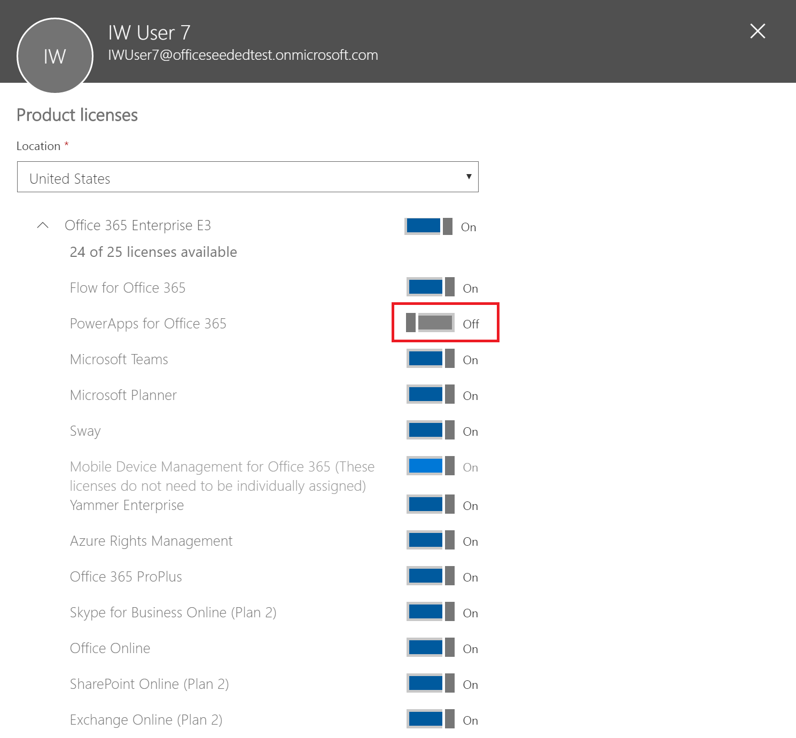
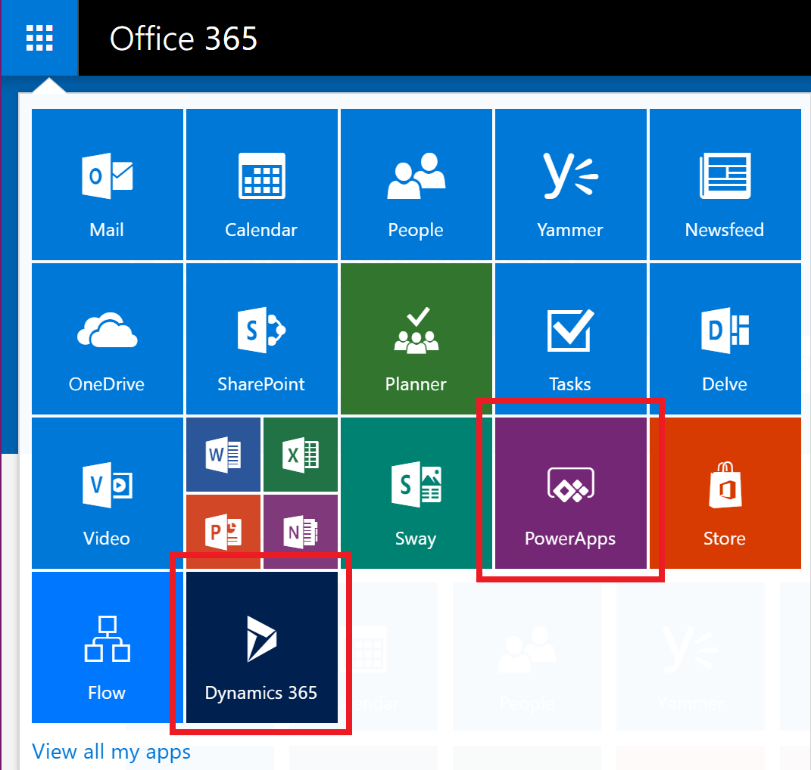
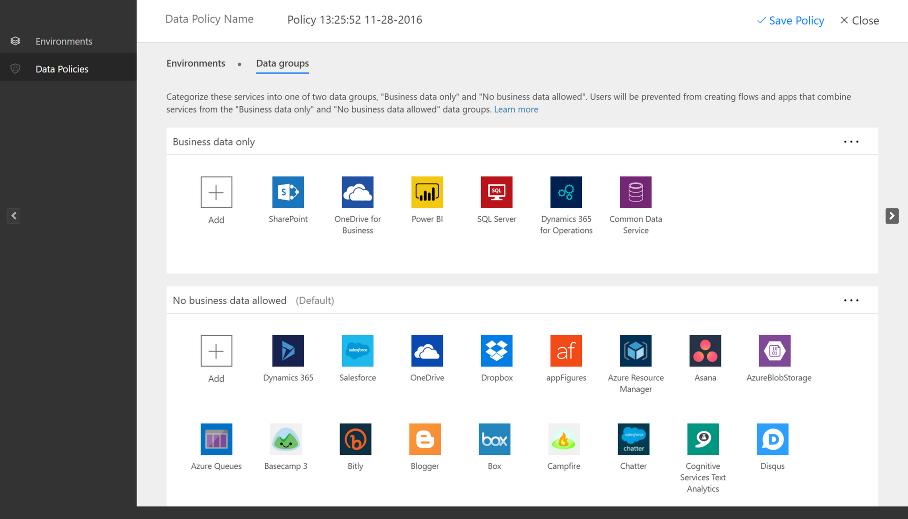

# PowerApps in your organization Q&A
This topic describes how users in your organization can use PowerApps, and how you can control the PowerApps service.

## Sign up for PowerApps
### What is PowerApps?
Microsoft PowerApps enables users to create applications for Windows, iOS, and Android mobile devices. Using these apps, you can create connections to common SaaS services, including Twitter, Office 365, Dropbox, and Excel.

### How do users sign up for PowerApps?
The only sign-up option for individual users in your organization is the PowerApps Plan 2 trial, which they can sign up for through the PowerApps website:

##### Option 1
Users can sign up by going to [powerapps.microsoft.com](https://powerapps.microsoft.com), selecting **Sign up free**, and then completing the sign-up process for PowerApps through [portal.office.com](https://portal.office.com/Start?sku=powerapps).

##### Option 2
Users can sign up by going to [powerapps.microsoft.com](https://powerapps.microsoft.com), selecting **Sign in**, signing in with their work or school accounts, and sign up for the PowerApps Plan 2 trial by accepting the PowerApps terms of use.    

When a user in your organization signs up for PowerApps, that user is assigned a PowerApps license automatically.

> [!NOTE]
> Users who sign up for a trial license from within PowerApps don't appear in the Office 365 admin portal as PowerApps Plan 2 trial users (unless they have another license to Office 365, Dynamics 365, or PowerApps).

See [Self-service sign up for PowerApps](../maker/signup-for-powerapps.md) for more details.

### How can users in my organization gain access to PowerApps?
Users within your organization can gain access to PowerApps in three different ways:

* They can individually sign up for a PowerApps Plan 2 trial as outlined in the [How do users sign up for PowerApps?](#how-do-users-sign-up-for-powerapps) section.
* You can assign a PowerApps license to them within the Office 365 admin portal.
* The user has been assigned an Office 365 and Dynamics 365 plans that includes access to the PowerApps service. See the [PowerApps pricing page](https://powerapps.microsoft.com/pricing) for the list of Office 365 and Dynamics 365 plans that include PowerApps capabilities.

### Can I block users in my organization from signing up for PowerApps?
Any individual can try out the features of Microsoft PowerApps Plan 2 for 90 days, and incur no costs as outlined in the [How do users sign up for PowerApps](#how-do-users-sign-up-for-powerapps) section.  This option is available to any user in a tenant and cannot be disabled by an admin.  After the user's trial expires the user will lose access to PowerApps Plan 2 capabilities.  

If a person signs up for a 90 day trial of Microsoft PowerApps Plan 2, and you choose to not support them inside of your organization, they can in no way incur costs to your company. When an individual signs up for Microsoft PowerApps, that is a relationship between that individual and Microsoft directly, like any many public cloud services from Microsoft, such as Bing, Wunderlist, OneDrive or Outlook.com, and does not in any way imply that the service is provided by your organization.

Finally, if your company wishes to restrict the use of organizational-only data inside of Microsoft PowerApps, that is possible through Data loss prevention (DLP) policies. For more details, See [Data loss prevention (DLP) policies](prevent-data-loss.md).

## Administration of PowerApps
### Why has the PowerApps icon appeared in the Office 365 app launcher?
As announced in August, Microsoft PowerApps is now a fundamental part of the Office 365 suite. Three months after this announcement Microsoft PowerApps was enabled as a service as a part of existing Office 365 SKU's. As users everywhere in the world can now use Microsoft PowerApps, it has appeared in the app launcher for them. See [Licensing overview](pricing-billing-skus.md) to understand which Office 365 SKUs now include PowerApps.

See the following section if you'd like to remove the PowerApps tile from the app launcher by default.

### How do I remove PowerApps from existing users?
If a user was assigned a PowerApps Plan 1 or PowerApps Plan 2 license then you can take the following steps to remove the PowerApps license for that user:

1. Go to the [Office 365 Admin Portal](https://portal.microsoftonline.com/).

2. In the left navigation bar, select **Users**, and then select **Active Users**.

3. Find the user you want to remove the license for, and then select their name.

4. On the user details pane, in the **Product licenses** section select **Edit**.

5. Find the license called **Microsoft PowerApps Plan 1** or **Microsoft PowerApps Plan 2**, set the toggle to **Off** and then select **Save**.
   
    

If a user has access to PowerApps through their Office 365 and Dynamics 365 plan license, then you can disable their access to the PowerApps service by taking the following steps:

1. Go to the [Office 365 Admin Portal](https://portal.microsoftonline.com/).

2. In the left navigation bar, select **Users**, and then select **Active Users**.

3. Find the user you want to remove access for, and then select their name.

4. On the user details pane, in the **Product licenses** section select **Edit**.

5. Expand the user's Office 365 or Dynamics 365 license, disable access to the service called **PowerApps for Office 365** or **PowerApps for Dynamics 365** and then select **Save**.
   
    

Bulk removal of licenses is also possible through PowerShell. See [Remove licenses from user accounts with Office 365 PowerShell](https://technet.microsoft.com/library/dn771774.aspx) for a detailed example.   Finally, further guidance about bulk removal of services within a license can be found at [Disable access to services with Office 365 PowerShell](https://technet.microsoft.com/library/dn771769.aspx).

Removing of the PowerApps license or service for a user in your organization will also result in the removal of the PowerApps and Dynamics 365 icons from the following locations for that user:

* [Office.com](https://office.com)
  
    
* Office 365 AppLauncher “waffle”
  
    

### How can I restrict my users' ability to access my organization's business data using PowerApps?
PowerApps allows you to create data zones for business and non-business data, as shown below.  Once these data loss prevention policies are implemented, users are prevented from designing or running PowerApps that combine business and non-business data. For more details, See [Data loss prevention (DLP) policies](prevent-data-loss.md).

### Why did 10,000 licenses for Microsoft PowerApps show up in my Office 365 tenant?
As a qualifying organization, users in your organization are eligible to try out Microsoft PowerApps Plan 2 for 90 days, and these trial licenses represent the available capacity for new PowerApps users in your tenant. There is no charge for these licenses. Specifically, there are two possible reasons why you may see a capacity 10,000 (trial) licenses for PowerApps showing up in the Office 365 admin portal:

* If at least one user in your tenant participated in the PowerApps public preview that spanned from April 2016 to October 2016 then you will see 10,000 licenses labeled as "Microsoft PowerApps and Logic flows"
  
    
* If at least one user in your tenant has signed-up for a PowerApps Plan 2 trial by going through trial signup **Option 1** outlined in the [How do users sign up for PowerApps](#how-do-users-sign-up-for-powerapps) section then you will see 10,000 licenses labeled "Microsoft Power Apps & Flow"
  
    

You can choose to assign additional licenses to users yourself through the Office 365 admin portal, but please note that these are trial licenses for Microsoft PowerApps Plan 2 and they will expire after 90 days of being assigned to a user.

### Is this free? Will I be charged for these licenses?
These licenses are free trial licenses for your users to try-out the Microsoft PowerApps Plan 2 for 90 days.

### How will this change the way I manage identities for users in my organization today?
If your organization already has an existing Office 365 environment and all users in your organization have Office 365 accounts, then identity management does not change.

If your organization already has an existing Office 365 environment but not all users in your organization have Office 365 accounts, then we create a user in the tenant and assign licenses based on the user’s work or school email address. This means that the number of users you are managing at any particular time will grow as users in your organization sign up for the service.

If your organization does not have an Office 365 environment connected to your email domain, there is no change in how you manage identity. Users will be added to a new, cloud-only user directory, and you will have the option to take over as the tenant admin and manage them.

### What is the process to manage a tenant created by Microsoft for my users?
If a tenant was created by Microsoft, you can claim and manage that tenant using the following steps:

1. Join the tenant by signing up for PowerApps using an email address domain that matches the tenant domain you want to manage. For example, if Microsoft created the contoso.com tenant, then join the tenant with an email address ending with @contoso.com.
2. Claim admin control by verifying domain ownership: once you are in the tenant, you can promote yourself to the admin role by verifying domain ownership. To do so, follow these steps:
3. Go to [https://portal.office.com](https://portal.office.com/Start?sku=powerapps).
4. Select the app-launcher icon in the upper-left corner, and then choose Admin.
5. Read the instructions on the **Become the admin** page, and then choose **Yes, I want to be the admin**.  

> [!NOTE]
> If this option doesn’t appear, an Office 365 administrator is already in place.

### If I have multiple domains, can I control the Office 365 tenant that users are added to?
If you do nothing, a tenant is created for each user email domain and subdomain.

If you want all users to be in the same tenant regardless of their email address extensions:  

* Create a target tenant ahead of time or use an existing tenant. Add all the existing domains and subdomains that you want consolidated within that tenant. Then all the users with email addresses ending in those domains and subdomains automatically join the target tenant when they sign up.

> [!IMPORTANT]
> There is no supported automated mechanism to move users across tenants once they have been created. To learn about adding domains to a single Office 365 tenant, see [Add your users and domain to Office 365](https://support.office.com/article/Add-your-users-and-domain-to-Office-365-ffdb2216-330d-4d73-832b-3e31bcb5b2a7).

