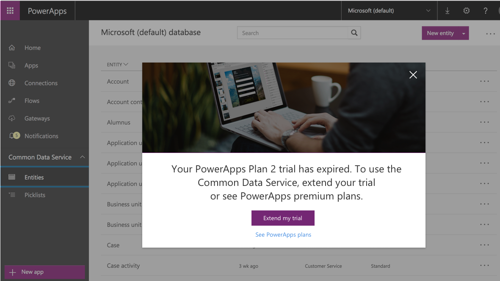

# Plan 2 Trial for PowerApps
Sign up for the PowerApps Plan 2 Trial to get all functionality free for 90 days. This trial offers more capacity and premium features in addition to the PowerApps functionality that you get from many [Office 365 and Dynamics 365 plans](pricing-billing-skus.md). Premium features include:

* **Access to the Common Data Service**, which is a secure business data platform built into PowerApps. This service comes with hundreds of standard business entities, so all your apps can share the same definition of “customer,” “product,” “lead,” and more. [Learn more](../maker/common-data-service/data-platform-intro.md)
* **Access to premium connections** such as Salesforce, DB2, Zendesk, and the Common Data Service. With many Office 365 and Dynamics 365 plans, you can connect to data sources such as Office 365, Dynamics 365, Dropbox, and Twitter. With the Plan 2 Trial, you can also connect to data through premium connectors such as these:
  
    
  
    In the [complete list of connectors](../maker/canvas-apps/connections-list.md), premium connectors appear with a badge:
  
    
* **Access to the PowerApps admin center**, in which you can manage your environments, databases, user permissions, and data policies.  [Learn more](introduction-to-the-admin-center.md)

For more information about additional functionality and capacity in the Plan 2 Trial, see the [pricing page](https://powerapps.microsoft.com/pricing/).

You can use a work or school account to sign up for the trial from the [PowerApps site](https://powerapps.microsoft.com/). If you already have access to PowerApps through Office 365, Dynamics 365, or PowerApps Plan 1, you'll be prompted to sign up for the trial if you try to access a Plan 2 feature.

## What happens when my trial expires?
After 90 days, you'll be prompted to request a 90-day extension of the trial or purchase a plan. You can find details about all plans [on the pricing page](https://powerapps.microsoft.com/pricing/).

* If you have access to PowerApps through Office 365, Dynamics 365, or PowerApps Plan 1, you can still use PowerApps, but you might lose access to the Common Data Service, premium connectors, the admin center, and other Plan 2 features. For example, this screen might appear if you try to create a premium connection:
  
    
  
    This screen might appear if you try to modify a schema or entities in the Common Data Service:
  
    
* If your only access to PowerApps is through the trial (for which you signed up on the [PowerApps site](http://powerapps.microsoft.com/) or the [pricing page](http://powerapps.microsoft.com/pricing)), a screen like this will appear if you try to access PowerApps:
  
    

## How many days are left before my trial expires?
You'll soon be able to see how many days are left before your trial expires.

## What happens to my data when my trial expires?
If you still have access to PowerApps, you can continue to use it. Any data in the Common Data Service will remain as it is, and any app or flow that used the Common Data Service as a data source will continue to run as it did. But you won't be able to use that app or flow, and you'll be prompted to request an extension of the trial or purchase a plan if you try to modify a schema or entities in the Common Data Service.

## What should I do next?
You can retain access to PowerApps and its features by following either of these steps:

* When prompted, request to extend your trial for another 90 days.
* Purchase a plan. You can view the available plans or visit the PowerApps pricing page. [Learn more](signup-for-powerapps-admin.md) about how to purchase a plan.

