# Use the Office 365 admin center to manage your subscription

[!INCLUDE[cc-applies-to-update-9-0-0](../includes/cc_applies_to_update_9_0_0.md)] [!INCLUDE[cc-applies-to-update-8-2-0](../includes/cc_applies_to_update_8_2_0.md)]

[The Office 365 admin center](https://support.office.com/article/About-the-Office-365-admin-center-758befc4-0888-4009-9f14-0d147402fd23) is a portal site rich in features for the administrator. [!INCLUDE[pn_CRM_Online](../includes/pn-crm-online.md)] takes advantage of the features on this site to simplify and consolidate management of user accounts, billing, licensing, and more.  
  
 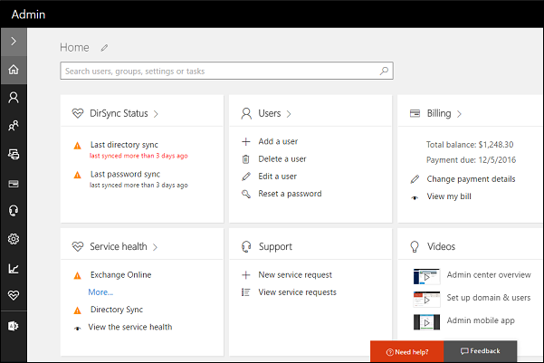  
  
 Review the information in this topic to learn how to do common [!INCLUDE[pn_crm_online_shortest](../includes/pn-crm-online-shortest.md)] administrative tasks in the [!INCLUDE[pn_office_365_admin_center](../includes/pn-office-365-admin-center.md)].  
  
> [!NOTE]
>  You must have the Global admin role to fully access the [!INCLUDE[pn_office_365_admin_center](../includes/pn-office-365-admin-center.md)].  
  
   
## Open Dynamics 365 and other services with the app launcher  
 You can open [!INCLUDE[pn_crm_online_shortest](../includes/pn-crm-online-shortest.md)] and other services such as [!INCLUDE[pn_netbreeze_long](../includes/pn-social-engagement-long.md)] from the [!INCLUDE[pn_Office_365](../includes/pn-office-365.md)] app launcher. Choose **Admin** to open the [!INCLUDE[pn_office_365_admin_center](../includes/pn-office-365-admin-center.md)] and **[!INCLUDE[pn_crm_shortest](../includes/pn-crm-shortest.md)]** to open [!INCLUDE[pn_crm_online_shortest](../includes/pn-crm-online-shortest.md)]. [!INCLUDE[proc_more_information](../includes/proc-more-information.md)] [Find help for the latest changes in Office 365](https://support.office.com/client/Find-help-for-the-latest-changes-in-Office-365-22E9A8BF-EF08-4B95-B10F-6E839440339C?NS=O365ENTADMIN&Version=15&HelpId=O365E_NewAppLauncher)  
  
 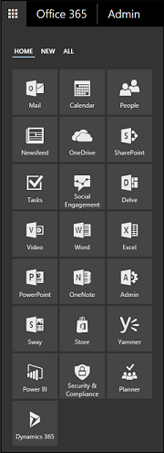  
  
   
## Manage instances and updates in the Dynamics 365 Administration Center  
 The [!INCLUDE[pn_dyn_365_admin_center](../includes/pn-dyn-365-admin-center.md)] is your portal site to manage [!INCLUDE[pn_crm_online_shortest](../includes/pn-crm-online-shortest.md)] instances and updates.  
  
 You access the portal by choosing [!INCLUDE[pn_crm_shortest](../includes/pn-crm-shortest.md)] from the left-side menu in the [!INCLUDE[pn_office_365_admin_center](../includes/pn-office-365-admin-center.md)].  
  
 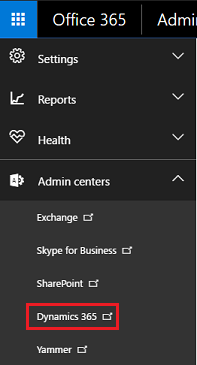  
  
 Choose the **Instances** tab to edit, copy, and reset, existing instances, configure new instances, manage preferred solutions, and more. [!INCLUDE[proc_more_information](../includes/proc-more-information.md)] [Manage Dynamics 365 (online) instances](manage-online-environments.md)  
  
 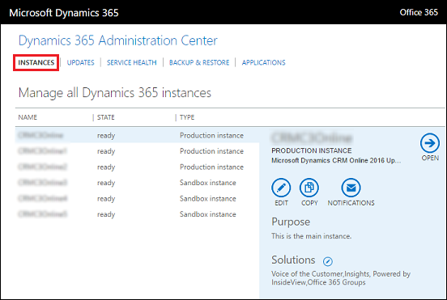  
  
 Choose the **Updates** tab to approve and schedule updates, change the update target version, and open [!INCLUDE[pn_crm_online_shortest](../includes/pn-crm-online-shortest.md)]. [!INCLUDE[proc_more_information](../includes/proc-more-information.md)] [Manage Dynamics 365 (online) updates](https://docs.microsoft.com/dynamics365/customer-engagement/admin/manage-updates)  
  
 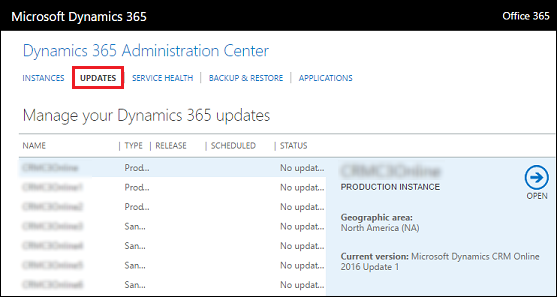  
  
   
## Check your service health  
 You can quickly get real-time status of your [!INCLUDE[pn_crm_online_shortest](../includes/pn-crm-online-shortest.md)] and [!INCLUDE[pn_Office_365](../includes/pn-office-365.md)] services. The Service health page on the [!INCLUDE[pn_office_365_admin_center](../includes/pn-office-365-admin-center.md)] provides a comprehensive view of the service health of your online services. If users are having trouble signing in to [!INCLUDE[pn_crm_online_shortest](../includes/pn-crm-online-shortest.md)], check this page to see if there is a service outage.  
  
 Click **Health** > **Service health**, and select services with issues to get more information.  
  
 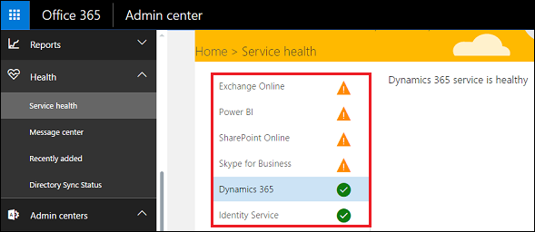  
  
 Click **View history** from the right-side menu to get more detailed information for each service arranged by date.  
  
   
  
   
## Review your messages  
 Check out the Message center to see how to fix or prevent issues, plan for service changes, or just to stay informed of new or updated features.  
  
 Click **Health** > **Message center**, and select messages to get more information.  
  
   
  
   
## Request support  
 Having a problem with your [!INCLUDE[pn_crm_online_shortest](../includes/pn-crm-online-shortest.md)] service? You can create a support request to get the issue resolved.  
  
More information: [Contact Technical Support](contact-technical-support.md)

   
## Manage users  
 Each user signs in to [!INCLUDE[pn_crm_online_shortest](../includes/pn-crm-online-shortest.md)] with an [!INCLUDE[pn_Office_365](../includes/pn-office-365.md)] user ID (more precisely, an [!INCLUDE[pn_azure_active_directory](../includes/pn-azure-active-directory.md)] user ID, see the following Note). Access to [!INCLUDE[pn_crm_online_shortest](../includes/pn-crm-online-shortest.md)] is controlled through the [!INCLUDE[pn_Office_365](../includes/pn-office-365.md)] user ID.  
  
 You use the [!INCLUDE[pn_office_365_admin_center](../includes/pn-office-365-admin-center.md)] to add, edit, and delete [!INCLUDE[pn_crm_online_shortest](../includes/pn-crm-online-shortest.md)] users and to reset passwords.  
  
 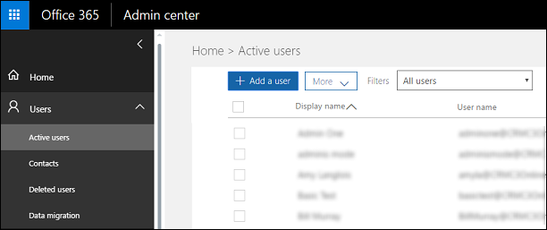  
  
> [!NOTE] 
> [!INCLUDE[pn_crm_online_shortest](../includes/pn-crm-online-shortest.md)] uses [Azure Active Directory](https://docs.microsoft.com/azure/active-directory/active-directory-whatis) as its identity provider. You access [!INCLUDE[pn_crm_online_shortest](../includes/pn-crm-online-shortest.md)] through an [!INCLUDE[pn_azure_active_directory](../includes/pn-azure-active-directory.md)] user ID that is created and managed in the [!INCLUDE[pn_office_365_admin_center](../includes/pn-office-365-admin-center.md)]. For simplicity, we’ll refer to the [!INCLUDE[pn_azure_active_directory](../includes/pn-azure-active-directory.md)] user ID as the [!INCLUDE[pn_Office_365](../includes/pn-office-365.md)] user ID in this documentation.  
  
 If your company uses on-premises [!INCLUDE[pn_Active_Directory](../includes/pn-active-directory.md)] for user identity, you have options that can simplify user management such as providing a single sign-on experience for your users. [!INCLUDE[proc_more_information](../includes/proc-more-information.md)] [Manage user account synchronization](manage-user-account-synchronization.md)  
  
   
## Manage subscriptions  
 Use the Subscriptions page to adjust licenses, view your bill, add a partner of record, and lots more.  
  
 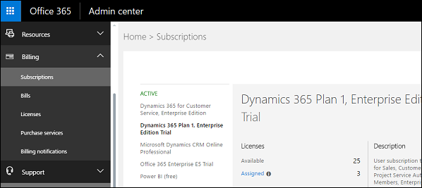  
  
   
## Set the password expiration  
 Use the Security & privacy page to set how frequently a user’s password expires and the number of days before a user is notified of an upcoming expiration.  
  
 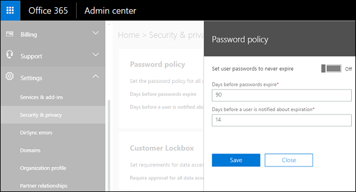  
  
> [!TIP]
>  Note the information on this page about users doing their own password reset. To enable your users to be able to reset their passwords themselves, you’ll need to purchase an [!INCLUDE[pn_azure_active_directory](../includes/pn-azure-active-directory.md)] subscription and configure it for password self-service. [!INCLUDE[proc_more_information](../includes/proc-more-information.md)] [Self-service password reset in Azure AD: how to enable, configure, and test self-service password reset](https://docs.microsoft.com/azure/active-directory/active-directory-passwords-getting-started#enable-users-to-reset-their-azure-ad-passwords)  
  
   
## Configure self-service password reset and other settings in Azure  
 If you have an [!INCLUDE[pn_azure_active_directory](../includes/pn-azure-active-directory.md)] Basic or Premium subscription, you can set it up so users can do their own password reset. You can access [!INCLUDE[pn_azure_active_directory](../includes/pn-azure-active-directory.md)] configuration from the [!INCLUDE[pn_office_365_admin_center](../includes/pn-office-365-admin-center.md)]. [!INCLUDE[proc_more_information](../includes/proc-more-information.md)] [Enable users to reset their Azure AD passwords](https://azure.microsoft.com/en-us/documentation/articles/active-directory-passwords-getting-started/#enable-users-to-reset-their-azure-ad-passwords)  
  
 On the left-side menu of the [!INCLUDE[pn_office_365_admin_center](../includes/pn-office-365-admin-center.md)], choose **Admin centers** > **Azure AD**. Select your subscription in [!INCLUDE[pn_Windows_Azure](../includes/pn-windows-azure.md)] and then choose **Configure**.  
  
 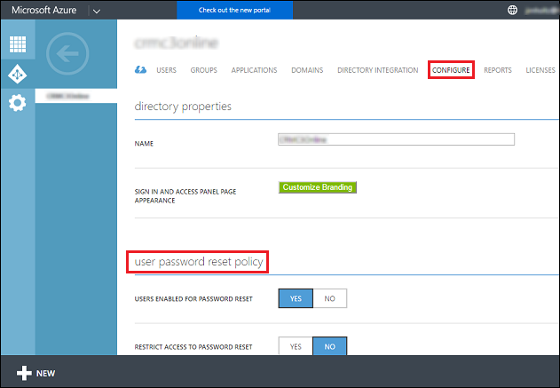  
  
   
## Add your domain  
 Use the Manage domains page to add your domain to your subscription. When you add your own domain, user sign-ins can match your company’s URL. For example, instead of user@contoso.onmicrosoft.com, it could be user@contoso.com. [!INCLUDE[proc_more_information](../includes/proc-more-information.md)] [Verify your domain in Office 365](http://support.office.com/article/Verify-your-domain-in-Office-365-6383f56d-3d09-4dcb-9b41-b5f5a5efd611)  
  
 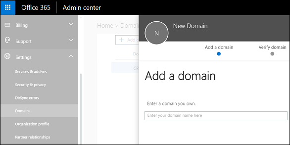  
  
   
## Purchase services  
 On the left-side menu of the [!INCLUDE[pn_office_365_admin_center](../includes/pn-office-365-admin-center.md)], click **Billing** > **Purchase services** to add licenses or purchase new online services.  
  
 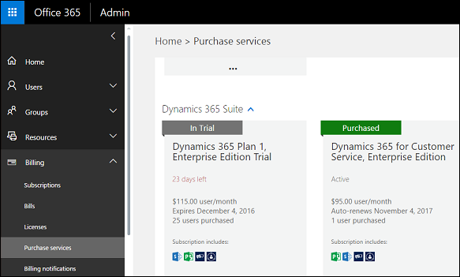  
  
### See also  
 [About the Office 365 admin center](https://support.office.com/article/About-the-Office-365-admin-center-758befc4-0888-4009-9f14-0d147402fd23)  
 [Set an individual user's password to never expire](https://support.office.com/article/Set-an-individual-user-s-password-to-never-expire-f493e3af-e1d8-4668-9211-230c245a0466)
