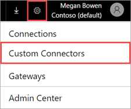

# Develop an API connector (PowerApps)
Building a connector involves multiple steps. To get started - in [PowerApps](https://web.powerapps.com/), click or tap the **Settings** button (the gear icon) at the upper right of the page. Then click or tap **Custom Connectors**.

## Describe your API
API connectors are described using the [OpenAPI standard](https://swagger.io/) for defining the interface of an HTTP API. You can start building with an existing OpenAPI file, or you can import a [Postman Collection](https://www.getpostman.com/docs/collections), which auto-generates the OpenAPI file for you. 

If you start from either of these API descriptions, the metadata fields in the wizard are auto-populated. You can edit these at any time.  

## Build security
Pick the authentication type supported by your service, and provide additional details to enable identity to flow appropriately between your service and any clients. 

[Learn more](register-custom-api.md) about connector security.

## Build triggers and actions
1. To build the triggers and actions for your connector, switch to the **Definition** tab. 
   
    
2. Using the wizard, you can add new operations or edit the schema and response for existing ones. The **General** properties for each operation enable you to control the end-user experience for your connector. Learn more about the different types of operations using the links below:
   
   * [Triggers](https://flow.microsoft.com/documentation/customapi-webhooks) (not visible in PowerApps)
   * [Actions](register-custom-api.md)
     
     To implement advanced functionality for Microsoft Flow, refer to [OpenAPI extensions for API connectors](https://flow.microsoft.com/documentation/customapi-how-to-swagger/). 
3. Finally, click or tap **Create connector** to register the API connector.

For additional features not available in the wizard, please contact [condevhelp@microsoft.com](mailto:condevhelp@microsoft.com).

## Test the connector
Prior to submission, test your API connector in one or more ways: 

* Using the API connector [Testing wizard](https://flow.microsoft.com/blog/new-updates-custom-api/), you can call each operation to verify its functionality and the response schema.
* In the designer for Microsoft Flow, you can visually build flows using your API connector. This method of testing gives you visibility into the user interface functionality and features of your connector.
* In the PowerApps Studio, you can call each operation using the formula bar, and bind the response to controls on your screen.

This topic provides an overview; for more information, see [Register and use a custom connector](register-custom-api.md).

