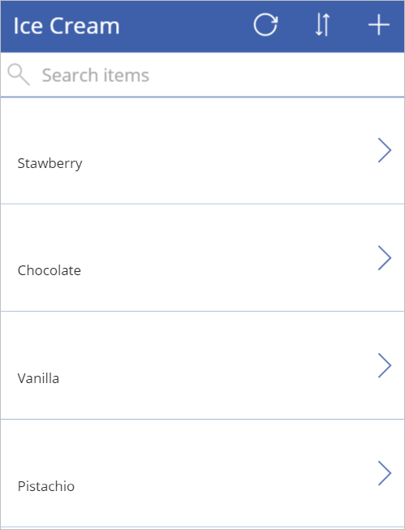

# Quickstart: Create an app using SharePoint list

Using a SharePoint Online list, create an app automatically within PowerApps. 

Every generated app automatically includes a screen to browse records, a screen that shows record details, and a screen to create or update records. You can customize the app to suit your needs. In this article, you create a new app, select an existing SharePoint Online list, and then see what you created. 

**Before you begin**

* Custom lists can be used; libraries cannot be used 
* You can show data in some types of columns, such as **Choice** and **Picture**, but you can't update that data
* For any column names that contain a space, **\_x0020\_** is added. For example, **"Column Name"** displays as **"Column_x0020_Name"**.

If you're not signed up for PowerApps, [sign up for free](https://web.powerapps.com/signup?redirect=marketing&email=). 

## Prerequisites 

This quickstart uses SharePoint Online. So, you need a SharePoint Online URL that also has a SharePoint list.

## Sign in to PowerApps 

Open a web browser, and go to [https://web.powerapps.com]([https://web.powerapps.com). Sign in with your account. 

## Choose a site and list

1. In the left menu, select **Apps**, and then select **Create an app**. 

2. In **Start with your data**, select **SharePoint**. Select **Connect directly (cloud services)**, and select **Create**. 

3. Enter the URL to your SharePoint site,and select **Go**. For example, enter  something like `https://microsoft.sharepoint.com/teams/TeamName`.  

4. **Choose a list**, and **Connect**. It may take a few minutes to create your app.

    

## View your app    
In PowerApps Studio, select **See a preview of this app**. Play the app. Select the different options, and use the arrows to navigate within your app. You can also sort the list, and add new items to the list. 

Now, save your app (Ctrl + S).

## Next steps

* [Customize a layout](customize-layout-sharepoint.md)
* [Customize a form](customize-forms-sharepoint.md)
* [Things to know](connections/connection-sharepoint-online.md#known-issues)