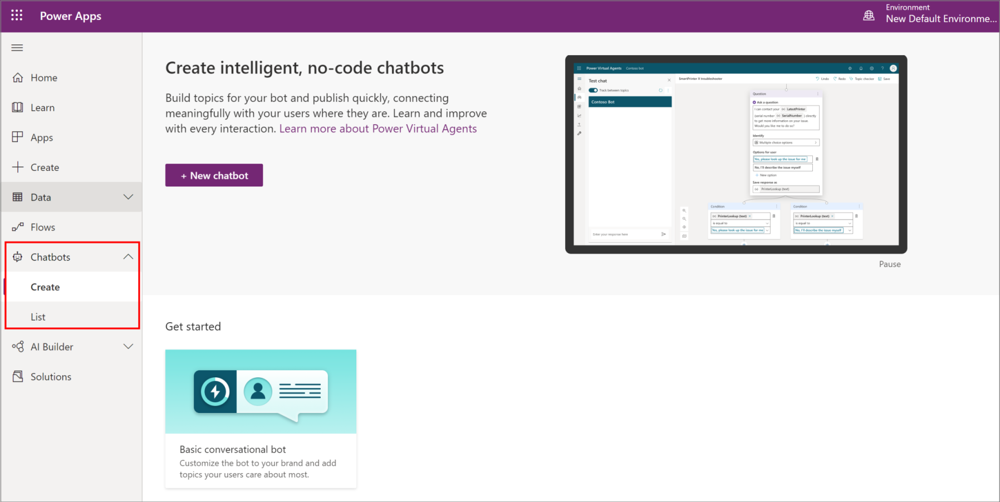

# Create chatbots from Power Apps

Power Virtual Agents allows you to quickly create and maintain intelligent chatbots using a no-code interface. App makers can now create and manage their chatbots directly from [Power Apps](https://make.powerapps.com). 

You can create and manage your chatbots using the **Chatbots** option in the left navigation pane.

- To create a chatbot, select **Chatbots** > **Create**, and then select **New chatbot**. This will take you directly to Power Virtual Agents portal where you can create your chatbot. More information: [TO DO: Add topic link]

- After you have chatbots in your environment, you'll be able to view them using **Chatbots** > **List** page. You can navigate directly to Power Virtual Agents portal to update your bot or view analytics.

More information: [Power Virtual Agents docs](https://docs.microsoft.com/power-virtual-agents)